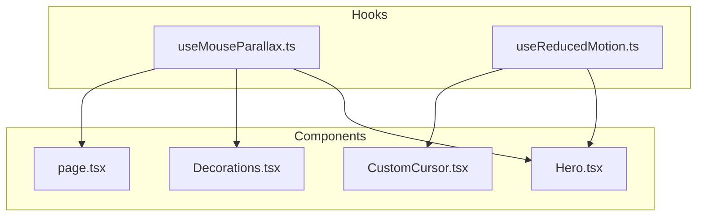
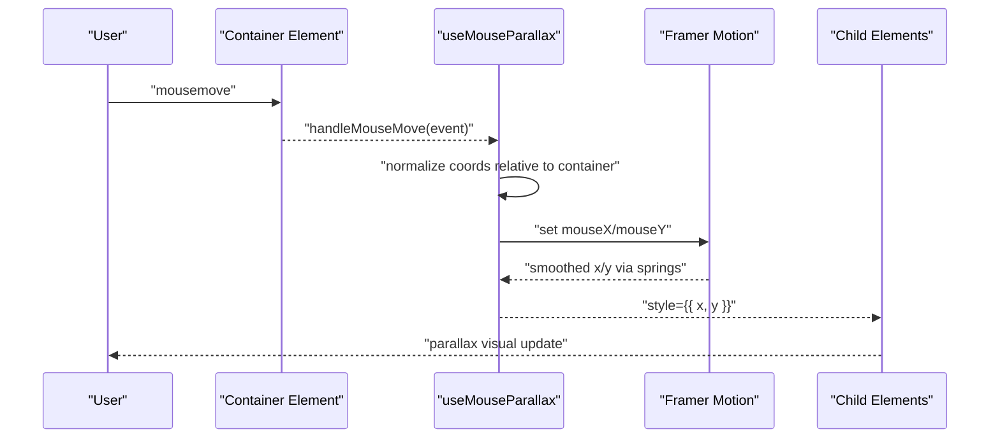
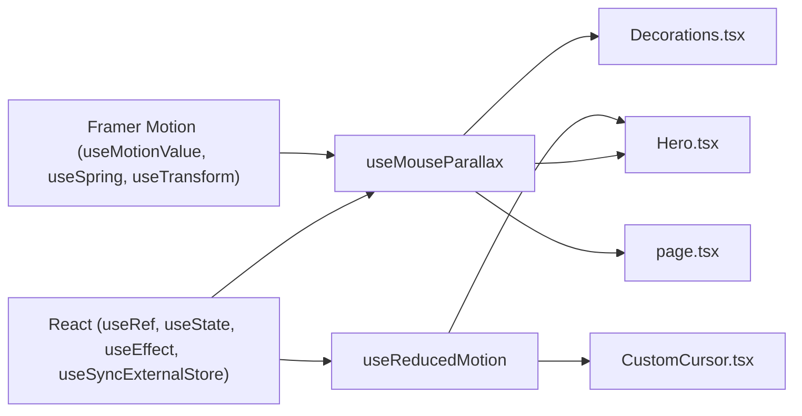

# Animation Hooks

<cite>
**Referenced Files in This Document**
- [useMouseParallax.ts](file://app/hooks/useMouseParallax.ts)
- [useReducedMotion.ts](file://app/hooks/useReducedMotion.ts)
- [Hero.tsx](file://app/components/Hero.tsx)
- [Decorations.tsx](file://app/components/Decorations.tsx)
- [CustomCursor.tsx](file://app/components/CustomCursor.tsx)
- [page.tsx](file://app/page.tsx)
</cite>

## Update Summary
**Changes Made**
- Updated useReducedMotion hook implementation to use React's useSyncExternalStore for improved performance and SSR compatibility
- Enhanced accessibility features with better hydration handling
- Updated component usage examples to reflect the new hook architecture
- Added detailed explanation of the external store pattern benefits

## Table of Contents
1. Introduction
2. Project Structure
3. Core Components
4. Architecture Overview
5. Detailed Component Analysis
6. Dependency Analysis
7. Performance Considerations
8. Troubleshooting Guide
9. Conclusion

## Introduction
This document explains the custom animation hooks that power interactive experiences in the portfolio:
- useMouseParallax: creates mouse-driven parallax effects with intensity control and spring-based smoothing.
- useReducedMotion: detects user accessibility preferences using React's useSyncExternalStore for optimal performance and SSR compatibility.

You will learn how these hooks work, how they are used across components, performance techniques applied, configuration options, best practices, and troubleshooting strategies.

## Project Structure
The animation system is centered around two hooks in app/hooks and consumed by UI components in app/components. The hooks encapsulate Framer Motion primitives (motion values, springs, transforms) and expose simple APIs for components to apply parallax to any element.

**Diagram sources**
- [useMouseParallax.ts:12-45](file://app/hooks/useMouseParallax.ts#L12-L45)
- [useReducedMotion.ts:25-27](file://app/hooks/useReducedMotion.ts#L25-L27)
- [Hero.tsx:11-34](file://app/components/Hero.tsx#L11-L34)
- [Decorations.tsx:4-106](file://app/components/Decorations.tsx#L4-L106)
- [CustomCursor.tsx:5-9](file://app/components/CustomCursor.tsx#L5-L9)
- [page.tsx:30-57](file://app/page.tsx#L30-L57)

**Section sources**
- [useMouseParallax.ts:1-66](file://app/hooks/useMouseParallax.ts#L1-L66)
- [useReducedMotion.ts:1-28](file://app/hooks/useReducedMotion.ts#L1-L28)
- [Hero.tsx:1-203](file://app/components/Hero.tsx#L1-L203)
- [Decorations.tsx:1-190](file://app/components/Decorations.tsx#L1-L190)
- [CustomCursor.tsx:1-92](file://app/components/CustomCursor.tsx#L1-L92)
- [page.tsx:1-637](file://app/page.tsx#L1-L637)

## Core Components
- useMouseParallax(config): Creates a container ref, tracks normalized mouse position within that container, and returns smoothed x/y motion values via Framer Motion springs. Also exposes raw mouseX/mouseY motion values so child elements can compute their own parallax offsets.
- useMouseParallaxValue(mouseX, mouseY, config): Derives per-element x/y motion values from shared mouseX/mouseY inputs with independent intensity and spring settings. Ideal for decorative layers at different depths.
- useReducedMotion(): Returns a boolean reflecting the user's prefers-reduced-motion setting using React's useSyncExternalStore for optimal performance and SSR compatibility, updating reactively when the preference changes.

Key behaviors:
- Intensity multiplies normalized mouse deltas to create depth effects.
- Spring smoothing uses damping and stiffness to avoid jitter and provide fluid motion.
- Mouse events are bound to a specific container to normalize coordinates relative to that element.
- Reduced motion is respected globally by components that choose to disable animations based on the hook's result.
- External store pattern ensures consistent behavior across server-side rendering and client hydration.

**Section sources**
- [useMouseParallax.ts:6-45](file://app/hooks/useMouseParallax.ts#L6-L45)
- [useMouseParallax.ts:47-65](file://app/hooks/useMouseParallax.ts#L47-L65)
- [useReducedMotion.ts:25-27](file://app/hooks/useReducedMotion.ts#L25-L27)

## Architecture Overview
The hooks form a small but powerful layer between DOM events and animated visuals:

**Diagram sources**
- [useMouseParallax.ts:28-44](file://app/hooks/useMouseParallax.ts#L28-L44)
- [Hero.tsx:11-34](file://app/components/Hero.tsx#L11-L34)
- [Decorations.tsx:22-106](file://app/components/Decorations.tsx#L22-L106)

## Detailed Component Analysis

### useMouseParallax
Responsibilities:
- Provide a container ref to capture mouse events.
- Normalize mouse position to [-1, 1] range based on container bounds.
- Expose smoothed x/y motion values for direct style application.
- Share raw mouseX/mouseY motion values for deeper parallax chains.

Implementation highlights:
- Uses Framer Motion's useMotionValue for reactive state without re-renders.
- Applies useTransform to scale normalized input by intensity.
- Wraps transformed values with useSpring using configurable damping/stiffness for smooth transitions.
- Resets motion values to zero on mouse leave to return elements to default positions.

Performance considerations:
- Event handling computes geometry once per move and sets motion values directly.
- No React state updates inside event handlers; only MotionValues are set.
- Normalization ensures consistent behavior regardless of container size.

Usage pattern:
- Attach returned ref and event handlers to a parent container.
- Apply returned x/y to child elements' styles for parallax movement.
- Optionally pass mouseX/mouseY to useMouseParallaxValue for layered effects.

Configuration options:
- intensity: multiplier for mouse delta (default 20).
- damping: spring damping factor (default 25).
- stiffness: spring stiffness factor (default 150).

Best practices:
- Use moderate intensity to avoid excessive movement.
- Increase damping or decrease stiffness if you see jitter.
- Keep containers stable; avoid frequent layout shifts during mouse tracking.

Common pitfalls:
- Forgetting to attach both onMouseMove and onMouseLeave can leave elements offset.
- Using very high intensity can cause off-screen jumps.
- Applying parallax to frequently re-rendered nodes may increase cost; prefer static refs and MotionValues.

**Section sources**
- [useMouseParallax.ts:12-45](file://app/hooks/useMouseParallax.ts#L12-L45)
- [Hero.tsx:11-34](file://app/components/Hero.tsx#L11-L34)
- [page.tsx:50-57](file://app/page.tsx#L50-L57)

### useMouseParallaxValue
Responsibilities:
- Derive per-element x/y motion values from shared mouseX/mouseY inputs.
- Allow each element to have its own intensity and spring characteristics.

Why it matters:
- Enables layered parallax where background elements move differently than foreground content.
- Keeps event handling centralized in the container while distributing motion to many children.

Usage pattern:
- Pass mouseX/mouseY from useMouseParallax along with desired intensity.
- Apply returned x/y to element styles for independent parallax.

Configuration options:
- Same as useMouseParallax: intensity, damping, stiffness.

Best practices:
- Use negative intensities for counter-parallax to enhance depth.
- Tune per-layer intensity to match visual hierarchy.

**Section sources**
- [useMouseParallax.ts:47-65](file://app/hooks/useMouseParallax.ts#L47-L65)
- [Decorations.tsx:22-106](file://app/components/Decorations.tsx#L22-L106)
- [Hero.tsx:22-34](file://app/components/Hero.tsx#L22-L34)

### useReducedMotion
Responsibilities:
- Detect and track the user's reduced motion preference using React's useSyncExternalStore.
- Update reactively when the preference changes at runtime.
- Ensure consistent behavior during server-side rendering and client hydration.

**Updated** Implementation now uses React's useSyncExternalStore for improved performance and SSR compatibility:

Implementation highlights:
- Uses useSyncExternalStore with a media query subscription for optimal performance.
- Implements getSnapshot function to read current reduced motion preference.
- Provides getServerSnapshot function that returns false during SSR to prevent hydration mismatches.
- Subscribes to media query change events to stay synchronized with OS/browser settings.

Usage pattern:
- Consume the boolean in components to conditionally enable/disable animations.
- Combine with component-specific logic (e.g., skip custom cursor on touch/reduced motion).

Accessibility benefits:
- Honors user preferences to reduce vestibular triggers.
- Provides fallbacks such as disabling continuous animations or complex transitions.
- Ensures consistent behavior across server and client environments.

Performance improvements:
- Eliminates unnecessary re-renders through external store pattern.
- Reduces memory footprint compared to traditional state management approaches.
- Optimizes hydration process by providing consistent initial values.

**Section sources**
- [useReducedMotion.ts:7-27](file://app/hooks/useReducedMotion.ts#L7-L27)
- [CustomCursor.tsx:9-9](file://app/components/CustomCursor.tsx#L9-L9)
- [Hero.tsx:34-34](file://app/components/Hero.tsx#L34-L34)

### Usage Examples Across Components
- Hero section:
  - Captures mouse movement over the hero container.
  - Applies multiple parallax layers with different intensities to decorations and text.
  - Respects reduced motion for subtle animations like the scroll indicator.

- Decorations:
  - Reusable decorative elements consume shared mouseX/mouseY via useMouseParallaxValue.
  - Each decoration can specify its own intensity to create varied depth.

- Custom cursor:
  - Disables itself on touch devices or when reduced motion is preferred.
  - Demonstrates conditional animation gating based on accessibility preferences.

- Page-level sections:
  - Sections initialize their own parallax containers and propagate mouseX/mouseY to nested decorations.

**Section sources**
- [Hero.tsx:11-34](file://app/components/Hero.tsx#L11-L34)
- [Hero.tsx:187-199](file://app/components/Hero.tsx#L187-L199)
- [Decorations.tsx:22-106](file://app/components/Decorations.tsx#L22-L106)
- [CustomCursor.tsx:20-59](file://app/components/CustomCursor.tsx#L20-L59)
- [page.tsx:50-57](file://app/page.tsx#L50-L57)

## Dependency Analysis
The hooks depend on Framer Motion primitives and React APIs. Components depend on the hooks to drive animations.

**Diagram sources**
- [useMouseParallax.ts:3-4](file://app/hooks/useMouseParallax.ts#L3-L4)
- [useReducedMotion.ts:3-3](file://app/hooks/useReducedMotion.ts#L3-L3)
- [Hero.tsx:1-7](file://app/components/Hero.tsx#L1-L7)
- [Decorations.tsx:1-5](file://app/components/Decorations.tsx#L1-L5)
- [CustomCursor.tsx:1-5](file://app/components/CustomCursor.tsx#L1-L5)
- [page.tsx:1-30](file://app/page.tsx#L1-L30)

**Section sources**
- [useMouseParallax.ts:1-66](file://app/hooks/useMouseParallax.ts#L1-L66)
- [useReducedMotion.ts:1-28](file://app/hooks/useReducedMotion.ts#L1-L28)
- [Hero.tsx:1-203](file://app/components/Hero.tsx#L1-L203)
- [Decorations.tsx:1-190](file://app/components/Decorations.tsx#L1-L190)
- [CustomCursor.tsx:1-92](file://app/components/CustomCursor.tsx#L1-L92)
- [page.tsx:1-637](file://app/page.tsx#L1-L637)

## Performance Considerations
- Prefer MotionValues over React state for high-frequency updates to avoid unnecessary renders.
- Normalize mouse coordinates relative to the container to keep calculations stable and efficient.
- Use springs with appropriate damping/stiffness to balance responsiveness and smoothness.
- Limit the number of heavily animated elements in tight loops; favor lightweight decorative layers.
- Gate expensive animations behind reduced motion checks to improve accessibility and performance on low-end devices.
- Avoid layout thrashing by reading geometry once per event and not triggering reflows inside event handlers.
- **Updated** The useSyncExternalStore pattern in useReducedMotion eliminates unnecessary re-renders and provides optimal SSR compatibility.

## Troubleshooting Guide
Common issues and resolutions:
- Elements do not reset after leaving the container:
  - Ensure onMouseLeave resets mouseX/mouseY to zero.
  - Verify the container ref is attached correctly.

- Parallax feels too fast or sluggish:
  - Adjust intensity to reduce or amplify movement.
  - Tune damping and stiffness: higher damping reduces overshoot; higher stiffness increases responsiveness.

- Jitter or stuttering:
  - Reduce the number of simultaneously animated elements.
  - Lower intensity or increase damping to smooth motion.
  - Ensure no heavy computations occur in mousemove handlers.

- Animations run on touch devices or when reduced motion is enabled:
  - Gate animations with useReducedMotion and device capability checks.
  - Disable custom cursor or heavy effects when reduced motion is preferred.

- Inconsistent behavior across screen sizes:
  - Confirm normalization uses the current container dimensions.
  - Test on various viewports to ensure coordinate math remains correct.

- **Updated** Hydration mismatches with reduced motion:
  - The useSyncExternalStore pattern handles this automatically by returning false during SSR.
  - Components should handle both server and client states gracefully.

Debugging tips:
- Log mouseX/mouseY values temporarily to verify ranges and updates.
- Temporarily remove springs to isolate whether the issue is event handling or smoothing.
- Use browser dev tools to inspect MotionValues and observe frame rates.
- Check media query status using browser developer tools to verify reduced motion detection.

**Section sources**
- [useMouseParallax.ts:28-44](file://app/hooks/useMouseParallax.ts#L28-L44)
- [CustomCursor.tsx:20-59](file://app/components/CustomCursor.tsx#L20-L59)
- [Hero.tsx:187-199](file://app/components/Hero.tsx#L187-L199)
- [useReducedMotion.ts:17-23](file://app/hooks/useReducedMotion.ts#L17-L23)

## Conclusion
The portfolio's interactive experiences are powered by two focused hooks:
- useMouseParallax centralizes mouse tracking and delivers smooth, configurable parallax motion values.
- useMouseParallaxValue enables layered depth by deriving per-element motion from shared inputs.
- useReducedMotion ensures accessibility by respecting user preferences using React's useSyncExternalStore for optimal performance and SSR compatibility, enabling graceful fallbacks.

By combining these hooks with Framer Motion primitives, the project achieves performant, accessible, and visually rich interactions. The enhanced useReducedMotion hook now leverages React's external store pattern for improved performance, better SSR support, and more reliable behavior across different environments. Follow the configuration guidelines and best practices outlined here to extend and maintain the animation system effectively.