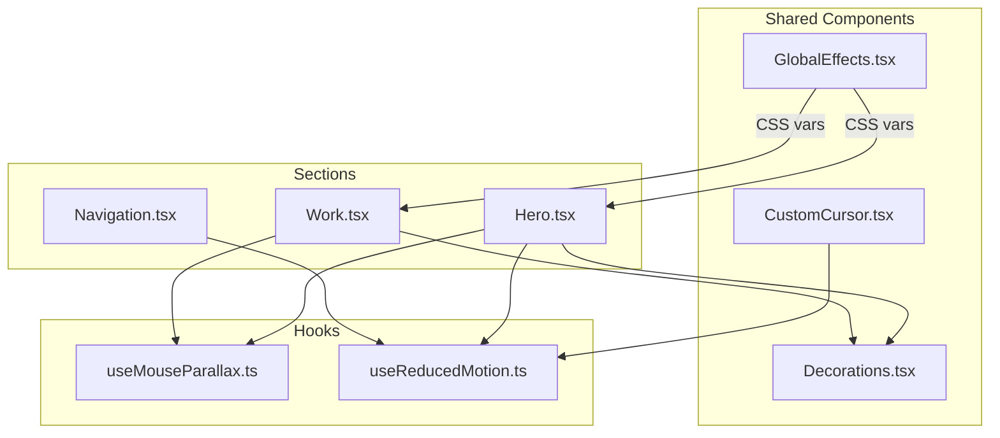
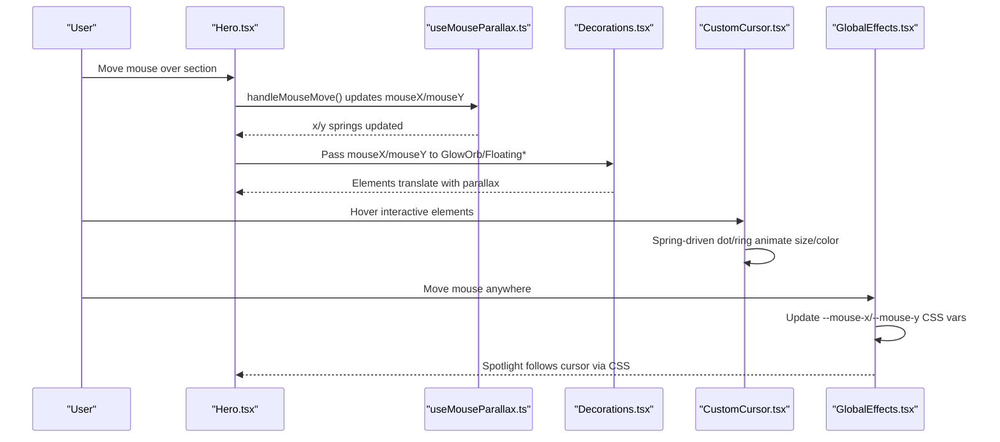
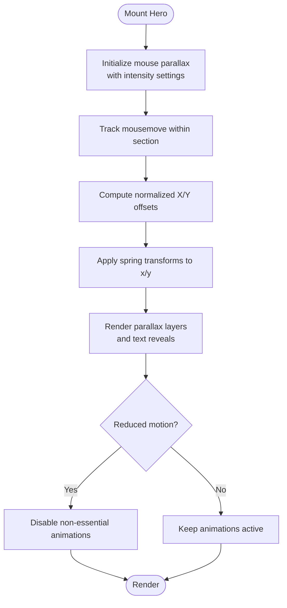
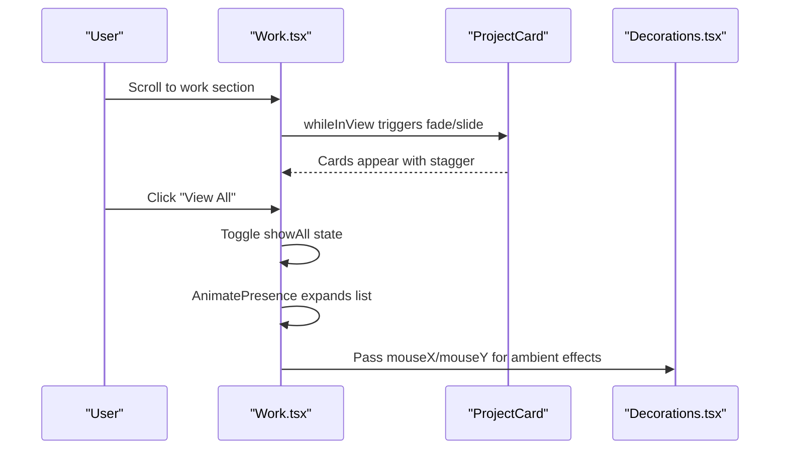
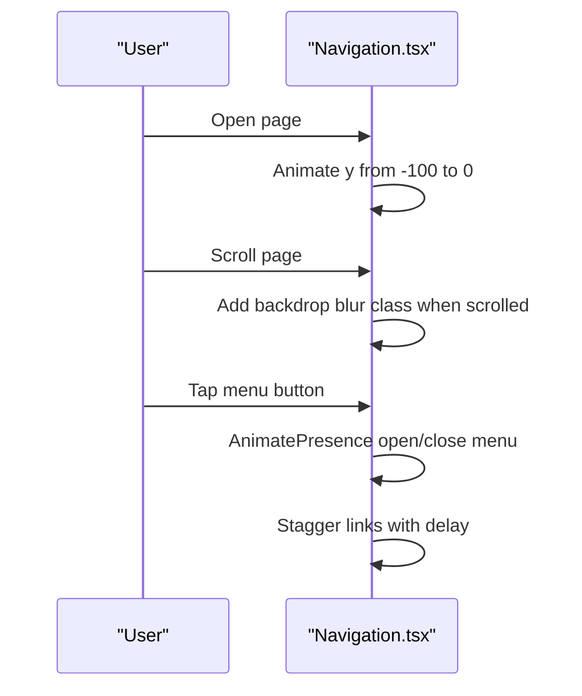
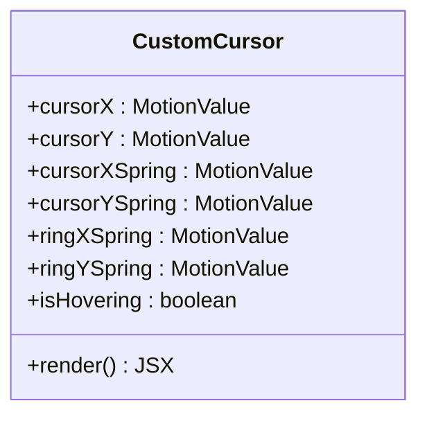
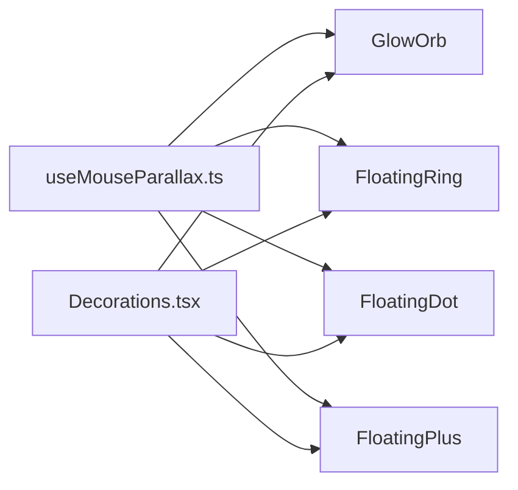
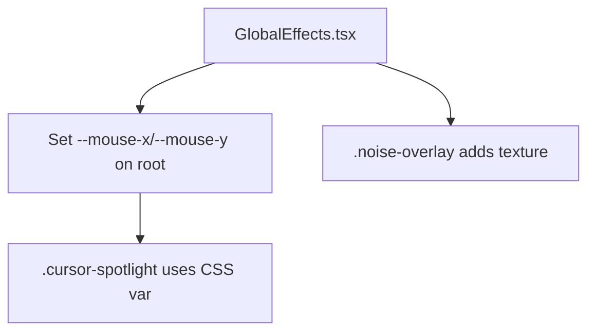
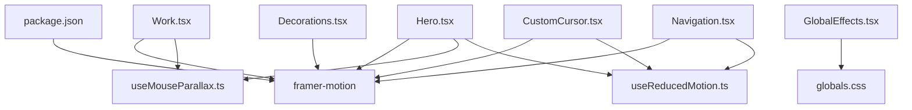

# Animation System

<cite>
**Referenced Files in This Document**
- [Hero.tsx](file://app/components/Hero.tsx)
- [Work.tsx](file://app/components/Work.tsx)
- [Navigation.tsx](file://app/components/Navigation.tsx)
- [CustomCursor.tsx](file://app/components/CustomCursor.tsx)
- [Decorations.tsx](file://app/components/Decorations.tsx)
- [GlobalEffects.tsx](file://app/components/GlobalEffects.tsx)
- [useMouseParallax.ts](file://app/hooks/useMouseParallax.ts)
- [useReducedMotion.ts](file://app/hooks/useReducedMotion.ts)
- [globals.css](file://app/globals.css)
- [package.json](file://package.json)
</cite>

## Table of Contents
1. [Introduction](#introduction)
2. [Project Structure](#project-structure)
3. [Core Components](#core-components)
4. [Architecture Overview](#architecture-overview)
5. [Detailed Component Analysis](#detailed-component-analysis)
6. [Dependency Analysis](#dependency-analysis)
7. [Performance Considerations](#performance-considerations)
8. [Troubleshooting Guide](#troubleshooting-guide)
9. [Conclusion](#conclusion)
10. [Appendices](#appendices)

## Introduction
This document explains the animation system built with Framer Motion across the portfolio. It covers hero text reveals, parallax effects driven by mouse movement, smooth transitions for navigation and content reveal, background decorations, a custom cursor, and global visual effects. It also documents how animations integrate with user interactions and scroll events, provides guidelines for adding new animations, performance optimization techniques, and accessibility considerations for motion-sensitive users.

## Project Structure
The animation system is organized into reusable hooks, shared components, and per-section components:
- Hooks encapsulate motion logic (mouse parallax, reduced motion preference).
- Shared decoration components provide reusable animated elements (glow orbs, floating shapes, grids).
- Section components (Hero, Work, Navigation) compose these building blocks to create rich experiences.
- Global effects inject CSS variables and overlays that respond to mouse position.

**Diagram sources**
- [Hero.tsx:1-187](file://app/components/Hero.tsx#L1-L187)
- [Work.tsx:1-499](file://app/components/Work.tsx#L1-L499)
- [Navigation.tsx:1-133](file://app/components/Navigation.tsx#L1-L133)
- [CustomCursor.tsx:1-92](file://app/components/CustomCursor.tsx#L1-L92)
- [Decorations.tsx:1-190](file://app/components/Decorations.tsx#L1-L190)
- [GlobalEffects.tsx:1-23](file://app/components/GlobalEffects.tsx#L1-L23)
- [useMouseParallax.ts:1-66](file://app/hooks/useMouseParallax.ts#L1-L66)
- [useReducedMotion.ts:1-20](file://app/hooks/useReducedMotion.ts#L1-L20)

**Section sources**
- [Hero.tsx:1-187](file://app/components/Hero.tsx#L1-L187)
- [Work.tsx:1-499](file://app/components/Work.tsx#L1-L499)
- [Navigation.tsx:1-133](file://app/components/Navigation.tsx#L1-L133)
- [CustomCursor.tsx:1-92](file://app/components/CustomCursor.tsx#L1-L92)
- [Decorations.tsx:1-190](file://app/components/Decorations.tsx#L1-L190)
- [GlobalEffects.tsx:1-23](file://app/components/GlobalEffects.tsx#L1-L23)
- [useMouseParallax.ts:1-66](file://app/hooks/useMouseParallax.ts#L1-L66)
- [useReducedMotion.ts:1-20](file://app/hooks/useReducedMotion.ts#L1-L20)

## Core Components
- Hero: Implements hero text reveals with staggered fade-in and slide-up, parallax-driven decorative layers, and an animated scroll indicator. Respects reduced motion preferences.
- Work: Uses scroll-triggered reveals for project cards, expandable additional projects with AnimatePresence, and mouse parallax for ambient decorations.
- Navigation: Slide-in on mount, backdrop blur on scroll, and animated mobile menu with staggered link entries using AnimatePresence.
- CustomCursor: A spring-physics-based dual-layer cursor (dot + ring) that reacts to hover states; disabled on touch devices or when reduced motion is preferred.
- Decorations: Reusable animated elements (GlowOrb, FloatingRing, FloatingDot, FloatingPlus, DottedGrid, CornerBrackets, DiagonalLine) that leverage mouse parallax values and viewport-aware opacity transitions.
- GlobalEffects: Tracks mouse position globally via CSS custom properties to power a radial spotlight overlay and integrates with noise texture.

**Section sources**
- [Hero.tsx:1-187](file://app/components/Hero.tsx#L1-L187)
- [Work.tsx:1-499](file://app/components/Work.tsx#L1-L499)
- [Navigation.tsx:1-133](file://app/components/Navigation.tsx#L1-L133)
- [CustomCursor.tsx:1-92](file://app/components/CustomCursor.tsx#L1-L92)
- [Decorations.tsx:1-190](file://app/components/Decorations.tsx#L1-L190)
- [GlobalEffects.tsx:1-23](file://app/components/GlobalEffects.tsx#L1-L23)

## Architecture Overview
The system composes motion primitives from Framer Motion with React hooks to keep concerns separated:
- Mouse-driven parallax is centralized in useMouseParallax and consumed by multiple sections and decorations.
- Reduced motion is detected once and propagated to all motion-enabled components.
- GlobalEffects sets CSS variables for a spotlight effect used by CSS.
- Sections orchestrate animations using initial/animate/whileInView/AnimatePresence for entrance, scroll-triggered, and state-driven transitions.

**Diagram sources**
- [Hero.tsx:1-187](file://app/components/Hero.tsx#L1-L187)
- [useMouseParallax.ts:1-66](file://app/hooks/useMouseParallax.ts#L1-L66)
- [Decorations.tsx:1-190](file://app/components/Decorations.tsx#L1-L190)
- [CustomCursor.tsx:1-92](file://app/components/CustomCursor.tsx#L1-L92)
- [GlobalEffects.tsx:1-23](file://app/components/GlobalEffects.tsx#L1-L23)

## Detailed Component Analysis

### Hero Text Reveals and Parallax
- Staggered entrance: Title, subtitle, description, and CTAs animate in with incremental delays, creating a layered reveal.
- Parallax layers: Background glow orbs and floating decorations move at different intensities relative to mouse position, producing depth.
- Scroll indicator: A subtle vertical bounce animation guides users downward; it respects reduced motion.

**Diagram sources**
- [Hero.tsx:1-187](file://app/components/Hero.tsx#L1-L187)
- [useMouseParallax.ts:1-66](file://app/hooks/useMouseParallax.ts#L1-L66)
- [useReducedMotion.ts:1-20](file://app/hooks/useReducedMotion.ts#L1-L20)

**Section sources**
- [Hero.tsx:75-183](file://app/components/Hero.tsx#L75-L183)
- [useMouseParallax.ts:12-45](file://app/hooks/useMouseParallax.ts#L12-L45)
- [useReducedMotion.ts:5-18](file://app/hooks/useReducedMotion.ts#L5-L18)

### Work Section: Scroll-Triggered Reveals and Expandable Content
- Project cards animate into view when scrolled into viewport with staggered delays based on index.
- Additional projects are revealed using AnimatePresence with height and opacity transitions.
- Ambient decorations follow mouse parallax to maintain consistent feel across sections.

**Diagram sources**
- [Work.tsx:296-499](file://app/components/Work.tsx#L296-L499)
- [Decorations.tsx:1-190](file://app/components/Decorations.tsx#L1-L190)

**Section sources**
- [Work.tsx:306-453](file://app/components/Work.tsx#L306-L453)

### Navigation: Entrance, Scroll State, and Mobile Menu
- The nav slides in on mount and gains a blurred background on scroll.
- Mobile menu uses AnimatePresence to enter/exit with staggered link animations.
- Accessibility attributes ensure proper screen reader behavior.

**Diagram sources**
- [Navigation.tsx:17-133](file://app/components/Navigation.tsx#L17-L133)

**Section sources**
- [Navigation.tsx:17-133](file://app/components/Navigation.tsx#L17-L133)

### Custom Cursor: Spring Physics and Hover States
- Two layers: a small dot and a larger ring, both spring-animated for smoothness.
- Detects touch devices and reduced motion to disable the custom cursor.
- Responds to hover over interactive elements by scaling and tinting the ring.

**Diagram sources**
- [CustomCursor.tsx:7-92](file://app/components/CustomCursor.tsx#L7-L92)

**Section sources**
- [CustomCursor.tsx:7-92](file://app/components/CustomCursor.tsx#L7-L92)

### Decorations: Reusable Animated Elements
- GlowOrb: Blurred circle with viewport-based opacity transition and mouse parallax.
- FloatingRing/FloatingDot/FloatingPlus: Lightweight geometric accents with parallax.
- DottedGrid/CornetBrackets/DiagonalLine: Static or minimal-motion decorative elements.

**Diagram sources**
- [Decorations.tsx:7-190](file://app/components/Decorations.tsx#L7-L190)
- [useMouseParallax.ts:47-66](file://app/hooks/useMouseParallax.ts#L47-L66)

**Section sources**
- [Decorations.tsx:7-190](file://app/components/Decorations.tsx#L7-L190)

### Global Effects: Spotlight and Noise Overlay
- Tracks mousemove to update CSS variables for a radial gradient spotlight.
- Adds a noise overlay for texture.
- Both are non-interactive and accessible via aria-hidden.

**Diagram sources**
- [GlobalEffects.tsx:5-23](file://app/components/GlobalEffects.tsx#L5-L23)
- [globals.css:61-84](file://app/globals.css#L61-L84)

**Section sources**
- [GlobalEffects.tsx:5-23](file://app/components/GlobalEffects.tsx#L5-L23)
- [globals.css:61-84](file://app/globals.css#L61-L84)

## Dependency Analysis
- Framer Motion is the core animation library, providing motion primitives, spring physics, and viewport detection.
- Hooks centralize motion logic to avoid duplication across components.
- CSS utilities and variables in globals.css complement JS-driven animations with performant GPU-accelerated effects (transforms, gradients).
- Tailwind classes manage layout and styling; motion props control timing and easing.

**Diagram sources**
- [package.json:11-19](file://package.json#L11-L19)
- [Hero.tsx:1-187](file://app/components/Hero.tsx#L1-L187)
- [Work.tsx:1-499](file://app/components/Work.tsx#L1-L499)
- [Navigation.tsx:1-133](file://app/components/Navigation.tsx#L1-L133)
- [CustomCursor.tsx:1-92](file://app/components/CustomCursor.tsx#L1-L92)
- [Decorations.tsx:1-190](file://app/components/Decorations.tsx#L1-L190)
- [useMouseParallax.ts:1-66](file://app/hooks/useMouseParallax.ts#L1-L66)
- [useReducedMotion.ts:1-20](file://app/hooks/useReducedMotion.ts#L1-L20)
- [globals.css:1-113](file://app/globals.css#L1-L113)

**Section sources**
- [package.json:11-19](file://package.json#L11-L19)
- [globals.css:1-113](file://app/globals.css#L1-L113)

## Performance Considerations
- Prefer transform-based animations (translate, scale) to leverage GPU acceleration; this codebase primarily animates x/y transforms via Framer Motion’s MotionValue and useSpring.
- Use spring physics for natural motion and to reduce jank during rapid interactions; configured in both parallax hooks and custom cursor.
- Limit heavy effects: large blurs and gradients can be expensive; apply them sparingly and only where visually necessary (e.g., glow orbs).
- Defer non-critical animations until after initial paint; staggered entrances help perceived performance.
- Respect prefers-reduced-motion to avoid unnecessary work for sensitive users.
- Avoid frequent re-renders by keeping motion values stable and using refs for DOM access where appropriate.

[No sources needed since this section provides general guidance]

## Troubleshooting Guide
- Animations not playing on mobile/touch: Ensure touch device detection disables custom cursor appropriately; verify that reduced motion does not unintentionally block essential UI feedback.
- Jittery parallax: Check intensity values and spring damping/stiffness; too high intensity or low damping can cause overshoot.
- Spotlight not following cursor: Confirm GlobalEffects is mounted and updating CSS variables; verify no CSS overrides hide the .cursor-spotlight element.
- Excessive memory usage: Remove unused listeners in cleanup functions; ensure event listeners are properly removed on unmount.
- Accessibility issues: Verify aria-hidden on decorative elements and that interactive elements remain keyboard navigable.

**Section sources**
- [CustomCursor.tsx:20-59](file://app/components/CustomCursor.tsx#L20-L59)
- [useMouseParallax.ts:28-45](file://app/hooks/useMouseParallax.ts#L28-L45)
- [GlobalEffects.tsx:5-23](file://app/components/GlobalEffects.tsx#L5-L23)
- [globals.css:94-112](file://app/globals.css#L94-L112)

## Conclusion
The portfolio’s animation system combines Framer Motion’s powerful primitives with well-structured hooks and reusable components to deliver smooth, responsive, and accessible motion. Mouse-driven parallax enhances depth, while scroll-triggered reveals and AnimatePresence manage state-driven transitions. Global effects add polish without compromising performance. By following the guidelines below, you can extend the system safely and consistently.

[No sources needed since this section summarizes without analyzing specific files]

## Appendices

### Guidelines for Adding New Animations
- Use motion primitives: Wrap elements with motion.div and define initial/animate/transition for simple reveals.
- For scroll-triggered animations, use whileInView with viewport configuration to trigger on entry.
- For complex state changes, prefer AnimatePresence to animate mounting/unmounting of elements.
- For mouse-driven effects, reuse useMouseParallax or useMouseParallaxValue to compute x/y offsets with configurable intensity and spring settings.
- Respect reduced motion: Gate non-essential animations behind useReducedMotion checks.
- Keep animations short and purposeful: Favor subtle transitions that guide attention rather than distract.

**Section sources**
- [Hero.tsx:75-183](file://app/components/Hero.tsx#L75-L183)
- [Work.tsx:306-453](file://app/components/Work.tsx#L306-L453)
- [useMouseParallax.ts:12-66](file://app/hooks/useMouseParallax.ts#L12-L66)
- [useReducedMotion.ts:5-18](file://app/hooks/useReducedMotion.ts#L5-L18)

### Common Patterns and Implementation Details
- Hero text reveals: Staggered fade-in and slide-up with incremental delays for hierarchy.
  - Reference: [Hero.tsx:79-130](file://app/components/Hero.tsx#L79-L130)
- Parallax backgrounds: Multiple layers with varying intensities to simulate depth.
  - Reference: [Hero.tsx:44-71](file://app/components/Hero.tsx#L44-L71), [useMouseParallax.ts:12-45](file://app/hooks/useMouseParallax.ts#L12-L45)
- Scroll-triggered card reveals: Fade/slide into view with viewport margins and index-based delays.
  - Reference: [Work.tsx:306-349](file://app/components/Work.tsx#L306-L349)
- Expandable lists: AnimatePresence for height and opacity transitions when toggling visibility.
  - Reference: [Work.tsx:435-453](file://app/components/Work.tsx#L435-L453)
- Navigation entrance and mobile menu: Slide-in on mount; staggered link animations with AnimatePresence.
  - Reference: [Navigation.tsx:31-129](file://app/components/Navigation.tsx#L31-L129)
- Custom cursor: Spring-based dot and ring with hover state transitions; disabled on touch/reduced motion.
  - Reference: [CustomCursor.tsx:7-92](file://app/components/CustomCursor.tsx#L7-L92)
- Global spotlight: CSS variable-driven radial gradient reacting to mouse position.
  - Reference: [GlobalEffects.tsx:5-23](file://app/components/GlobalEffects.tsx#L5-L23), [globals.css:73-84](file://app/globals.css#L73-L84)

### Accessibility Considerations
- Honor prefers-reduced-motion: Disable or minimize animations for users who prefer reduced motion.
  - Reference: [useReducedMotion.ts:5-18](file://app/hooks/useReducedMotion.ts#L5-L18), [globals.css:102-112](file://app/globals.css#L102-L112)
- Mark decorative elements as aria-hidden to prevent screen readers from announcing non-essential visuals.
  - Reference: [Decorations.tsx:31-41](file://app/components/Decorations.tsx#L31-L41), [Decorations.tsx:61-66](file://app/components/Decorations.tsx#L61-L66), [Decorations.tsx:84-89](file://app/components/Decorations.tsx#L84-L89), [Decorations.tsx:108-119](file://app/components/Decorations.tsx#L108-L119), [Decorations.tsx:145-155](file://app/components/Decorations.tsx#L145-L155), [Decorations.tsx:158-179](file://app/components/Decorations.tsx#L158-L179), [Decorations.tsx:181-189](file://app/components/Decorations.tsx#L181-L189)
- Ensure interactive elements remain keyboard accessible and have appropriate roles and labels.
  - Reference: [Navigation.tsx:71-83](file://app/components/Navigation.tsx#L71-L83), [Navigation.tsx:88-129](file://app/components/Navigation.tsx#L88-L129)