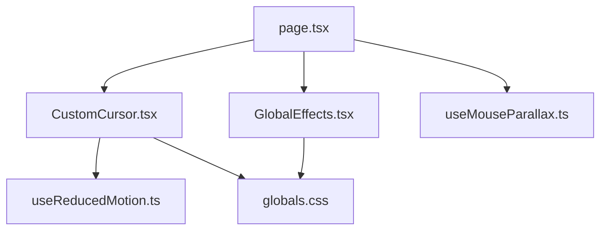
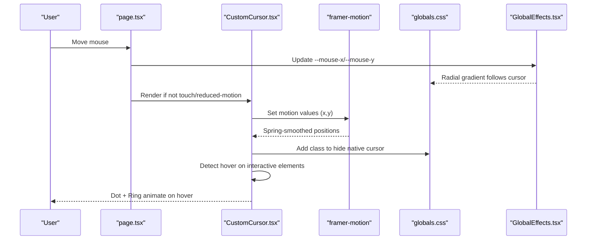
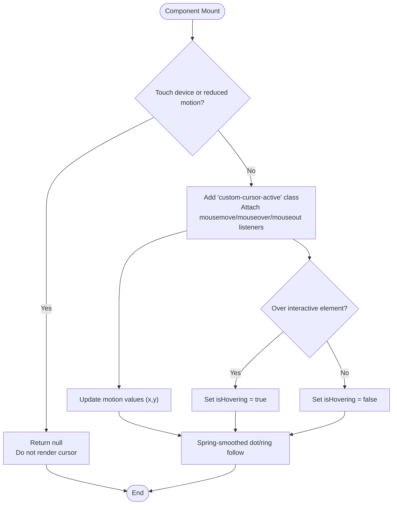
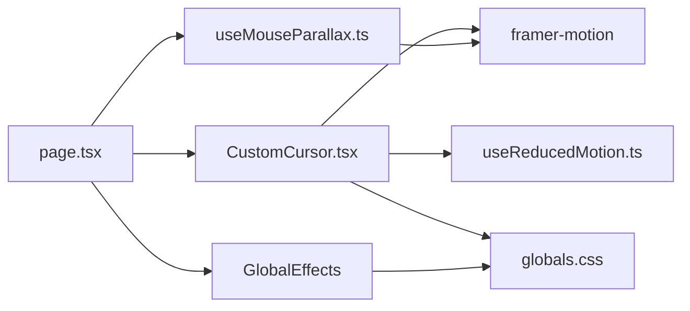

# Custom Cursor Effects

<cite>
**Referenced Files in This Document**
- [CustomCursor.tsx](file://app/components/CustomCursor.tsx)
- [useMouseParallax.ts](file://app/hooks/useMouseParallax.ts)
- [useReducedMotion.ts](file://app/hooks/useReducedMotion.ts)
- [GlobalEffects.tsx](file://app/components/GlobalEffects.tsx)
- [globals.css](file://app/globals.css)
- [page.tsx](file://app/page.tsx)
</cite>

## Table of Contents
1. [Introduction](#introduction)
2. [Project Structure](#project-structure)
3. [Core Components](#core-components)
4. [Architecture Overview](#architecture-overview)
5. [Detailed Component Analysis](#detailed-component-analysis)
6. [Dependency Analysis](#dependency-analysis)
7. [Performance Considerations](#performance-considerations)
8. [Troubleshooting Guide](#troubleshooting-guide)
9. [Conclusion](#conclusion)
10. [Appendices](#appendices)

## Introduction
This document explains the custom cursor implementation, including smooth following behavior, hover state animations, responsive device handling, and integration with the parallax system. It also covers customization options for appearance, animation timing, and device-specific behavior adjustments.

## Project Structure
The custom cursor is implemented as a client-side React component that:
- Tracks mouse movement and applies spring-based smoothing
- Detects interactive elements to trigger hover states
- Disables itself on touch devices or when reduced motion is preferred
- Integrates with global effects (spotlight) and CSS classes to hide the native cursor

**Diagram sources**
- [page.tsx:557-587](file://app/page.tsx#L557-L587)
- [CustomCursor.tsx:1-92](file://app/components/CustomCursor.tsx#L1-L92)
- [GlobalEffects.tsx:1-23](file://app/components/GlobalEffects.tsx#L1-L23)
- [useMouseParallax.ts:1-66](file://app/hooks/useMouseParallax.ts#L1-L66)
- [useReducedMotion.ts:1-20](file://app/hooks/useReducedMotion.ts#L1-L20)
- [globals.css:94-112](file://app/globals.css#L94-L112)

**Section sources**
- [page.tsx:557-587](file://app/page.tsx#L557-L587)
- [CustomCursor.tsx:1-92](file://app/components/CustomCursor.tsx#L1-L92)
- [GlobalEffects.tsx:1-23](file://app/components/GlobalEffects.tsx#L1-L23)
- [useMouseParallax.ts:1-66](file://app/hooks/useMouseParallax.ts#L1-L66)
- [useReducedMotion.ts:1-20](file://app/hooks/useReducedMotion.ts#L1-L20)
- [globals.css:94-112](file://app/globals.css#L94-L112)

## Core Components
- CustomCursor: Renders a dot and ring that follow the mouse with spring physics; toggles hover state on interactive elements; disables on touch or reduced-motion preferences.
- useReducedMotion: Provides a boolean indicating whether the user prefers reduced motion.
- GlobalEffects: Updates CSS variables for mouse position to drive a spotlight effect across the page.
- useMouseParallax: Supplies normalized mouse coordinates per section to drive parallax effects independently from the cursor.
- globals.css: Hides the native cursor when the custom cursor is active and enforces reduced-motion constraints.

Key behaviors:
- Smooth following via framer-motion springs
- Hover detection using element selectors and data attributes
- Device-aware disabling (touch devices)
- Accessibility-aware disabling (reduced motion)
- Integration with global spotlight and parallax systems

**Section sources**
- [CustomCursor.tsx:7-92](file://app/components/CustomCursor.tsx#L7-L92)
- [useReducedMotion.ts:5-19](file://app/hooks/useReducedMotion.ts#L5-L19)
- [GlobalEffects.tsx:5-22](file://app/components/GlobalEffects.tsx#L5-L22)
- [useMouseParallax.ts:12-65](file://app/hooks/useMouseParallax.ts#L12-L65)
- [globals.css:94-112](file://app/globals.css#L94-L112)

## Architecture Overview
The cursor architecture separates concerns into rendering, motion, accessibility, and global effects:

**Diagram sources**
- [page.tsx:557-587](file://app/page.tsx#L557-L587)
- [CustomCursor.tsx:25-59](file://app/components/CustomCursor.tsx#L25-L59)
- [GlobalEffects.tsx:5-22](file://app/components/GlobalEffects.tsx#L5-L22)
- [globals.css:73-100](file://app/globals.css#L73-L100)

## Detailed Component Analysis

### CustomCursor Component
Responsibilities:
- Track mouse position and apply spring smoothing for both dot and ring
- Detect hover over interactive elements and toggle size/appearance
- Respect device capabilities and user preferences by disabling itself when needed
- Manage event listeners and cleanup

Hover detection targets:
- Links, buttons, inputs, textareas, selects, and any element with a specific data attribute

Visual feedback:
- Dot scales up slightly on hover
- Ring expands and changes border/background color on hover

Device and accessibility behavior:
- Disabled on touch devices
- Disabled when reduced motion is preferred

**Diagram sources**
- [CustomCursor.tsx:20-59](file://app/components/CustomCursor.tsx#L20-L59)
- [CustomCursor.tsx:61-90](file://app/components/CustomCursor.tsx#L61-L90)

**Section sources**
- [CustomCursor.tsx:7-92](file://app/components/CustomCursor.tsx#L7-L92)

### useReducedMotion Hook
Purpose:
- Detect user preference for reduced motion and update dynamically when settings change
- Used to disable animations and the custom cursor when appropriate

Behavior:
- Initializes based on media query
- Listens for changes and updates state accordingly

**Section sources**
- [useReducedMotion.ts:5-19](file://app/hooks/useReducedMotion.ts#L5-L19)

### GlobalEffects Component
Purpose:
- Maintain CSS variables for current mouse position used by the spotlight effect
- Provide non-interactive overlay elements for visual polish

Integration:
- The spotlight uses CSS variables to create a radial gradient centered at the cursor
- Works alongside the custom cursor without interfering with its performance

**Section sources**
- [GlobalEffects.tsx:5-22](file://app/components/GlobalEffects.tsx#L5-L22)
- [globals.css:73-84](file://app/globals.css#L73-L84)

### useMouseParallax Hook
Purpose:
- Compute normalized mouse coordinates relative to an element’s center
- Apply spring smoothing to produce parallax offsets for decorative elements

Usage:
- Sections attach this hook to their root element to drive independent parallax effects
- Does not interfere with the custom cursor; they operate on separate motion values

**Section sources**
- [useMouseParallax.ts:12-65](file://app/hooks/useMouseParallax.ts#L12-L65)

### CSS and Styling
Key styling behaviors:
- Hide native cursor when custom cursor is active (only on fine pointer devices)
- Enforce reduced motion constraints globally
- Define spotlight and noise overlays for ambient effects

**Section sources**
- [globals.css:73-112](file://app/globals.css#L73-L112)

## Dependency Analysis
- CustomCursor depends on:
  - framer-motion for motion values and springs
  - useReducedMotion for accessibility compliance
  - CSS class to hide native cursor
- GlobalEffects depends on:
  - DOM APIs to set CSS variables
  - CSS for spotlight rendering
- useMouseParallax depends on:
  - framer-motion for motion values and transforms
- page.tsx composes these components and hooks to enable the full experience

**Diagram sources**
- [CustomCursor.tsx:1-92](file://app/components/CustomCursor.tsx#L1-L92)
- [GlobalEffects.tsx:1-23](file://app/components/GlobalEffects.tsx#L1-L23)
- [useMouseParallax.ts:1-66](file://app/hooks/useMouseParallax.ts#L1-L66)
- [page.tsx:557-587](file://app/page.tsx#L557-L587)
- [globals.css:94-112](file://app/globals.css#L94-L112)

**Section sources**
- [CustomCursor.tsx:1-92](file://app/components/CustomCursor.tsx#L1-L92)
- [GlobalEffects.tsx:1-23](file://app/components/GlobalEffects.tsx#L1-L23)
- [useMouseParallax.ts:1-66](file://app/hooks/useMouseParallax.ts#L1-L66)
- [page.tsx:557-587](file://app/page.tsx#L557-L587)
- [globals.css:94-112](file://app/globals.css#L94-L112)

## Performance Considerations
- Use of framer-motion springs ensures GPU-friendly animations with minimal layout thrashing
- Event listeners are attached once and cleaned up on unmount to prevent memory leaks
- Touch devices and reduced-motion preferences disable the cursor to conserve resources and respect user settings
- Spotlight effect uses CSS variables updated on mousemove; consider throttling if additional heavy computations are added
- Keep hover detection lightweight; avoid deep DOM traversals beyond closest() checks

[No sources needed since this section provides general guidance]

## Troubleshooting Guide
Common issues and resolutions:
- Cursor not visible:
  - Ensure the environment is not a touch device and reduced motion is not enabled
  - Verify that the body has the active class when the cursor is rendered
- Hover state not triggering:
  - Confirm the target element matches one of the supported selectors or includes the designated data attribute
- Native cursor still showing:
  - Check that the active class is applied only on fine pointer devices and that CSS rules are loaded
- Spotlight not following cursor:
  - Ensure the global effects component is mounted and updating CSS variables
- Parallax not working:
  - Verify the section has the required ref and event handlers attached

**Section sources**
- [CustomCursor.tsx:20-59](file://app/components/CustomCursor.tsx#L20-L59)
- [GlobalEffects.tsx:5-22](file://app/components/GlobalEffects.tsx#L5-L22)
- [globals.css:94-112](file://app/globals.css#L94-L112)

## Conclusion
The custom cursor provides a smooth, accessible, and responsive interaction layer that enhances the user experience while integrating seamlessly with the site’s parallax and global effects. It respects device capabilities and user preferences, ensuring optimal performance and accessibility across environments.

[No sources needed since this section summarizes without analyzing specific files]

## Appendices

### Customization Options
- Appearance:
  - Adjust dot and ring sizes, colors, and opacity via component props or CSS classes
  - Modify blend modes and z-index for better visibility on different backgrounds
- Animation timing:
  - Tune spring damping and stiffness for smoother or snappier responses
  - Adjust transition durations for hover state changes
- Device-specific behavior:
  - Extend touch detection logic if needed for specific platforms
  - Add conditional logic to customize behavior based on pointer type or screen size

[No sources needed since this section provides general guidance]