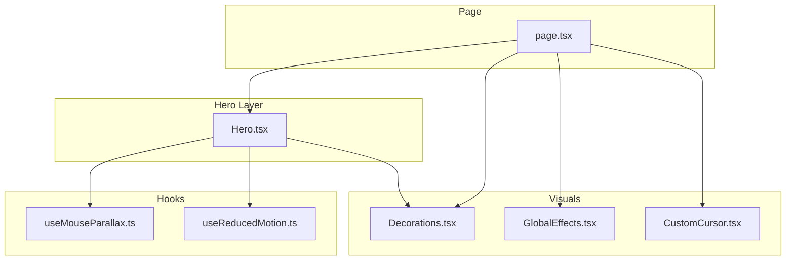
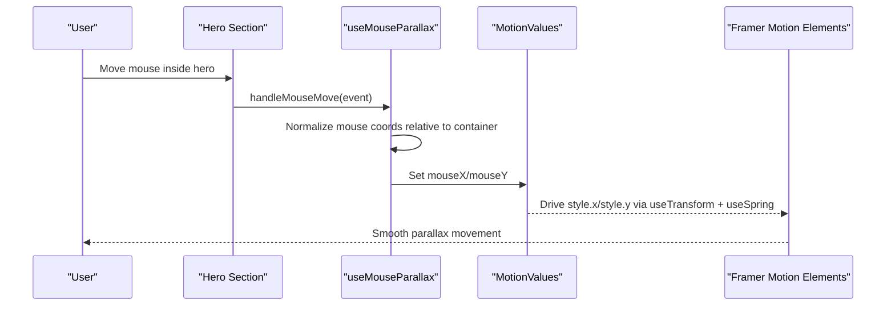
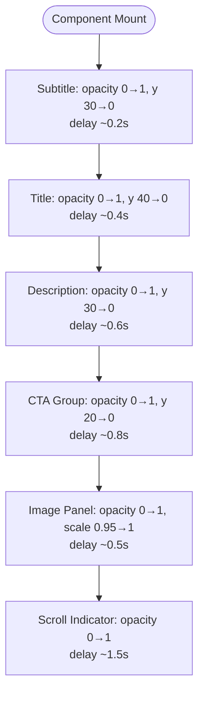
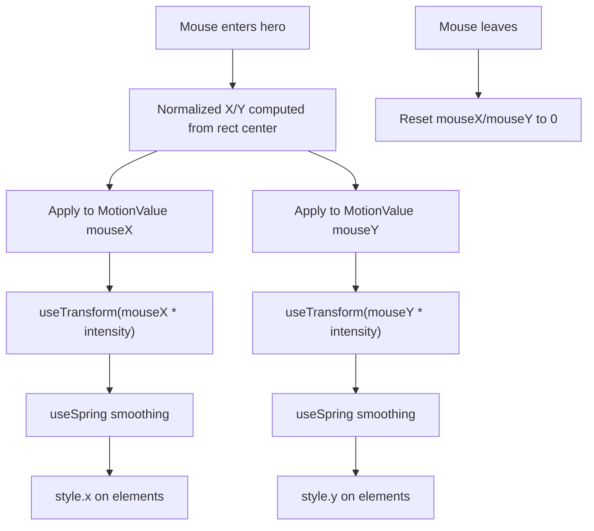
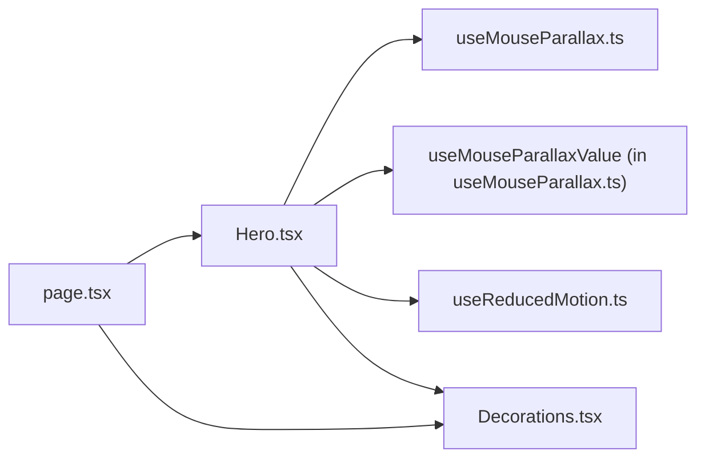

# Hero Animations

<cite>
**Referenced Files in This Document**
- [Hero.tsx](file://app/components/Hero.tsx)
- [useMouseParallax.ts](file://app/hooks/useMouseParallax.ts)
- [Decorations.tsx](file://app/components/Decorations.tsx)
- [useReducedMotion.ts](file://app/hooks/useReducedMotion.ts)
- [GlobalEffects.tsx](file://app/components/GlobalEffects.tsx)
- [CustomCursor.tsx](file://app/components/CustomCursor.tsx)
- [page.tsx](file://app/page.tsx)
</cite>

## Table of Contents
1. [Introduction](#introduction)
2. [Project Structure](#project-structure)
3. [Core Components](#core-components)
4. [Architecture Overview](#architecture-overview)
5. [Detailed Component Analysis](#detailed-component-analysis)
6. [Dependency Analysis](#dependency-analysis)
7. [Performance Considerations](#performance-considerations)
8. [Troubleshooting Guide](#troubleshooting-guide)
9. [Conclusion](#conclusion)

## Introduction
This document explains the hero section animations with a focus on:
- Staggered entrance animations for title, subtitle, and call-to-action buttons using Framer Motion
- Mouse-driven parallax system that creates depth effects across background elements and decorative shapes
- Implementation details of the useMouseParallax hook, intensity settings, and performance optimizations
- How to customize animation timing, delays, and motion patterns for different screen sizes

The hero is built as a client component and composes Framer Motion primitives with custom hooks to deliver smooth, GPU-accelerated interactions while respecting user preferences for reduced motion.

## Project Structure
The hero animations are implemented across a small set of focused files:
- Hero component orchestrates content layout, staggered entrances, and parallax application
- Parallax hook provides mouse tracking and spring-smooth transforms
- Decorations provide reusable visual elements (grids, orbs, rings, plus marks)
- Reduced motion hook ensures accessibility by disabling or simplifying animations when requested
- Global effects and custom cursor add ambient interactivity

**Diagram sources**
- [Hero.tsx:10-33](file://app/components/Hero.tsx#L10-L33)
- [useMouseParallax.ts:12-45](file://app/hooks/useMouseParallax.ts#L12-L45)
- [Decorations.tsx:145-156](file://app/components/Decorations.tsx#L145-L156)
- [useReducedMotion.ts:5-19](file://app/hooks/useReducedMotion.ts#L5-L19)
- [GlobalEffects.tsx:5-21](file://app/components/GlobalEffects.tsx#L5-L21)
- [CustomCursor.tsx:7-92](file://app/components/CustomCursor.tsx#L7-L92)
- [page.tsx:557-587](file://app/page.tsx#L557-L587)

**Section sources**
- [Hero.tsx:10-33](file://app/components/Hero.tsx#L10-L33)
- [page.tsx:557-587](file://app/page.tsx#L557-L587)

## Core Components
- Hero: Composes text reveals, image frame, and decorative layers; applies per-element parallax via MotionValues; uses staggered transitions for entrance
- useMouseParallax: Tracks normalized mouse position within a container and returns spring-smooth x/y values; exposes handlers for mouse move and leave
- useMouseParallaxValue: Consumes shared mouseX/mouseY MotionValues and applies a configurable intensity multiplier with spring smoothing
- Decorations: Provides reusable background visuals (DottedGrid, GlowOrb, FloatingRing, FloatingDot, FloatingPlus, CornerBrackets)
- useReducedMotion: Detects prefers-reduced-motion and toggles complex animations off
- GlobalEffects: Updates CSS variables for global cursor spotlight and noise overlay
- CustomCursor: Adds a custom pointer with hover states, disabled on touch or reduced motion

Key behaviors:
- Staggered entrances: Each hero element animates from opacity 0 and an offset Y to its final state with increasing delay
- Parallax depth: Different intensities create layered depth (background glows move less than foreground decorations)
- Accessibility: Reduced motion disables non-essential animations and simplifies motion where possible

**Section sources**
- [Hero.tsx:79-130](file://app/components/Hero.tsx#L79-L130)
- [useMouseParallax.ts:12-65](file://app/hooks/useMouseParallax.ts#L12-L65)
- [Decorations.tsx:7-189](file://app/components/Decorations.tsx#L7-L189)
- [useReducedMotion.ts:5-19](file://app/hooks/useReducedMotion.ts#L5-L19)
- [GlobalEffects.tsx:5-21](file://app/components/GlobalEffects.tsx#L5-L21)
- [CustomCursor.tsx:7-92](file://app/components/CustomCursor.tsx#L7-L92)

## Architecture Overview
The hero animation architecture combines event-driven mouse tracking with declarative motion primitives:

**Diagram sources**
- [Hero.tsx:35-41](file://app/components/Hero.tsx#L35-L41)
- [useMouseParallax.ts:28-44](file://app/hooks/useMouseParallax.ts#L28-L44)
- [useMouseParallax.ts:47-65](file://app/hooks/useMouseParallax.ts#L47-L65)

## Detailed Component Analysis

### Staggered Entrance Animations (Title, Subtitle, Buttons)
- The hero uses Framer Motion’s initial/animate/transition to animate each element into view
- Subtitle (role label), h1 title, description paragraph, and CTA group each have distinct delays to create a cascading reveal
- The image panel scales and fades in slightly later to emphasize hierarchy
- A scroll indicator at the bottom fades in last and gently bounces

Implementation highlights:
- Subtitle: fade-up with short delay
- Title: larger fade-up with medium delay
- Description: fade-up with longer delay
- CTA group: fade-up with longest delay among text elements
- Image panel: scale-in with delay
- Scroll indicator: fade-in with long delay and infinite subtle vertical oscillation

**Diagram sources**
- [Hero.tsx:79-130](file://app/components/Hero.tsx#L79-L130)
- [Hero.tsx:133-167](file://app/components/Hero.tsx#L133-L167)
- [Hero.tsx:171-183](file://app/components/Hero.tsx#L171-L183)

**Section sources**
- [Hero.tsx:79-130](file://app/components/Hero.tsx#L79-L130)
- [Hero.tsx:133-167](file://app/components/Hero.tsx#L133-L167)
- [Hero.tsx:171-183](file://app/components/Hero.tsx#L171-L183)

### Mouse-Driven Parallax System
- The hero attaches mousemove and mouseleave handlers to the root section
- useMouseParallax normalizes mouse coordinates to [-1, 1] based on container bounds
- Multiple layers receive different intensities to simulate depth:
  - Background glows: low absolute intensity (e.g., -8)
  - Mid-layer decorations: moderate positive/negative intensities (e.g., 12, -18)
  - Foreground text: subtle positive intensity (e.g., 8)
- Springs smooth motion and return to center on mouse leave

**Diagram sources**
- [useMouseParallax.ts:28-44](file://app/hooks/useMouseParallax.ts#L28-L44)
- [useMouseParallax.ts:47-65](file://app/hooks/useMouseParallax.ts#L47-L65)
- [Hero.tsx:11-33](file://app/components/Hero.tsx#L11-L33)

**Section sources**
- [Hero.tsx:11-33](file://app/components/Hero.tsx#L11-L33)
- [useMouseParallax.ts:12-65](file://app/hooks/useMouseParallax.ts#L12-L65)

### useMouseParallax Hook Internals
- Returns:
  - ref: container reference for bounding rect calculations
  - x/y: spring-smooth MotionValues for direct usage
  - mouseX/mouseY: raw normalized MotionValues for sharing across components
  - handleMouseMove/handleMouseLeave: event handlers
- Configurable:
  - intensity: multiplier applied to normalized mouse position
  - damping/stiffness: spring parameters controlling responsiveness and settling behavior

Usage patterns:
- One instance per section to track mouse within that container
- Share mouseX/mouseY with multiple children via useMouseParallaxValue to apply varied intensities

**Section sources**
- [useMouseParallax.ts:12-45](file://app/hooks/useMouseParallax.ts#L12-L45)
- [useMouseParallax.ts:47-65](file://app/hooks/useMouseParallax.ts#L47-L65)

### Decorative Layers and Depth
- DottedGrid: subtle dot pattern background
- GlowOrb: large blurred circles with color variants and viewport-triggered fade-in
- FloatingRing/FloatingDot/FloatingPlus: small geometric accents with parallax
- CornerBrackets: framing accents around image panels
- DiagonalLine: accent lines for visual rhythm

These elements are positioned absolutely and animated via Framer Motion style transforms driven by parallax MotionValues.

**Section sources**
- [Decorations.tsx:7-189](file://app/components/Decorations.tsx#L7-L189)
- [Hero.tsx:42-71](file://app/components/Hero.tsx#L42-L71)

### Accessibility and Reduced Motion
- useReducedMotion detects prefers-reduced-motion and updates reactively
- In the hero, the scroll indicator animation is conditionally disabled when reduced motion is preferred
- Custom cursor is disabled on touch devices or when reduced motion is enabled

**Section sources**
- [useReducedMotion.ts:5-19](file://app/hooks/useReducedMotion.ts#L5-L19)
- [Hero.tsx:171-183](file://app/components/Hero.tsx#L171-L183)
- [CustomCursor.tsx:20-59](file://app/components/CustomCursor.tsx#L20-L59)

### Global Effects and Cursor
- GlobalEffects sets CSS variables for mouse position used by global styles (e.g., cursor spotlight)
- CustomCursor renders a custom pointer with hover scaling and ring expansion, disabled on touch/reduced motion

**Section sources**
- [GlobalEffects.tsx:5-21](file://app/components/GlobalEffects.tsx#L5-L21)
- [CustomCursor.tsx:7-92](file://app/components/CustomCursor.tsx#L7-L92)

## Dependency Analysis
- Hero depends on:
  - useMouseParallax for mouse tracking and MotionValues
  - useMouseParallaxValue for per-layer parallax
  - useReducedMotion for accessibility
  - Decorations for background visuals
- page.tsx composes Hero with other sections and imports decoration utilities
- Decorations reuse useMouseParallaxValue for consistent parallax behavior across components

**Diagram sources**
- [Hero.tsx:3-8](file://app/components/Hero.tsx#L3-L8)
- [page.tsx:11-27](file://app/page.tsx#L11-L27)
- [useMouseParallax.ts:12-65](file://app/hooks/useMouseParallax.ts#L12-L65)

**Section sources**
- [Hero.tsx:3-8](file://app/components/Hero.tsx#L3-L8)
- [page.tsx:11-27](file://app/page.tsx#L11-L27)

## Performance Considerations
- GPU-accelerated transforms: All motion uses Framer Motion’s MotionValues and transforms, avoiding layout thrash
- Spring smoothing: useSpring reduces jank by interpolating MotionValues smoothly
- Minimal re-renders: Shared mouseX/mouseY MotionValues prevent unnecessary component updates
- Viewport-triggered animations: Decorations like GlowOrb use whileInView to animate only when visible
- Reduced motion: Non-essential animations are disabled when users prefer reduced motion
- Image optimization: Next.js Image is used for responsive images with priority hints where appropriate

[No sources needed since this section provides general guidance]

## Troubleshooting Guide
Common issues and resolutions:
- Parallax not moving: Ensure the hero section has a ref attached and onMouseMove/onMouseLeave handlers bound
- Excessive jitter: Increase damping or decrease stiffness in the parallax config to smooth motion
- Overly strong parallax: Reduce intensity values for specific layers to avoid exaggerated movement
- Animations not respecting reduced motion: Verify useReducedMotion is used to gate animations and that conditional branches are correct
- Custom cursor flickering: Confirm it is disabled on touch devices or when reduced motion is enabled

**Section sources**
- [Hero.tsx:35-41](file://app/components/Hero.tsx#L35-L41)
- [useMouseParallax.ts:12-44](file://app/hooks/useMouseParallax.ts#L12-L44)
- [useReducedMotion.ts:5-19](file://app/hooks/useReducedMotion.ts#L5-L19)
- [CustomCursor.tsx:20-59](file://app/components/CustomCursor.tsx#L20-L59)

## Conclusion
The hero section delivers a polished, accessible experience through:
- Staggered entrance animations that guide attention to key content
- A robust mouse-driven parallax system with layered depth and spring smoothing
- Reusable decoration components for consistent visual language
- Strong accessibility practices via reduced motion support

To customize:
- Adjust stagger delays and durations in the hero’s motion props to change pacing
- Tune intensity values per layer to control perceived depth
- Modify spring damping/stiffness for smoother or snappier responses
- Use viewport-aware animations for performance on long pages

[No sources needed since this section summarizes without analyzing specific files]