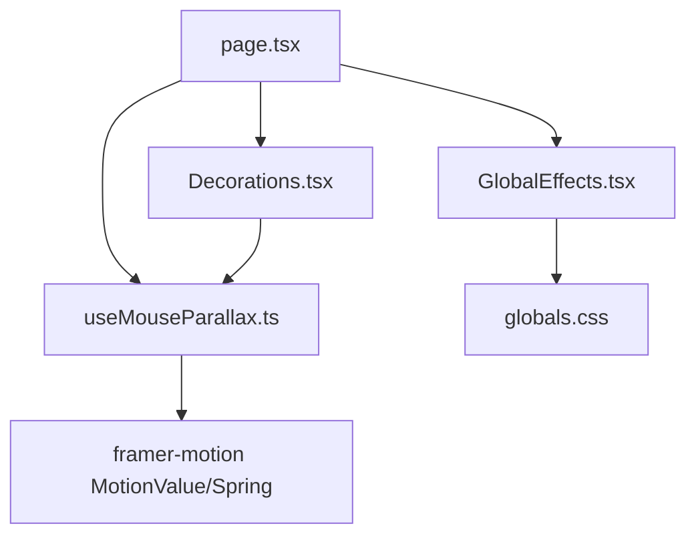
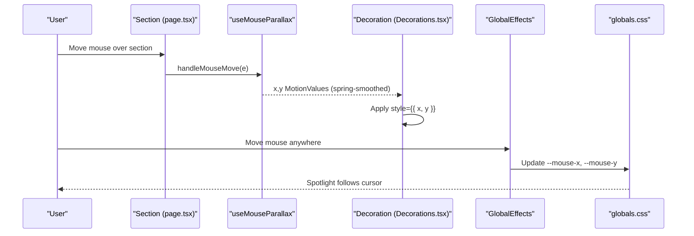
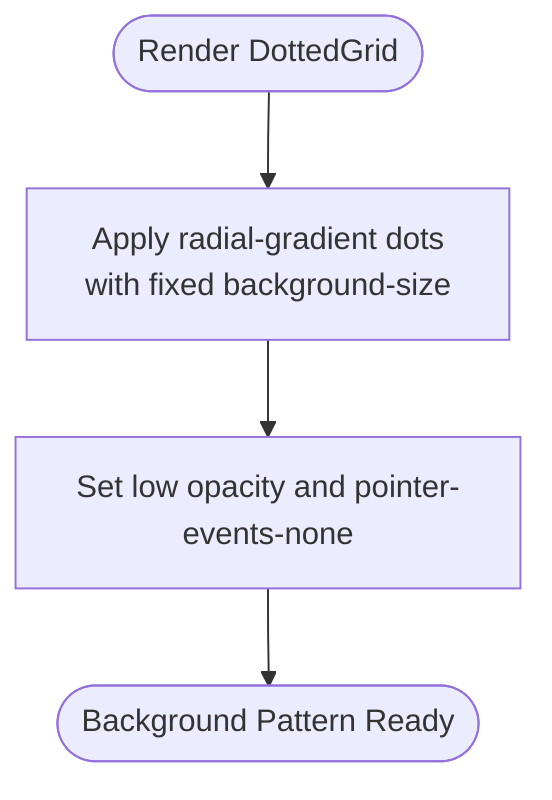
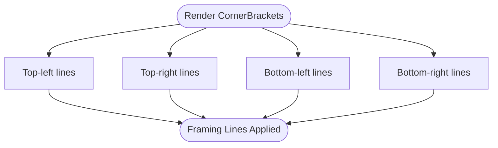
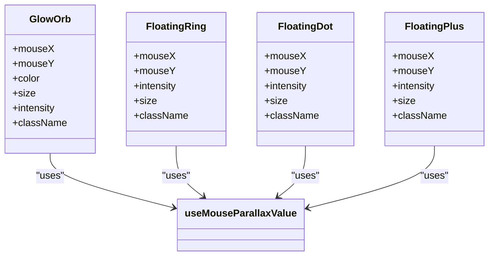
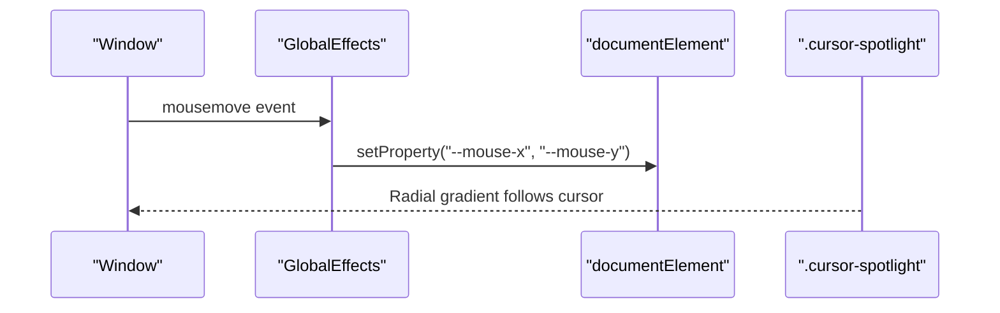
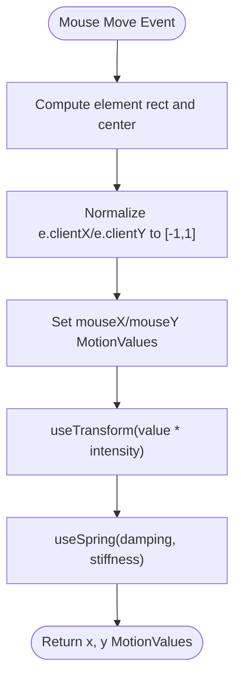
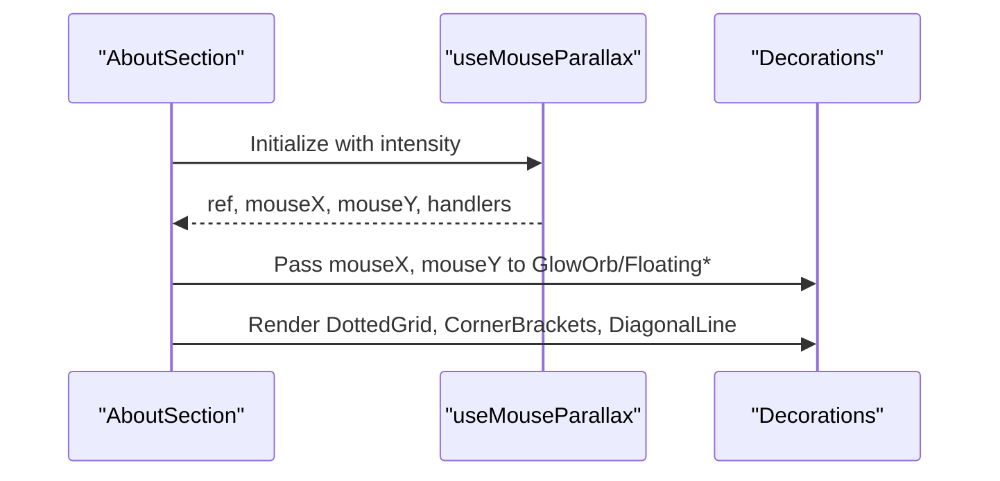
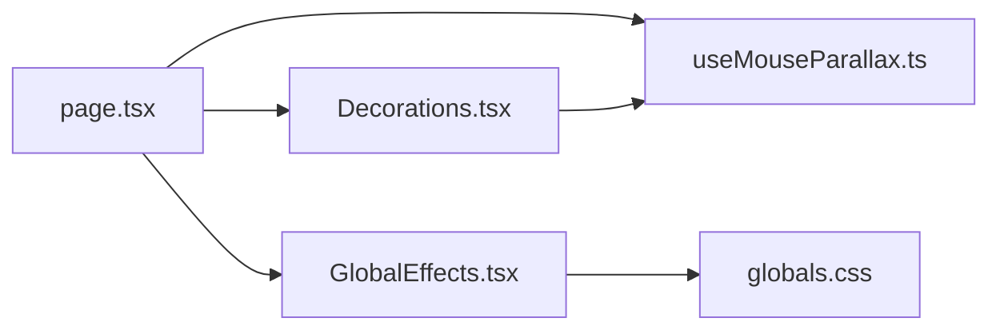

# Visual Decorations

<cite>
**Referenced Files in This Document**
- [Decorations.tsx](file://app/components/Decorations.tsx)
- [GlobalEffects.tsx](file://app/components/GlobalEffects.tsx)
- [useMouseParallax.ts](file://app/hooks/useMouseParallax.ts)
- [useReducedMotion.ts](file://app/hooks/useReducedMotion.ts)
- [page.tsx](file://app/page.tsx)
- [globals.css](file://app/globals.css)
</cite>

## Table of Contents
1. [Introduction](#introduction)
2. [Project Structure](#project-structure)
3. [Core Components](#core-components)
4. [Architecture Overview](#architecture-overview)
5. [Detailed Component Analysis](#detailed-component-analysis)
6. [Dependency Analysis](#dependency-analysis)
7. [Performance Considerations](#performance-considerations)
8. [Troubleshooting Guide](#troubleshooting-guide)
9. [Conclusion](#conclusion)
10. [Appendices](#appendices)

## Introduction
This document explains the visual decoration system used to create subtle background patterns, floating geometric shapes, and animated decorative elements that respond to user interactions. It focuses on:
- DottedGrid for subtle dot-grid backgrounds
- CornerBrackets for framing accents
- Floating shapes (GlowOrb, FloatingRing, FloatingDot, FloatingPlus) with parallax-driven motion
- Global effects such as a cursor spotlight and noise overlay
- How decorations integrate with the mouse-based parallax system and respect reduced motion preferences
- Guidelines for adding new decorations, maintaining performance, and ensuring accessibility

## Project Structure
The decoration system is implemented across components and hooks:
- Decorations are defined in a dedicated component file and composed into page sections
- Parallax behavior is provided by a reusable hook
- Global effects are rendered once at the root level
- Styles for effects live in global CSS

**Diagram sources**
- [page.tsx:17-27](file://app/page.tsx#L17-L27)
- [Decorations.tsx:1-6](file://app/components/Decorations.tsx#L1-L6)
- [GlobalEffects.tsx:1-23](file://app/components/GlobalEffects.tsx#L1-L23)
- [useMouseParallax.ts:1-66](file://app/hooks/useMouseParallax.ts#L1-L66)
- [globals.css:61-92](file://app/globals.css#L61-L92)

**Section sources**
- [page.tsx:17-27](file://app/page.tsx#L17-L27)
- [Decorations.tsx:1-6](file://app/components/Decorations.tsx#L1-L6)
- [GlobalEffects.tsx:1-23](file://app/components/GlobalEffects.tsx#L1-L23)
- [useMouseParallax.ts:1-66](file://app/hooks/useMouseParallax.ts#L1-L66)
- [globals.css:61-92](file://app/globals.css#L61-L92)

## Core Components
- DottedGrid: Renders a subtle radial-gradient dot pattern covering its container.
- CornerBrackets: Draws four corner lines to frame content.
- GlowOrb: A large blurred circle that follows mouse movement via parallax.
- FloatingRing: An outlined ring that floats with parallax.
- FloatingDot: A small filled circle that floats with parallax.
- FloatingPlus: A plus-shaped SVG marker that floats with parallax.
- SectionNumber: Large, semi-transparent section numbers for visual rhythm.
- DiagonalLine: A diagonal line accent for layout decoration.
- GlobalEffects: Installs a mouse-tracking spotlight and a noise overlay.

These components are composed within page sections to create layered, interactive backgrounds without interfering with content interaction.

**Section sources**
- [Decorations.tsx:145-189](file://app/components/Decorations.tsx#L145-L189)
- [Decorations.tsx:7-143](file://app/components/Decorations.tsx#L7-L143)
- [GlobalEffects.tsx:5-21](file://app/components/GlobalEffects.tsx#L5-L21)

## Architecture Overview
The decoration system uses a mouse-driven parallax pipeline:
- Sections attach mouse move handlers to compute normalized coordinates relative to their center
- The parallax hook transforms these values into smooth spring-animated offsets
- Decoration components consume these offsets to animate position
- Global effects track window-level mouse movement to drive a CSS spotlight

**Diagram sources**
- [page.tsx:162-176](file://app/page.tsx#L162-L176)
- [useMouseParallax.ts:12-45](file://app/hooks/useMouseParallax.ts#L12-L45)
- [Decorations.tsx:22-41](file://app/components/Decorations.tsx#L22-L41)
- [GlobalEffects.tsx:6-14](file://app/components/GlobalEffects.tsx#L6-L14)
- [globals.css:73-84](file://app/globals.css#L73-L84)

## Detailed Component Analysis

### DottedGrid
- Purpose: Provides a subtle, low-opacity dot grid background using a radial gradient and fixed background size.
- Behavior: Static pattern; non-interactive; accessible via aria-hidden.
- Integration: Placed behind content in sections to add texture without distraction.

**Diagram sources**
- [Decorations.tsx:145-156](file://app/components/Decorations.tsx#L145-L156)

**Section sources**
- [Decorations.tsx:145-156](file://app/components/Decorations.tsx#L145-L156)

### CornerBrackets
- Purpose: Adds four corner lines to frame cards or sections.
- Behavior: Purely decorative; positioned absolutely; non-interactive.
- Integration: Used inside bordered containers to emphasize structure.

**Diagram sources**
- [Decorations.tsx:158-179](file://app/components/Decorations.tsx#L158-L179)

**Section sources**
- [Decorations.tsx:158-179](file://app/components/Decorations.tsx#L158-L179)

### Floating Shapes with Parallax
Components: GlowOrb, FloatingRing, FloatingDot, FloatingPlus
- Shared behavior:
  - Accept mouseX/mouseY MotionValues from useMouseParallax
  - Compute smoothed x/y offsets via useMouseParallaxValue
  - Apply transform via style={{ x, y }}
  - Marked aria-hidden for accessibility
- Differences:
  - GlowOrb: Blurred circle with color variants and fade-in on view
  - FloatingRing: Outlined ring with responsive visibility
  - FloatingDot: Small filled circle
  - FloatingPlus: SVG crosshair shape

**Diagram sources**
- [Decorations.tsx:7-119](file://app/components/Decorations.tsx#L7-L119)
- [useMouseParallax.ts:47-65](file://app/hooks/useMouseParallax.ts#L47-L65)

**Section sources**
- [Decorations.tsx:7-119](file://app/components/Decorations.tsx#L7-L119)
- [useMouseParallax.ts:47-65](file://app/hooks/useMouseParallax.ts#L47-L65)

### Global Effects
- Mouse spotlight: Tracks window mousemove and updates CSS variables used by a radial gradient overlay.
- Noise overlay: Adds a subtle grain texture over the entire viewport.
- Both are non-interactive and marked aria-hidden.

**Diagram sources**
- [GlobalEffects.tsx:6-14](file://app/components/GlobalEffects.tsx#L6-L14)
- [globals.css:73-84](file://app/globals.css#L73-L84)

**Section sources**
- [GlobalEffects.tsx:5-21](file://app/components/GlobalEffects.tsx#L5-L21)
- [globals.css:61-84](file://app/globals.css#L61-L84)

### Parallax Hook Deep Dive
- useMouseParallax:
  - Creates a ref for the host element
  - Computes normalized mouse position relative to element center
  - Returns spring-smoothed x/y MotionValues and event handlers
- useMouseParallaxValue:
  - Consumes external mouseX/mouseY MotionValues
  - Applies intensity scaling and spring smoothing
  - Returns x/y for styling

**Diagram sources**
- [useMouseParallax.ts:12-45](file://app/hooks/useMouseParallax.ts#L12-L45)
- [useMouseParallax.ts:47-65](file://app/hooks/useMouseParallax.ts#L47-L65)

**Section sources**
- [useMouseParallax.ts:12-65](file://app/hooks/useMouseParallax.ts#L12-L65)

### Usage in Page Sections
- Each section creates its own parallax context via useMouseParallax and composes decorations accordingly.
- Examples include About, Services, Contact sections, and footer.

**Diagram sources**
- [page.tsx:47-176](file://app/page.tsx#L47-L176)
- [page.tsx:374-432](file://app/page.tsx#L374-L432)
- [page.tsx:489-512](file://app/page.tsx#L489-L512)

**Section sources**
- [page.tsx:47-176](file://app/page.tsx#L47-L176)
- [page.tsx:374-432](file://app/page.tsx#L374-L432)
- [page.tsx:489-512](file://app/page.tsx#L489-L512)

## Dependency Analysis
- Decorations depend on framer-motion MotionValues and the custom parallax hook
- GlobalEffects depends on DOM APIs and CSS variables
- Page sections orchestrate both by wiring events and props

**Diagram sources**
- [page.tsx:17-27](file://app/page.tsx#L17-L27)
- [Decorations.tsx:1-6](file://app/components/Decorations.tsx#L1-L6)
- [GlobalEffects.tsx:1-23](file://app/components/GlobalEffects.tsx#L1-L23)
- [useMouseParallax.ts:1-66](file://app/hooks/useMouseParallax.ts#L1-L66)
- [globals.css:61-92](file://app/globals.css#L61-L92)

**Section sources**
- [page.tsx:17-27](file://app/page.tsx#L17-L27)
- [Decorations.tsx:1-6](file://app/components/Decorations.tsx#L1-L6)
- [GlobalEffects.tsx:1-23](file://app/components/GlobalEffects.tsx#L1-L23)
- [useMouseParallax.ts:1-66](file://app/hooks/useMouseParallax.ts#L1-L66)
- [globals.css:61-92](file://app/globals.css#L61-L92)

## Performance Considerations
- Prefer lightweight decorations: Use simple shapes and low opacity to avoid heavy repaints.
- Limit simultaneous animations: Keep the number of moving elements per section reasonable.
- Use spring smoothing: The hook already applies damping/stiffness to reduce jank.
- Avoid expensive filters: GlowOrb uses blur; keep sizes moderate and count low.
- Respect reduced motion: A global media query disables animations when users prefer reduced motion.
- Offload to CSS where possible: Global spotlight uses CSS variables updated minimally.

[No sources needed since this section provides general guidance]

## Troubleshooting Guide
- Animations not visible: Ensure the section has a ref and onMouseMove/onMouseLeave attached to trigger parallax.
- Shapes not following mouse: Verify mouseX/mouseY are passed correctly to decoration components.
- Spotlight not tracking: Confirm GlobalEffects is mounted and CSS variables are set on documentElement.
- Accessibility concerns: All decorative elements are marked aria-hidden; ensure they remain purely decorative.
- Reduced motion: If animations feel overwhelming, rely on the built-in reduced motion rules or consider disabling specific effects.

**Section sources**
- [page.tsx:162-176](file://app/page.tsx#L162-L176)
- [Decorations.tsx:22-119](file://app/components/Decorations.tsx#L22-L119)
- [GlobalEffects.tsx:6-14](file://app/components/GlobalEffects.tsx#L6-L14)
- [globals.css:102-112](file://app/globals.css#L102-L112)

## Conclusion
The decoration system combines lightweight visual primitives with a robust parallax hook to deliver engaging, performant backgrounds. By composing DottedGrid, CornerBrackets, and floating shapes within sections, you can create consistent, accessible, and responsive experiences. Follow the guidelines below to extend the system safely and maintainably.

[No sources needed since this section summarizes without analyzing specific files]

## Appendices

### Adding a New Decorative Element
- Create a new component in the decorations file with:
  - Optional mouseX/mouseY MotionValues for parallax
  - Configurable size/intensity/className
  - aria-hidden="true"
  - Non-interactive styles (pointer-events-none if overlaid)
- Compose it in desired sections alongside existing decorations
- Test with reduced motion enabled

**Section sources**
- [Decorations.tsx:7-119](file://app/components/Decorations.tsx#L7-L119)
- [page.tsx:162-176](file://app/page.tsx#L162-L176)

### Common Decoration Patterns and Configuration Options
- Subtle background texture:
  - Use DottedGrid with full coverage
- Framed cards:
  - Wrap content with CornerBrackets
- Floating accents:
  - Combine GlowOrb, FloatingRing, FloatingDot, FloatingPlus with varying intensities and sizes
- Section markers:
  - Add SectionNumber for visual hierarchy
- Diagonal accents:
  - Place DiagonalLine for dynamic lines

Configuration tips:
- Adjust intensity to control parallax strength
- Tune size for visual balance
- Use color variants to match theme
- Position with absolute classes and responsive breakpoints

**Section sources**
- [Decorations.tsx:7-189](file://app/components/Decorations.tsx#L7-L189)
- [page.tsx:162-176](file://app/page.tsx#L162-L176)
- [page.tsx:374-432](file://app/page.tsx#L374-L432)
- [page.tsx:489-512](file://app/page.tsx#L489-L512)

### Accessibility Compliance
- All decorative components are marked aria-hidden
- No focusable or interactive elements in decorations
- Respects prefers-reduced-motion globally
- Ensure contrast and sizing do not interfere with content readability

**Section sources**
- [Decorations.tsx:22-189](file://app/components/Decorations.tsx#L22-L189)
- [globals.css:102-112](file://app/globals.css#L102-L112)