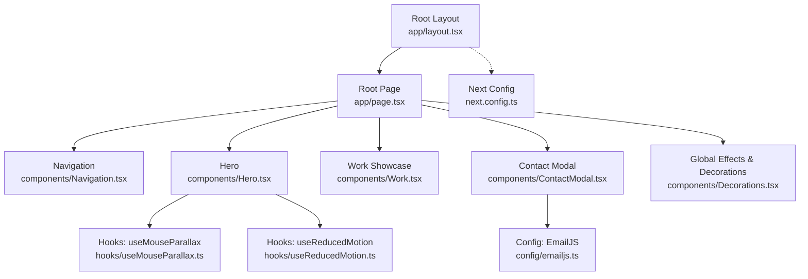
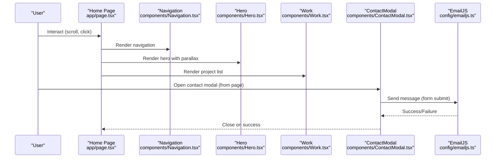
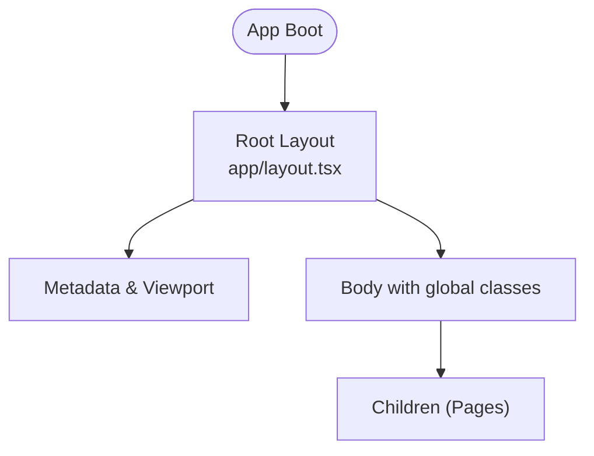
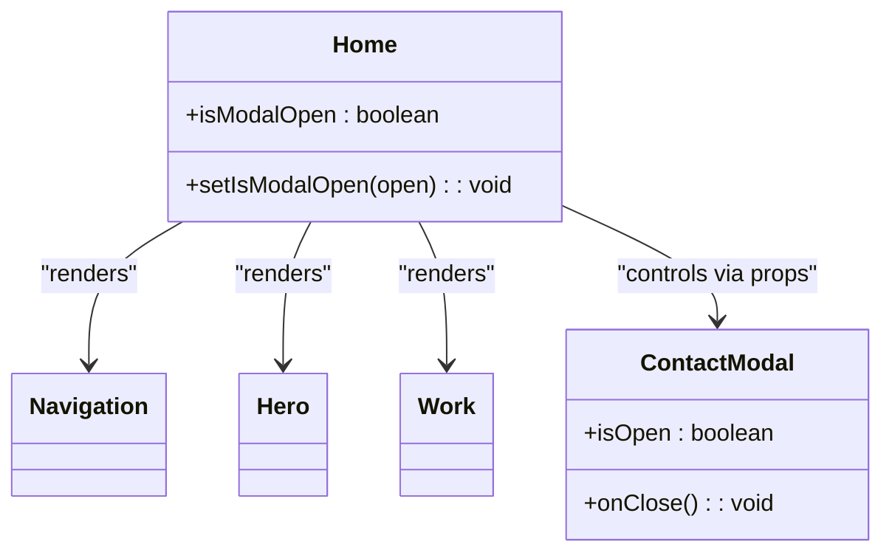
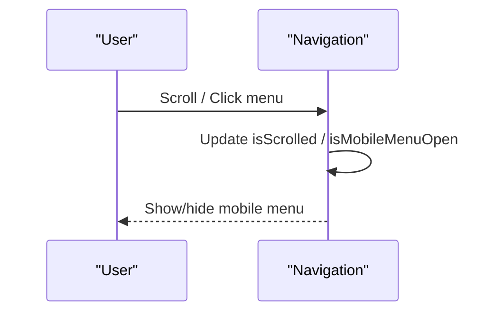
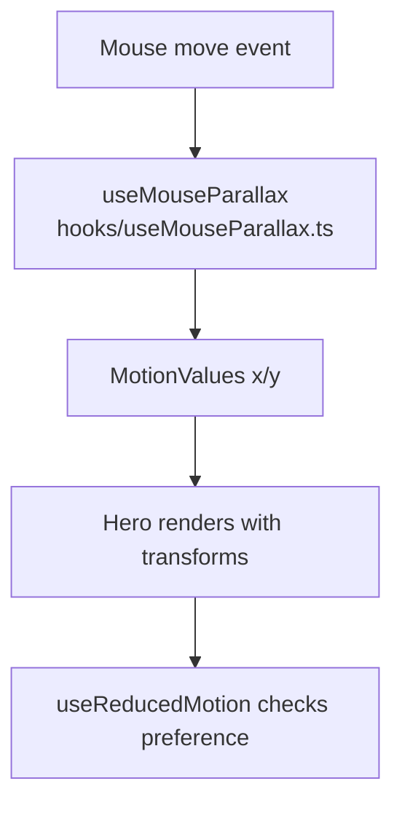
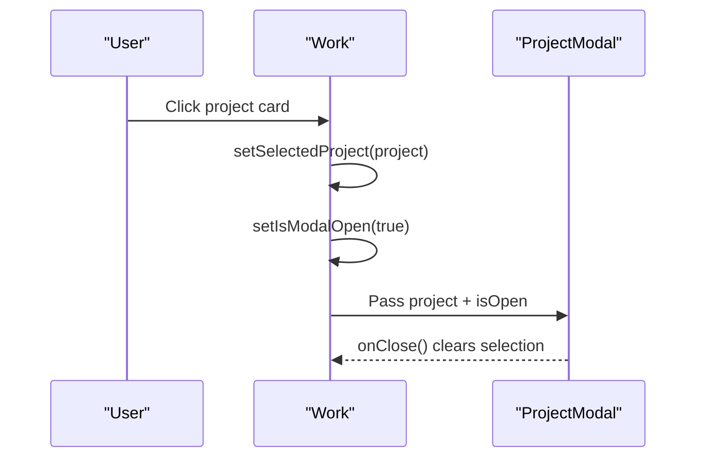
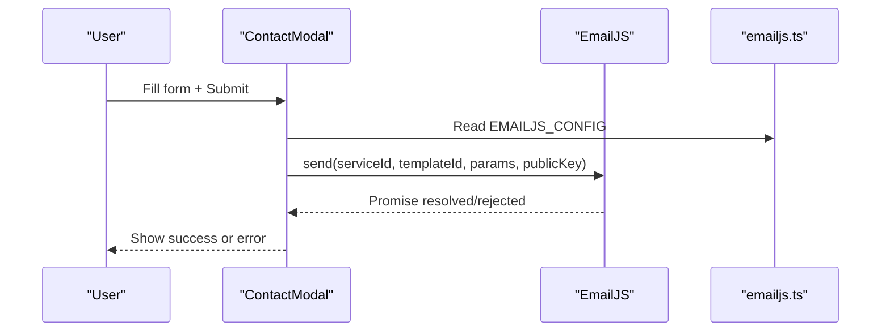
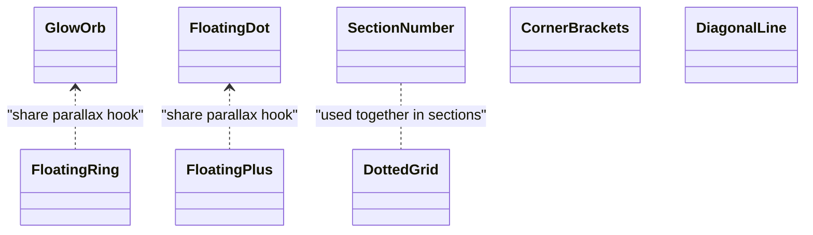
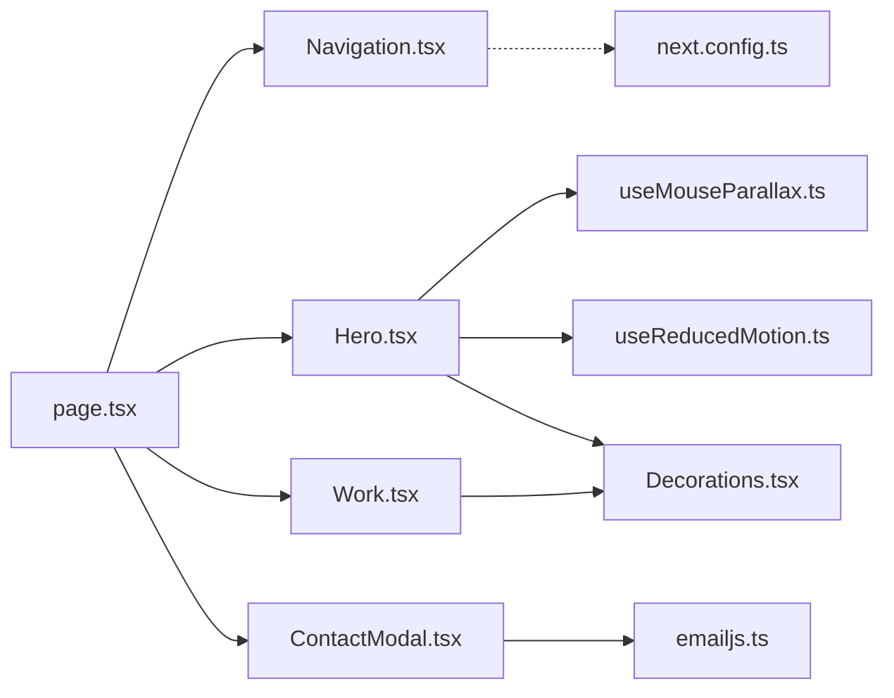

# Architecture Overview

<cite>
**Referenced Files in This Document**
- [layout.tsx](file://app/layout.tsx)
- [page.tsx](file://app/page.tsx)
- [Navigation.tsx](file://app/components/Navigation.tsx)
- [Hero.tsx](file://app/components/Hero.tsx)
- [Work.tsx](file://app/components/Work.tsx)
- [ContactModal.tsx](file://app/components/ContactModal.tsx)
- [Decorations.tsx](file://app/components/Decorations.tsx)
- [useMouseParallax.ts](file://app/hooks/useMouseParallax.ts)
- [useReducedMotion.ts](file://app/hooks/useReducedMotion.ts)
- [emailjs.ts](file://app/config/emailjs.ts)
- [next.config.ts](file://next.config.ts)
- [package.json](file://package.json)
</cite>

## Table of Contents
1. Introduction
2. Project Structure
3. Core Components
4. Architecture Overview
5. Detailed Component Analysis
6. Dependency Analysis
7. Performance Considerations
8. Troubleshooting Guide
9. Conclusion

## Introduction
This document describes the portfolio website’s component-based architecture built with Next.js App Router. It explains how pages are composed from reusable components, how data flows unidirectionally from parent to child via props and hooks, and how cross-cutting concerns such as state management, animation, accessibility, and configuration are organized for maintainability and extensibility.

## Project Structure
The application follows a feature-oriented layout under app/:
- Root layout defines global metadata, fonts, viewport, and base styles.
- The root page composes top-level sections and shared UI elements.
- Components are grouped by responsibility (navigation, hero, work showcase, modals, decorations).
- Hooks encapsulate reusable behaviors (mouse parallax, reduced motion).
- Configuration centralizes external service settings (EmailJS).
- Next.js configuration optimizes images and response compression.

**Diagram sources**
- [layout.tsx:1-107](file://app/layout.tsx#L1-L107)
- [page.tsx:1-588](file://app/page.tsx#L1-L588)
- [Navigation.tsx:1-133](file://app/components/Navigation.tsx#L1-L133)
- [Hero.tsx:1-187](file://app/components/Hero.tsx#L1-L187)
- [Work.tsx:1-499](file://app/components/Work.tsx#L1-L499)
- [ContactModal.tsx:1-392](file://app/components/ContactModal.tsx#L1-L392)
- [Decorations.tsx:1-190](file://app/components/Decorations.tsx#L1-L190)
- [useMouseParallax.ts:1-66](file://app/hooks/useMouseParallax.ts#L1-L66)
- [useReducedMotion.ts:1-20](file://app/hooks/useReducedMotion.ts#L1-L20)
- [emailjs.ts:1-15](file://app/config/emailjs.ts#L1-L15)
- [next.config.ts:1-20](file://next.config.ts#L1-L20)

**Section sources**
- [layout.tsx:1-107](file://app/layout.tsx#L1-L107)
- [page.tsx:1-588](file://app/page.tsx#L1-L588)
- [next.config.ts:1-20](file://next.config.ts#L1-L20)
- [package.json:1-32](file://package.json#L1-L32)

## Core Components
- Root Layout: Sets up fonts, viewport, SEO metadata, and global classes.
- Root Page: Orchestrates sections (Hero, About, Services, Work, Contact), global effects, custom cursor, navigation, and modal state.
- Navigation: Fixed header with scroll-aware styling and mobile menu; includes resume download link.
- Hero: Animated hero section with mouse-driven parallax and accessibility-aware motion.
- Work: Project list with expandable additional projects and a detail modal.
- ContactModal: Accessible dialog with form submission via EmailJS and success feedback.
- Decorations: Reusable visual primitives (glow orbs, floating shapes, grids, section numbers) that consume parallax values.

Key responsibilities and separation of concerns:
- Presentation vs behavior: Components render UI; hooks encapsulate side effects and motion logic.
- Data ownership: Parent components own state (e.g., modal open/close, selected project) and pass down via props.
- External integrations: EmailJS configuration is isolated in config files; components only call send methods with parameters.

**Section sources**
- [layout.tsx:24-107](file://app/layout.tsx#L24-L107)
- [page.tsx:557-588](file://app/page.tsx#L557-L588)
- [Navigation.tsx:17-133](file://app/components/Navigation.tsx#L17-L133)
- [Hero.tsx:10-187](file://app/components/Hero.tsx#L10-L187)
- [Work.tsx:352-499](file://app/components/Work.tsx#L352-L499)
- [ContactModal.tsx:214-392](file://app/components/ContactModal.tsx#L214-L392)
- [Decorations.tsx:7-190](file://app/components/Decorations.tsx#L7-L190)

## Architecture Overview
The application uses a unidirectional data flow pattern:
- State lives in parent components (e.g., Home page manages modal visibility and selected project).
- Child components receive data through props and emit events upward via callbacks.
- Hooks provide shared behaviors (parallax, reduced motion) without leaking state across components.
- External services are invoked within components or hooks using centralized configuration.

**Diagram sources**
- [page.tsx:557-588](file://app/page.tsx#L557-L588)
- [Navigation.tsx:17-133](file://app/components/Navigation.tsx#L17-L133)
- [Hero.tsx:10-187](file://app/components/Hero.tsx#L10-L187)
- [Work.tsx:352-499](file://app/components/Work.tsx#L352-L499)
- [ContactModal.tsx:56-99](file://app/components/ContactModal.tsx#L56-L99)
- [emailjs.ts:6-14](file://app/config/emailjs.ts#L6-L14)

## Detailed Component Analysis

### Root Layout and Global Configuration
- Defines font variables and applies them globally.
- Exports metadata for SEO and social sharing.
- Provides viewport settings and base body classes.

**Diagram sources**
- [layout.tsx:24-107](file://app/layout.tsx#L24-L107)

**Section sources**
- [layout.tsx:1-107](file://app/layout.tsx#L1-L107)

### Root Page Composition and Unidirectional Flow
- Composes global effects, custom cursor, navigation, hero, work, and contact modal.
- Manages modal open/close state and passes handlers to children.
- Uses local sections defined inline for About, Services, and Contact to keep page cohesive while delegating UI to components where appropriate.

**Diagram sources**
- [page.tsx:557-588](file://app/page.tsx#L557-L588)
- [ContactModal.tsx:9-12](file://app/components/ContactModal.tsx#L9-L12)

**Section sources**
- [page.tsx:1-588](file://app/page.tsx#L1-L588)

### Navigation Component
- Tracks scroll position to apply glassmorphism style.
- Renders desktop links and a responsive mobile menu with AnimatePresence transitions.
- Includes accessible attributes for toggle button and dialog role for mobile menu.

**Diagram sources**
- [Navigation.tsx:17-133](file://app/components/Navigation.tsx#L17-L133)

**Section sources**
- [Navigation.tsx:1-133](file://app/components/Navigation.tsx#L1-L133)

### Hero Component and Parallax
- Uses mouse parallax hook to drive decorative elements and text offset.
- Respects user preferences via reduced motion hook.
- Integrates Next.js Image for optimized rendering.

**Diagram sources**
- [Hero.tsx:10-187](file://app/components/Hero.tsx#L10-L187)
- [useMouseParallax.ts:12-45](file://app/hooks/useMouseParallax.ts#L12-L45)
- [useReducedMotion.ts:5-19](file://app/hooks/useReducedMotion.ts#L5-L19)

**Section sources**
- [Hero.tsx:1-187](file://app/components/Hero.tsx#L1-L187)
- [useMouseParallax.ts:1-66](file://app/hooks/useMouseParallax.ts#L1-L66)
- [useReducedMotion.ts:1-20](file://app/hooks/useReducedMotion.ts#L1-L20)

### Work Showcase and Project Modal
- Displays featured projects and conditionally reveals additional projects.
- Opens a modal with detailed project information when a project card is clicked.
- Uses AnimatePresence for smooth transitions.

**Diagram sources**
- [Work.tsx:352-499](file://app/components/Work.tsx#L352-L499)

**Section sources**
- [Work.tsx:1-499](file://app/components/Work.tsx#L1-L499)

### Contact Modal and Email Integration
- Presents an accessible dialog with keyboard support (Escape to close) and focus management considerations.
- Submits form via EmailJS using centralized configuration.
- Shows loading states, success feedback, and error handling.

**Diagram sources**
- [ContactModal.tsx:56-99](file://app/components/ContactModal.tsx#L56-L99)
- [emailjs.ts:6-14](file://app/config/emailjs.ts#L6-L14)

**Section sources**
- [ContactModal.tsx:1-392](file://app/components/ContactModal.tsx#L1-L392)
- [emailjs.ts:1-15](file://app/config/emailjs.ts#L1-L15)

### Decorations and Shared Visual Primitives
- Provide reusable animated elements (glow orbs, floating rings/dots/plus, dotted grid, corner brackets, diagonal lines).
- Consume parallax MotionValues to create depth and interactivity.
- Mark non-interactive visuals with aria-hidden for accessibility.

**Diagram sources**
- [Decorations.tsx:7-190](file://app/components/Decorations.tsx#L7-L190)

**Section sources**
- [Decorations.tsx:1-190](file://app/components/Decorations.tsx#L1-L190)

## Dependency Analysis
- Components depend on hooks for motion and accessibility behaviors.
- The root page orchestrates composition and state; it does not implement low-level behaviors.
- External services are abstracted behind configuration to simplify testing and updates.

**Diagram sources**
- [page.tsx:557-588](file://app/page.tsx#L557-L588)
- [Hero.tsx:10-187](file://app/components/Hero.tsx#L10-L187)
- [Work.tsx:352-499](file://app/components/Work.tsx#L352-L499)
- [ContactModal.tsx:214-392](file://app/components/ContactModal.tsx#L214-L392)
- [useMouseParallax.ts:12-45](file://app/hooks/useMouseParallax.ts#L12-L45)
- [useReducedMotion.ts:5-19](file://app/hooks/useReducedMotion.ts#L5-L19)
- [emailjs.ts:6-14](file://app/config/emailjs.ts#L6-L14)
- [next.config.ts:3-17](file://next.config.ts#L3-L17)

**Section sources**
- [package.json:11-19](file://package.json#L11-L19)
- [next.config.ts:3-17](file://next.config.ts#L3-L17)

## Performance Considerations
- Image optimization: Next.js image formats and sizes configured for efficient delivery.
- Response compression enabled to reduce payload size.
- Animations driven by GPU-accelerated MotionValues with spring physics for smooth interactions.
- Reduced motion respected to improve performance and accessibility for users who prefer minimal animations.

[No sources needed since this section provides general guidance]

## Troubleshooting Guide
- EmailJS failures:
  - Ensure SERVICE_ID, TEMPLATE_ID, NOTIFY_TEMPLATE_ID, and PUBLIC_KEY are correctly set in configuration.
  - If notification template is not configured, the system continues after sending the auto-reply.
  - Errors surface as user-facing messages; verify network connectivity and template setup.
- Modal accessibility:
  - Escape key closes the modal; ensure focus is managed appropriately when opening/closing.
  - Verify aria-modal and role="dialog" are present for screen readers.
- Animation issues:
  - Check prefers-reduced-motion setting; if enabled, animations are minimized.
  - Validate that MotionValues are bound to refs and event handlers are attached to the correct containers.

**Section sources**
- [ContactModal.tsx:56-99](file://app/components/ContactModal.tsx#L56-L99)
- [emailjs.ts:6-14](file://app/config/emailjs.ts#L6-L14)
- [useReducedMotion.ts:5-19](file://app/hooks/useReducedMotion.ts#L5-L19)

## Conclusion
The portfolio site employs a clear, modular architecture centered around Next.js App Router. Pages compose focused components that delegate behavior to hooks and configuration modules. Unidirectional data flow ensures predictable state changes, while reusable decoration components and consistent animation patterns deliver a cohesive experience. This structure supports easy extension—new sections can be added as components, new hooks encapsulate shared behaviors, and external integrations remain isolated behind configuration—facilitating maintainability and scalability.