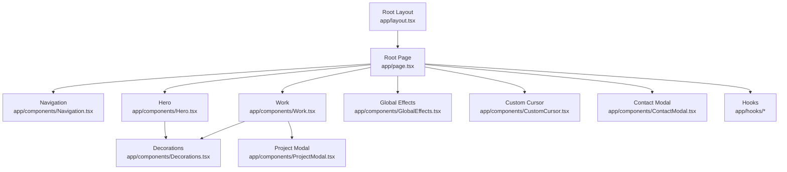
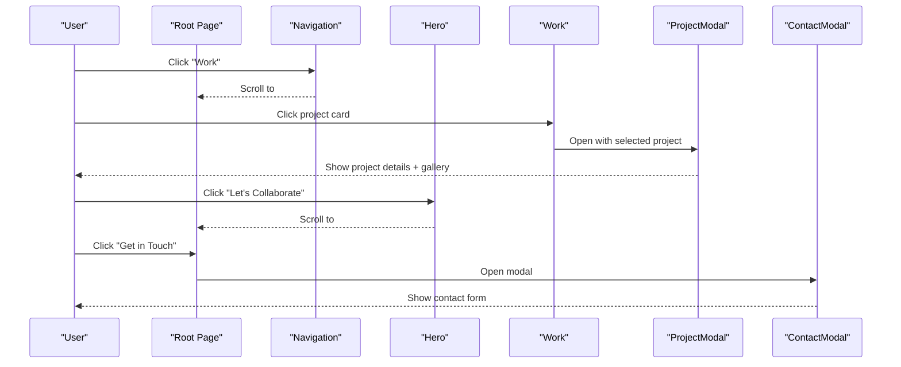
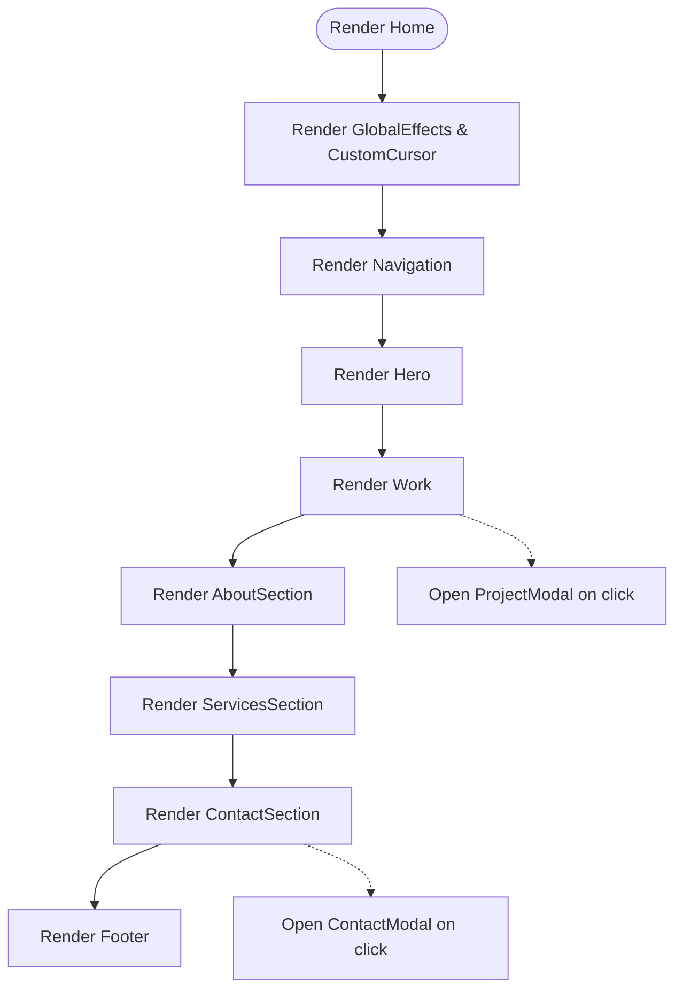
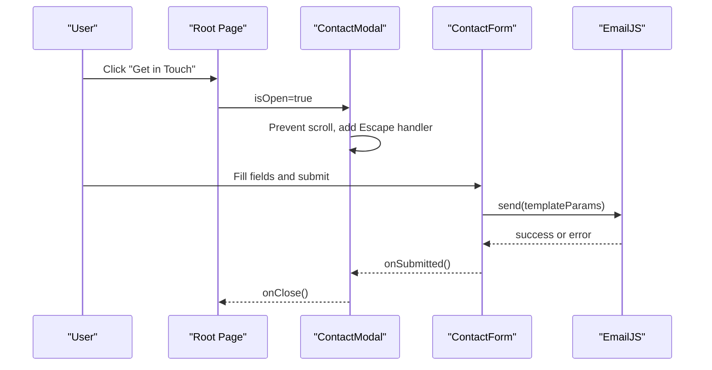
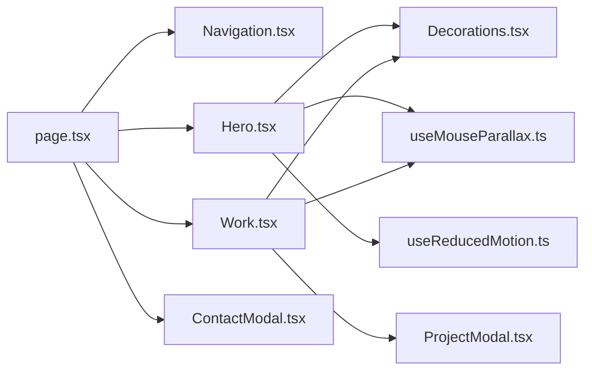

# Component Structure

<cite>
**Referenced Files in This Document**
- [layout.tsx](file://app/layout.tsx)
- [page.tsx](file://app/page.tsx)
- [Hero.tsx](file://app/components/Hero.tsx)
- [Work.tsx](file://app/components/Work.tsx)
- [Navigation.tsx](file://app/components/Navigation.tsx)
- [ContactModal.tsx](file://app/components/ContactModal.tsx)
- [ProjectModal.tsx](file://app/components/ProjectModal.tsx)
- [Decorations.tsx](file://app/components/Decorations.tsx)
- [useMouseParallax.ts](file://app/hooks/useMouseParallax.ts)
- [useReducedMotion.ts](file://app/hooks/useReducedMotion.ts)
</cite>

## Table of Contents
1. [Introduction](#introduction)
2. [Project Structure](#project-structure)
3. [Core Components](#core-components)
4. [Architecture Overview](#architecture-overview)
5. [Detailed Component Analysis](#detailed-component-analysis)
6. [Dependency Analysis](#dependency-analysis)
7. [Performance Considerations](#performance-considerations)
8. [Troubleshooting Guide](#troubleshooting-guide)
9. [Conclusion](#conclusion)

## Introduction
This document explains the portfolio website’s component structure and organization using the Next.js App Router pattern. It covers the root layout, page-level composition, separation of concerns between page sections (Hero, Work, Navigation), reusable UI elements, data flow via props and state, and a modular architecture that supports maintenance and extension.

## Project Structure
The application follows the Next.js App Router with a clear separation:
- Root layout defines global fonts, metadata, viewport, and base styles.
- The root page composes top-level sections and global effects.
- Feature components live under app/components for pages and shared UI.
- Shared hooks under app/hooks encapsulate behavior like mouse parallax and reduced motion preferences.
- Decorations provide reusable visual primitives used across sections.



**Diagram sources**
- [layout.tsx:1-107](file://app/layout.tsx#L1-L107)
- [page.tsx:1-588](file://app/page.tsx#L1-L588)
- [Navigation.tsx:1-133](file://app/components/Navigation.tsx#L1-L133)
- [Hero.tsx:1-187](file://app/components/Hero.tsx#L1-L187)
- [Work.tsx:1-499](file://app/components/Work.tsx#L1-L499)
- [ContactModal.tsx:1-392](file://app/components/ContactModal.tsx#L1-L392)
- [ProjectModal.tsx:1-631](file://app/components/ProjectModal.tsx#L1-L631)
- [Decorations.tsx:1-190](file://app/components/Decorations.tsx#L1-L190)
- [useMouseParallax.ts:1-66](file://app/hooks/useMouseParallax.ts#L1-L66)
- [useReducedMotion.ts:1-20](file://app/hooks/useReducedMotion.ts#L1-L20)

**Section sources**
- [layout.tsx:1-107](file://app/layout.tsx#L1-L107)
- [page.tsx:1-588](file://app/page.tsx#L1-L588)

## Core Components
- Root Layout: Provides global fonts, viewport, metadata, and wraps all children in html/body with consistent theme classes.
- Root Page: Composes Navigation, Hero, Work, Contact modal, GlobalEffects, CustomCursor, and section components (About, Services, Contact). Manages modal open/close state and passes callbacks to child components.
- Navigation: Fixed header with scroll-aware styling, desktop links, mobile menu, and resume download link.
- Hero: Full-viewport hero with parallax decorations, animated text/image blocks, and accessibility-friendly motion toggling.
- Work: Project listing with expandable additional projects, project detail modal, and lightbox gallery.
- ContactModal: Accessible modal with contact details and an email form integrated with EmailJS.
- ProjectModal: Detailed project view with overview, design process, outcomes, gallery, and external links; includes a full-screen lightbox with zoom and keyboard navigation.
- Decorations: Reusable visual primitives (glow orbs, floating shapes, grids, corner brackets, diagonal lines) driven by mouse parallax values.
- Hooks: Mouse parallax hook provides normalized mouse coordinates and spring-animated x/y transforms; reduced motion hook respects user preferences.

**Section sources**
- [layout.tsx:1-107](file://app/layout.tsx#L1-L107)
- [page.tsx:1-588](file://app/page.tsx#L1-L588)
- [Navigation.tsx:1-133](file://app/components/Navigation.tsx#L1-L133)
- [Hero.tsx:1-187](file://app/components/Hero.tsx#L1-L187)
- [Work.tsx:1-499](file://app/components/Work.tsx#L1-L499)
- [ContactModal.tsx:1-392](file://app/components/ContactModal.tsx#L1-L392)
- [ProjectModal.tsx:1-631](file://app/components/ProjectModal.tsx#L1-L631)
- [Decorations.tsx:1-190](file://app/components/Decorations.tsx#L1-L190)
- [useMouseParallax.ts:1-66](file://app/hooks/useMouseParallax.ts#L1-L66)
- [useReducedMotion.ts:1-20](file://app/hooks/useReducedMotion.ts#L1-L20)

## Architecture Overview
The site uses a client-side rich experience within the App Router:
- Root layout sets up global context (fonts, theme classes).
- Root page orchestrates high-level sections and shared modals.
- Section components are self-contained and use shared decoration components and hooks for consistent interactions.
- Data flows downward via props; events bubble upward via callbacks.
- Modals manage their own internal state but rely on parent-controlled visibility.



**Diagram sources**
- [page.tsx:557-588](file://app/page.tsx#L557-L588)
- [Navigation.tsx:10-15](file://app/components/Navigation.tsx#L10-L15)
- [Hero.tsx:117-130](file://app/components/Hero.tsx#L117-L130)
- [Work.tsx:352-365](file://app/components/Work.tsx#L352-L365)
- [ProjectModal.tsx:125-163](file://app/components/ProjectModal.tsx#L125-L163)
- [ContactModal.tsx:214-234](file://app/components/ContactModal.tsx#L214-L234)

## Detailed Component Analysis

### Root Layout
- Responsibilities: Define Google fonts with CSS variables, set viewport and metadata (title template, description, authors, Open Graph, Twitter cards, robots), and render body with theme classes.
- Integration: Serves as the single source of truth for global typography and SEO configuration.

**Section sources**
- [layout.tsx:1-107](file://app/layout.tsx#L1-L107)

### Root Page Composition
- Responsibilities: Assemble Navigation, Hero, Work, Contact modal, GlobalEffects, CustomCursor, and section components (About, Services, Contact). Manage modal open state and pass handlers down.
- State management: Uses local state to control ContactModal visibility and passes onClose/updating callbacks to children.
- Data flow: Parent-to-child via props; child-to-parent via event callbacks (e.g., opening/closing modals).



**Diagram sources**
- [page.tsx:557-588](file://app/page.tsx#L557-L588)

**Section sources**
- [page.tsx:1-588](file://app/page.tsx#L1-L588)

### Navigation
- Responsibilities: Fixed header with scroll-aware background blur, desktop nav links, mobile menu toggle, and resume download link.
- Interactions: Tracks scroll position to change appearance; manages mobile menu open state locally.

**Section sources**
- [Navigation.tsx:1-133](file://app/components/Navigation.tsx#L1-L133)

### Hero
- Responsibilities: Present headline, tagline, CTAs, and profile image with layered decorative elements.
- Parallax: Uses mouse parallax hook to drive multiple layers at different intensities for depth.
- Accessibility: Respects reduced motion preference to disable non-essential animations.

**Section sources**
- [Hero.tsx:1-187](file://app/components/Hero.tsx#L1-L187)
- [useMouseParallax.ts:1-66](file://app/hooks/useMouseParallax.ts#L1-L66)
- [useReducedMotion.ts:1-20](file://app/hooks/useReducedMotion.ts#L1-L20)

### Work
- Responsibilities: Display featured projects, expandable additional projects, and open project detail modal.
- State: Local state controls selected project, modal visibility, and “show all” toggle.
- Data model: Strongly typed project interface is shared with ProjectModal to ensure type safety across components.

```mermaid
classDiagram
class ProjectDetail {
+string id
+string title
+string category
+string description
+string fullDescription
+string year
+string color
+string tag
+string role
+string timeline
+string[] techStack
+string[] outcomes
+{phase : string;description : string}[] designProcess
+links
+string[] images
}
class Work {
-selectedProject : ProjectDetail?
-isModalOpen : boolean
-showAll : boolean
+handleOpenProject(project)
+handleCloseModal()
}
class ProjectModal {
-lightboxOpen : boolean
-currentImageIndex : number
-zoomLevelIndex : number
+openLightbox(index)
+handleNextImage()
+handlePrevImage()
+handleZoomIn()
+handleZoomOut()
+handleZoomReset()
}
Work --> ProjectModal : "opens with ProjectDetail"
```

**Diagram sources**
- [Work.tsx:1-499](file://app/components/Work.tsx#L1-L499)
- [ProjectModal.tsx:1-631](file://app/components/ProjectModal.tsx#L1-L631)

**Section sources**
- [Work.tsx:1-499](file://app/components/Work.tsx#L1-L499)
- [ProjectModal.tsx:1-631](file://app/components/ProjectModal.tsx#L1-L631)

### ContactModal
- Responsibilities: Accessible modal dialog with contact details and a form that sends messages via EmailJS.
- State: Controls form fields, submission status, success feedback, and error handling.
- Accessibility: Manages focus trap-like behaviors via Escape key, aria attributes, and prevents background scrolling when open.



**Diagram sources**
- [ContactModal.tsx:1-392](file://app/components/ContactModal.tsx#L1-L392)

**Section sources**
- [ContactModal.tsx:1-392](file://app/components/ContactModal.tsx#L1-L392)

### Decorations
- Responsibilities: Provide reusable visual primitives (GlowOrb, FloatingRing, FloatingDot, FloatingPlus, SectionNumber, DottedGrid, CornerBrackets, DiagonalLine).
- Interaction: Many decorations consume mouse parallax MotionValues to create subtle depth and movement.

**Section sources**
- [Decorations.tsx:1-190](file://app/components/Decorations.tsx#L1-L190)
- [useMouseParallax.ts:1-66](file://app/hooks/useMouseParallax.ts#L1-L66)

### Hooks
- useMouseParallax: Normalizes mouse position relative to a container and produces smooth x/y transforms via springs. Exposes ref, mouseX/mouseY MotionValues, and handlers.
- useMouseParallaxValue: Derives x/y from existing MotionValues with configurable intensity and spring settings.
- useReducedMotion: Detects prefers-reduced-motion and updates reactively.

**Section sources**
- [useMouseParallax.ts:1-66](file://app/hooks/useMouseParallax.ts#L1-L66)
- [useReducedMotion.ts:1-20](file://app/hooks/useReducedMotion.ts#L1-L20)

## Dependency Analysis
- Root Page depends on Navigation, Hero, Work, ContactModal, GlobalEffects, CustomCursor, and section components.
- Work depends on ProjectModal and shared decorations.
- Hero and Work both depend on mouse parallax hooks and decorations for consistent interactions.
- ContactModal depends on EmailJS configuration and handles asynchronous submission.



**Diagram sources**
- [page.tsx:1-588](file://app/page.tsx#L1-L588)
- [Navigation.tsx:1-133](file://app/components/Navigation.tsx#L1-L133)
- [Hero.tsx:1-187](file://app/components/Hero.tsx#L1-L187)
- [Work.tsx:1-499](file://app/components/Work.tsx#L1-L499)
- [ContactModal.tsx:1-392](file://app/components/ContactModal.tsx#L1-L392)
- [ProjectModal.tsx:1-631](file://app/components/ProjectModal.tsx#L1-L631)
- [Decorations.tsx:1-190](file://app/components/Decorations.tsx#L1-L190)
- [useMouseParallax.ts:1-66](file://app/hooks/useMouseParallax.ts#L1-L66)
- [useReducedMotion.ts:1-20](file://app/hooks/useReducedMotion.ts#L1-L20)

**Section sources**
- [page.tsx:1-588](file://app/page.tsx#L1-L588)
- [Work.tsx:1-499](file://app/components/Work.tsx#L1-L499)
- [Hero.tsx:1-187](file://app/components/Hero.tsx#L1-L187)
- [ContactModal.tsx:1-392](file://app/components/ContactModal.tsx#L1-L392)
- [ProjectModal.tsx:1-631](file://app/components/ProjectModal.tsx#L1-L631)
- [Decorations.tsx:1-190](file://app/components/Decorations.tsx#L1-L190)
- [useMouseParallax.ts:1-66](file://app/hooks/useMouseParallax.ts#L1-L66)
- [useReducedMotion.ts:1-20](file://app/hooks/useReducedMotion.ts#L1-L20)

## Performance Considerations
- Use lazy loading for images where appropriate and prioritize above-the-fold assets.
- Keep parallax computations lightweight; reuse MotionValues and avoid unnecessary re-renders.
- Debounce heavy side effects if adding new interactive features.
- Respect reduced motion preferences to improve performance and accessibility.
- Avoid deep prop drilling by keeping related state close to where it’s used (e.g., modal state in the owning component).

[No sources needed since this section provides general guidance]

## Troubleshooting Guide
- Modal not closing on Escape: Ensure keydown listeners are attached only when modal is open and cleaned up on unmount.
- Form submission errors: Validate EmailJS configuration and handle network failures gracefully; surface user-friendly messages.
- Parallax jitter: Verify container refs are present before computing mouse positions and reset values on mouse leave.
- Reduced motion issues: Confirm hooks read system preferences and conditionally apply animations.

**Section sources**
- [ContactModal.tsx:214-234](file://app/components/ContactModal.tsx#L214-L234)
- [ProjectModal.tsx:138-163](file://app/components/ProjectModal.tsx#L138-L163)
- [useMouseParallax.ts:28-44](file://app/hooks/useMouseParallax.ts#L28-L44)
- [useReducedMotion.ts:5-19](file://app/hooks/useReducedMotion.ts#L5-L19)

## Conclusion
The portfolio leverages a clean, modular architecture built on the Next.js App Router. The root layout centralizes global configuration, while the root page composes cohesive sections and shared modals. Components follow a clear separation of concerns: page-level sections (Hero, Work, Navigation) orchestrate content and user flows, while reusable UI elements (Decorations) and hooks encapsulate shared behavior. Data flows predictably through props and callbacks, enabling maintainability and easy extension of new sections or features.