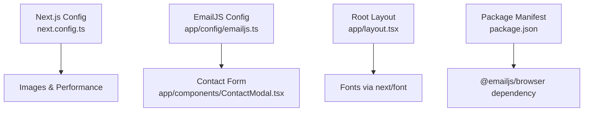
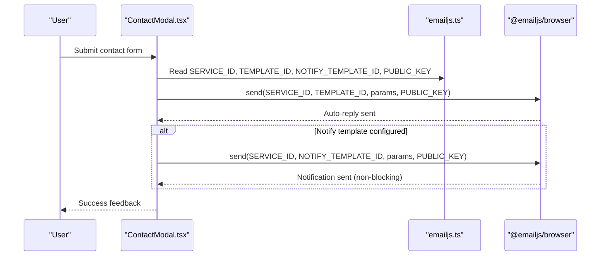
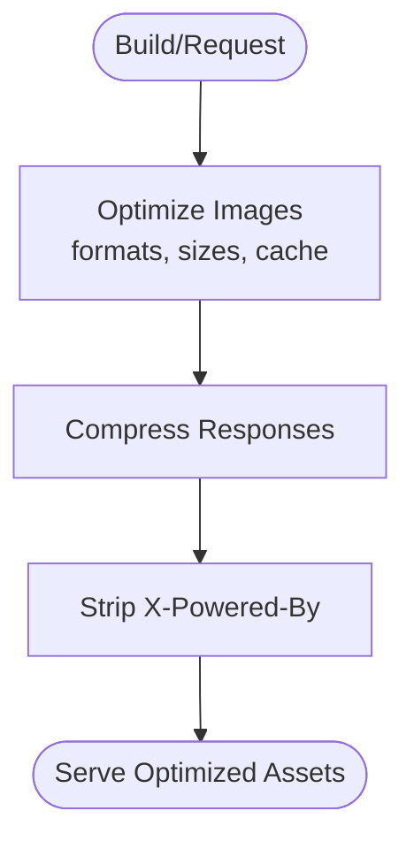
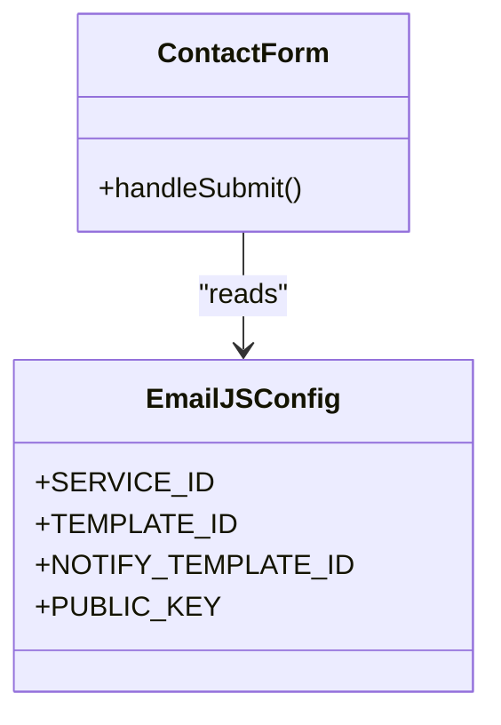
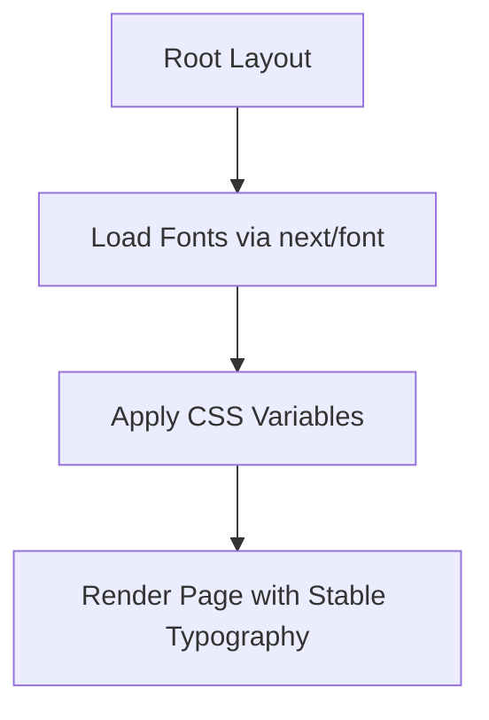
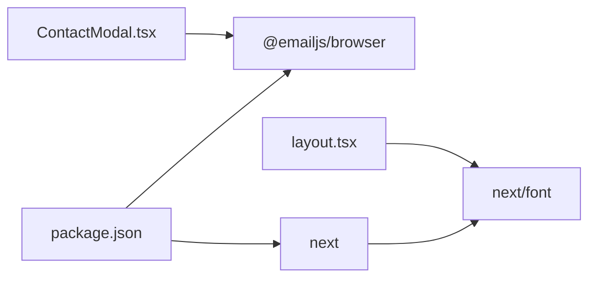

# Configuration Management

<cite>
**Referenced Files in This Document**
- [next.config.ts](file://next.config.ts)
- [emailjs.ts](file://app/config/emailjs.ts)
- [ContactModal.tsx](file://app/components/ContactModal.tsx)
- [layout.tsx](file://app/layout.tsx)
- [package.json](file://package.json)
- [README.md](file://README.md)
</cite>

## Table of Contents
1. [Introduction](#introduction)
2. [Project Structure](#project-structure)
3. [Core Components](#core-components)
4. [Architecture Overview](#architecture-overview)
5. [Detailed Component Analysis](#detailed-component-analysis)
6. [Dependency Analysis](#dependency-analysis)
7. [Performance Considerations](#performance-considerations)
8. [Troubleshooting Guide](#troubleshooting-guide)
9. [Conclusion](#conclusion)
10. [Appendices](#appendices)

## Introduction
This document explains the configuration management system for the application, focusing on:
- Centralized settings and external service integrations
- EmailJS setup (service IDs, template IDs, public key, and security considerations)
- Next.js configuration for performance optimization, image processing, and build-time settings
- Font configuration using next/font with optimal loading and caching strategies
- Environment variable management, deployment-specific configurations, and best practices as the application scales

## Project Structure
Configuration is organized into focused modules:
- Application runtime and build configuration in a single Next.js config file
- External service credentials centralized in a dedicated module
- Fonts configured at the root layout to ensure global availability and optimized delivery
- Dependencies declared in package manifest

**Diagram sources**
- [next.config.ts:3-17](file://next.config.ts#L3-L17)
- [emailjs.ts:6-14](file://app/config/emailjs.ts#L6-L14)
- [ContactModal.tsx:6-8](file://app/components/ContactModal.tsx#L6-L8)
- [layout.tsx:2-22](file://app/layout.tsx#L2-L22)
- [package.json:11-19](file://package.json#L11-L19)

**Section sources**
- [next.config.ts:1-20](file://next.config.ts#L1-L20)
- [emailjs.ts:1-15](file://app/config/emailjs.ts#L1-L15)
- [layout.tsx:1-107](file://app/layout.tsx#L1-L107)
- [package.json:1-32](file://package.json#L1-L32)

## Core Components
- Next.js configuration centralizes image formats, responsive sizes, cache TTL, compression, and header control.
- EmailJS configuration centralizes service ID, template IDs, public key, and recipient email.
- Root layout configures fonts via next/font with display swap and subsets for fast, stable rendering.
- Contact form integrates EmailJS to send messages and optional notifications.

**Section sources**
- [next.config.ts:3-17](file://next.config.ts#L3-L17)
- [emailjs.ts:6-14](file://app/config/emailjs.ts#L6-L14)
- [layout.tsx:5-22](file://app/layout.tsx#L5-L22)
- [ContactModal.tsx:56-99](file://app/components/ContactModal.tsx#L56-L99)

## Architecture Overview
The configuration architecture separates concerns:
- Build/runtime behavior is defined in Next.js config
- Third-party service credentials are isolated in a dedicated module
- UI layer consumes configuration without leaking secrets into business logic
- Fonts are loaded globally to avoid layout shifts and improve perceived performance

**Diagram sources**
- [ContactModal.tsx:56-99](file://app/components/ContactModal.tsx#L56-L99)
- [emailjs.ts:6-14](file://app/config/emailjs.ts#L6-L14)

## Detailed Component Analysis

### Next.js Configuration
Key options and their impact:
- Image formats: Enables modern formats for smaller payloads and faster decoding
- Responsive sizes: Defines breakpoints for device and image sizes to optimize delivery
- Cache TTL: Long-lived caching for optimized images reduces bandwidth and improves load times
- Compression: Reduces response sizes across the app
- Header control: Removes server identification headers for minor security hardening

**Diagram sources**
- [next.config.ts:3-17](file://next.config.ts#L3-L17)

**Section sources**
- [next.config.ts:3-17](file://next.config.ts#L3-L17)

### EmailJS Configuration and Usage
Centralized configuration includes:
- Service ID: Identifies your EmailJS service
- Template IDs: One for auto-reply to sender and one for owner notification
- Public Key: Used by the browser SDK to authenticate requests
- Recipient email: Where notifications are delivered

Usage flow:
- The contact form constructs template parameters from user input
- Sends an auto-reply to the sender; this must succeed for UX clarity
- Optionally sends a notification to the owner if the notify template is configured; failures are non-critical

Security considerations:
- The EmailJS public key is intentionally client-facing; it does not grant access to secrets but enables API calls
- Avoid committing sensitive values directly; prefer environment variables for keys and IDs
- Restrict allowed domains in EmailJS dashboard to prevent misuse
- Validate and sanitize inputs before sending to reduce spam and injection risks

**Diagram sources**
- [emailjs.ts:6-14](file://app/config/emailjs.ts#L6-L14)
- [ContactModal.tsx:56-99](file://app/components/ContactModal.tsx#L56-L99)

**Section sources**
- [emailjs.ts:1-15](file://app/config/emailjs.ts#L1-L15)
- [ContactModal.tsx:56-99](file://app/components/ContactModal.tsx#L56-L99)

### Font Configuration with next/font
Fonts are configured in the root layout:
- Uses next/font Google imports to serve optimized font files
- Sets CSS variables per font family for consistent theming
- Specifies subsets and display mode to minimize layout shift and improve performance
- Applies multiple weights where needed for typographic hierarchy

Best practices applied:
- Subset selection limits payload size
- Display swap prevents invisible text during load
- Variables enable flexible usage across components

**Diagram sources**
- [layout.tsx:5-22](file://app/layout.tsx#L5-L22)

**Section sources**
- [layout.tsx:5-22](file://app/layout.tsx#L5-L22)
- [README.md:21-21](file://README.md#L21-L21)

### Environment Variables and Deployment-Specific Configurations
Current state:
- No environment files are present in the repository
- EmailJS credentials are currently hardcoded in the configuration module

Recommendations for secure and scalable configuration:
- Move EmailJS keys and IDs to environment variables:
  - NEXT_PUBLIC_EMAILJS_SERVICE_ID
  - NEXT_PUBLIC_EMAILJS_TEMPLATE_ID
  - NEXT_PUBLIC_EMAILJS_NOTIFY_TEMPLATE_ID
  - NEXT_PUBLIC_EMAILJS_PUBLIC_KEY
- Keep only non-sensitive defaults in code; override via environment at runtime or deploy time
- Use platform-specific env management:
  - Vercel: Add environment variables in project settings
  - Local development: Create .env.local (not committed)
  - CI/CD: Inject secrets through provider secret stores
- Enforce validation at startup:
  - Fail fast if required variables are missing
  - Provide clear error messages for misconfiguration

Operational notes:
- Client-side variables must be prefixed with NEXT_PUBLIC_ to be available in the browser bundle
- Server-only variables should never be exposed to the client

[No sources needed since this section provides general guidance]

## Dependency Analysis
External dependencies relevant to configuration:
- @emailjs/browser: Provides the client SDK used by the contact form to send emails
- next: Framework providing build-time and runtime configuration APIs
- next/font: Integrated font optimization used in the root layout

**Diagram sources**
- [package.json:11-19](file://package.json#L11-L19)
- [ContactModal.tsx:6-7](file://app/components/ContactModal.tsx#L6-L7)
- [layout.tsx:2-22](file://app/layout.tsx#L2-L22)

**Section sources**
- [package.json:11-19](file://package.json#L11-L19)
- [ContactModal.tsx:6-8](file://app/components/ContactModal.tsx#L6-L8)
- [layout.tsx:2-22](file://app/layout.tsx#L2-L22)

## Performance Considerations
- Images: Modern formats and responsive sizing reduce payload and improve decode speed; long cache TTL minimizes repeat downloads
- Compression: Reduces transfer sizes for all responses
- Fonts: next/font with subset selection and display swap improves First Contentful Paint and avoids layout shifts
- Network: Ensure CDN caching for static assets; consider domain sharding if serving many resources
- Bundle: Remove unused dependencies and tree-shake aggressively; keep third-party libraries updated

[No sources needed since this section provides general guidance]

## Troubleshooting Guide
Common issues and resolutions:
- EmailJS errors:
  - Verify service ID, template IDs, and public key match your EmailJS dashboard
  - Ensure templates include correct placeholders matching the parameters sent from the form
  - Check that the sender’s email address is valid and included in template parameters
  - If notify template is not set up, confirm the conditional skip path is working
- CORS and domain restrictions:
  - Add your deployed domain to EmailJS trusted domains
- Image caching:
  - If images do not update after changes, verify cache headers and purge CDN cache if applicable
- Fonts not loading:
  - Confirm network access to Google Fonts or use self-hosted alternatives
  - Ensure subsets and weights are correctly specified

**Section sources**
- [ContactModal.tsx:56-99](file://app/components/ContactModal.tsx#L56-L99)
- [emailjs.ts:6-14](file://app/config/emailjs.ts#L6-L14)

## Conclusion
The application centralizes configuration to improve maintainability and security:
- Next.js configuration optimizes images, compression, and headers
- EmailJS credentials are isolated in a dedicated module and consumed by the contact form
- Fonts are configured for fast, stable rendering using next/font
- Moving to environment variables will strengthen security and support multi-environment deployments

[No sources needed since this section summarizes without analyzing specific files]

## Appendices

### Configuration Checklist
- [ ] Move EmailJS keys and IDs to environment variables
- [ ] Add domain restrictions in EmailJS dashboard
- [ ] Validate required environment variables at startup
- [ ] Review image sizes and formats for current content
- [ ] Audit font subsets and weights to minimize payload
- [ ] Configure CI/CD to inject secrets securely

[No sources needed since this section provides general guidance]