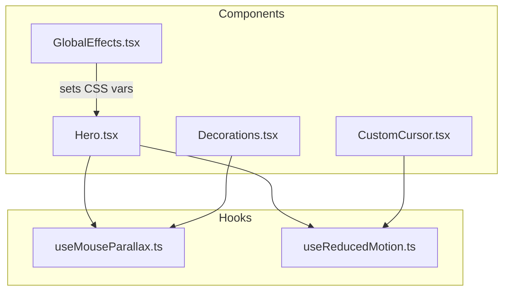
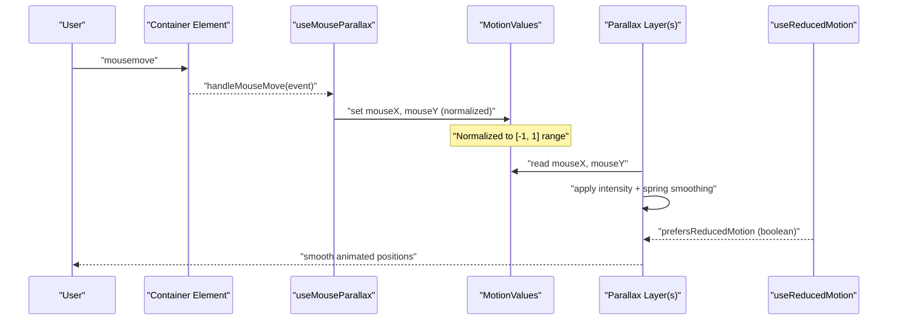
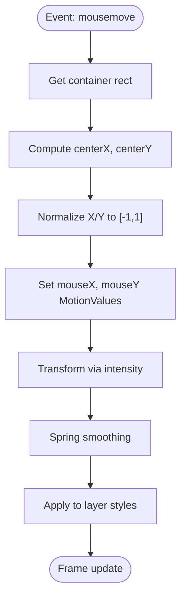
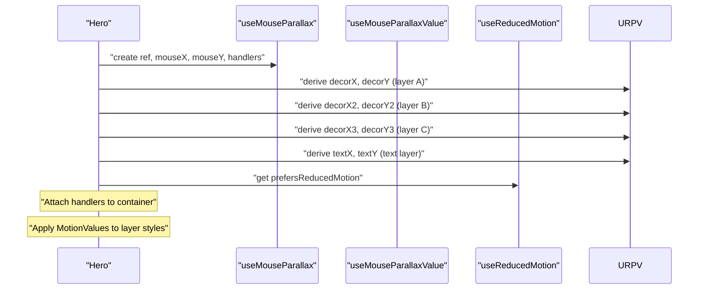
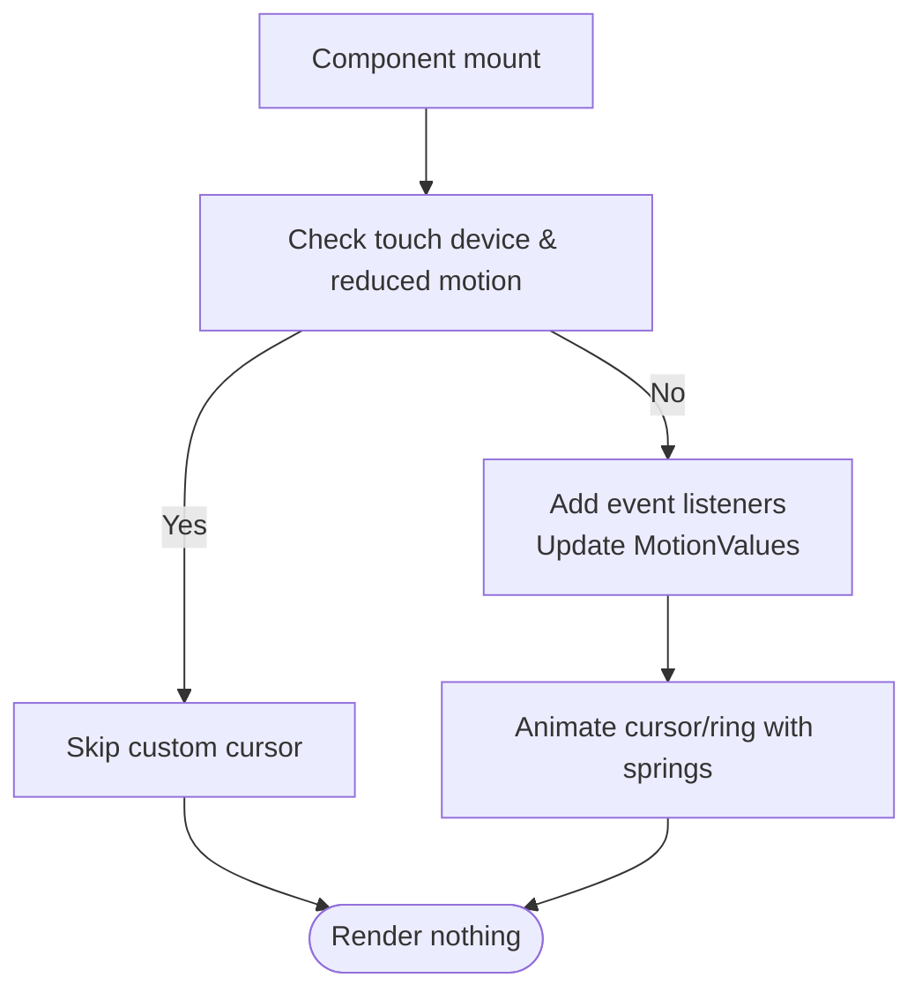
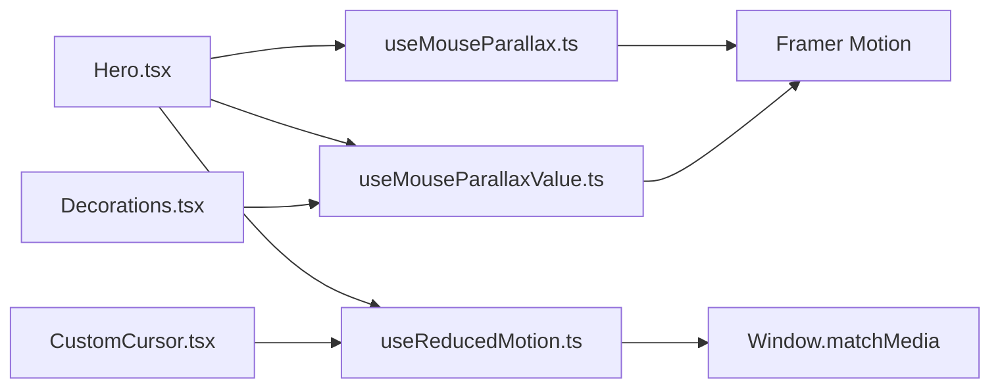

# Custom Hooks Architecture

<cite>
**Referenced Files in This Document**
- [useMouseParallax.ts](file://app/hooks/useMouseParallax.ts)
- [useReducedMotion.ts](file://app/hooks/useReducedMotion.ts)
- [Hero.tsx](file://app/components/Hero.tsx)
- [CustomCursor.tsx](file://app/components/CustomCursor.tsx)
- [Decorations.tsx](file://app/components/Decorations.tsx)
- [GlobalEffects.tsx](file://app/components/GlobalEffects.tsx)
</cite>

## Table of Contents
1. [Introduction](#introduction)
2. [Project Structure](#project-structure)
3. [Core Components](#core-components)
4. [Architecture Overview](#architecture-overview)
5. [Detailed Component Analysis](#detailed-component-analysis)
6. [Dependency Analysis](#dependency-analysis)
7. [Performance Considerations](#performance-considerations)
8. [Troubleshooting Guide](#troubleshooting-guide)
9. [Conclusion](#conclusion)

## Introduction
This document explains the custom hooks architecture that encapsulates complex, reusable logic for parallax effects and accessibility-driven motion preferences. It focuses on:
- useMouseParallax: a hook that abstracts mouse event handling and Framer Motion primitives to create smooth parallax animations.
- useReducedMotion: a hook that detects and reacts to user preferences for reduced motion to ensure accessibility.

The design emphasizes abstraction over browser APIs, consistent interfaces across components, composable patterns, dependency management, and performance optimizations such as motion values and spring-based smoothing.

## Project Structure
The hooks live under app/hooks and are consumed by UI components under app/components. The Hero component orchestrates multiple parallax layers using shared mouse motion values, while Decorations provides reusable visual elements that consume those values. GlobalEffects sets global CSS variables from mouse position for broader styling effects. CustomCursor demonstrates how reduced motion is respected when enabling or disabling interactive features.

**Diagram sources**
- [useMouseParallax.ts:12-45](file://app/hooks/useMouseParallax.ts#L12-L45)
- [useReducedMotion.ts:5-19](file://app/hooks/useReducedMotion.ts#L5-L19)
- [Hero.tsx:10-33](file://app/components/Hero.tsx#L10-L33)
- [Decorations.tsx:7-119](file://app/components/Decorations.tsx#L7-L119)
- [CustomCursor.tsx:7-59](file://app/components/CustomCursor.tsx#L7-L59)
- [GlobalEffects.tsx:5-14](file://app/components/GlobalEffects.tsx#L5-L14)

**Section sources**
- [useMouseParallax.ts:12-65](file://app/hooks/useMouseParallax.ts#L12-L65)
- [useReducedMotion.ts:5-19](file://app/hooks/useReducedMotion.ts#L5-L19)
- [Hero.tsx:10-33](file://app/components/Hero.tsx#L10-L33)
- [Decorations.tsx:7-119](file://app/components/Decorations.tsx#L7-L119)
- [CustomCursor.tsx:7-59](file://app/components/CustomCursor.tsx#L7-L59)
- [GlobalEffects.tsx:5-14](file://app/components/GlobalEffects.tsx#L5-L14)

## Core Components
- useMouseParallax: Creates normalized mouse coordinates relative to an element, applies intensity scaling, and returns spring-smoothed x/y values plus handlers to attach to a container.
- useMouseParallaxValue: Consumes shared MotionValues (mouseX, mouseY) and produces independent spring-smoothed x/y outputs with configurable intensity and spring parameters.
- useReducedMotion: Reads and listens to the prefers-reduced-motion media query, returning a boolean that components can use to disable or simplify animations.

These hooks provide a consistent interface:
- Parallax hooks return MotionValues for x/y transforms that integrate directly with Framer Motion’s style props.
- Reduced motion hook returns a simple boolean for conditional behavior.

**Section sources**
- [useMouseParallax.ts:12-65](file://app/hooks/useMouseParallax.ts#L12-L65)
- [useReducedMotion.ts:5-19](file://app/hooks/useReducedMotion.ts#L5-L19)

## Architecture Overview
The architecture separates concerns:
- Event capture and normalization occur in useMouseParallax.
- Per-layer transformation and smoothing occur via useMouseParallaxValue.
- Accessibility gating occurs via useReducedMotion.
- Components compose these hooks to build layered parallax experiences.

**Diagram sources**
- [useMouseParallax.ts:28-44](file://app/hooks/useMouseParallax.ts#L28-L44)
- [useMouseParallax.ts:47-65](file://app/hooks/useMouseParallax.ts#L47-L65)
- [useReducedMotion.ts:5-19](file://app/hooks/useReducedMotion.ts#L5-L19)
- [Hero.tsx:10-33](file://app/components/Hero.tsx#L10-L33)

## Detailed Component Analysis

### useMouseParallax Hook
Responsibilities:
- Maintain a ref to a container element.
- Track normalized mouse position within the container.
- Provide spring-smoothed x/y MotionValues based on configured intensity and spring settings.
- Expose handlers for mousemove and mouseleave to reset state when the pointer leaves.

Design principles:
- Normalization: Mouse coordinates are normalized relative to the container center and dimensions, ensuring consistent behavior regardless of element size.
- Decoupling: Shared MotionValues (mouseX, mouseY) enable multiple layers to react independently with different intensities.
- Smoothness: Spring-based transforms avoid janky updates and provide natural easing.

Edge cases handled:
- Early exit if the ref is not attached yet.
- Resetting motion values on mouse leave to restore default positions.

**Diagram sources**
- [useMouseParallax.ts:28-44](file://app/hooks/useMouseParallax.ts#L28-L44)
- [useMouseParallax.ts:18-26](file://app/hooks/useMouseParallax.ts#L18-L26)

**Section sources**
- [useMouseParallax.ts:12-45](file://app/hooks/useMouseParallax.ts#L12-L45)

### useMouseParallaxValue Hook
Responsibilities:
- Accept shared mouseX and mouseY MotionValues.
- Apply per-layer intensity and spring configuration.
- Return x/y MotionValues ready for direct use in Framer Motion style props.

Composition pattern:
- Encourages composition by allowing multiple layers to subscribe to the same source of truth (mouseX, mouseY) while applying unique transformations.

Performance considerations:
- Each call creates its own springs and transforms; keep intensity and spring configs reasonable to avoid excessive recalculations.

**Section sources**
- [useMouseParallax.ts:47-65](file://app/hooks/useMouseParallax.ts#L47-L65)

### useReducedMotion Hook
Responsibilities:
- Detect initial system preference for reduced motion.
- Listen for changes to the preference at runtime.
- Return a boolean indicating whether reduced motion is preferred.

Accessibility considerations:
- Provides a single source of truth for motion-sensitive features.
- Enables graceful degradation by disabling or simplifying animations when users prefer reduced motion.

Usage example in components:
- Conditional rendering or animation toggling based on the returned boolean.

**Section sources**
- [useReducedMotion.ts:5-19](file://app/hooks/useReducedMotion.ts#L5-L19)

### Hero Component: Composition in Practice
How it uses the hooks:
- Initializes a primary parallax context via useMouseParallax with a specific intensity.
- Derives multiple parallax layers using useMouseParallaxValue with varied intensities (positive and negative) to create depth.
- Integrates useReducedMotion to conditionally animate decorative elements (e.g., arrow indicator).

Key behaviors:
- Attaches mouse handlers to a container to drive all layers.
- Applies MotionValues to transform properties for smooth movement.
- Respects reduced motion by avoiding infinite loops or heavy animations when enabled.

**Diagram sources**
- [Hero.tsx:10-33](file://app/components/Hero.tsx#L10-L33)
- [Hero.tsx:35-183](file://app/components/Hero.tsx#L35-L183)

**Section sources**
- [Hero.tsx:10-33](file://app/components/Hero.tsx#L10-L33)
- [Hero.tsx:35-183](file://app/components/Hero.tsx#L35-L183)

### Decorations Components: Reusable Parallax Primitives
Reusable elements like GlowOrb, FloatingRing, FloatingDot, and FloatingPlus accept shared mouseX and mouseY MotionValues and apply their own intensity. This promotes reuse and consistency across the UI.

Benefits:
- Centralized motion logic in hooks.
- Declarative styling in components.
- Easy composition into larger scenes.

**Section sources**
- [Decorations.tsx:7-119](file://app/components/Decorations.tsx#L7-L119)

### CustomCursor: Accessibility and Performance
Behavior:
- Uses useReducedMotion to skip custom cursor setup when reduced motion is preferred or on touch devices.
- Subscribes to window-level mouse events only when appropriate.
- Uses MotionValues and springs for smooth cursor and ring movement.

Edge cases:
- Avoids running on touch devices or when reduced motion is preferred.
- Cleans up event listeners on unmount.

**Diagram sources**
- [CustomCursor.tsx:7-59](file://app/components/CustomCursor.tsx#L7-L59)

**Section sources**
- [CustomCursor.tsx:7-59](file://app/components/CustomCursor.tsx#L7-L59)

### GlobalEffects: Global Mouse State
Sets CSS custom properties for mouse position on the document root, enabling global styling effects without React re-renders. While not part of the core hooks, it complements the parallax system by providing global mouse state for CSS-driven effects.

**Section sources**
- [GlobalEffects.tsx:5-14](file://app/components/GlobalEffects.tsx#L5-L14)

## Dependency Analysis
- useMouseParallax depends on React useRef and Framer Motion primitives (useMotionValue, useSpring, useTransform).
- useMouseParallaxValue depends on Framer Motion primitives and accepts MotionValues as inputs.
- useReducedMotion depends on React useState/useEffect and the Web API matchMedia.
- Components depend on hooks and each other indirectly through shared MotionValues.

**Diagram sources**
- [useMouseParallax.ts:1-5](file://app/hooks/useMouseParallax.ts#L1-L5)
- [useReducedMotion.ts:1-4](file://app/hooks/useReducedMotion.ts#L1-L4)
- [Hero.tsx:1-7](file://app/components/Hero.tsx#L1-L7)
- [Decorations.tsx:1-5](file://app/components/Decorations.tsx#L1-L5)
- [CustomCursor.tsx:1-6](file://app/components/CustomCursor.tsx#L1-L6)

**Section sources**
- [useMouseParallax.ts:1-5](file://app/hooks/useMouseParallax.ts#L1-L5)
- [useReducedMotion.ts:1-4](file://app/hooks/useReducedMotion.ts#L1-L4)
- [Hero.tsx:1-7](file://app/components/Hero.tsx#L1-L7)
- [Decorations.tsx:1-5](file://app/components/Decorations.tsx#L1-L5)
- [CustomCursor.tsx:1-6](file://app/components/CustomCursor.tsx#L1-L6)

## Performance Considerations
- Use MotionValues instead of React state for high-frequency updates to avoid unnecessary renders.
- Apply spring smoothing to reduce jitter and improve perceived performance.
- Normalize mouse coordinates to a fixed range to keep transformations predictable and efficient.
- Gate expensive interactions (like custom cursor) behind reduced motion checks and device capability detection.
- Keep event listeners scoped appropriately (container vs. window) to minimize overhead.
- Reuse shared MotionValues (mouseX, mouseY) to centralize computation and reduce duplication.

[No sources needed since this section provides general guidance]

## Troubleshooting Guide
Common issues and resolutions:
- Parallax not moving: Ensure the container ref is attached and mouse handlers are bound to it. Verify that the ref exists before reading geometry.
- Jittery animations: Adjust damping and stiffness in spring configurations to balance responsiveness and smoothness.
- Unexpected resets: Confirm that mouseleave handlers reset motion values to zero to restore default positions.
- Reduced motion not respected: Verify that components check the reduced motion flag before starting animations or setting up event listeners.
- Memory leaks: Ensure event listeners added in components are removed on unmount.

**Section sources**
- [useMouseParallax.ts:28-44](file://app/hooks/useMouseParallax.ts#L28-L44)
- [CustomCursor.tsx:25-57](file://app/components/CustomCursor.tsx#L25-L57)

## Conclusion
The custom hooks architecture cleanly separates motion logic from presentation:
- useMouseParallax abstracts mouse event handling and provides normalized, spring-smoothed MotionValues.
- useMouseParallaxValue enables composable, per-layer transformations with consistent interfaces.
- useReducedMotion ensures accessibility by detecting and reacting to user preferences.

Together, they deliver performant, accessible, and maintainable parallax experiences across components while keeping browser API usage centralized and consistent.

[No sources needed since this section summarizes without analyzing specific files]