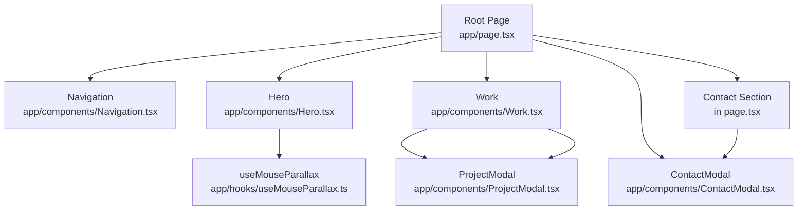
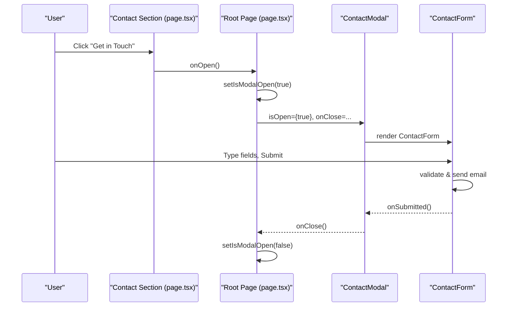
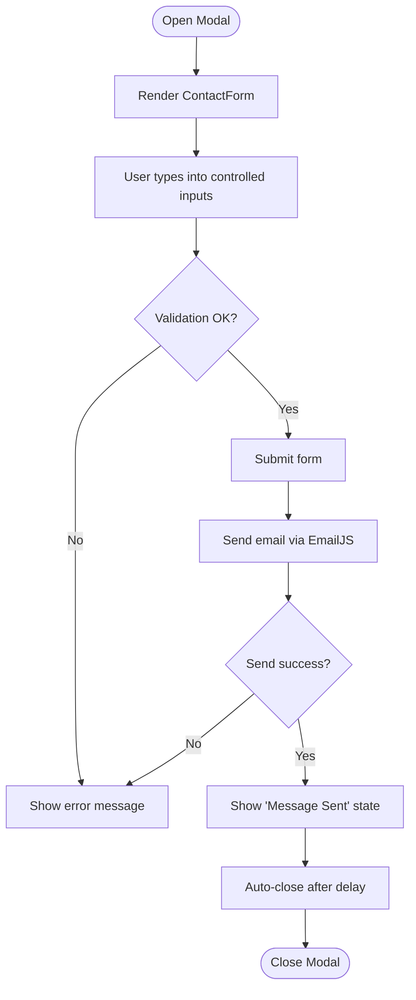
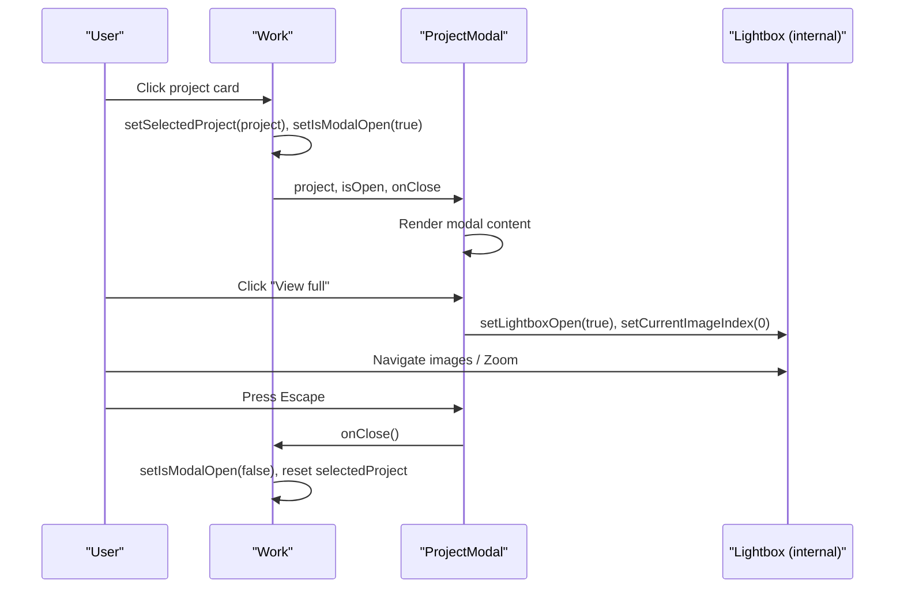
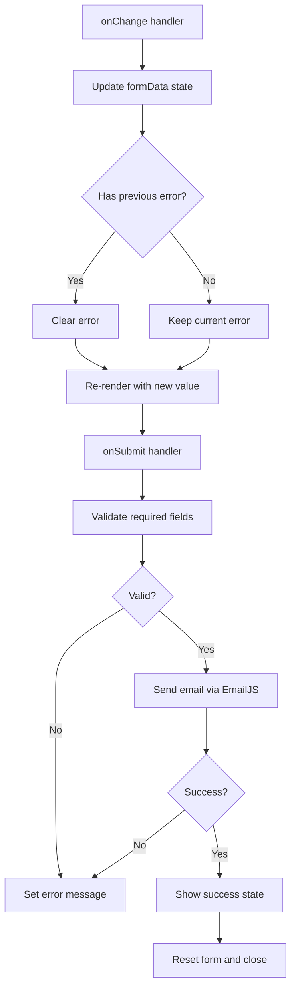
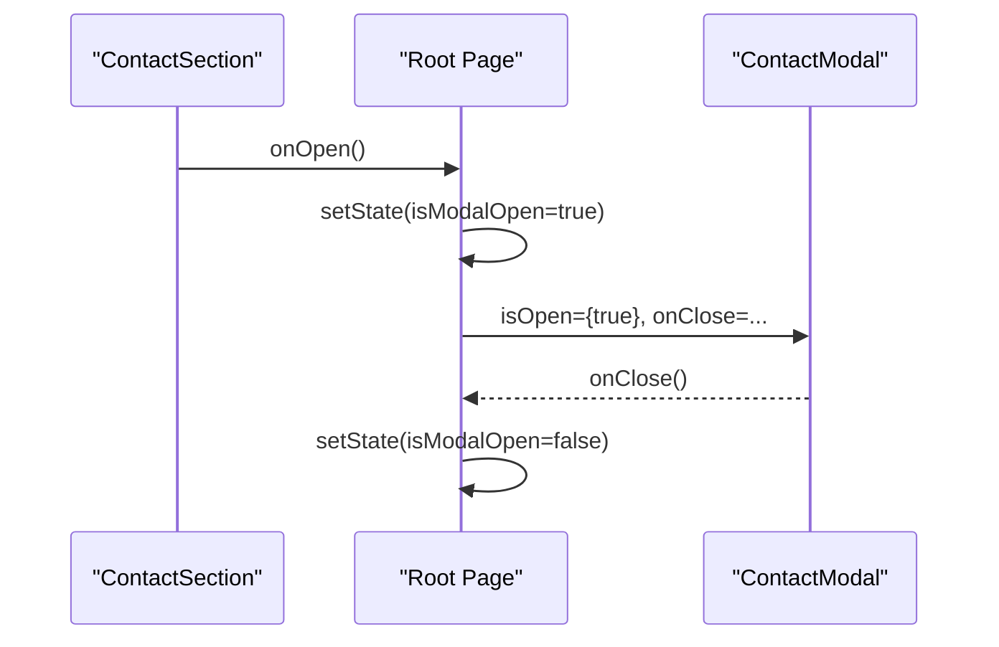
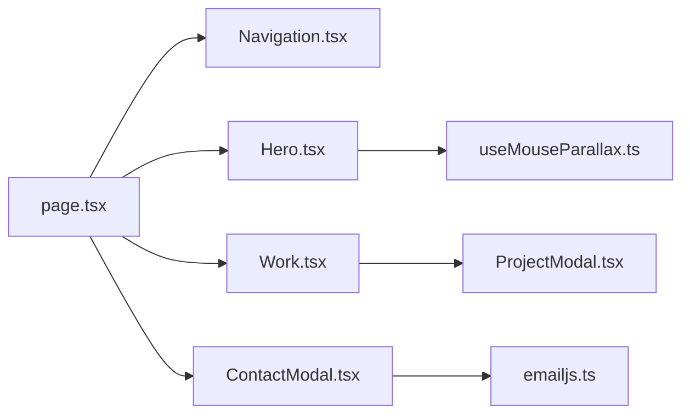

# Data Flow Patterns

<cite>
**Referenced Files in This Document**
- [page.tsx](file://app/page.tsx)
- [Work.tsx](file://app/components/Work.tsx)
- [ProjectModal.tsx](file://app/components/ProjectModal.tsx)
- [ContactModal.tsx](file://app/components/ContactModal.tsx)
- [Navigation.tsx](file://app/components/Navigation.tsx)
- [Hero.tsx](file://app/components/Hero.tsx)
- [useMouseParallax.ts](file://app/hooks/useMouseParallax.ts)
- [emailjs.ts](file://app/config/emailjs.ts)
</cite>

## Table of Contents
1. Introduction
2. Project Structure
3. Core Components
4. Architecture Overview
5. Detailed Component Analysis
6. Dependency Analysis
7. Performance Considerations
8. Troubleshooting Guide
9. Conclusion

## Introduction
This document explains the unidirectional data flow patterns implemented across the portfolio website. It focuses on how state flows from parent components to child components via props, how user interactions trigger state updates, and how modal state is managed in ContactModal and ProjectModal. It also covers controlled form data flow and validation, event handling, state lifting between siblings, and performance considerations such as prop drilling alternatives and when to use context or custom hooks for shared state.

## Project Structure
The application is a Next.js client-side app with a clear component hierarchy:
- Root page orchestrates top-level state and composes sections and modals.
- Work section owns project selection and modal visibility.
- Contact section triggers the contact modal through an event callback.
- Modal components manage their own internal UI state (lightbox, zoom, form submission).
- Custom hooks encapsulate reusable behavior like mouse parallax.

**Diagram sources**
- [page.tsx:557-587](file://app/page.tsx#L557-L587)
- [Work.tsx:352-499](file://app/components/Work.tsx#L352-L499)
- [ContactModal.tsx:214-392](file://app/components/ContactModal.tsx#L214-L392)
- [ProjectModal.tsx:125-631](file://app/components/ProjectModal.tsx#L125-L631)
- [useMouseParallax.ts:12-45](file://app/hooks/useMouseParallax.ts#L12-L45)

**Section sources**
- [page.tsx:557-587](file://app/page.tsx#L557-L587)
- [Work.tsx:352-499](file://app/components/Work.tsx#L352-L499)
- [ContactModal.tsx:214-392](file://app/components/ContactModal.tsx#L214-L392)
- [ProjectModal.tsx:125-631](file://app/components/ProjectModal.tsx#L125-L631)
- [useMouseParallax.ts:12-45](file://app/hooks/useMouseParallax.ts#L12-L45)

## Core Components
- Root Page: Holds global modal visibility state for the contact modal and renders all sections and modals. It lifts state to enable communication between sibling sections.
- Work: Owns selected project and modal open/close state; passes project data down to ProjectModal via props.
- ContactModal: Manages its own internal form state and submission flow; communicates success back to parent via callback.
- ProjectModal: Manages lightbox state, image index, and zoom level internally; receives project details via props.
- Navigation: Local state for scroll detection and mobile menu toggle; no cross-component state sharing.
- Hero: Uses custom hook for parallax effects; purely presentational with local motion state.

Key data flow principles:
- Parent-to-child: Props carry data and callbacks downward.
- Child-to-parent: Callbacks bubble events upward to update parent state.
- Sibling communication: Achieved by lifting state to the common parent (e.g., root page).

**Section sources**
- [page.tsx:557-587](file://app/page.tsx#L557-L587)
- [Work.tsx:352-499](file://app/components/Work.tsx#L352-L499)
- [ContactModal.tsx:30-212](file://app/components/ContactModal.tsx#L30-L212)
- [ProjectModal.tsx:125-631](file://app/components/ProjectModal.tsx#L125-L631)
- [Navigation.tsx:17-133](file://app/components/Navigation.tsx#L17-L133)
- [Hero.tsx:10-187](file://app/components/Hero.tsx#L10-L187)

## Architecture Overview
The site follows a unidirectional data flow:
- User interactions (clicks, keyboard, form input) trigger local state changes in child components.
- For cross-component needs, state is lifted to the nearest common parent.
- Modals receive visibility and data via props and expose callbacks to close or notify completion.

**Diagram sources**
- [page.tsx:489-571](file://app/page.tsx#L489-L571)
- [ContactModal.tsx:30-212](file://app/components/ContactModal.tsx#L30-L212)
- [ContactModal.tsx:214-392](file://app/components/ContactModal.tsx#L214-L392)

**Section sources**
- [page.tsx:489-571](file://app/page.tsx#L489-L571)
- [ContactModal.tsx:30-212](file://app/components/ContactModal.tsx#L30-L212)
- [ContactModal.tsx:214-392](file://app/components/ContactModal.tsx#L214-L392)

## Detailed Component Analysis

### Contact Modal State Management
- Visibility: Controlled by root page state; passed as isOpen prop.
- Close behavior: onClose callback resets root state; Escape key and backdrop clicks also call onClose.
- Internal state: Form inputs, submission status, error messages are held locally within ContactModal.
- Success feedback: After successful submission, a temporary success view is shown before closing via onSubmitted callback.

**Diagram sources**
- [ContactModal.tsx:30-212](file://app/components/ContactModal.tsx#L30-L212)
- [ContactModal.tsx:214-392](file://app/components/ContactModal.tsx#L214-L392)
- [emailjs.ts:6-14](file://app/config/emailjs.ts#L6-L14)

**Section sources**
- [ContactModal.tsx:30-212](file://app/components/ContactModal.tsx#L30-L212)
- [ContactModal.tsx:214-392](file://app/components/ContactModal.tsx#L214-L392)
- [emailjs.ts:6-14](file://app/config/emailjs.ts#L6-L14)

### Project Modal State Management
- Visibility and data: Opened/closed by Work component; project data passed via props.
- Lightbox state: Managed internally (open/close, current image index, zoom level).
- Keyboard navigation: Supports Escape to close, arrow keys to navigate images, plus/minus for zoom.
- Image gallery: Thumbnails and main viewer share currentImageIndex state; zoom resets when switching images or opening lightbox.

**Diagram sources**
- [Work.tsx:352-499](file://app/components/Work.tsx#L352-L499)
- [ProjectModal.tsx:125-631](file://app/components/ProjectModal.tsx#L125-L631)

**Section sources**
- [Work.tsx:352-499](file://app/components/Work.tsx#L352-L499)
- [ProjectModal.tsx:125-631](file://app/components/ProjectModal.tsx#L125-L631)

### Controlled Forms and Validation Logic
- Controlled inputs: Each field’s value is bound to local state and updated via onChange handlers.
- Validation: HTML required attributes provide basic validation; errors are cleared on change and displayed on submit failure.
- Submission flow: Prevent default, set submitting state, send email, handle success/error, show confirmation, then reset and close.

**Diagram sources**
- [ContactModal.tsx:30-212](file://app/components/ContactModal.tsx#L30-L212)
- [emailjs.ts:6-14](file://app/config/emailjs.ts#L6-L14)

**Section sources**
- [ContactModal.tsx:30-212](file://app/components/ContactModal.tsx#L30-L212)
- [emailjs.ts:6-14](file://app/config/emailjs.ts#L6-L14)

### Event Handling and State Lifting
- Root page lifts modal visibility state to coordinate between ContactSection and ContactModal.
- Work lifts project selection and modal visibility to coordinate ProjectCard and ProjectModal.
- Sibling communication pattern:
  - ContactSection calls onOpen callback to inform root page.
  - Root page updates state and passes isOpen to ContactModal.
  - ContactModal calls onClose to return control to root page.

**Diagram sources**
- [page.tsx:489-571](file://app/page.tsx#L489-L571)
- [ContactModal.tsx:214-392](file://app/components/ContactModal.tsx#L214-L392)

**Section sources**
- [page.tsx:489-571](file://app/page.tsx#L489-L571)
- [ContactModal.tsx:214-392](file://app/components/ContactModal.tsx#L214-L392)

### Prop Drilling Alternatives and Shared State
- Current approach: Minimal prop drilling is used effectively for small trees (e.g., root page to modals).
- When to consider Context:
  - If multiple deeply nested components need the same theme, locale, or auth state, a context could reduce drilling.
  - Example candidates: global UI preferences, feature flags, or user session data if added later.
- When to use Custom Hooks:
  - Encapsulate side effects and derived values (e.g., useMouseParallax already abstracts motion values and spring transforms).
  - Create additional hooks for shared behaviors like modal management, form handling, or analytics tracking.

[No sources needed since this section provides general guidance]

## Dependency Analysis
The following diagram shows key dependencies among components and hooks:

**Diagram sources**
- [page.tsx:557-587](file://app/page.tsx#L557-L587)
- [Work.tsx:352-499](file://app/components/Work.tsx#L352-L499)
- [ProjectModal.tsx:125-631](file://app/components/ProjectModal.tsx#L125-L631)
- [ContactModal.tsx:214-392](file://app/components/ContactModal.tsx#L214-L392)
- [useMouseParallax.ts:12-45](file://app/hooks/useMouseParallax.ts#L12-L45)
- [emailjs.ts:6-14](file://app/config/emailjs.ts#L6-L14)

**Section sources**
- [page.tsx:557-587](file://app/page.tsx#L557-L587)
- [Work.tsx:352-499](file://app/components/Work.tsx#L352-L499)
- [ProjectModal.tsx:125-631](file://app/components/ProjectModal.tsx#L125-L631)
- [ContactModal.tsx:214-392](file://app/components/ContactModal.tsx#L214-L392)
- [useMouseParallax.ts:12-45](file://app/hooks/useMouseParallax.ts#L12-L45)
- [emailjs.ts:6-14](file://app/config/emailjs.ts#L6-L14)

## Performance Considerations
- Keep modal state local where possible: Both ContactModal and ProjectModal manage internal UI state (form, lightbox, zoom) to avoid unnecessary re-renders in parents.
- Avoid deep prop drilling: The current structure uses shallow drilling; if deeper nesting emerges, introduce context or a custom hook to centralize shared state.
- Use memoization judiciously: For expensive computations or large lists, consider React.memo or useMemo; not currently necessary given the app size.
- Optimize animations: Framer Motion is used efficiently; ensure motion values are reused and avoid animating heavy DOM nodes unnecessarily.
- Debounce frequent events: Mouse move handlers can be throttled or debounced if performance issues arise on low-end devices.

[No sources needed since this section provides general guidance]

## Troubleshooting Guide
- Modal does not close:
  - Verify onClose is passed correctly to modals and that Escape/backdrop handlers call it.
  - Check that root state setters are invoked and not blocked by async operations.
- Form submission fails:
  - Ensure EmailJS configuration is correct and templates are set up.
  - Confirm network requests succeed and errors are handled; check browser console for CORS or template errors.
- Lightbox navigation issues:
  - Confirm project.images array has valid URLs.
  - Verify keyboard event listeners are attached only when modal is open and cleaned up on unmount.

**Section sources**
- [ContactModal.tsx:30-212](file://app/components/ContactModal.tsx#L30-L212)
- [ContactModal.tsx:214-392](file://app/components/ContactModal.tsx#L214-L392)
- [ProjectModal.tsx:125-631](file://app/components/ProjectModal.tsx#L125-L631)
- [emailjs.ts:6-14](file://app/config/emailjs.ts#L6-L14)

## Conclusion
The portfolio website implements a clean unidirectional data flow:
- Parent components hold shared state and pass data down via props.
- Child components emit events via callbacks to update parent state.
- Modals encapsulate their internal state while relying on props for visibility and data.
- Controlled forms provide predictable input handling and validation.
- Custom hooks abstract complex behaviors like mouse parallax.
For future growth, consider introducing context or additional custom hooks to reduce prop drilling and centralize shared concerns, while maintaining the clear data flow established here.