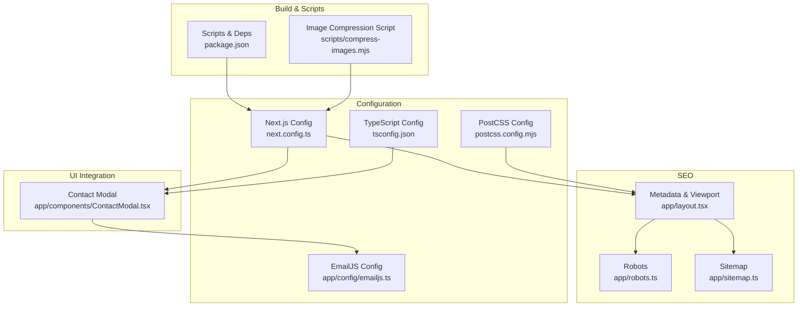
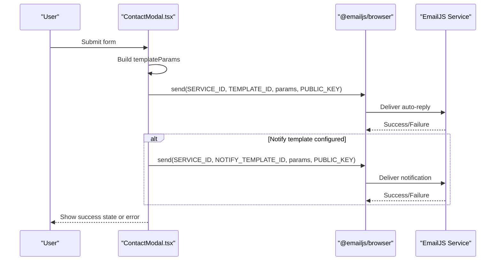
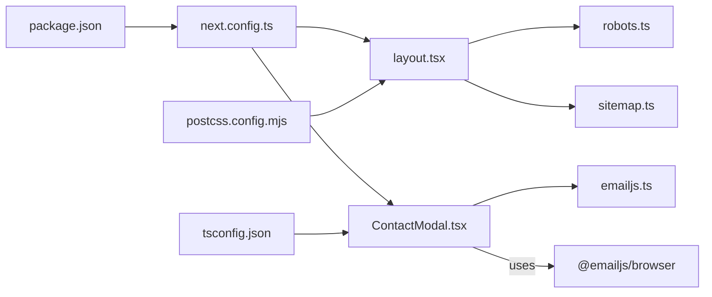

# Configuration Management

<cite>
**Referenced Files in This Document**
- [emailjs.ts](file://app/config/emailjs.ts)
- [ContactModal.tsx](file://app/components/ContactModal.tsx)
- [next.config.ts](file://next.config.ts)
- [layout.tsx](file://app/layout.tsx)
- [robots.ts](file://app/robots.ts)
- [sitemap.ts](file://app/sitemap.ts)
- [package.json](file://package.json)
- [tsconfig.json](file://tsconfig.json)
- [postcss.config.mjs](file://postcss.config.mjs)
- [compress-images.mjs](file://scripts/compress-images.mjs)
</cite>

## Table of Contents
1. [Introduction](#introduction)
2. [Project Structure](#project-structure)
3. [Core Components](#core-components)
4. [Architecture Overview](#architecture-overview)
5. [Detailed Component Analysis](#detailed-component-analysis)
6. [Dependency Analysis](#dependency-analysis)
7. [Performance Considerations](#performance-considerations)
8. [Troubleshooting Guide](#troubleshooting-guide)
9. [Conclusion](#conclusion)
10. [Appendices](#appendices)

## Introduction
This document explains the application’s configuration management system with a focus on:
- EmailJS integration setup (service, templates, and security considerations)
- Next.js configuration options and build-time settings
- Environment variable management and deployment-specific configurations
- Step-by-step guides for enabling email functionality, configuring SEO metadata, and optimizing build performance
- Common configuration issues and solutions
- Examples for extending configuration to support additional features

## Project Structure
The configuration is spread across dedicated files that centralize behavior for email delivery, runtime optimizations, SEO, and tooling:
- EmailJS configuration and contact recipient are defined centrally for reuse.
- Next.js runtime and build-time behaviors are configured via Next.js config.
- SEO metadata, robots, and sitemap are generated at build time using Next.js conventions.
- Tooling configs (TypeScript, PostCSS/Tailwind) and image compression scripts support performance and developer experience.

**Diagram sources**
- [emailjs.ts:1-15](file://app/config/emailjs.ts#L1-L15)
- [ContactModal.tsx:1-392](file://app/components/ContactModal.tsx#L1-L392)
- [next.config.ts:1-20](file://next.config.ts#L1-L20)
- [layout.tsx:1-107](file://app/layout.tsx#L1-L107)
- [robots.ts:1-12](file://app/robots.ts#L1-L12)
- [sitemap.ts:1-13](file://app/sitemap.ts#L1-L13)
- [package.json:1-32](file://package.json#L1-L32)
- [tsconfig.json:1-35](file://tsconfig.json#L1-L35)
- [postcss.config.mjs:1-8](file://postcss.config.mjs#L1-L8)
- [compress-images.mjs:1-43](file://scripts/compress-images.mjs#L1-L43)

**Section sources**
- [emailjs.ts:1-15](file://app/config/emailjs.ts#L1-L15)
- [next.config.ts:1-20](file://next.config.ts#L1-L20)
- [layout.tsx:1-107](file://app/layout.tsx#L1-L107)
- [robots.ts:1-12](file://app/robots.ts#L1-L12)
- [sitemap.ts:1-13](file://app/sitemap.ts#L1-L13)
- [package.json:1-32](file://package.json#L1-L32)
- [tsconfig.json:1-35](file://tsconfig.json#L1-L35)
- [postcss.config.mjs:1-8](file://postcss.config.mjs#L1-L8)
- [compress-images.mjs:1-43](file://scripts/compress-images.mjs#L1-L43)

## Core Components
- EmailJS configuration module centralizes service identifiers, template IDs, public key, and the recipient email used by the contact form.
- Contact modal integrates EmailJS to send messages from users and optionally notify the site owner.
- Next.js configuration enables modern image formats, responsive sizes, caching, response compression, and header hardening.
- SEO metadata is declared in the root layout; robots and sitemap are generated via Next.js route handlers.

Key responsibilities:
- Centralized configuration reduces duplication and makes environment-specific changes easier.
- Build-time SEO generation improves discoverability without runtime overhead.
- Image optimization and compression reduce payload size and improve load times.

**Section sources**
- [emailjs.ts:1-15](file://app/config/emailjs.ts#L1-L15)
- [ContactModal.tsx:56-99](file://app/components/ContactModal.tsx#L56-L99)
- [next.config.ts:3-17](file://next.config.ts#L3-L17)
- [layout.tsx:24-89](file://app/layout.tsx#L24-L89)
- [robots.ts:3-11](file://app/robots.ts#L3-L11)
- [sitemap.ts:3-12](file://app/sitemap.ts#L3-L12)

## Architecture Overview
The email flow is client-side driven by EmailJS. The contact form collects user input, constructs parameters, and sends two emails:
- An auto-reply to the sender (required).
- A notification to the site owner (optional and non-blocking if not configured).

**Diagram sources**
- [ContactModal.tsx:56-99](file://app/components/ContactModal.tsx#L56-L99)
- [emailjs.ts:6-14](file://app/config/emailjs.ts#L6-L14)

## Detailed Component Analysis

### EmailJS Integration Setup
- Service configuration:
  - Service ID, template IDs, and public key are centralized in the configuration module.
  - The recipient email is exported separately for use in templates and UI.
- Template management:
  - Two templates are referenced: one for auto-reply to the sender and one for notifying the owner.
  - The notification template is optional; the UI gracefully handles its absence.
- Security considerations:
  - Only the EmailJS public key is exposed to the browser. Secrets such as private keys must remain in the EmailJS dashboard.
  - Use EmailJS IP allowlist and domain restrictions in the EmailJS dashboard to mitigate abuse.
  - Validate and sanitize inputs on the client side before sending.

Step-by-step guide to enable email functionality:
1. Create an EmailJS account and connect your email provider (e.g., Gmail).
2. Create two templates:
   - Auto-reply template for the sender.
   - Notification template for the site owner.
3. Update the configuration module with your Service ID, both Template IDs, and Public Key.
4. Ensure the contact form imports and uses the configuration module when sending.
5. Test the form end-to-end to verify both emails deliver correctly.

Common issues and solutions:
- Auto-reply fails:
  - Verify Service ID, Template ID, and Public Key match your EmailJS setup.
  - Check network errors and ensure the EmailJS public key is correct.
- Owner notification not received:
  - Confirm the notification template ID is set and active in EmailJS.
  - Review EmailJS dashboard logs for failures.

Extending configuration:
- Add environment-based overrides by reading process.env values and merging them into the configuration object.
- Introduce feature flags for toggling notifications or enabling/disabling specific templates.

**Section sources**
- [emailjs.ts:1-15](file://app/config/emailjs.ts#L1-L15)
- [ContactModal.tsx:56-99](file://app/components/ContactModal.tsx#L56-L99)

### Next.js Configuration Options and Build-Time Settings
- Images:
  - Modern formats enabled (AVIF, WebP) for smaller payloads and faster rendering.
  - Responsive device and image sizes define breakpoints for optimal delivery.
  - Long cache TTL for optimized images reduces repeated downloads.
- Response compression:
  - Enabled to minimize transfer sizes for all responses.
- Header hardening:
  - Removed X-Powered-By header to reduce information leakage.

Build-time implications:
- Image optimization occurs during build and serve-time based on device capabilities.
- Compression applies to server responses, improving bandwidth usage.

Optimization recommendations:
- Keep deviceSizes aligned with your design breakpoints.
- Adjust minimumCacheTTL based on content update frequency.
- Monitor bundle size and consider code splitting for large components.

**Section sources**
- [next.config.ts:3-17](file://next.config.ts#L3-L17)

### Environment Variable Management and Deployment-Specific Configurations
Current state:
- No environment variables are currently used in the repository.
- EmailJS credentials are embedded directly in the configuration module.

Recommended approach:
- Move sensitive values (Service ID, Template IDs, Public Key) to environment variables.
- In Next.js, prefix client-facing variables with NEXT_PUBLIC_ to expose them to the browser where needed.
- For server-only secrets, keep them out of the client bundle and access via server-side code only.

Deployment-specific configurations:
- Use per-environment .env files (development, staging, production) managed by your hosting platform.
- Validate required variables at startup to fail fast on misconfiguration.
- Pin versions of dependencies in package.json to ensure consistent builds across environments.

Security best practices:
- Never commit secrets to version control.
- Restrict EmailJS service access via IP allowlists and domain whitelisting.
- Rotate keys periodically and monitor EmailJS usage for anomalies.

**Section sources**
- [emailjs.ts:6-14](file://app/config/emailjs.ts#L6-L14)
- [package.json:11-20](file://package.json#L11-L20)

### SEO Metadata Configuration
- Root layout defines:
  - Title with default and template patterns for consistent page titles.
  - Description and keywords for search engines.
  - Open Graph and Twitter card metadata for rich social sharing previews.
  - Robots directives to control indexing and crawling.
  - Base URL for absolute links in metadata.

- Robots and sitemap:
  - Robots file allows crawling and points to the sitemap location.
  - Sitemap includes the homepage with last modified date and priority.

Step-by-step guide to configure SEO:
1. Set title, description, and keywords in the root layout metadata.
2. Provide Open Graph and Twitter card images and text for social previews.
3. Configure robots rules to allow indexing and specify sitemap URL.
4. Maintain the sitemap to reflect current pages and update frequencies.

Best practices:
- Keep metadata concise and accurate.
- Use canonical URLs and avoid duplicate content.
- Regularly validate metadata with SEO tools.

**Section sources**
- [layout.tsx:24-89](file://app/layout.tsx#L24-L89)
- [robots.ts:3-11](file://app/robots.ts#L3-L11)
- [sitemap.ts:3-12](file://app/sitemap.ts#L3-L12)

### Optimizing Build Performance
- Image optimization:
  - Enable AVIF/WebP formats and appropriate sizes to reduce payload.
  - Use long cache TTL for static assets.
- Compression:
  - Enable response compression to reduce transfer sizes.
- Asset pipeline:
  - Pre-compress images larger than a threshold using the provided script to save space before deployment.
- TypeScript and tooling:
  - Strict mode ensures type safety and can catch configuration mistakes early.
  - Tailwind via PostCSS minimizes CSS footprint through tree-shaking.

Operational tips:
- Run the image compression script before deploying to reduce asset sizes.
- Monitor build output and analyze bundle composition to identify heavy dependencies.
- Leverage incremental builds and caching in CI pipelines.

**Section sources**
- [next.config.ts:3-17](file://next.config.ts#L3-L17)
- [compress-images.mjs:1-43](file://scripts/compress-images.mjs#L1-L43)
- [tsconfig.json:1-35](file://tsconfig.json#L1-L35)
- [postcss.config.mjs:1-8](file://postcss.config.mjs#L1-L8)

## Dependency Analysis
The configuration touches several layers:
- Client-side email delivery depends on EmailJS SDK and centralized configuration.
- Next.js runtime configuration affects image serving, compression, and headers.
- SEO metadata is consumed by browsers and crawlers at build time.
- Tooling configurations influence build outputs and developer experience.

**Diagram sources**
- [ContactModal.tsx:1-392](file://app/components/ContactModal.tsx#L1-L392)
- [emailjs.ts:1-15](file://app/config/emailjs.ts#L1-L15)
- [layout.tsx:1-107](file://app/layout.tsx#L1-L107)
- [robots.ts:1-12](file://app/robots.ts#L1-L12)
- [sitemap.ts:1-13](file://app/sitemap.ts#L1-L13)
- [next.config.ts:1-20](file://next.config.ts#L1-L20)
- [package.json:1-32](file://package.json#L1-L32)
- [tsconfig.json:1-35](file://tsconfig.json#L1-L35)
- [postcss.config.mjs:1-8](file://postcss.config.mjs#L1-L8)

**Section sources**
- [ContactModal.tsx:1-392](file://app/components/ContactModal.tsx#L1-L392)
- [emailjs.ts:1-15](file://app/config/emailjs.ts#L1-L15)
- [next.config.ts:1-20](file://next.config.ts#L1-L20)
- [layout.tsx:1-107](file://app/layout.tsx#L1-L107)
- [robots.ts:1-12](file://app/robots.ts#L1-L12)
- [sitemap.ts:1-13](file://app/sitemap.ts#L1-L13)
- [package.json:1-32](file://package.json#L1-L32)
- [tsconfig.json:1-35](file://tsconfig.json#L1-L35)
- [postcss.config.mjs:1-8](file://postcss.config.mjs#L1-L8)

## Performance Considerations
- Image formats and sizes:
  - AVIF and WebP provide better compression ratios than legacy formats.
  - Device and image sizes should align with common screen resolutions and breakpoints.
- Caching:
  - Long cache TTL for optimized images reduces repeat downloads.
- Compression:
  - Server response compression reduces bandwidth usage.
- Asset pre-processing:
  - Pre-compress large images to minimize upload and storage costs.
- Build-time optimizations:
  - Strict TypeScript settings help prevent runtime errors that could degrade performance.
  - Tailwind CSS minimizes unused styles.

[No sources needed since this section provides general guidance]

## Troubleshooting Guide
Common configuration issues and resolutions:
- EmailJS public key mismatch:
  - Ensure the public key in configuration matches your EmailJS project settings.
- Template IDs not set:
  - Verify both template IDs exist and are linked to the correct service.
- Notification template missing:
  - If the notification template ID is not set, the UI will skip sending the owner notification without failing the submission.
- SEO metadata not reflecting:
  - Rebuild the application after updating metadata in the root layout.
  - Verify robots and sitemap point to the correct base URL.
- Image optimization not applied:
  - Confirm Next.js image configuration includes desired formats and sizes.
  - Ensure images are served via Next.js Image component or static assets recognized by the optimizer.

Diagnostics:
- Check browser network tab for failed requests to EmailJS endpoints.
- Inspect EmailJS dashboard logs for delivery status and errors.
- Validate SEO metadata using online tools and inspect rendered HTML source.

**Section sources**
- [ContactModal.tsx:56-99](file://app/components/ContactModal.tsx#L56-L99)
- [emailjs.ts:6-14](file://app/config/emailjs.ts#L6-L14)
- [layout.tsx:24-89](file://app/layout.tsx#L24-L89)
- [robots.ts:3-11](file://app/robots.ts#L3-L11)
- [sitemap.ts:3-12](file://app/sitemap.ts#L3-L12)
- [next.config.ts:3-17](file://next.config.ts#L3-L17)

## Conclusion
The application centralizes configuration to streamline email delivery, optimize performance, and enhance SEO. By moving sensitive values to environment variables, refining image strategies, and maintaining accurate metadata, the site remains secure, fast, and discoverable. Extensibility is straightforward through modular configuration and well-defined integration points.

[No sources needed since this section summarizes without analyzing specific files]

## Appendices

### Step-by-Step Guides

- Setting up email functionality:
  1. Create EmailJS service and templates (auto-reply and notification).
  2. Update the configuration module with Service ID, Template IDs, and Public Key.
  3. Test form submission and verify both emails deliver.
  4. Optionally move credentials to environment variables and reference them in configuration.

- Configuring SEO metadata:
  1. Define title, description, and keywords in the root layout metadata.
  2. Provide Open Graph and Twitter card images and text.
  3. Configure robots rules and sitemap URL.
  4. Rebuild and verify metadata in browser and SEO tools.

- Optimizing build performance:
  1. Enable AVIF/WebP formats and set responsive sizes in Next.js config.
  2. Enable response compression.
  3. Pre-compress large images using the provided script.
  4. Monitor build output and adjust configurations based on metrics.

### Examples for Extending Configuration

- Environment-based configuration:
  - Introduce environment variables for EmailJS credentials and merge them into the configuration object at runtime.
  - Use conditional logic to enable or disable features like owner notifications based on environment.

- Additional integrations:
  - Add analytics or tracking by introducing a configuration module for third-party services.
  - Extend SEO with dynamic metadata per page by exporting metadata from route-specific files.

- Performance tuning:
  - Adjust image sizes and cache TTL based on traffic patterns and content update frequency.
  - Implement lazy loading for heavy components and defer non-critical scripts.

[No sources needed since this section provides general guidance]