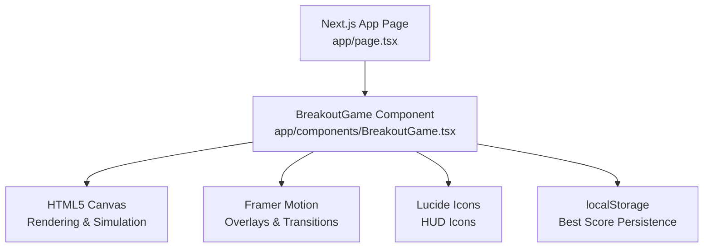
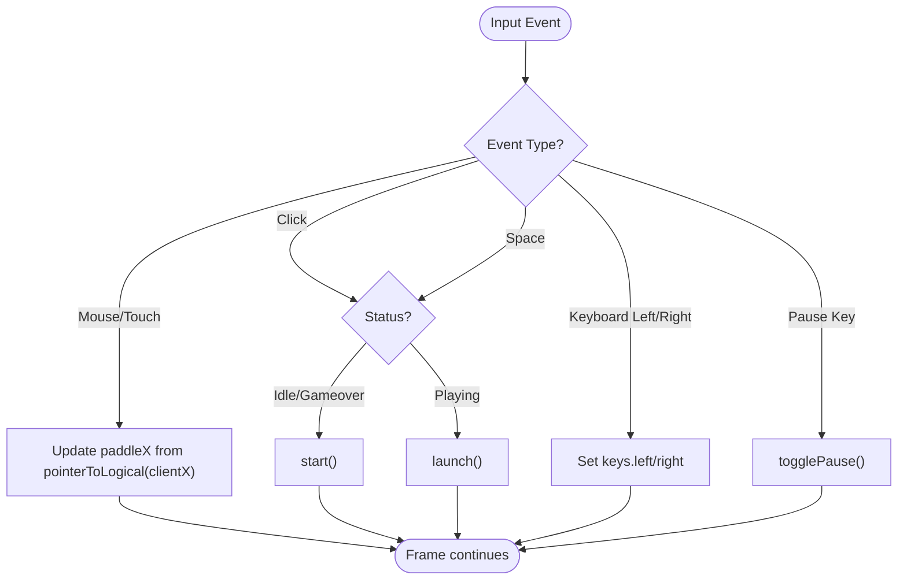
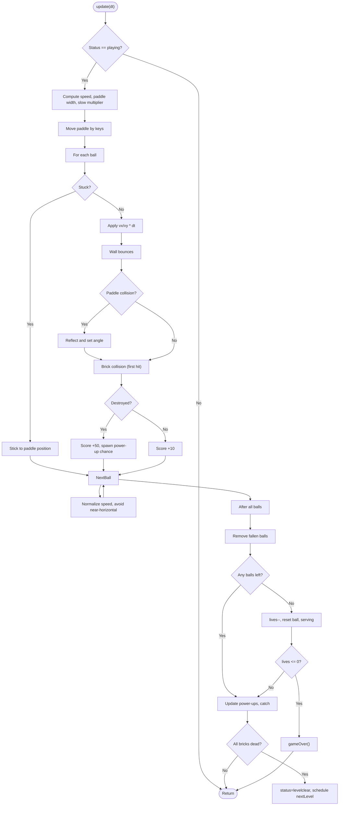
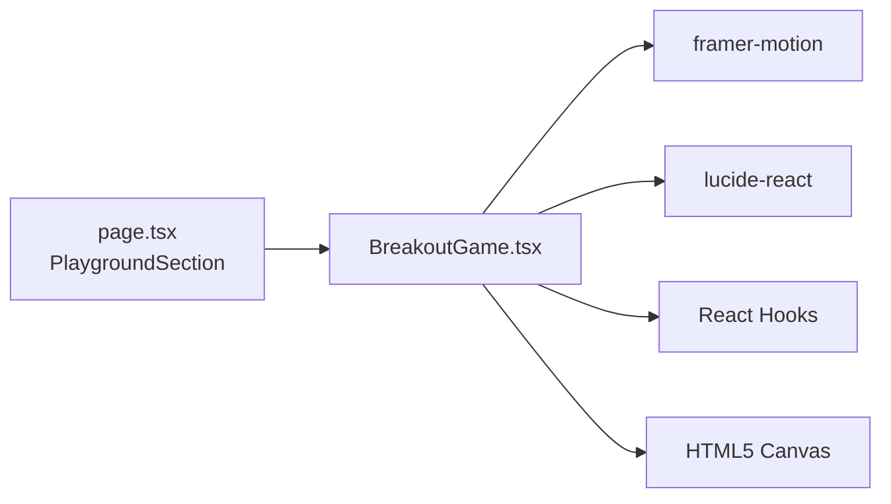

# Breakout Game Component

<cite>
**Referenced Files in This Document**
- [BreakoutGame.tsx](file://app/components/BreakoutGame.tsx)
- [page.tsx](file://app/page.tsx)
- [package.json](file://package.json)
</cite>

## Table of Contents
1. [Introduction](#introduction)
2. [Project Structure](#project-structure)
3. [Core Components](#core-components)
4. [Architecture Overview](#architecture-overview)
5. [Detailed Component Analysis](#detailed-component-analysis)
6. [Dependency Analysis](#dependency-analysis)
7. [Performance Considerations](#performance-considerations)
8. [Troubleshooting Guide](#troubleshooting-guide)
9. [Conclusion](#conclusion)

## Introduction
This document explains the Breakout Game component embedded in a Next.js portfolio site. It covers how the game is implemented with React and the HTML5 Canvas API, how it integrates into the page, and how its core systems (input, simulation, rendering, power-ups, scoring, and persistence) work together to deliver a responsive arcade experience.

## Project Structure
The Breakout Game is a self-contained client component that renders a canvas-based game and overlays UI for HUD and state transitions. It is integrated into the main page as part of an interactive “Playground” section.



**Diagram sources**
- [page.tsx:473-531](file://app/page.tsx#L473-L531)
- [BreakoutGame.tsx:107-741](file://app/components/BreakoutGame.tsx#L107-L741)

**Section sources**
- [page.tsx:473-531](file://app/page.tsx#L473-L531)
- [BreakoutGame.tsx:107-741](file://app/components/BreakoutGame.tsx#L107-L741)

## Core Components
- BreakoutGame: The primary React component encapsulating all game logic, input handling, simulation loop, and rendering.
- HUD overlay: Displays score, level, lives, best score, and contextual messages using React state and Framer Motion.
- Power-ups: Temporary effects like expand paddle, multi-ball, extra life, and slow motion.
- Level system: Procedurally generated brick layouts per level with increasing difficulty.

Key responsibilities:
- Maintain authoritative mutable game state in a ref to avoid unnecessary re-renders during the animation frame loop.
- Sync only necessary UI state to React for HUD updates.
- Manage input via mouse, touch, and keyboard events.
- Render frames at ~60fps using requestAnimationFrame.

**Section sources**
- [BreakoutGame.tsx:107-741](file://app/components/BreakoutGame.tsx#L107-L741)

## Architecture Overview
The component follows a classic game loop pattern within a React effect:
- Initialization: Set up canvas size based on device pixel ratio, build initial level, attach event listeners, start the loop.
- Update: Advance simulation (ball movement, collisions, power-ups, level progression).
- Draw: Render background, bricks, power-ups, paddle, balls, and visual effects.
- Cleanup: Cancel animation frame and remove event listeners on unmount.

```mermaid
sequenceDiagram
participant User as "User"
participant Page as "Page (playground)"
participant Game as "BreakoutGame"
participant Loop as "Animation Loop"
participant Canvas as "Canvas Renderer"
User->>Page : Scroll to Playground
Page->>Game : Mount BreakoutGame
Game->>Game : Initialize canvas, build level, attach inputs
Game->>Loop : Start requestAnimationFrame loop
loop Each Frame
Loop->>Game : update(dt)
Game->>Game : Move paddle/balls, collisions, power-ups
Game->>Canvas : draw()
end
User->>Game : Click/Space to launch or Pause
Game->>Game : Change status, sync HUD
```

**Diagram sources**
- [BreakoutGame.tsx:154-615](file://app/components/BreakoutGame.tsx#L154-L615)
- [page.tsx:473-531](file://app/page.tsx#L473-L531)

## Detailed Component Analysis

### Game State Model
- Paddle: Position and width; width can temporarily expand via power-up.
- Balls: Array of ball objects with position, velocity, and stuck state for launching from paddle.
- Bricks: Grid of bricks with color, name, hit count, and alive flag; levels vary rows and include armored bricks.
- Power-ups: Falling items with type and vertical velocity; caught by paddle to apply effects.
- Status: Idle, playing, paused, levelclear, gameover.
- HUD: Score, lives, level, serving indicator, best score, new best flag.

Complexity notes:
- Collision checks iterate over active bricks per ball; typical grid sizes keep this efficient.
- Power-up spawning is probabilistic upon brick destruction.

**Section sources**
- [BreakoutGame.tsx:24-39](file://app/components/BreakoutGame.tsx#L24-L39)
- [BreakoutGame.tsx:136-152](file://app/components/BreakoutGame.tsx#L136-L152)

### Input Handling
- Mouse/touch: Moves paddle horizontally; click launches ball when serving.
- Keyboard: Arrow keys or A/D move paddle; Space launches; P or Escape pauses/resumes.
- Event listeners are attached to window and canvas; cleaned up on unmount.



**Diagram sources**
- [BreakoutGame.tsx:285-332](file://app/components/BreakoutGame.tsx#L285-L332)
- [BreakoutGame.tsx:364-508](file://app/components/BreakoutGame.tsx#L364-L508)

**Section sources**
- [BreakoutGame.tsx:285-332](file://app/components/BreakoutGame.tsx#L285-L332)

### Simulation and Rendering
- Speed scaling: Ball speed increases per level; power-ups can modify effective speed temporarily.
- Wall and paddle collisions: Reflect velocities and clamp positions; angle control on paddle bounce.
- Brick collision: First hit per frame per ball; reduces hits; destroys when hits reach zero; spawns power-ups with probability.
- Power-ups: Fall down; if caught, apply effects (expand paddle, multi-ball, extra life, slow).
- Level clear: When all bricks destroyed, transition to levelclear then next level after delay.
- Rendering: Gradient background, rounded rectangles for bricks/power-ups/paddle, glowing balls, subtle flash on hits.



**Diagram sources**
- [BreakoutGame.tsx:364-508](file://app/components/BreakoutGame.tsx#L364-L508)

**Section sources**
- [BreakoutGame.tsx:364-508](file://app/components/BreakoutGame.tsx#L364-L508)

### Scoring and Persistence
- Scoring: Points awarded for hitting bricks (more for destruction), catching power-ups, and clearing levels.
- Best score: Persisted in localStorage; read after hydration to avoid SSR mismatch; session best overrides stored best during play.

**Section sources**
- [BreakoutGame.tsx:123-134](file://app/components/BreakoutGame.tsx#L123-L134)
- [BreakoutGame.tsx:218-234](file://app/components/BreakoutGame.tsx#L218-L234)

### UI Overlays and Controls
- Overlays: Contextual messages for idle, paused, level cleared, and game over states with animated entrance/exit.
- Controls: Buttons to start/pause/restart; hints for controls below the canvas.

**Section sources**
- [BreakoutGame.tsx:617-741](file://app/components/BreakoutGame.tsx#L617-L741)

## Dependency Analysis
External dependencies used by the component:
- framer-motion: Used for overlay animations and presence transitions.
- lucide-react: Icons for hearts, pause/play, restart, trophy.
- React hooks: useRef, useState, useEffect, useMemo, useSyncExternalStore for safe SSR hydration.

Integration points:
- Imported into the main page’s Playground section and rendered inside a styled container.



**Diagram sources**
- [page.tsx:473-531](file://app/page.tsx#L473-L531)
- [BreakoutGame.tsx:1-10](file://app/components/BreakoutGame.tsx#L1-L10)

**Section sources**
- [package.json:11-19](file://package.json#L11-L19)
- [page.tsx:473-531](file://app/page.tsx#L473-L531)
- [BreakoutGame.tsx:1-10](file://app/components/BreakoutGame.tsx#L1-L10)

## Performance Considerations
- Canvas DPR scaling: Uses devicePixelRatio capped at 2 to balance sharpness and performance.
- Animation timing: requestAnimationFrame loop with delta time capped to prevent large jumps.
- Efficient updates: Authoritative game state kept in refs; only minimal HUD state synced to React to reduce re-renders.
- Collision optimization: First-hit-per-frame per ball avoids multiple redundant calculations.
- Memory: Power-ups and balls filtered each frame to remove off-screen or inactive entities.

[No sources needed since this section provides general guidance]

## Troubleshooting Guide
Common issues and resolutions:
- No response to input: Ensure event listeners are attached and not removed prematurely; verify status is not locked in levelclear.
- Ball not launching: Confirm serving state and that click/space triggers launch; check that status allows launching.
- High CPU usage: Verify loop runs once per frame and dt is clamped; ensure no heavy operations inside update beyond necessary.
- Best score not persisting: Check browser storage permissions and that hydration occurs before reading/writing localStorage.

**Section sources**
- [BreakoutGame.tsx:154-615](file://app/components/BreakoutGame.tsx#L154-L615)
- [BreakoutGame.tsx:123-134](file://app/components/BreakoutGame.tsx#L123-L134)

## Conclusion
The Breakout Game component demonstrates a clean separation between game simulation and UI rendering within a React application. It leverages the HTML5 Canvas API for high-performance graphics, uses refs for mutable game state, and integrates smoothly into a modern Next.js portfolio layout. Its modular design makes it easy to extend with new power-ups, levels, or visual effects while maintaining responsiveness and accessibility.

[No sources needed since this section summarizes without analyzing specific files]