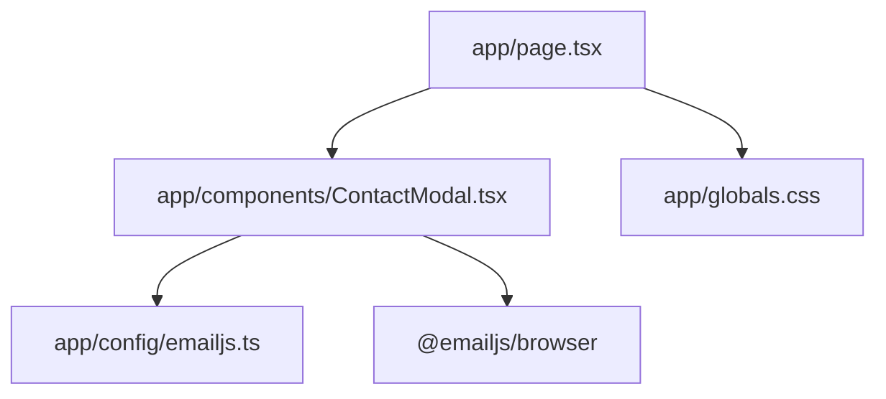
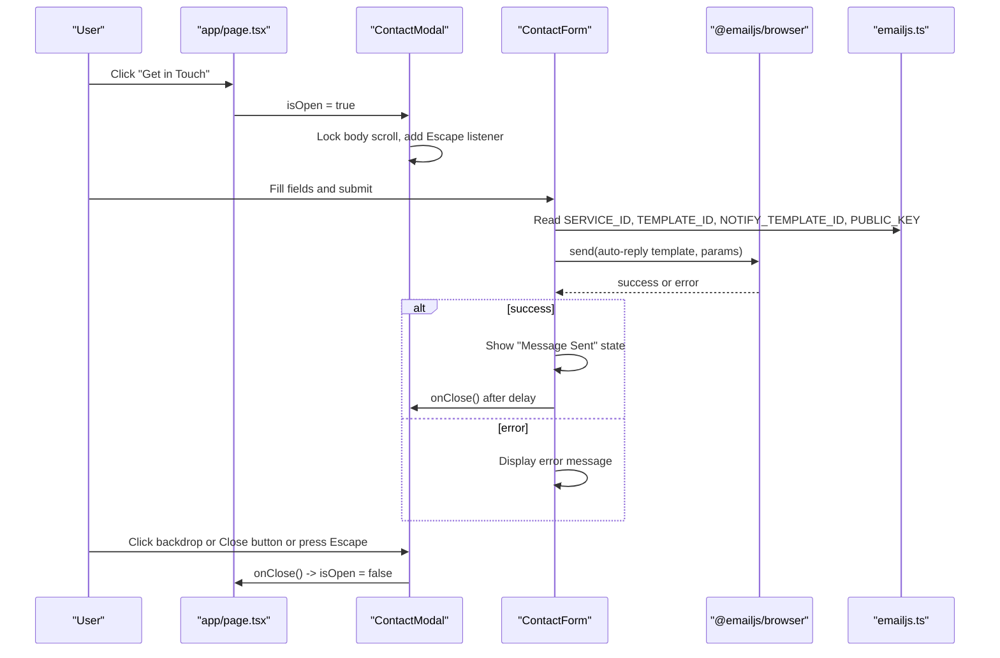
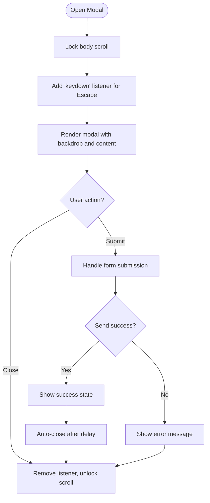
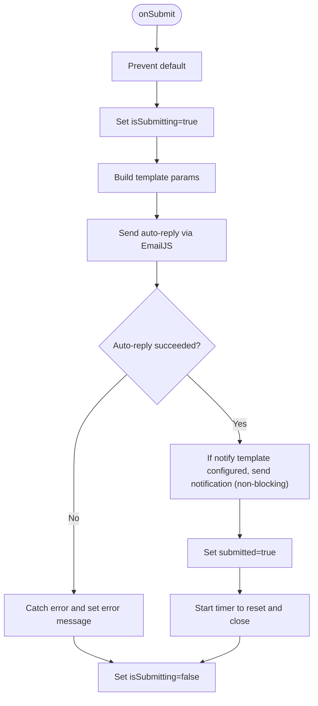
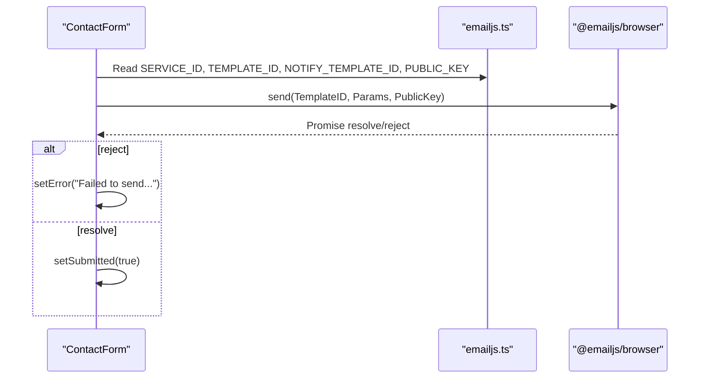
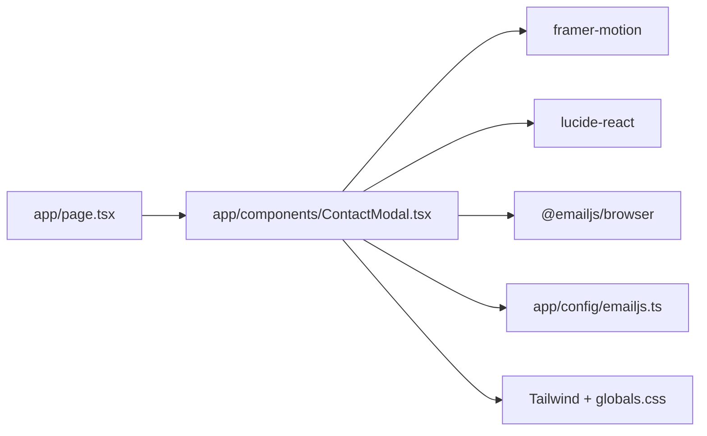

# Contact Modal Component

<cite>
**Referenced Files in This Document**
- [ContactModal.tsx](file://app/components/ContactModal.tsx)
- [emailjs.ts](file://app/config/emailjs.ts)
- [page.tsx](file://app/page.tsx)
- [globals.css](file://app/globals.css)
</cite>

## Table of Contents
1. [Introduction](#introduction)
2. [Project Structure](#project-structure)
3. [Core Components](#core-components)
4. [Architecture Overview](#architecture-overview)
5. [Detailed Component Analysis](#detailed-component-analysis)
6. [Dependency Analysis](#dependency-analysis)
7. [Performance Considerations](#performance-considerations)
8. [Troubleshooting Guide](#troubleshooting-guide)
9. [Conclusion](#conclusion)
10. [Appendices](#appendices)

## Introduction
This document explains the Contact modal component that enables visitors to send inquiries via an email-integrated form. It covers form validation, EmailJS integration for sending messages, modal state management, user interface design (fields, errors, success feedback), accessibility features, configuration options for EmailJS and styling theming, examples of implementing validation and submission states, and security considerations for client-side email sending.

## Project Structure
The Contact modal is implemented as a client-side React component integrated into the Next.js application. The modal is opened from the main page and contains a contact details panel alongside a form that sends emails through EmailJS. Styling uses Tailwind CSS with custom theme variables defined globally.

**Diagram sources**
- [page.tsx:557-571](file://app/page.tsx#L557-L571)
- [ContactModal.tsx:1-12](file://app/components/ContactModal.tsx#L1-L12)
- [emailjs.ts:6-14](file://app/config/emailjs.ts#L6-L14)
- [globals.css:3-17](file://app/globals.css#L3-L17)

**Section sources**
- [page.tsx:557-571](file://app/page.tsx#L557-L571)
- [ContactModal.tsx:1-12](file://app/components/ContactModal.tsx#L1-L12)
- [emailjs.ts:6-14](file://app/config/emailjs.ts#L6-L14)
- [globals.css:3-17](file://app/globals.css#L3-L17)

## Core Components
- ContactModal: Controls visibility, backdrop, keyboard handling, and renders the contact details and form.
- ContactForm: Manages form state, validation via HTML attributes, submission flow, and success/error UI.
- EmailJS Configuration: Centralized service IDs, template IDs, public key, and recipient email.

Key responsibilities:
- Modal state management via props from the parent page.
- Form data binding and controlled inputs.
- Submission using EmailJS with auto-reply and optional notification.
- Accessibility attributes and keyboard support.
- Styling via Tailwind classes and global theme variables.

**Section sources**
- [ContactModal.tsx:9-12](file://app/components/ContactModal.tsx#L9-L12)
- [ContactModal.tsx:30-212](file://app/components/ContactModal.tsx#L30-L212)
- [emailjs.ts:6-14](file://app/config/emailjs.ts#L6-L14)

## Architecture Overview
The modal is conditionally rendered based on state managed in the root page. When open, it locks body scroll, listens for Escape to close, and presents a two-column layout: contact details on the left and the form on the right. On submit, the form constructs parameters and calls EmailJS to send an auto-reply; optionally it also sends a notification to the owner. Success transitions to a confirmation view and resets after a delay.

**Diagram sources**
- [page.tsx:557-571](file://app/page.tsx#L557-L571)
- [ContactModal.tsx:214-234](file://app/components/ContactModal.tsx#L214-L234)
- [ContactModal.tsx:56-99](file://app/components/ContactModal.tsx#L56-L99)
- [emailjs.ts:6-14](file://app/config/emailjs.ts#L6-L14)

## Detailed Component Analysis

### Modal State Management and UX
- Visibility controlled by props: isOpen and onClose passed from the page.
- Body scroll lock when modal is open to prevent background scrolling.
- Keyboard accessibility: Escape key closes the modal.
- Backdrop click and explicit close button both trigger onClose.
- ARIA attributes: role="dialog", aria-modal="true", aria-labelledby linked to the heading id.

**Diagram sources**
- [ContactModal.tsx:214-234](file://app/components/ContactModal.tsx#L214-L234)
- [ContactModal.tsx:236-269](file://app/components/ContactModal.tsx#L236-L269)
- [ContactModal.tsx:56-99](file://app/components/ContactModal.tsx#L56-L99)

**Section sources**
- [ContactModal.tsx:214-234](file://app/components/ContactModal.tsx#L214-L234)
- [ContactModal.tsx:236-269](file://app/components/ContactModal.tsx#L236-L269)

### Form Fields and Validation
Fields:
- Name (text input)
- Email (email input)
- Subject (text input)
- Message (textarea)

Validation approach:
- HTML5 required attributes enforce presence.
- Input type="email" leverages browser email validation.
- Error state is cleared on change and shown only when submission fails.

Accessibility:
- Each field has a label with htmlFor matching the input id.
- Focus styles use theme colors for clear indication.

Submission states:
- isSubmitting disables the button and shows a spinner during send.
- submitted toggles to a success view with a brief delay before closing.

**Diagram sources**
- [ContactModal.tsx:56-99](file://app/components/ContactModal.tsx#L56-L99)
- [ContactModal.tsx:119-212](file://app/components/ContactModal.tsx#L119-L212)

**Section sources**
- [ContactModal.tsx:30-212](file://app/components/ContactModal.tsx#L30-L212)

### EmailJS Integration
Configuration:
- Service ID, Template ID (auto-reply), Notify Template ID (optional), Public Key are centralized.
- Recipient email is centralized for inclusion in template parameters.

Behavior:
- Auto-reply is mandatory; failure sets an error state.
- Notification to owner is fire-and-forget; failures are ignored to avoid blocking success.

Security note:
- EmailJS public key is intentionally exposed for client usage.
- Sensitive secrets should not be stored in client code; rely on EmailJS templates and services for server-side logic if needed.

**Diagram sources**
- [ContactModal.tsx:61-86](file://app/components/ContactModal.tsx#L61-L86)
- [emailjs.ts:6-14](file://app/config/emailjs.ts#L6-L14)

**Section sources**
- [ContactModal.tsx:61-86](file://app/components/ContactModal.tsx#L61-L86)
- [emailjs.ts:6-14](file://app/config/emailjs.ts#L6-L14)

### UI Design and Theming
- Layout: Two-column grid on large screens; stacked on smaller screens.
- Left column: Contact details including email, phone, location, and social links.
- Right column: Contact form with consistent spacing and focus states.
- Theme variables: Colors and fonts are defined in global CSS and consumed via Tailwind utilities.
- Animations: Framer Motion provides entrance/exit animations and staggered children.

Styling highlights:
- Backgrounds, borders, and text colors use theme tokens for consistency.
- Accent color used for primary actions and focus states.
- Reduced motion preferences respected globally.

**Section sources**
- [ContactModal.tsx:236-387](file://app/components/ContactModal.tsx#L236-L387)
- [globals.css:3-17](file://app/globals.css#L3-L17)
- [globals.css:102-112](file://app/globals.css#L102-L112)

### Accessibility Features
- Dialog semantics: role="dialog", aria-modal="true", aria-labelledby pointing to the heading id.
- Labels: All inputs have associated labels via htmlFor/id pairs.
- Keyboard navigation: Escape key closes the modal.
- Focus management: Inputs have visible focus styles aligned with theme.
- Screen reader friendly: Success and error messages are presented as standard DOM elements.

**Section sources**
- [ContactModal.tsx:251-269](file://app/components/ContactModal.tsx#L251-L269)
- [ContactModal.tsx:121-183](file://app/components/ContactModal.tsx#L121-L183)
- [ContactModal.tsx:226-234](file://app/components/ContactModal.tsx#L226-L234)

## Dependency Analysis
- Parent component (page.tsx) manages modal open/close state and passes props to ContactModal.
- ContactModal depends on:
  - Framer Motion for animations.
  - Lucide icons for visual cues.
  - EmailJS client library for sending emails.
  - Centralized EmailJS configuration.
- Styling relies on Tailwind CSS and global theme variables.

**Diagram sources**
- [page.tsx:557-571](file://app/page.tsx#L557-L571)
- [ContactModal.tsx:1-8](file://app/components/ContactModal.tsx#L1-L8)
- [emailjs.ts:6-14](file://app/config/emailjs.ts#L6-L14)
- [globals.css:3-17](file://app/globals.css#L3-L17)

**Section sources**
- [page.tsx:557-571](file://app/page.tsx#L557-L571)
- [ContactModal.tsx:1-8](file://app/components/ContactModal.tsx#L1-L8)
- [emailjs.ts:6-14](file://app/config/emailjs.ts#L6-L14)
- [globals.css:3-17](file://app/globals.css#L3-L17)

## Performance Considerations
- Minimal re-renders: Controlled inputs update only changed fields.
- Non-blocking notification: Owner notification is fire-and-forget to avoid delaying success.
- Animation performance: Use Framer Motion variants for efficient transitions.
- Reduced motion: Respects prefers-reduced-motion to improve accessibility and performance for sensitive users.

[No sources needed since this section provides general guidance]

## Troubleshooting Guide
Common issues and strategies:
- Network or EmailJS errors:
  - Symptom: Error message displayed below the form.
  - Cause: Failed auto-reply send or network issue.
  - Resolution: Retry submission; ensure EmailJS service and template are correctly configured.
- Missing notify template:
  - Behavior: If notify template ID is placeholder, notification is skipped without affecting success.
  - Action: Replace placeholder with actual template ID to receive notifications.
- Modal not closing:
  - Ensure Escape handler is attached and onClose prop is wired correctly from the parent.
- Body scroll remains locked:
  - Verify cleanup effect unlocks scroll on unmount or when modal closes.

**Section sources**
- [ContactModal.tsx:94-98](file://app/components/ContactModal.tsx#L94-L98)
- [ContactModal.tsx:79-86](file://app/components/ContactModal.tsx#L79-L86)
- [ContactModal.tsx:214-234](file://app/components/ContactModal.tsx#L214-L234)

## Conclusion
The Contact modal provides a polished, accessible, and functional way to collect inquiries and send emails via EmailJS. It balances user experience with robust error handling and maintains clean separation of concerns through centralized configuration. With proper EmailJS setup and adherence to the provided patterns, you can customize fields, styling, and behavior while maintaining reliability and accessibility.

[No sources needed since this section summarizes without analyzing specific files]

## Appendices

### Configuration Options
- EmailJS:
  - SERVICE_ID: Your EmailJS service identifier.
  - TEMPLATE_ID: Auto-reply template sent to the sender.
  - NOTIFY_TEMPLATE_ID: Optional notification template for the owner; leave placeholder to skip.
  - PUBLIC_KEY: EmailJS public key for client-side access.
- Recipient:
  - CONTACT_EMAIL: Destination email for notifications included in template parameters.

To configure:
- Update EMAILJS_CONFIG values in the configuration file.
- Ensure EmailJS templates exist and map to parameter names used in the form submission.

**Section sources**
- [emailjs.ts:6-14](file://app/config/emailjs.ts#L6-L14)

### Form Field Customization
- To add or remove fields:
  - Extend the form state object.
  - Add corresponding input/textarea with label and htmlFor/id pairing.
  - Include the new field in template parameters sent to EmailJS.
  - Update EmailJS templates to include the new variable.

**Section sources**
- [ContactModal.tsx:30-36](file://app/components/ContactModal.tsx#L30-L36)
- [ContactModal.tsx:119-183](file://app/components/ContactModal.tsx#L119-L183)
- [ContactModal.tsx:61-68](file://app/components/ContactModal.tsx#L61-L68)

### Implementing Validation and Submission States
- Validation:
  - Use HTML5 required and type constraints for basic validation.
  - Clear error state on input changes to provide immediate feedback.
- Submission states:
  - Disable submit button during send and show loading indicator.
  - On success, switch to a confirmation view and auto-close after a delay.
  - On error, display a user-friendly message.

**Section sources**
- [ContactModal.tsx:49-54](file://app/components/ContactModal.tsx#L49-L54)
- [ContactModal.tsx:56-99](file://app/components/ContactModal.tsx#L56-L99)
- [ContactModal.tsx:101-117](file://app/components/ContactModal.tsx#L101-L117)
- [ContactModal.tsx:191-210](file://app/components/ContactModal.tsx#L191-L210)

### Security Considerations for Client-Side Email Sending
- EmailJS public key exposure:
  - Intentional for client usage; restrict abuse via EmailJS dashboard settings (rate limits, allowed domains).
- Avoid storing secrets in client code:
  - Keep sensitive credentials server-side; use EmailJS templates/services to handle routing and templating.
- Sanitize inputs:
  - Rely on EmailJS templates to render content safely; consider server-side validation if integrating additional endpoints later.
- Monitor and log:
  - Track failed submissions in EmailJS dashboard and implement retry strategies if necessary.

[No sources needed since this section provides general guidance]