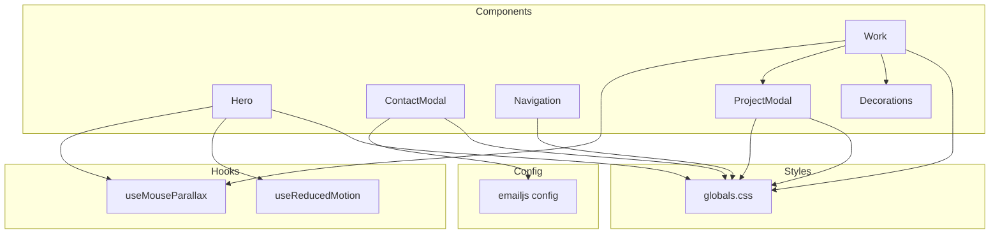
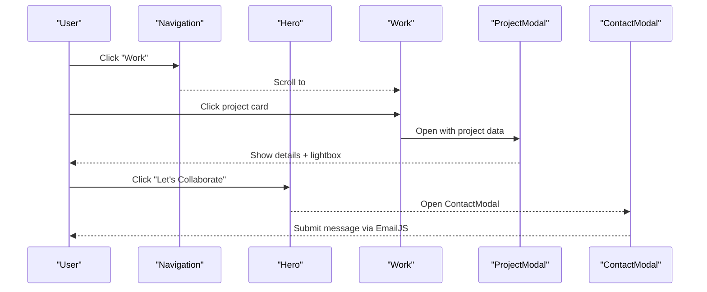
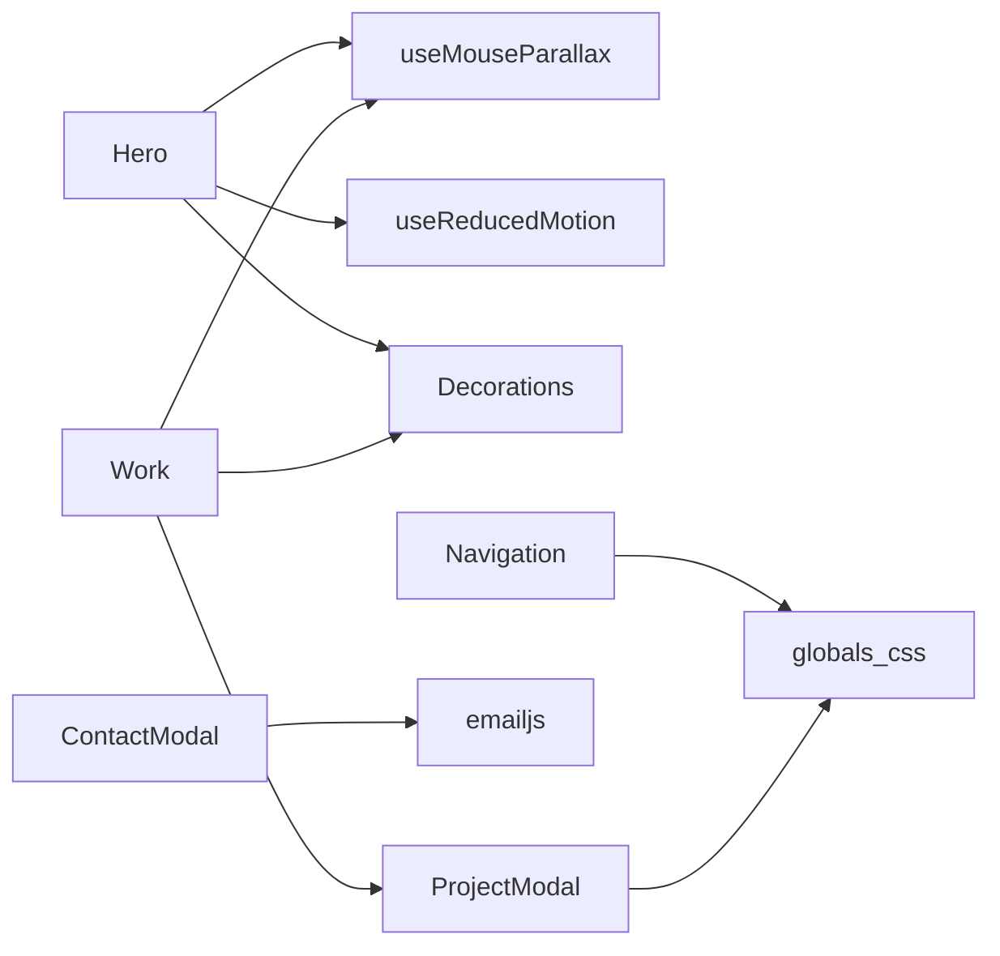

# Core Components

<cite>
**Referenced Files in This Document**
- [Hero.tsx](file://app/components/Hero.tsx)
- [Work.tsx](file://app/components/Work.tsx)
- [ContactModal.tsx](file://app/components/ContactModal.tsx)
- [Navigation.tsx](file://app/components/Navigation.tsx)
- [ProjectModal.tsx](file://app/components/ProjectModal.tsx)
- [Decorations.tsx](file://app/components/Decorations.tsx)
- [useMouseParallax.ts](file://app/hooks/useMouseParallax.ts)
- [useReducedMotion.ts](file://app/hooks/useReducedMotion.ts)
- [emailjs.ts](file://app/config/emailjs.ts)
- [globals.css](file://app/globals.css)
</cite>

## Table of Contents
1. [Introduction](#introduction)
2. [Project Structure](#project-structure)
3. [Core Components](#core-components)
4. [Architecture Overview](#architecture-overview)
5. [Detailed Component Analysis](#detailed-component-analysis)
6. [Dependency Analysis](#dependency-analysis)
7. [Performance Considerations](#performance-considerations)
8. [Troubleshooting Guide](#troubleshooting-guide)
9. [Conclusion](#conclusion)
10. [Appendices](#appendices)

## Introduction
This document describes the core UI components that power the portfolio website: Hero, Work, ContactModal, Navigation, and ProjectModal. It explains each component’s visual appearance, behavior, user interactions, props, events, customization options, animations, responsive design, accessibility, theming, and integration patterns with other components and utilities.

## Project Structure
The components are organized under app/components and rely on shared hooks for mouse parallax and reduced motion preferences. Decorative elements are abstracted into a reusable set of components. Styling is handled via Tailwind CSS with custom theme variables defined globally.

**Diagram sources**
- [Hero.tsx:1-187](file://app/components/Hero.tsx#L1-L187)
- [Work.tsx:1-499](file://app/components/Work.tsx#L1-L499)
- [ContactModal.tsx:1-392](file://app/components/ContactModal.tsx#L1-L392)
- [Navigation.tsx:1-133](file://app/components/Navigation.tsx#L1-L133)
- [ProjectModal.tsx:1-631](file://app/components/ProjectModal.tsx#L1-L631)
- [Decorations.tsx:1-190](file://app/components/Decorations.tsx#L1-L190)
- [useMouseParallax.ts:1-66](file://app/hooks/useMouseParallax.ts#L1-L66)
- [useReducedMotion.ts:1-20](file://app/hooks/useReducedMotion.ts#L1-L20)
- [emailjs.ts:1-15](file://app/config/emailjs.ts#L1-L15)
- [globals.css:1-113](file://app/globals.css#L1-L113)

**Section sources**
- [Hero.tsx:1-187](file://app/components/Hero.tsx#L1-L187)
- [Work.tsx:1-499](file://app/components/Work.tsx#L1-L499)
- [ContactModal.tsx:1-392](file://app/components/ContactModal.tsx#L1-L392)
- [Navigation.tsx:1-133](file://app/components/Navigation.tsx#L1-L133)
- [ProjectModal.tsx:1-631](file://app/components/ProjectModal.tsx#L1-L631)
- [Decorations.tsx:1-190](file://app/components/Decorations.tsx#L1-L190)
- [useMouseParallax.ts:1-66](file://app/hooks/useMouseParallax.ts#L1-L66)
- [useReducedMotion.ts:1-20](file://app/hooks/useReducedMotion.ts#L1-L20)
- [emailjs.ts:1-15](file://app/config/emailjs.ts#L1-L15)
- [globals.css:1-113](file://app/globals.css#L1-L113)

## Core Components
- Hero: Full-screen introduction with animated text, image frame, decorative parallax elements, and call-to-action links. Uses mouse parallax and respects reduced motion.
- Work: Project showcase with featured and expandable additional projects, hover effects, and modal navigation to detailed project views.
- ContactModal: Accessible modal with contact details and an email form powered by EmailJS, including success state and error handling.
- Navigation: Fixed top navigation with scroll-aware background, desktop links, resume download, and mobile menu with accessible attributes.
- ProjectModal: Detailed project view with hero image, overview, design process, outcomes, gallery, tech stack, and links; includes a lightbox with zoom and keyboard navigation.

**Section sources**
- [Hero.tsx:10-187](file://app/components/Hero.tsx#L10-L187)
- [Work.tsx:71-499](file://app/components/Work.tsx#L71-L499)
- [ContactModal.tsx:9-392](file://app/components/ContactModal.tsx#L9-L392)
- [Navigation.tsx:17-133](file://app/components/Navigation.tsx#L17-L133)
- [ProjectModal.tsx:23-631](file://app/components/ProjectModal.tsx#L23-L631)

## Architecture Overview
The components compose together to deliver a cohesive experience:
- Navigation provides global access to sections and resume download.
- Hero introduces the portfolio and guides users to work and contact.
- Work lists projects and opens ProjectModal for details.
- ProjectModal offers deep project exploration with a lightbox.
- ContactModal handles outreach via EmailJS.
- Decorations provide reusable visual accents across sections.
- Hooks supply mouse-driven parallax and reduced-motion preferences.
- Global styles define the theme and accessibility-friendly defaults.

**Diagram sources**
- [Navigation.tsx:10-133](file://app/components/Navigation.tsx#L10-L133)
- [Hero.tsx:117-130](file://app/components/Hero.tsx#L117-L130)
- [Work.tsx:352-499](file://app/components/Work.tsx#L352-L499)
- [ProjectModal.tsx:125-631](file://app/components/ProjectModal.tsx#L125-L631)
- [ContactModal.tsx:214-392](file://app/components/ContactModal.tsx#L214-L392)

## Detailed Component Analysis

### Hero
- Visual appearance: Full-viewport section with layered decorative elements (glow orbs, dots, brackets), a framed portrait image, and prominent headline with gradient text.
- Behavior: Mouse parallax moves decorative layers at different intensities; staggered entrance animations for text and image; subtle floating arrow animation at bottom.
- User interaction: Links to “View Work” and “Let’s Collaborate”; mouse movement triggers parallax; respects system reduced motion preference.
- Props/attributes: None exported; internal configuration via hooks and Tailwind classes.
- Events: Mouse move/leave handlers for parallax; link clicks navigate to sections or open ContactModal from parent usage.
- Customization: Adjust parallax intensity via hook parameters; modify colors via theme variables; swap image source and alt text; adjust animation timings and delays.
- Responsive design: Grid layout adapts from single column on small screens to two-column on large screens; image sizes use responsive breakpoints; decorative elements hidden on smaller screens.
- Accessibility: Semantic headings and paragraphs; aria-hidden on decorative elements; prefers-reduced-motion respected; focus management handled by parent when opening modals.
- Animations/transitions: Framer Motion for fade/slide-in; spring-based parallax; infinite gentle float for arrow; gradient text styling.
- Theming support: Uses CSS variables for colors; accent color drives highlights and borders; can be customized by editing theme variables.
- Integration: Uses Decorations (DottedGrid, CornerBrackets), useMouseParallax, useReducedMotion, Next Image, and Lucide icons.

Usage example reference:
- See how Hero composes parallax hooks and decorations: [Hero.tsx:10-187](file://app/components/Hero.tsx#L10-L187)

**Section sources**
- [Hero.tsx:10-187](file://app/components/Hero.tsx#L10-L187)
- [useMouseParallax.ts:12-45](file://app/hooks/useMouseParallax.ts#L12-L45)
- [useReducedMotion.ts:5-19](file://app/hooks/useReducedMotion.ts#L5-L19)
- [Decorations.tsx:145-179](file://app/components/Decorations.tsx#L145-L179)
- [globals.css:3-17](file://app/globals.css#L3-L17)

### Work
- Visual appearance: Section header with project count badge; list of project cards with accent line, tag badges, category labels, and hover states; optional “View All Projects” button.
- Behavior: Featured projects always visible; additional projects reveal on demand with animated expansion; clicking a project opens ProjectModal; mouse parallax applied to section background decorations.
- User interaction: Hover effects on cards; click to open detail modal; toggle to show/hide additional projects.
- Props/attributes: Exports default component; internally defines ProjectCard with project, index, onClick; manages local state for selected project and visibility.
- Events: Click handlers for project cards and “View All” toggle; passes project data to ProjectModal.
- Customization: Add/remove projects in arrays; customize tags, colors, tech stacks, outcomes, images, and design processes; adjust animation durations and viewport margins.
- Responsive design: Card grid adapts to screen size; typography scales; decorative elements hide on smaller screens; modal integrates with ProjectModal which is responsive.
- Accessibility: Keyboard-focusable interactive elements; semantic headings; aria attributes on modal via ProjectModal; decorative elements marked aria-hidden.
- Animations/transitions: Staggered fade-in on scroll; AnimatePresence for expanding/collapsing additional projects; hover scale and color transitions.
- Theming support: Accent colors per project via inline styles; border and text colors derived from theme variables.
- Integration: Uses Decorations (SectionNumber, DottedGrid, GlowOrb, FloatingRing, FloatingDot, FloatingPlus, DiagonalLine); ProjectModal for details; mouse parallax hook.

Usage example reference:
- See project arrays and modal integration: [Work.tsx:71-499](file://app/components/Work.tsx#L71-L499)

**Section sources**
- [Work.tsx:71-499](file://app/components/Work.tsx#L71-L499)
- [Decorations.tsx:7-143](file://app/components/Decorations.tsx#L7-L143)
- [useMouseParallax.ts:12-45](file://app/hooks/useMouseParallax.ts#L12-L45)

### ContactModal
- Visual appearance: Modal overlay with backdrop blur; split layout showing contact details (email, phone, location, social links) and a contact form; success state with icon and message.
- Behavior: Opens/closes based on isOpen prop; disables body scroll while open; Escape key closes; form submission sends auto-reply via EmailJS and optionally notifies owner; success state auto-dismisses after delay.
- User interaction: Fill name, email, subject, message; submit to send; close via X button, backdrop click, or Escape key.
- Props/attributes: isOpen (boolean), onClose (function).
- Events: Form submit handler; keyboard Escape listener; effect to manage body overflow.
- Customization: Update EMAILJS_CONFIG and CONTACT_EMAIL; adjust success message and dismiss duration; style fields and buttons via Tailwind classes.
- Responsive design: Two-column layout on large screens; stacked on small screens; modal scrolls within viewport; padding adjusts for mobile.
- Accessibility: role="dialog", aria-modal="true", aria-labelledby; labeled inputs; aria-labels on close button; focus trap not implemented but Escape closes; screen reader friendly structure.
- Animations/transitions: Fade/scale entrance and exit; staggered content reveals; button hover/tap micro-interactions; spinner during submission.
- Theming support: Uses theme colors for borders, backgrounds, and accents; consistent with site palette.
- Integration: Uses EmailJS configuration; Lucide icons; Framer Motion for animations.

Usage example reference:
- See props and form logic: [ContactModal.tsx:9-392](file://app/components/ContactModal.tsx#L9-L392)
- See EmailJS config: [emailjs.ts:1-15](file://app/config/emailjs.ts#L1-L15)

**Section sources**
- [ContactModal.tsx:9-392](file://app/components/ContactModal.tsx#L9-L392)
- [emailjs.ts:1-15](file://app/config/emailjs.ts#L1-L15)

### Navigation
- Visual appearance: Fixed top bar with logo/name, desktop nav links, and resume download button; mobile menu toggled via hamburger icon; background becomes translucent with blur on scroll.
- Behavior: Detects scroll position to apply background; toggles mobile menu; smooth scrolling via global CSS; downloads resume PDF.
- User interaction: Click nav links to jump to sections; toggle mobile menu; download resume.
- Props/attributes: None exported; internal state for scroll and mobile menu.
- Events: Scroll listener updates background; click handlers for menu toggle and links; download attribute on resume link.
- Customization: Update navItems array; change RESUME_PATH; adjust scroll threshold; style via Tailwind classes.
- Responsive design: Desktop links visible on medium+ screens; mobile menu overlays full screen on small screens; large typography for mobile links.
- Accessibility: aria-label on toggle; aria-expanded reflects menu state; aria-controls references menu element; mobile menu has role="dialog".
- Animations/transitions: Slide-in/out for mobile menu; smooth background transition on scroll; hover color changes.
- Theming support: Uses theme colors for text and borders; hover states align with accent color.
- Integration: Uses Next Link for routing; Framer Motion for animations; global CSS for smooth scrolling.

Usage example reference:
- See navigation structure and mobile menu: [Navigation.tsx:17-133](file://app/components/Navigation.tsx#L17-L133)

**Section sources**
- [Navigation.tsx:17-133](file://app/components/Navigation.tsx#L17-L133)
- [globals.css:19-21](file://app/globals.css#L19-L21)

### ProjectModal
- Visual appearance: Full-screen modal with hero image overlay, overview text, design process steps, outcomes grid, gallery thumbnails, sidebar with meta info, tech stack tags, and external links; includes a lightbox with zoom controls and thumbnail strip.
- Behavior: Opens with project data; manages lightbox state; supports keyboard navigation (Escape, arrows, plus/minus for zoom); resets zoom on image change or close; prevents body scroll while open.
- User interaction: Close modal; open lightbox; navigate images; zoom in/out/reset; click thumbnails; keyboard shortcuts for navigation and zoom.
- Props/attributes: project (ProjectDetail | null), isOpen (boolean), onClose (function).
- Events: Keyboard listeners for Escape and navigation; click handlers for lightbox controls; image selection and zoom toggles.
- Customization: Extend ProjectDetail type; add new link types; adjust zoom levels; customize gallery placeholders; tweak animation timings.
- Responsive design: Modal adapts to viewport; lightbox toolbar collapses gracefully; images scale with aspect ratio; touch-friendly controls.
- Accessibility: role="dialog", aria-modal="true", aria-labelledby; descriptive aria-labels on controls; keyboard navigation; focus management via Escape; images have alt text.
- Animations/transitions: Fade/scale modal entrance; staggered content reveals; spring-based zoom transitions; hover effects on gallery items.
- Theming support: Uses theme colors for borders, backgrounds, and accents; project-specific colors via inline styles; consistent with global theme.
- Integration: Uses Next Image for optimized images; Framer Motion for animations; Lucide icons for controls.

Usage example reference:
- See modal structure and lightbox logic: [ProjectModal.tsx:125-631](file://app/components/ProjectModal.tsx#L125-L631)

**Section sources**
- [ProjectModal.tsx:23-631](file://app/components/ProjectModal.tsx#L23-L631)

## Dependency Analysis
- Hero depends on:
  - useMouseParallax for mouse-driven parallax
  - useReducedMotion to respect system preferences
  - Decorations for background grid and corner brackets
  - Next Image for optimized portrait rendering
  - Lucide icons for arrow indicators
- Work depends on:
  - ProjectModal for detailed views
  - Decorations for section accents and numbers
  - useMouseParallax for background parallax
  - Framer Motion for animations and presence
- ContactModal depends on:
  - EmailJS configuration for sending messages
  - Framer Motion for modal animations
  - Lucide icons for UI elements
- Navigation depends on:
  - Framer Motion for menu animations
  - Next Link for navigation
  - Global CSS for smooth scrolling
- ProjectModal depends on:
  - Framer Motion for animations
  - Next Image for gallery and hero images
  - Lucide icons for controls

**Diagram sources**
- [Hero.tsx:1-187](file://app/components/Hero.tsx#L1-L187)
- [Work.tsx:1-499](file://app/components/Work.tsx#L1-L499)
- [ContactModal.tsx:1-392](file://app/components/ContactModal.tsx#L1-L392)
- [Navigation.tsx:1-133](file://app/components/Navigation.tsx#L1-L133)
- [ProjectModal.tsx:1-631](file://app/components/ProjectModal.tsx#L1-L631)
- [useMouseParallax.ts:1-66](file://app/hooks/useMouseParallax.ts#L1-L66)
- [useReducedMotion.ts:1-20](file://app/hooks/useReducedMotion.ts#L1-L20)
- [emailjs.ts:1-15](file://app/config/emailjs.ts#L1-L15)
- [globals.css:1-113](file://app/globals.css#L1-L113)

**Section sources**
- [Hero.tsx:1-187](file://app/components/Hero.tsx#L1-L187)
- [Work.tsx:1-499](file://app/components/Work.tsx#L1-L499)
- [ContactModal.tsx:1-392](file://app/components/ContactModal.tsx#L1-L392)
- [Navigation.tsx:1-133](file://app/components/Navigation.tsx#L1-L133)
- [ProjectModal.tsx:1-631](file://app/components/ProjectModal.tsx#L1-L631)
- [useMouseParallax.ts:1-66](file://app/hooks/useMouseParallax.ts#L1-L66)
- [useReducedMotion.ts:1-20](file://app/hooks/useReducedMotion.ts#L1-L20)
- [emailjs.ts:1-15](file://app/config/emailjs.ts#L1-L15)
- [globals.css:1-113](file://app/globals.css#L1-L113)

## Performance Considerations
- Use lazy loading for non-critical images; Hero uses priority for initial image, while gallery images use lazy loading where appropriate.
- Parallax calculations are lightweight and use motion values; keep intensity reasonable to avoid jank on low-end devices.
- Respect reduced motion preferences to minimize unnecessary animations for users who prefer reduced motion.
- Avoid excessive re-renders by keeping state minimal and colocated; Work uses local state for modal and visibility toggles.
- Optimize images with Next Image’s fill and sizes attributes to ensure efficient loading across breakpoints.

[No sources needed since this section provides general guidance]

## Troubleshooting Guide
- Contact form fails to send:
  - Verify EMAILJS_CONFIG values and ensure templates exist; check browser console for errors; confirm network requests succeed.
  - If notify template is not configured, notification failures are ignored; auto-reply must succeed for success state.
- Modal does not close on Escape:
  - Ensure event listeners are attached when modal is open; verify no conflicting keydown handlers.
- Parallax not working:
  - Confirm mousemove handlers are bound to the correct ref; check that ref.current exists before calculating bounds.
- Reduced motion not respected:
  - Check useReducedMotion hook usage; ensure animations conditionally render or disable transitions when reduced motion is preferred.
- Images not loading:
  - Validate image paths; ensure Next Image src points to valid assets; check sizes and priority settings.

**Section sources**
- [ContactModal.tsx:56-99](file://app/components/ContactModal.tsx#L56-L99)
- [ProjectModal.tsx:149-163](file://app/components/ProjectModal.tsx#L149-L163)
- [useMouseParallax.ts:28-42](file://app/hooks/useMouseParallax.ts#L28-L42)
- [useReducedMotion.ts:5-19](file://app/hooks/useReducedMotion.ts#L5-L19)

## Conclusion
The portfolio’s core components are built with a clear separation of concerns: presentation via React components, interactivity through hooks, and styling via Tailwind with a consistent theme. They emphasize accessibility, responsiveness, and performance while providing rich interactions such as parallax, modals, and lightboxes. Customization is straightforward through props, configuration files, and theme variables, enabling easy adaptation to different branding needs.

[No sources needed since this section summarizes without analyzing specific files]

## Appendices

### Theme and Styling Reference
- Colors and fonts are defined in global theme variables; update these to rebrand the site quickly.
- Gradient text utility and noise overlay enhance visual depth; use sparingly to maintain performance.
- Scrollbar styling ensures consistency across browsers.

**Section sources**
- [globals.css:3-17](file://app/globals.css#L3-L17)
- [globals.css:53-71](file://app/globals.css#L53-L71)
- [globals.css:36-51](file://app/globals.css#L36-L51)

### Accessibility Checklist
- Use semantic HTML elements (headings, paragraphs, buttons).
- Provide descriptive alt text for images.
- Ensure all interactive elements are keyboard accessible.
- Include ARIA attributes for modals and dialogs.
- Respect reduced motion preferences.

**Section sources**
- [ContactModal.tsx:251-269](file://app/components/ContactModal.tsx#L251-L269)
- [ProjectModal.tsx:357-375](file://app/components/ProjectModal.tsx#L357-L375)
- [useReducedMotion.ts:5-19](file://app/hooks/useReducedMotion.ts#L5-L19)