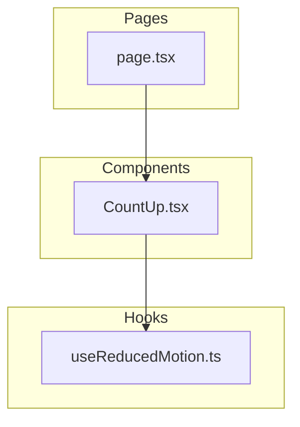
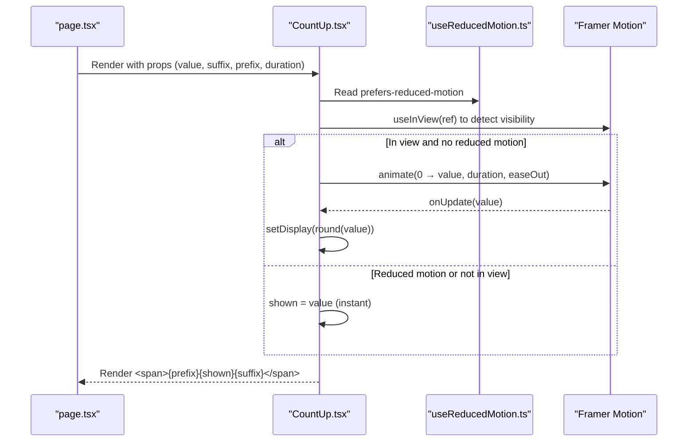
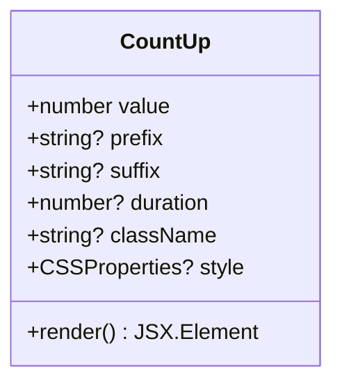
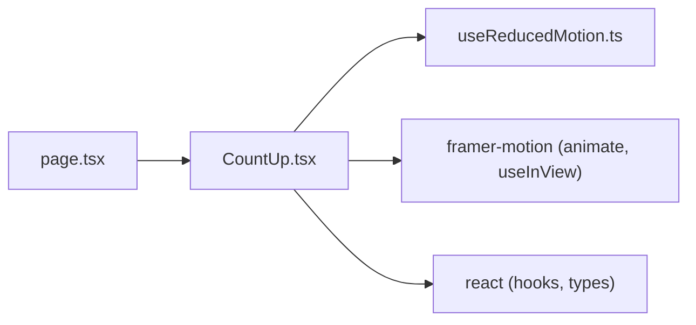

# CountUp Animated Counter

<cite>
**Referenced Files in This Document**
- [CountUp.tsx](file://app/components/CountUp.tsx)
- [useReducedMotion.ts](file://app/hooks/useReducedMotion.ts)
- [page.tsx](file://app/page.tsx)
- [package.json](file://package.json)
</cite>

## Table of Contents
1. [Introduction](#introduction)
2. [Project Structure](#project-structure)
3. [Core Components](#core-components)
4. [Architecture Overview](#architecture-overview)
5. [Detailed Component Analysis](#detailed-component-analysis)
6. [Dependency Analysis](#dependency-analysis)
7. [Performance Considerations](#performance-considerations)
8. [Troubleshooting Guide](#troubleshooting-guide)
9. [Conclusion](#conclusion)

## Introduction
This document explains the CountUp animated counter component used in a Next.js portfolio site. The component animates a numeric value from zero to a target when it scrolls into view, and gracefully falls back to instant display for users who prefer reduced motion. It is designed as a lightweight, reusable React component that integrates with Framer Motion for animation and a custom hook for accessibility-aware motion preferences.

## Project Structure
The CountUp feature spans three primary areas:
- Component implementation in the components directory
- A custom hook for detecting reduced motion preference
- Usage within the main page to animate statistics

**Diagram sources**
- [CountUp.tsx:1-53](file://app/components/CountUp.tsx#L1-L53)
- [useReducedMotion.ts:1-28](file://app/hooks/useReducedMotion.ts#L1-L28)
- [page.tsx:17-17](file://app/page.tsx#L17-L17)

**Section sources**
- [CountUp.tsx:1-53](file://app/components/CountUp.tsx#L1-L53)
- [useReducedMotion.ts:1-28](file://app/hooks/useReducedMotion.ts#L1-L28)
- [page.tsx:17-17](file://app/page.tsx#L17-L17)

## Core Components
- CountUp: Animates a number from 0 to a target value on first view, supports prefix/suffix styling, duration control, and CSS customization.
- useReducedMotion: Detects system-level reduced motion preference using matchMedia and exposes a boolean via a stable external store pattern.

Key behaviors:
- Triggers animation only once when the element enters the viewport.
- Honors user preference for reduced motion by instantly showing the final value.
- Uses an easing curve for smooth counting and rounds intermediate values for clean integer display.

**Section sources**
- [CountUp.tsx:7-52](file://app/components/CountUp.tsx#L7-L52)
- [useReducedMotion.ts:5-27](file://app/hooks/useReducedMotion.ts#L5-L27)

## Architecture Overview
The component follows a simple client-side flow:
- Mounts as a client component
- Tracks visibility using an intersection observer hook
- Reads reduced motion preference
- Starts an animation when visible and not reduced-motion
- Renders a span with optional prefix/suffix and styled content

**Diagram sources**
- [CountUp.tsx:28-43](file://app/components/CountUp.tsx#L28-L43)
- [useReducedMotion.ts:5-27](file://app/hooks/useReducedMotion.ts#L5-L27)
- [page.tsx:220-228](file://app/page.tsx#L220-L228)

## Detailed Component Analysis

### CountUp Component
Responsibilities:
- Accepts configuration via props: target value, optional prefix/suffix strings, animation duration, and styling hooks (className/style).
- Uses a ref to observe visibility and triggers animation once.
- Integrates with a reduced motion hook to respect user preferences.
- Renders a semantic span containing the animated number with optional surrounding text.

Props:
- value: number — target count
- prefix?: string — optional leading text (e.g., currency symbol)
- suffix?: string — optional trailing text (e.g., “+”, “%”)
- duration?: number — animation length in seconds
- className?: string — CSS class names
- style?: CSSProperties — inline styles

Rendering behavior:
- When reduced motion is preferred or before the element is in view, shows either the final value immediately or zero until triggered.
- On first view without reduced motion, counts up smoothly and updates state each frame.

Accessibility:
- Respects system-level reduced motion preference to avoid motion-induced discomfort.

**Section sources**
- [CountUp.tsx:7-52](file://app/components/CountUp.tsx#L7-L52)

#### Class-like structure (for conceptual clarity)

**Diagram sources**
- [CountUp.tsx:7-52](file://app/components/CountUp.tsx#L7-L52)

### useReducedMotion Hook
Responsibilities:
- Subscribes to the system’s reduced motion media query.
- Provides a stable boolean value across renders using an external store pattern compatible with React’s hydration model.
- Avoids hydration mismatches by returning a safe default during server rendering.

Behavior:
- Returns true if the user has enabled reduced motion at the OS/browser level.
- Updates reactively when the preference changes.

**Section sources**
- [useReducedMotion.ts:5-27](file://app/hooks/useReducedMotion.ts#L5-L27)

### Usage in the Application
Where it appears:
- The main page imports and uses CountUp to animate key metrics (e.g., years of experience, products shipped).
- Each metric passes a numeric value and an optional suffix, styled with large typography and color.

Integration points:
- Imported alongside other UI primitives and decorative components.
- Placed inside a stats card layout that highlights achievements.

**Section sources**
- [page.tsx:17-17](file://app/page.tsx#L17-L17)
- [page.tsx:220-228](file://app/page.tsx#L220-L228)

## Dependency Analysis
External dependencies relevant to CountUp:
- Framer Motion: provides animate and useInView for animation and visibility detection.
- React: core framework for component composition and state management.

Local dependencies:
- useReducedMotion hook for accessibility-aware motion handling.

**Diagram sources**
- [CountUp.tsx:3-5](file://app/components/CountUp.tsx#L3-L5)
- [page.tsx:17-17](file://app/page.tsx#L17-L17)
- [package.json:11-19](file://package.json#L11-L19)

**Section sources**
- [CountUp.tsx:3-5](file://app/components/CountUp.tsx#L3-L5)
- [package.json:11-19](file://package.json#L11-L19)

## Performance Considerations
- Animation runs only once per mount due to the “once” flag in the visibility hook, preventing repeated re-runs on scroll.
- Rounding intermediate values avoids unnecessary layout thrashing from fractional numbers.
- Reduced motion path bypasses animation entirely, minimizing work for sensitive users.
- Lightweight DOM: renders a single span with minimal overhead.

[No sources needed since this section provides general guidance]

## Troubleshooting Guide
Common issues and resolutions:
- Animation does not start:
  - Ensure the component is rendered in a client context (the component is marked as a client component).
  - Verify the element is actually scrolled into view; adjust viewport margins if necessary.
- Numbers jump to final value immediately:
  - Check if reduced motion is enabled in the system settings; the component intentionally shows the final value instantly in this case.
- Unexpected re-animation:
  - Confirm the component is not being unmounted/remounted frequently, which could reset the “once” visibility state.
- Styling not applied:
  - Pass className or style props to the component; ensure parent containers do not override styles unexpectedly.

**Section sources**
- [CountUp.tsx:1-52](file://app/components/CountUp.tsx#L1-L52)
- [useReducedMotion.ts:5-27](file://app/hooks/useReducedMotion.ts#L5-L27)

## Conclusion
The CountUp component delivers a performant, accessible, and configurable animated counter that enhances data presentation in the portfolio. By combining Framer Motion for smooth animations, a visibility hook for trigger control, and a reduced motion hook for accessibility, it offers a robust solution suitable for showcasing key metrics effectively.

[No sources needed since this section summarizes without analyzing specific files]