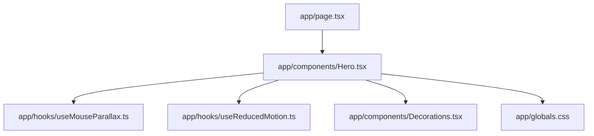
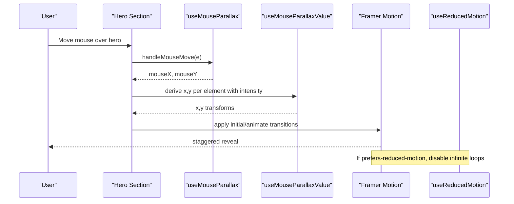
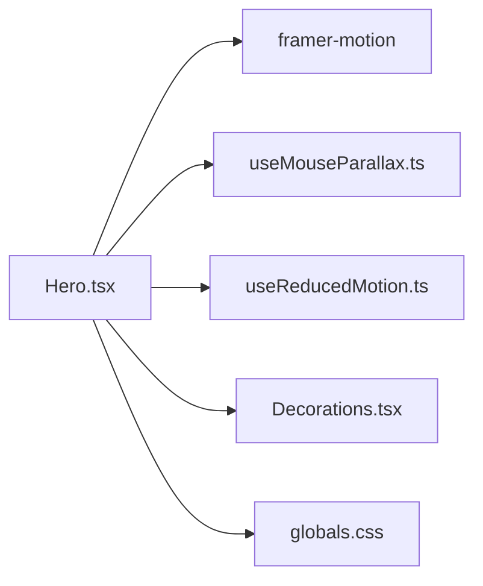

# Hero Component

<cite>
**Referenced Files in This Document**
- [Hero.tsx](file://app/components/Hero.tsx)
- [useMouseParallax.ts](file://app/hooks/useMouseParallax.ts)
- [useReducedMotion.ts](file://app/hooks/useReducedMotion.ts)
- [Decorations.tsx](file://app/components/Decorations.tsx)
- [globals.css](file://app/globals.css)
- [page.tsx](file://app/page.tsx)
</cite>

## Table of Contents
1. [Introduction](#introduction)
2. [Project Structure](#project-structure)
3. [Core Components](#core-components)
4. [Architecture Overview](#architecture-overview)
5. [Detailed Component Analysis](#detailed-component-analysis)
6. [Dependency Analysis](#dependency-analysis)
7. [Performance Considerations](#performance-considerations)
8. [Troubleshooting Guide](#troubleshooting-guide)
9. [Conclusion](#conclusion)
10. [Appendices](#appendices)

## Introduction
The Hero component is the main landing section of the portfolio website. It presents a visually rich, responsive layout with animated text reveals, parallax background effects, and accessible motion behavior. The implementation leverages custom hooks for mouse-driven parallax, Framer Motion for staggered content entrance, and CSS utilities for typography and color theming.

Key highlights:
- Animated text reveals with staggered timing for role tagline, headline, description, and CTAs.
- Mouse parallax on decorative elements and image frames to create depth.
- Responsive grid layout that reflows gracefully across breakpoints.
- Accessibility support via reduced motion preferences.

## Project Structure
The Hero component lives under app/components and integrates with:
- Custom hooks for parallax and reduced motion
- Shared decoration components for visual accents
- Global theme and utility styles
- The root page that composes site sections

**Diagram sources**
- [page.tsx:11-16](file://app/page.tsx#L11-L16)
- [Hero.tsx:3-8](file://app/components/Hero.tsx#L3-L8)
- [useMouseParallax.ts:1-66](file://app/hooks/useMouseParallax.ts#L1-L66)
- [useReducedMotion.ts:1-20](file://app/hooks/useReducedMotion.ts#L1-L20)
- [Decorations.tsx:1-190](file://app/components/Decorations.tsx#L1-L190)
- [globals.css:1-113](file://app/globals.css#L1-L113)

**Section sources**
- [page.tsx:11-16](file://app/page.tsx#L11-L16)
- [Hero.tsx:1-187](file://app/components/Hero.tsx#L1-L187)

## Core Components
- Hero: Renders the hero section with layered visuals, parallax, and staggered animations.
- useMouseParallax: Provides normalized mouse coordinates and spring-based parallax values for smooth movement.
- useMouseParallaxValue: Derives x/y transforms from shared mouse motion values with configurable intensity.
- useReducedMotion: Detects system preference for reduced motion and returns a boolean flag.
- Decorations: Reusable visual primitives (glow orbs, floating shapes, grids, brackets).
- globals.css: Theme tokens, gradient text utility, noise overlay, and reduced motion media query.

**Section sources**
- [Hero.tsx:10-187](file://app/components/Hero.tsx#L10-L187)
- [useMouseParallax.ts:6-66](file://app/hooks/useMouseParallax.ts#L6-L66)
- [useReducedMotion.ts:5-19](file://app/hooks/useReducedMotion.ts#L5-L19)
- [Decorations.tsx:7-190](file://app/components/Decorations.tsx#L7-L190)
- [globals.css:3-17](file://app/globals.css#L3-L17)
- [globals.css:53-59](file://app/globals.css#L53-L59)
- [globals.css:102-112](file://app/globals.css#L102-L112)

## Architecture Overview
The Hero orchestrates multiple layers:
- A full-viewport section with a dotted grid background.
- Blurred glow orbs and floating decorations driven by parallax values.
- A two-column layout on large screens: textual content on one side and an image frame on the other.
- Staggered Framer Motion animations for entrance effects.
- Reduced motion handling to disable continuous animations when requested by the user.

**Diagram sources**
- [Hero.tsx:11-33](file://app/components/Hero.tsx#L11-L33)
- [Hero.tsx:35-184](file://app/components/Hero.tsx#L35-L184)
- [useMouseParallax.ts:12-45](file://app/hooks/useMouseParallax.ts#L12-L45)
- [useMouseParallax.ts:47-65](file://app/hooks/useMouseParallax.ts#L47-L65)
- [useReducedMotion.ts:5-19](file://app/hooks/useReducedMotion.ts#L5-L19)

## Detailed Component Analysis

### Hero Component
Responsibilities:
- Mounts the hero section and attaches mouse listeners for parallax.
- Creates multiple parallax layers with different intensities for depth.
- Applies staggered entrance animations to text and image elements.
- Respects reduced motion preferences for continuous animations.

Visual appearance:
- Full-screen section with a subtle dot grid background.
- Two blurred glow orbs at different positions for ambient lighting.
- Floating decorative dots and crosshair SVGs visible on larger screens.
- Text block with role tagline, headline using gradient text, descriptive paragraph, and call-to-action links.
- Image frame with nested borders and accent blocks, plus corner brackets.
- Scroll indicator arrow with gentle vertical bounce animation.

Animation details:
- Staggered delays for role tagline, headline, description, and CTA group.
- Image container fades and scales in with a slightly longer duration.
- Arrow indicator animates vertically with infinite repeat unless reduced motion is enabled.

Accessibility:
- Uses aria-hidden on decorative elements.
- Reads system preference for reduced motion and disables infinite animations accordingly.

Responsive behavior:
- Grid switches from stacked on small screens to two columns on large screens.
- Decorative elements are hidden on smaller viewports to reduce clutter.
- Image sizing adapts via Tailwind classes and Next.js Image sizes prop.

Customization points:
- Parallax intensity per layer can be tuned via hook configuration.
- Colors and typography rely on global theme tokens and utilities.
- Content strings and links can be updated directly in the component.

Code snippet paths:
- Parallax setup and values: [Hero.tsx:11-33](file://app/components/Hero.tsx#L11-L33)
- Section and background layers: [Hero.tsx:35-71](file://app/components/Hero.tsx#L35-L71)
- Text content and staggered animations: [Hero.tsx:73-131](file://app/components/Hero.tsx#L73-L131)
- Image frame and decorations: [Hero.tsx:133-167](file://app/components/Hero.tsx#L133-L167)
- Scroll indicator with reduced motion: [Hero.tsx:171-184](file://app/components/Hero.tsx#L171-L184)

**Section sources**
- [Hero.tsx:10-187](file://app/components/Hero.tsx#L10-L187)

### Mouse Parallax Hook
Purpose:
- Tracks normalized mouse position within a bounding element.
- Converts mouse deltas into smooth spring-based x/y transforms.
- Resets values on mouse leave.

Configuration:
- intensity: Multiplier for transform distance (default 20).
- damping/stiffness: Spring physics parameters controlling responsiveness and settling (defaults provided).

Derived values:
- useMouseParallaxValue allows multiple elements to share the same mouse source while applying individual intensities.

Implementation notes:
- Uses Framer Motion’s useMotionValue, useTransform, and useSpring for GPU-accelerated updates.
- Normalizes coordinates relative to the element’s center to ensure symmetric parallax.

Code snippet paths:
- Hook definition and event handlers: [useMouseParallax.ts:12-45](file://app/hooks/useMouseParallax.ts#L12-L45)
- Derived value hook: [useMouseParallax.ts:47-65](file://app/hooks/useMouseParallax.ts#L47-L65)

**Section sources**
- [useMouseParallax.ts:1-66](file://app/hooks/useMouseParallax.ts#L1-L66)

### Reduced Motion Hook
Purpose:
- Detects user preference for reduced motion via matchMedia.
- Updates state dynamically when the preference changes.

Usage:
- Disables infinite or heavy animations in the Hero when true.

Code snippet paths:
- Preference detection and listener: [useReducedMotion.ts:5-19](file://app/hooks/useReducedMotion.ts#L5-L19)

**Section sources**
- [useReducedMotion.ts:1-20](file://app/hooks/useReducedMotion.ts#L1-L20)

### Decoration Components
Purpose:
- Provide reusable visual accents used across sections including the Hero.
- Apply parallax through shared mouse values and intensities.

Components:
- GlowOrb: Large blurred circles with configurable color and size.
- FloatingRing, FloatingDot, FloatingPlus: Small geometric accents with parallax.
- DottedGrid: Subtle dot pattern background.
- CornerBrackets: Framing lines around images/cards.
- DiagonalLine: Accent line for visual rhythm.

Code snippet paths:
- All decoration primitives: [Decorations.tsx:7-190](file://app/components/Decorations.tsx#L7-L190)

**Section sources**
- [Decorations.tsx:1-190](file://app/components/Decorations.tsx#L1-L190)

### Styling and Theme
- Color tokens and fonts are defined inline in the theme block.
- Gradient text utility applies multi-color gradients to text nodes.
- Noise overlay and cursor spotlight are available globally but not required by Hero.
- Reduced motion media query enforces minimal animation durations across the app.

Code snippet paths:
- Theme tokens: [globals.css:3-17](file://app/globals.css#L3-L17)
- Gradient text utility: [globals.css:53-59](file://app/globals.css#L53-L59)
- Reduced motion media query: [globals.css:102-112](file://app/globals.css#L102-L112)

**Section sources**
- [globals.css:1-113](file://app/globals.css#L1-L113)

## Dependency Analysis
The Hero depends on:
- Framer Motion for animations and motion values.
- Custom hooks for parallax and reduced motion.
- Decoration components for visual accents.
- Global styles for theme and utilities.

**Diagram sources**
- [Hero.tsx:3-8](file://app/components/Hero.tsx#L3-L8)
- [useMouseParallax.ts:1-66](file://app/hooks/useMouseParallax.ts#L1-L66)
- [useReducedMotion.ts:1-20](file://app/hooks/useReducedMotion.ts#L1-L20)
- [Decorations.tsx:1-190](file://app/components/Decorations.tsx#L1-L190)
- [globals.css:1-113](file://app/globals.css#L1-L113)

**Section sources**
- [Hero.tsx:1-187](file://app/components/Hero.tsx#L1-L187)

## Performance Considerations
- GPU-accelerated transforms: Parallax uses Framer Motion’s motion values and springs to minimize layout thrash.
- Staggered entrances: Short durations and delays keep perceived performance smooth without blocking.
- Conditional animations: Infinite animations are disabled when reduced motion is preferred.
- Image optimization: Next.js Image with priority and responsive sizes reduces load impact.
- Decorative visibility: Many decorative elements are hidden on small screens to reduce DOM and paint costs.

[No sources needed since this section provides general guidance]

## Troubleshooting Guide
Common issues and resolutions:
- Parallax not responding: Ensure the hero section has a ref and mouse listeners attached; verify the bounding box calculation inside the hook.
- Excessive jank on low-end devices: Reduce intensity values or disable heavy blur effects on smaller screens.
- Animations persist despite reduced motion: Confirm the reduced motion hook is used to gate infinite animations and that the global media query is active.
- Image clipping or aspect ratio issues: Adjust sizes prop and container dimensions to match the intended layout.

**Section sources**
- [Hero.tsx:11-33](file://app/components/Hero.tsx#L11-L33)
- [Hero.tsx:139-167](file://app/components/Hero.tsx#L139-L167)
- [useMouseParallax.ts:28-42](file://app/hooks/useMouseParallax.ts#L28-L42)
- [useReducedMotion.ts:5-19](file://app/hooks/useReducedMotion.ts#L5-L19)
- [globals.css:102-112](file://app/globals.css#L102-L112)

## Conclusion
The Hero component delivers a polished, accessible landing experience through coordinated parallax, staggered animations, and responsive design. Its modular architecture—custom hooks, shared decorations, and global styles—makes it straightforward to customize content, adjust motion intensity, and maintain consistent theming across the site.

[No sources needed since this section summarizes without analyzing specific files]

## Appendices

### Props and Configuration Summary
- Hero does not accept external props; customization occurs via:
  - Inline content edits (text, links, image source).
  - Hook configuration for parallax intensity and spring settings.
  - Global theme tokens and utilities for colors and typography.

**Section sources**
- [Hero.tsx:10-187](file://app/components/Hero.tsx#L10-L187)
- [useMouseParallax.ts:6-13](file://app/hooks/useMouseParallax.ts#L6-L13)
- [globals.css:3-17](file://app/globals.css#L3-L17)

### Animation Timing Parameters
- Staggered entrance delays for role tagline, headline, description, and CTAs.
- Image container fade/scale transition with a slightly longer duration.
- Scroll indicator infinite vertical animation gated by reduced motion.

**Section sources**
- [Hero.tsx:79-115](file://app/components/Hero.tsx#L79-L115)
- [Hero.tsx:133-137](file://app/components/Hero.tsx#L133-L137)
- [Hero.tsx:171-184](file://app/components/Hero.tsx#L171-L184)

### Customization Examples (by reference)
- Modify hero content: Update text and links within the text block and CTA area.
  - Path: [Hero.tsx:79-131](file://app/components/Hero.tsx#L79-L131)
- Adjust parallax intensity: Change intensity in hook calls for each layer.
  - Paths: [Hero.tsx:11-33](file://app/components/Hero.tsx#L11-L33), [useMouseParallax.ts:6-13](file://app/hooks/useMouseParallax.ts#L6-L13)
- Integrate with other components: Use decoration components for additional accents.
  - Path: [Decorations.tsx:7-190](file://app/components/Decorations.tsx#L7-L190)

### Mobile Responsiveness Patterns
- Grid switches to single column on small screens; decorative elements hidden below lg breakpoint.
- Image sizing adapts via responsive Tailwind classes and Next.js Image sizes.
- Reduced motion media query ensures smoother experiences on constrained devices.

**Section sources**
- [Hero.tsx:35-167](file://app/components/Hero.tsx#L35-L167)
- [globals.css:102-112](file://app/globals.css#L102-L112)