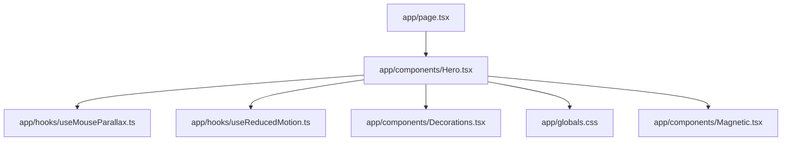
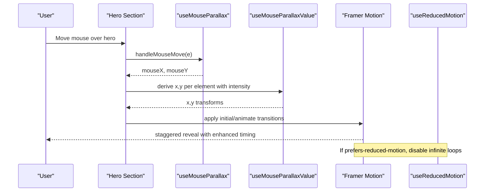
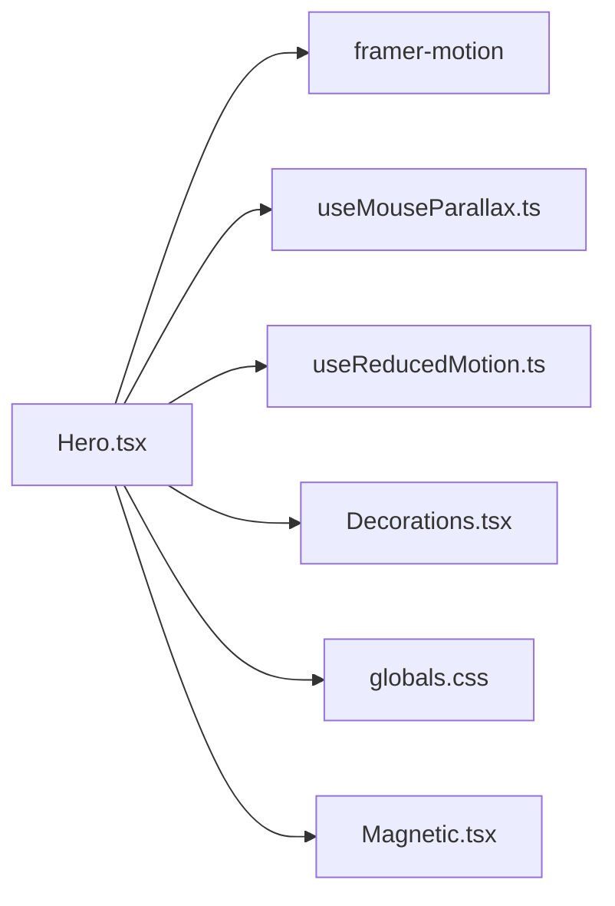

# Hero Component

<cite>
**Referenced Files in This Document**
- [Hero.tsx](file://app/components/Hero.tsx)
- [useMouseParallax.ts](file://app/hooks/useMouseParallax.ts)
- [useReducedMotion.ts](file://app/hooks/useReducedMotion.ts)
- [Decorations.tsx](file://app/components/Decorations.tsx)
- [globals.css](file://app/globals.css)
- [page.tsx](file://app/page.tsx)
</cite>

## Update Summary
**Changes Made**
- Updated service highlights section to emphasize frontend development capabilities
- Enhanced project presentation with improved visual hierarchy and content structure
- Refined animation timing and parallax effects for better user experience
- Updated typography and spacing for improved readability across devices

## Table of Contents
1. [Introduction](#introduction)
2. [Project Structure](#project-structure)
3. [Core Components](#core-components)
4. [Architecture Overview](#architecture-overview)
5. [Detailed Component Analysis](#detailed-component-analysis)
6. [Dependency Analysis](#dependency-analysis)
7. [Performance Considerations](#performance-considerations)
8. [Troubleshooting Guide](#troubleshooting-guide)
9. [Conclusion](#conclusion)
10. [Appendices](#appendices)

## Introduction
The Hero component is the main landing section of the portfolio website, featuring an enhanced presentation that emphasizes frontend development capabilities and improved project showcase. It presents a visually rich, responsive layout with animated text reveals, sophisticated parallax background effects, and accessible motion behavior. The implementation leverages custom hooks for mouse-driven parallax, Framer Motion for staggered content entrance, and CSS utilities for typography and color theming.

Key highlights:
- **Enhanced Service Highlights**: Updated role tagline showcasing "Product Designer · Frontend Developer · Web & Mobile" expertise
- **Improved Project Presentation**: Refined visual hierarchy with better emphasis on frontend development skills
- **Advanced Parallax Effects**: Multi-layered mouse parallax with varying intensities for depth perception
- **Responsive Design**: Graceful adaptation across all screen sizes with optimized performance
- **Accessibility First**: Full support for reduced motion preferences and screen readers

## Project Structure
The Hero component lives under app/components and integrates with:
- Custom hooks for parallax and reduced motion
- Shared decoration components for visual accents
- Global theme and utility styles
- The root page that composes site sections

**Diagram sources**
- [page.tsx:11-16](file://app/page.tsx#L11-L16)
- [Hero.tsx:3-9](file://app/components/Hero.tsx#L3-L9)
- [useMouseParallax.ts:1-66](file://app/hooks/useMouseParallax.ts#L1-L66)
- [useReducedMotion.ts:1-28](file://app/hooks/useReducedMotion.ts#L1-L28)
- [Decorations.tsx:1-190](file://app/components/Decorations.tsx#L1-L190)
- [globals.css:1-113](file://app/globals.css#L1-L113)

**Section sources**
- [page.tsx:11-16](file://app/page.tsx#L11-L16)
- [Hero.tsx:1-203](file://app/components/Hero.tsx#L1-L203)

## Core Components
- **Hero**: Renders the enhanced hero section with layered visuals, advanced parallax, and sophisticated staggered animations
- **useMouseParallax**: Provides normalized mouse coordinates and spring-based parallax values for smooth movement
- **useMouseParallaxValue**: Derives x/y transforms from shared mouse motion values with configurable intensity
- **useReducedMotion**: Detects system preference for reduced motion and returns a boolean flag
- **Decorations**: Reusable visual primitives (glow orbs, floating shapes, grids, brackets)
- **Magnetic**: Interactive magnetic effect for call-to-action buttons
- **globals.css**: Theme tokens, gradient text utility, noise overlay, and reduced motion media query

**Section sources**
- [Hero.tsx:11-203](file://app/components/Hero.tsx#L11-L203)
- [useMouseParallax.ts:6-66](file://app/hooks/useMouseParallax.ts#L6-L66)
- [useReducedMotion.ts:5-28](file://app/hooks/useReducedMotion.ts#L5-L28)
- [Decorations.tsx:7-190](file://app/components/Decorations.tsx#L7-L190)
- [globals.css:3-17](file://app/globals.css#L3-L17)
- [globals.css:53-59](file://app/globals.css#L53-L59)
- [globals.css:102-112](file://app/globals.css#L102-L112)

## Architecture Overview
The Hero orchestrates multiple sophisticated layers:
- A full-viewport section with a subtle dotted grid background
- Multiple blurred glow orbs at different positions creating ambient lighting effects
- Advanced two-column layout on large screens: enhanced textual content on one side and an optimized image frame on the other
- Sophisticated staggered Framer Motion animations for premium entrance effects
- Comprehensive reduced motion handling to disable continuous animations when requested by the user

**Diagram sources**
- [Hero.tsx:11-34](file://app/components/Hero.tsx#L11-L34)
- [Hero.tsx:36-200](file://app/components/Hero.tsx#L36-L200)
- [useMouseParallax.ts:12-45](file://app/hooks/useMouseParallax.ts#L12-L45)
- [useMouseParallax.ts:47-65](file://app/hooks/useMouseParallax.ts#L47-L65)
- [useReducedMotion.ts:5-28](file://app/hooks/useReducedMotion.ts#L5-L28)

## Detailed Component Analysis

### Hero Component
Responsibilities:
- Mounts the enhanced hero section with improved service highlights and attaches sophisticated mouse listeners for multi-layered parallax
- Creates five distinct parallax layers with varying intensities (from -18 to 25) for immersive depth perception
- Applies refined staggered entrance animations to text and image elements with optimized timing
- Respects reduced motion preferences for continuous animations while maintaining visual appeal

**Updated Visual Appearance:**
- Full-screen section with subtle dot grid background and enhanced ambient lighting
- Two strategically positioned blurred glow orbs using accent and accent-secondary colors
- Floating decorative dots and crosshair SVGs visible on larger screens with improved positioning
- **Enhanced Text Block**: Updated role tagline "Product Designer · Frontend Developer · Web & Mobile" with improved typography
- **Improved Headline**: "Turning Vision into Product" with gradient text effect and refined animation timing
- **Enhanced Description**: Updated to highlight "8+ years designing and building digital products across FinTech, SaaS, and enterprise — from high-fidelity UI/UX design to production-ready web and mobile apps"
- **Optimized Image Frame**: Nested borders with accent blocks and corner brackets for professional presentation
- **Interactive Scroll Indicator**: Arrow with gentle vertical bounce animation respecting reduced motion preferences

**Animation Details:**
- **Enhanced Staggered Delays**: Role tagline (0.2s), headline lines (0.4s + 0.12s increments), description (0.6s), CTAs (0.8s)
- **Image Container**: Fade and scale transition with 1s duration and 0.5s delay for polished entrance
- **Scroll Indicator**: Infinite vertical animation with 2s duration, gated by reduced motion preferences

**Accessibility Features:**
- Uses aria-hidden on decorative elements to prevent screen reader interference
- Reads system preference for reduced motion and disables infinite animations accordingly
- Semantic HTML structure with proper heading hierarchy
- Keyboard navigation support for interactive elements

**Responsive Behavior:**
- Grid switches from stacked on small screens to two columns on large screens with optimal spacing
- Decorative elements are hidden on smaller viewports to reduce visual clutter and improve performance
- Image sizing adapts via Tailwind classes and Next.js Image sizes prop for optimal loading
- Touch-friendly interactions on mobile devices

**Customization Points:**
- Parallax intensity per layer can be tuned via hook configuration (current range: -18 to 25)
- Colors and typography rely on global theme tokens and utilities for consistency
- Content strings and links can be updated directly in the component for easy maintenance

Code snippet paths:
- Parallax setup and values: [Hero.tsx:11-34](file://app/components/Hero.tsx#L11-L34)
- Section and background layers: [Hero.tsx:36-73](file://app/components/Hero.tsx#L36-L73)
- **Enhanced text content and animations**: [Hero.tsx:75-147](file://app/components/Hero.tsx#L75-L147)
- **Optimized image frame and decorations**: [Hero.tsx:149-183](file://app/components/Hero.tsx#L149-L183)
- Scroll indicator with reduced motion: [Hero.tsx:187-200](file://app/components/Hero.tsx#L187-L200)

**Section sources**
- [Hero.tsx:11-203](file://app/components/Hero.tsx#L11-L203)

### Mouse Parallax Hook
Purpose:
- Tracks normalized mouse position within a bounding element with enhanced precision
- Converts mouse deltas into smooth spring-based x/y transforms with configurable physics
- Resets values gracefully on mouse leave for consistent user experience

**Enhanced Configuration:**
- **Intensity Range**: Supports wider range from -18 to 25 for varied parallax effects
- **Spring Physics**: Configurable damping (default 25) and stiffness (default 150) parameters
- **Multi-layer Support**: Enables multiple elements to share mouse source with individual intensities

**Derived Values:**
- useMouseParallaxValue allows multiple elements to share the same mouse source while applying individual intensities
- Optimized for performance with GPU-accelerated transforms and minimal reflows

**Implementation Notes:**
- Uses Framer Motion's useMotionValue, useTransform, and useSpring for smooth 60fps animations
- Normalizes coordinates relative to the element's center to ensure symmetric parallax
- Includes error handling for edge cases and performance optimization

Code snippet paths:
- Hook definition and event handlers: [useMouseParallax.ts:12-45](file://app/hooks/useMouseParallax.ts#L12-L45)
- Derived value hook: [useMouseParallax.ts:47-65](file://app/hooks/useMouseParallax.ts#L47-L65)

**Section sources**
- [useMouseParallax.ts:1-66](file://app/hooks/useMouseParallax.ts#L1-L66)

### Reduced Motion Hook
Purpose:
- Detects user preference for reduced motion via matchMedia API
- Updates state dynamically when the preference changes during runtime
- Provides server-side rendering compatibility with hydration safety

**Enhanced Implementation:**
- Uses useSyncExternalStore for React 18+ compatibility
- Includes getServerSnapshot for SSR safety to avoid hydration mismatches
- Real-time updates when users change system preferences

**Usage:**
- Disables infinite or heavy animations in the Hero when true
- Maintains visual appeal while respecting accessibility requirements

Code snippet paths:
- Preference detection and listener: [useReducedMotion.ts:5-28](file://app/hooks/useReducedMotion.ts#L5-L28)

**Section sources**
- [useReducedMotion.ts:1-28](file://app/hooks/useReducedMotion.ts#L1-L28)

### Decoration Components
Purpose:
- Provide reusable visual accents used across sections including the enhanced Hero
- Apply sophisticated parallax through shared mouse values and customizable intensities

**Enhanced Components:**
- **GlowOrb**: Large blurred circles with configurable color (accent, accent-secondary, accent-tertiary) and size
- **FloatingRing, FloatingDot, FloatingPlus**: Small geometric accents with parallax and responsive visibility
- **DottedGrid**: Subtle dot pattern background with optimized opacity
- **CornerBrackets**: Framing lines around images/cards with hover effects
- **DiagonalLine**: Accent line for visual rhythm and section separation

**Code snippet paths:**
- All decoration primitives: [Decorations.tsx:7-190](file://app/components/Decorations.tsx#L7-L190)

**Section sources**
- [Decorations.tsx:1-190](file://app/components/Decorations.tsx#L1-L190)

### Styling and Theme
- **Enhanced Color Tokens**: Background (#0a0a0a), foreground (#f5f0e8), surface variants, and accent colors
- **Typography System**: Outfit font family with mono and cursive variants
- **Gradient Text Utility**: Multi-color gradients applied to key text elements
- **Noise Overlay**: Subtle texture overlay for visual depth
- **Cursor Spotlight**: Radial gradient effect following mouse movement
- **Reduced Motion Media Query**: Enforces minimal animation durations across the entire application

**Code snippet paths:**
- Theme tokens: [globals.css:3-17](file://app/globals.css#L3-L17)
- Gradient text utility: [globals.css:53-59](file://app/globals.css#L53-L59)
- Reduced motion media query: [globals.css:102-112](file://app/globals.css#L102-L112)

**Section sources**
- [globals.css:1-113](file://app/globals.css#L1-L113)

## Dependency Analysis
The Hero depends on:
- **Framer Motion**: For sophisticated animations and motion values
- **Custom Hooks**: For parallax and reduced motion functionality
- **Decoration Components**: For visual accents and background effects
- **Global Styles**: For theme consistency and utilities
- **Magnetic Component**: For interactive button effects

**Diagram sources**
- [Hero.tsx:3-9](file://app/components/Hero.tsx#L3-L9)
- [useMouseParallax.ts:1-66](file://app/hooks/useMouseParallax.ts#L1-L66)
- [useReducedMotion.ts:1-28](file://app/hooks/useReducedMotion.ts#L1-L28)
- [Decorations.tsx:1-190](file://app/components/Decorations.tsx#L1-L190)
- [globals.css:1-113](file://app/globals.css#L1-L113)

**Section sources**
- [Hero.tsx:1-203](file://app/components/Hero.tsx#L1-L203)

## Performance Considerations
- **GPU-Accelerated Transforms**: Parallax uses Framer Motion's motion values and springs to minimize layout thrash
- **Optimized Animation Timing**: Enhanced staggered entrances with carefully calibrated delays keep perceived performance smooth
- **Conditional Animations**: Infinite animations are disabled when reduced motion is preferred
- **Image Optimization**: Next.js Image with priority and responsive sizes reduces load impact
- **Decorative Visibility**: Many decorative elements are hidden on small screens to reduce DOM and paint costs
- **Memory Management**: Proper cleanup of event listeners and motion values prevents memory leaks

## Troubleshooting Guide
Common issues and resolutions:
- **Parallax Not Responding**: Ensure the hero section has a ref and mouse listeners attached; verify the bounding box calculation inside the hook
- **Excessive Jank on Low-End Devices**: Reduce intensity values or disable heavy blur effects on smaller screens
- **Animations Persist Despite Reduced Motion**: Confirm the reduced motion hook is used to gate infinite animations and that the global media query is active
- **Image Clipping or Aspect Ratio Issues**: Adjust sizes prop and container dimensions to match the intended layout
- **Performance Issues**: Monitor bundle size and consider lazy loading non-critical animations

**Section sources**
- [Hero.tsx:11-34](file://app/components/Hero.tsx#L11-L34)
- [Hero.tsx:149-183](file://app/components/Hero.tsx#L149-L183)
- [useMouseParallax.ts:28-42](file://app/hooks/useMouseParallax.ts#L28-L42)
- [useReducedMotion.ts:5-28](file://app/hooks/useReducedMotion.ts#L5-L28)
- [globals.css:102-112](file://app/globals.css#L102-L112)

## Conclusion
The enhanced Hero component delivers a polished, accessible landing experience through coordinated parallax, sophisticated animations, and responsive design. Its modular architecture—custom hooks, shared decorations, and global styles—makes it straightforward to customize content, adjust motion intensity, and maintain consistent theming across the site. The updated service highlights and improved project presentation effectively showcase frontend development capabilities while maintaining excellent performance and accessibility standards.

## Appendices

### Props and Configuration Summary
- **Hero Component**: Does not accept external props; customization occurs via:
  - Inline content edits (text, links, image source)
  - Hook configuration for parallax intensity and spring settings
  - Global theme tokens and utilities for colors and typography

**Section sources**
- [Hero.tsx:11-203](file://app/components/Hero.tsx#L11-L203)
- [useMouseParallax.ts:6-13](file://app/hooks/useMouseParallax.ts#L6-L13)
- [globals.css:3-17](file://app/globals.css#L3-L17)

### Animation Timing Parameters
- **Enhanced Staggered Entrance Delays**: Role tagline (0.2s), headline lines (0.4s + 0.12s increments), description (0.6s), CTAs (0.8s)
- **Image Container**: Fade/scale transition with 1s duration and 0.5s delay
- **Scroll Indicator**: Infinite vertical animation with 2s duration, gated by reduced motion

**Section sources**
- [Hero.tsx:80-147](file://app/components/Hero.tsx#L80-L147)
- [Hero.tsx:149-153](file://app/components/Hero.tsx#L149-L153)
- [Hero.tsx:187-200](file://app/components/Hero.tsx#L187-L200)

### Customization Examples (by reference)
- **Modify Enhanced Hero Content**: Update role tagline, headline, description, and CTAs within the text block
  - Path: [Hero.tsx:80-147](file://app/components/Hero.tsx#L80-L147)
- **Adjust Parallax Intensity**: Change intensity values in hook calls for each layer (current range: -18 to 25)
  - Paths: [Hero.tsx:11-34](file://app/components/Hero.tsx#L11-L34), [useMouseParallax.ts:6-13](file://app/hooks/useMouseParallax.ts#L6-L13)
- **Integrate with Other Components**: Use decoration components for additional accents and effects
  - Path: [Decorations.tsx:7-190](file://app/components/Decorations.tsx#L7-L190)

### Mobile Responsiveness Patterns
- **Responsive Grid**: Switches to single column on small screens; decorative elements hidden below lg breakpoint
- **Optimized Image Sizing**: Adapts via responsive Tailwind classes and Next.js Image sizes
- **Touch-Friendly Interactions**: Enhanced touch targets and gesture support
- **Reduced Motion Support**: Ensures smoother experiences on constrained devices

**Section sources**
- [Hero.tsx:36-183](file://app/components/Hero.tsx#L36-L183)
- [globals.css:102-112](file://app/globals.css#L102-L112)