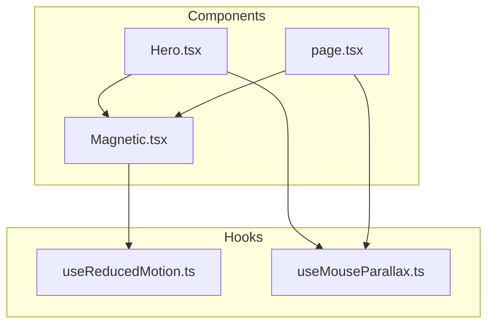
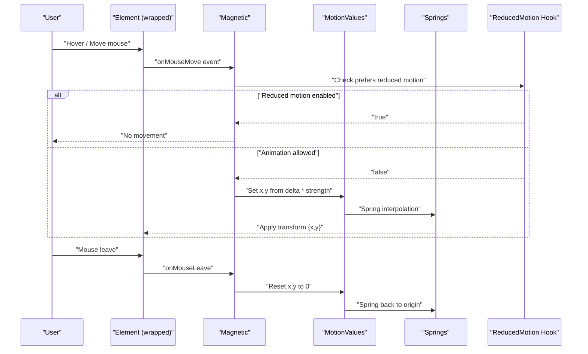
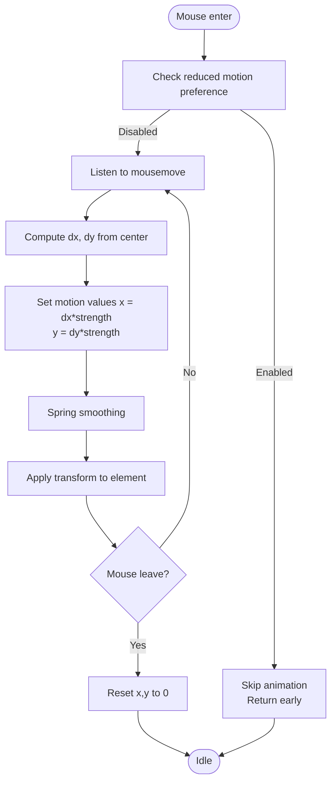
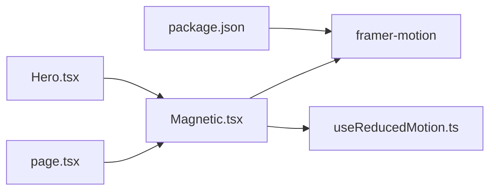

# Magnetic Interaction Component

<cite>
**Referenced Files in This Document**
- [Magnetic.tsx](file://app/components/Magnetic.tsx)
- [useReducedMotion.ts](file://app/hooks/useReducedMotion.ts)
- [Hero.tsx](file://app/components/Hero.tsx)
- [page.tsx](file://app/page.tsx)
- [useMouseParallax.ts](file://app/hooks/useMouseParallax.ts)
- [package.json](file://package.json)
</cite>

## Table of Contents
1. [Introduction](#introduction)
2. [Project Structure](#project-structure)
3. [Core Components](#core-components)
4. [Architecture Overview](#architecture-overview)
5. [Detailed Component Analysis](#detailed-component-analysis)
6. [Dependency Analysis](#dependency-analysis)
7. [Performance Considerations](#performance-considerations)
8. [Troubleshooting Guide](#troubleshooting-guide)
9. [Conclusion](#conclusion)

## Introduction
This document explains the Magnetic Interaction Component used across the portfolio site. The component wraps interactive elements (like buttons and links) to create a subtle magnetic pull toward the cursor on hover, with smooth spring-based return animations. It integrates accessibility by respecting user preferences for reduced motion and is built on Framer Motion for performant, GPU-accelerated animations.

## Project Structure
The Magnetic component lives under app/components and is consumed by page-level components such as Hero and Contact sections. It depends on a custom hook that detects reduced-motion preferences and uses Framer Motion primitives for motion values and springs.

**Diagram sources**
- [Magnetic.tsx:1-57](file://app/components/Magnetic.tsx#L1-L57)
- [Hero.tsx:1-203](file://app/components/Hero.tsx#L1-L203)
- [page.tsx:1-637](file://app/page.tsx#L1-L637)
- [useReducedMotion.ts:1-28](file://app/hooks/useReducedMotion.ts#L1-L28)
- [useMouseParallax.ts:1-66](file://app/hooks/useMouseParallax.ts#L1-L66)

**Section sources**
- [Magnetic.tsx:1-57](file://app/components/Magnetic.tsx#L1-L57)
- [Hero.tsx:1-203](file://app/components/Hero.tsx#L1-L203)
- [page.tsx:1-637](file://app/page.tsx#L1-L637)
- [useReducedMotion.ts:1-28](file://app/hooks/useReducedMotion.ts#L1-L28)
- [useMouseParallax.ts:1-66](file://app/hooks/useMouseParallax.ts#L1-L66)

## Core Components
- Magnetic component: A client-side wrapper that applies mouse-driven translation with spring physics and respects reduced-motion settings.
- useReducedMotion hook: Detects system preference for reduced motion using matchMedia and provides a stable boolean value during SSR/hydration.
- Integration points: Used in Hero and Contact sections to enhance call-to-action buttons and links.

Key responsibilities:
- Track mouse position relative to the wrapped element’s center.
- Compute displacement based on configurable strength.
- Apply smooth transitions via Framer Motion springs.
- Reset to origin on mouse leave.
- Honor reduced-motion preference by disabling animation when requested.

**Section sources**
- [Magnetic.tsx:7-56](file://app/components/Magnetic.tsx#L7-L56)
- [useReducedMotion.ts:5-27](file://app/hooks/useReducedMotion.ts#L5-L27)
- [Hero.tsx:131-139](file://app/components/Hero.tsx#L131-L139)
- [page.tsx:589-598](file://app/page.tsx#L589-L598)

## Architecture Overview
The Magnetic component composes Framer Motion primitives to achieve a natural-feeling interaction:
- Motion values track raw x/y offsets.
- Springs smooth these values into animated transforms.
- Event handlers update motion values based on mouse position.
- Reduced-motion detection short-circuits updates to ensure accessibility.

**Diagram sources**
- [Magnetic.tsx:23-54](file://app/components/Magnetic.tsx#L23-L54)
- [useReducedMotion.ts:5-27](file://app/hooks/useReducedMotion.ts#L5-L27)

## Detailed Component Analysis

### Magnetic Component
- Purpose: Wrap any interactive element to add a magnetic hover effect with spring physics.
- Props:
  - children: Any React node to wrap.
  - strength: Controls how strongly the element follows the cursor (default moderate).
  - className: Optional styling class applied to the wrapper.
- Behavior:
  - On mouse move, calculates distance from element center and sets motion values scaled by strength.
  - On mouse leave, resets motion values to zero so the element returns to its original position.
  - Uses Framer Motion springs for smooth easing and natural deceleration.
  - Respects reduced-motion preference to disable movement entirely.

**Diagram sources**
- [Magnetic.tsx:23-54](file://app/components/Magnetic.tsx#L23-L54)

**Section sources**
- [Magnetic.tsx:7-56](file://app/components/Magnetic.tsx#L7-L56)

### useReducedMotion Hook
- Purpose: Provide a reliable boolean indicating whether the user prefers reduced motion.
- Implementation highlights:
  - Uses matchMedia with a media query for reduced motion.
  - Subscribes to changes and updates React state accordingly.
  - Provides a server snapshot to avoid hydration mismatches.

**Section sources**
- [useReducedMotion.ts:5-27](file://app/hooks/useReducedMotion.ts#L5-L27)

### Usage in Hero Section
- Demonstrates wrapping primary CTAs with Magnetic to enhance interactivity.
- Combines with parallax effects for layered motion.

**Section sources**
- [Hero.tsx:131-139](file://app/components/Hero.tsx#L131-L139)

### Usage in Contact Section
- Shows another CTA wrapped with Magnetic, illustrating consistent interaction patterns across the site.

**Section sources**
- [page.tsx:589-598](file://app/page.tsx#L589-L598)

## Dependency Analysis
- External dependencies:
  - Framer Motion: Provides motion primitives (motion.div, useMotionValue, useSpring) used for high-performance animations.
  - React: Hooks and JSX runtime.
- Internal dependencies:
  - useReducedMotion: Ensures accessibility by honoring user preferences.
- Coupling:
  - Magnetic is loosely coupled; it only requires a DOM ref and event listeners.
  - Integrates cleanly with other motion systems (e.g., parallax hooks) without conflicts.

**Diagram sources**
- [package.json:11-19](file://package.json#L11-L19)
- [Magnetic.tsx:3-5](file://app/components/Magnetic.tsx#L3-L5)
- [Hero.tsx:9](file://app/components/Hero.tsx#L9)
- [page.tsx:18](file://app/page.tsx#L18)

**Section sources**
- [package.json:11-19](file://package.json#L11-L19)
- [Magnetic.tsx:3-5](file://app/components/Magnetic.tsx#L3-L5)

## Performance Considerations
- Use of motion values and springs avoids layout thrashing and leverages compositor threads for smooth animations.
- Strength parameter allows tuning performance vs. visual impact; lower strength reduces movement magnitude and can feel lighter.
- Reduced-motion support prevents unnecessary work for users who prefer minimal motion.
- Event handling is lightweight; calculations are simple arithmetic per frame.

[No sources needed since this section provides general guidance]

## Troubleshooting Guide
- Element not moving:
  - Ensure the component is rendered in a client context (marked as a client component).
  - Verify that the parent container does not have pointer-events disabled or overflow clipping that hides movement.
- Animation feels too strong or weak:
  - Adjust the strength prop to scale movement intensity.
- Reduced motion not respected:
  - Confirm the reduced-motion hook is imported and checked before updating motion values.
- Hydration mismatch warnings:
  - The reduced-motion hook handles server snapshots to prevent mismatches; ensure no other code branches differently between server and client.

**Section sources**
- [Magnetic.tsx:23-43](file://app/components/Magnetic.tsx#L23-L43)
- [useReducedMotion.ts:17-27](file://app/hooks/useReducedMotion.ts#L17-L27)

## Conclusion
The Magnetic Interaction Component delivers an accessible, performant, and easily customizable hover effect that enhances user engagement. By leveraging Framer Motion and respecting reduced-motion preferences, it fits seamlessly into modern React applications while maintaining high standards for performance and inclusivity.

[No sources needed since this section summarizes without analyzing specific files]