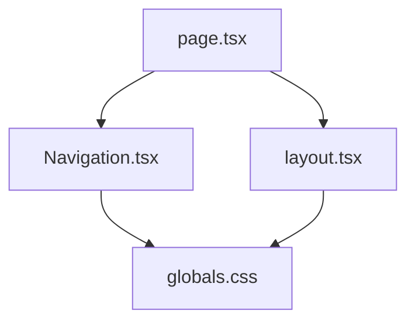
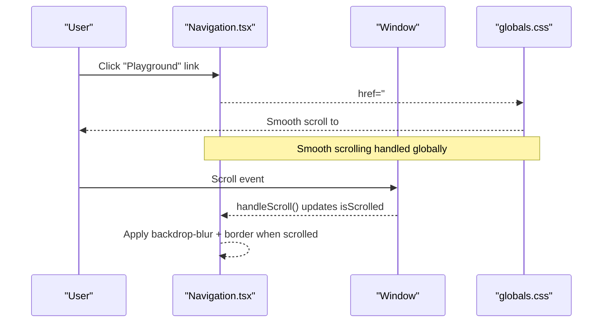
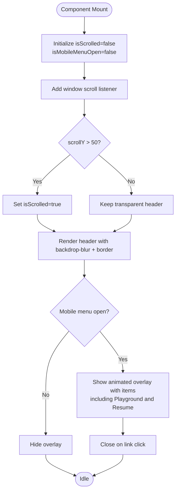
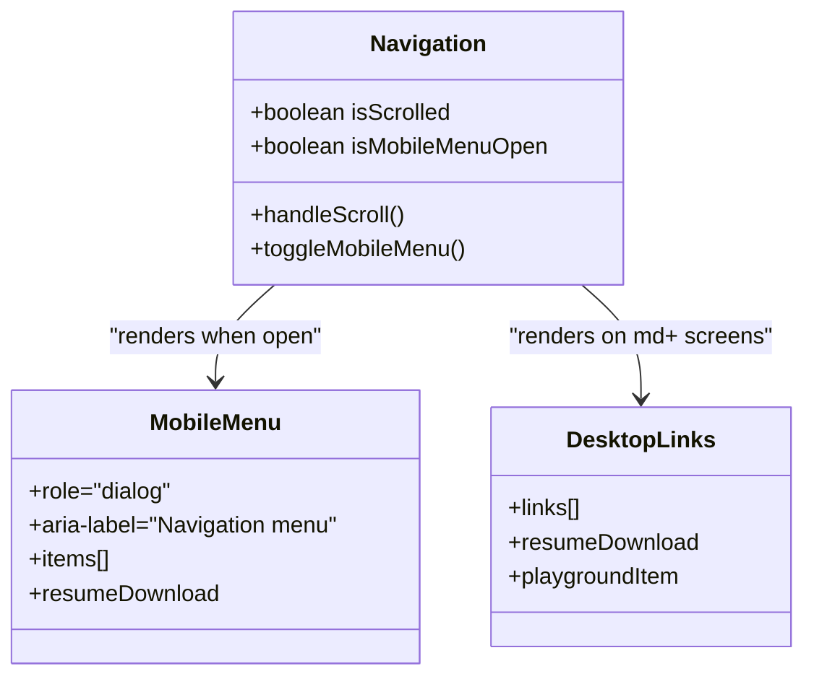
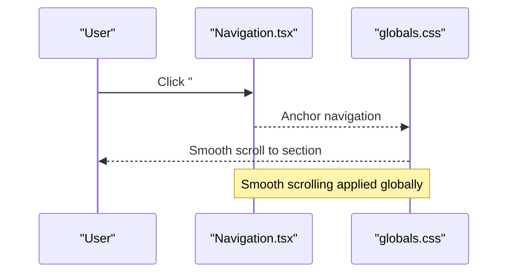
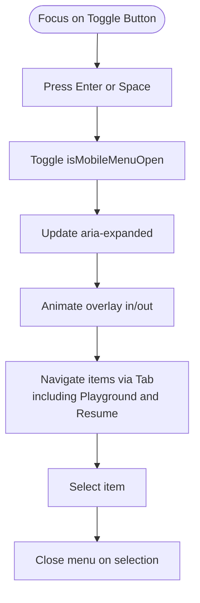
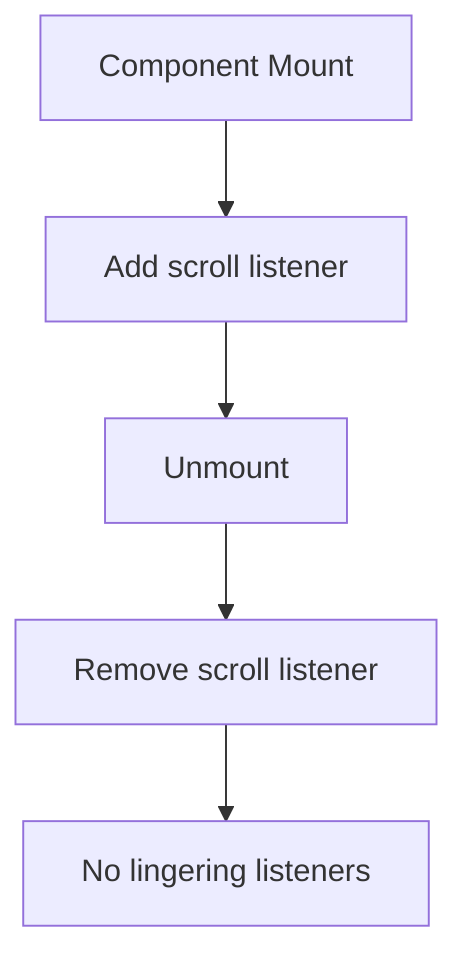
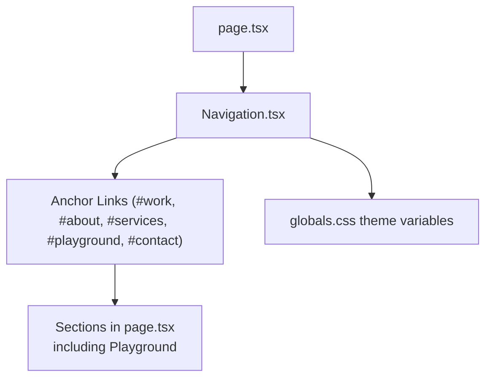
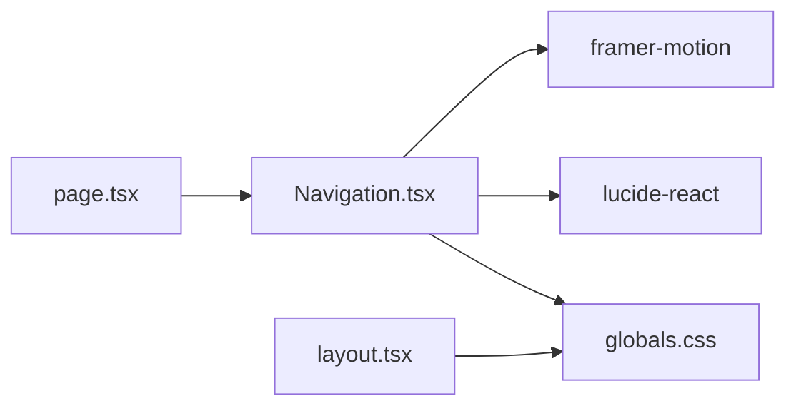

# Navigation Component

<cite>
**Referenced Files in This Document**
- [Navigation.tsx](file://app/components/Navigation.tsx)
- [globals.css](file://app/globals.css)
- [layout.tsx](file://app/layout.tsx)
- [page.tsx](file://app/page.tsx)
</cite>

## Update Summary
**Changes Made**
- Updated navigation items to include new "Playground" section
- Enhanced mobile menu with dedicated resume download functionality
- Improved responsive design patterns for better component integration
- Updated scroll-aware styling and smooth scrolling behavior
- Enhanced accessibility features for improved user experience

## Table of Contents
1. [Introduction](#introduction)
2. [Project Structure](#project-structure)
3. [Core Components](#core-components)
4. [Architecture Overview](#architecture-overview)
5. [Detailed Component Analysis](#detailed-component-analysis)
6. [Dependency Analysis](#dependency-analysis)
7. [Performance Considerations](#performance-considerations)
8. [Troubleshooting Guide](#troubleshooting-guide)
9. [Conclusion](#conclusion)
10. [Appendices](#appendices)

## Introduction
This document provides comprehensive documentation for the site-wide Navigation component. It covers responsive design patterns (desktop navigation and mobile menu), scroll-aware styling, smooth scrolling behavior, keyboard navigation support, accessibility features, performance optimizations, customization options, integration with routing and state management, and styling customization.

## Project Structure
The Navigation component is a client-side React component rendered at the root of the application page. It uses Tailwind CSS for styling, Framer Motion for animations, and Next.js Link for navigation. The global styles define smooth scrolling and theme variables used by the component.

**Diagram sources**
- [page.tsx:11-15](file://app/page.tsx#L11-L15)
- [Navigation.tsx:1-10](file://app/components/Navigation.tsx#L1-L10)
- [globals.css:1-21](file://app/globals.css#L1-L21)
- [layout.tsx:1-4](file://app/layout.tsx#L1-L4)

**Section sources**
- [page.tsx:11-15](file://app/page.tsx#L11-L15)
- [Navigation.tsx:1-10](file://app/components/Navigation.tsx#L1-L10)
- [globals.css:1-21](file://app/globals.css#L1-L21)
- [layout.tsx:1-4](file://app/layout.tsx#L1-L4)

## Core Components
- Navigation component: Provides fixed top navigation bar with desktop links and a mobile menu overlay. Implements scroll-aware background and blur effects, accessible toggle button, and animated mobile menu with enhanced resume download functionality.
- Global styles: Define smooth scrolling, color tokens, and reduced motion preferences.
- Root layout: Applies fonts and base classes to the document.
- Page composition: Renders Navigation alongside other sections that serve as scroll targets including the new Playground section.

Key responsibilities:
- Responsive layout switching between desktop and mobile menus
- Scroll detection to update visual style
- Accessible mobile menu toggle with ARIA attributes
- Smooth scrolling via CSS
- Animated transitions for menu open/close
- Enhanced navigation pattern support for new content sections

**Section sources**
- [Navigation.tsx:17-133](file://app/components/Navigation.tsx#L17-L133)
- [globals.css:19-21](file://app/globals.css#L19-L21)
- [globals.css:102-112](file://app/globals.css#L102-L112)
- [layout.tsx:91-106](file://app/layout.tsx#L91-L106)
- [page.tsx:605-637](file://app/page.tsx#L605-L637)

## Architecture Overview
The Navigation component is mounted once per page render and manages its own local state for scroll position and mobile menu visibility. It renders:
- A fixed header with logo and desktop links including the new Playground section
- A mobile menu overlay controlled by a toggle button with enhanced resume download
- Animations using Framer Motion for entrance and exit states

**Diagram sources**
- [Navigation.tsx:21-27](file://app/components/Navigation.tsx#L21-L27)
- [Navigation.tsx:31-40](file://app/components/Navigation.tsx#L31-L40)
- [Navigation.tsx:50-69](file://app/components/Navigation.tsx#L50-L69)
- [globals.css:19-21](file://app/globals.css#L19-L21)

## Detailed Component Analysis

### Navigation Component Behavior
- State management:
  - isScrolled: toggled on window scroll events to change header appearance
  - isMobileMenuOpen: toggles mobile menu visibility
- Scroll-aware styling:
  - When scrolled, the header gains a semi-transparent background and backdrop blur, plus a bottom border
  - Otherwise, it remains transparent
- Mobile menu:
  - Full-screen overlay with accessible dialog role and ARIA attributes
  - Staggered animation for each menu item including the new Playground link
  - Dedicated resume download button with enhanced styling
  - Closes on link click
- Desktop menu:
  - Horizontal list of links with hover color transitions including Playground
  - Resume download link with icon and hover effect

**Updated** Added new Playground navigation item and enhanced mobile menu with dedicated resume download functionality

**Diagram sources**
- [Navigation.tsx:17-27](file://app/components/Navigation.tsx#L17-L27)
- [Navigation.tsx:31-40](file://app/components/Navigation.tsx#L31-L40)
- [Navigation.tsx:71-84](file://app/components/Navigation.tsx#L71-L84)
- [Navigation.tsx:88-129](file://app/components/Navigation.tsx#L88-L129)

**Section sources**
- [Navigation.tsx:17-133](file://app/components/Navigation.tsx#L17-L133)

### Responsive Design Patterns
- Desktop navigation:
  - Visible on medium screens and above; horizontal layout with spacing and hover transitions
  - Includes all navigation items: Work, About, Services, Playground, Contact
- Mobile menu:
  - Hidden on medium screens and above; full-screen overlay on smaller screens
  - Toggle button switches between menu and close icons
  - Uses AnimatePresence for enter/exit animations
  - Enhanced with dedicated resume download button

**Updated** Enhanced mobile menu with dedicated resume download functionality and improved responsive patterns

**Diagram sources**
- [Navigation.tsx:50-69](file://app/components/Navigation.tsx#L50-L69)
- [Navigation.tsx:71-84](file://app/components/Navigation.tsx#L71-L84)
- [Navigation.tsx:88-129](file://app/components/Navigation.tsx#L88-L129)

**Section sources**
- [Navigation.tsx:50-129](file://app/components/Navigation.tsx#L50-L129)

### Scroll-Aware Styling and Smooth Scrolling
- Scroll detection:
  - Adds/removes a scroll listener to update header style based on scroll position
- Smooth scrolling:
  - Enabled globally via CSS for all anchor links including the new Playground section
- Reduced motion:
  - Respects user preference by disabling animations and smooth scrolling when reduced motion is enabled

**Updated** Enhanced smooth scrolling support for new navigation patterns

**Diagram sources**
- [Navigation.tsx:21-27](file://app/components/Navigation.tsx#L21-L27)
- [globals.css:19-21](file://app/globals.css#L19-L21)
- [globals.css:102-112](file://app/globals.css#L102-L112)

**Section sources**
- [Navigation.tsx:21-27](file://app/components/Navigation.tsx#L21-L27)
- [globals.css:19-21](file://app/globals.css#L19-L21)
- [globals.css:102-112](file://app/globals.css#L102-L112)

### Accessibility Features
- Keyboard navigation:
  - Standard anchor links are focusable and navigable via keyboard
  - Mobile menu toggle is a button with proper ARIA attributes
- ARIA attributes:
  - aria-expanded reflects menu open/close state
  - aria-controls references the mobile menu element
  - Mobile menu has role="dialog" and aria-label for screen readers
- Focus management:
  - Links inside the mobile menu close the menu on click, improving usability
  - Enhanced resume download functionality maintains accessibility standards

**Updated** Enhanced accessibility features for improved user experience across all navigation patterns

**Diagram sources**
- [Navigation.tsx:71-84](file://app/components/Navigation.tsx#L71-L84)
- [Navigation.tsx:88-129](file://app/components/Navigation.tsx#L88-L129)

**Section sources**
- [Navigation.tsx:71-84](file://app/components/Navigation.tsx#L71-L84)
- [Navigation.tsx:88-129](file://app/components/Navigation.tsx#L88-L129)

### Performance Optimizations
- Event listener cleanup:
  - Removes scroll listener on unmount to prevent memory leaks
- Conditional rendering:
  - Mobile menu only renders when open using conditional logic and AnimatePresence
- Minimal re-renders:
  - Local state changes scoped to Navigation component
- CSS-driven effects:
  - Backdrop blur and transitions handled by browser compositor where possible

**Diagram sources**
- [Navigation.tsx:21-27](file://app/components/Navigation.tsx#L21-L27)

**Section sources**
- [Navigation.tsx:21-27](file://app/components/Navigation.tsx#L21-L27)

### Integration Patterns
- Routing:
  - Uses anchor links to navigate within the same page; smooth scrolling is enabled globally
  - Supports new Playground section navigation
- State management:
  - Menu open/close state is local to the Navigation component
- Styling customization:
  - Theme variables in global CSS control colors and fonts used by the component
- Layout integration:
  - Navigation is rendered in the root page alongside other sections including the new Playground section

**Updated** Enhanced integration patterns to support new navigation patterns and component integrations

**Diagram sources**
- [page.tsx:605-637](file://app/page.tsx#L605-L637)
- [Navigation.tsx:10-15](file://app/components/Navigation.tsx#L10-L15)
- [globals.css:3-17](file://app/globals.css#L3-L17)

**Section sources**
- [page.tsx:605-637](file://app/page.tsx#L605-L637)
- [Navigation.tsx:10-15](file://app/components/Navigation.tsx#L10-L15)
- [globals.css:3-17](file://app/globals.css#L3-L17)

## Dependency Analysis
- External libraries:
  - Framer Motion: Used for animations and presence handling
  - Lucide React: Icons for menu, close, and download
  - Next.js Link: Not used for internal anchors; native <a> tags are used for in-page navigation
- Internal dependencies:
  - Global CSS for theme and smooth scrolling
  - Page structure defines target sections for anchor links including the new Playground section

**Diagram sources**
- [Navigation.tsx:1-6](file://app/components/Navigation.tsx#L1-L6)
- [globals.css:1-21](file://app/globals.css#L1-L21)
- [page.tsx:11-15](file://app/page.tsx#L11-L15)
- [layout.tsx:1-4](file://app/layout.tsx#L1-L4)

**Section sources**
- [Navigation.tsx:1-6](file://app/components/Navigation.tsx#L1-L6)
- [globals.css:1-21](file://app/globals.css#L1-L21)
- [page.tsx:11-15](file://app/page.tsx#L11-L15)
- [layout.tsx:1-4](file://app/layout.tsx#L1-L4)

## Performance Considerations
- Avoid unnecessary re-renders by keeping state local to Navigation
- Use CSS transitions and transforms for smooth UI updates
- Respect reduced motion preferences to improve UX for sensitive users
- Ensure event listeners are properly cleaned up to prevent memory leaks
- Optimize mobile menu rendering with conditional logic

## Troubleshooting Guide
- Mobile menu not closing:
  - Verify onClick handlers on menu links set isMobileMenuOpen to false
- Smooth scrolling not working:
  - Confirm CSS includes smooth scrolling and no overrides disable it
  - Check reduced motion settings if animations appear disabled
- Header not changing on scroll:
  - Ensure scroll listener is attached and removes itself on unmount
  - Verify scroll threshold logic matches desired behavior
- Accessibility issues:
  - Confirm aria-expanded reflects actual state
  - Ensure mobile menu has role="dialog" and aria-label
- New navigation items not working:
  - Verify href attributes match corresponding section IDs in page.tsx
  - Check that smooth scrolling is enabled globally

**Section sources**
- [Navigation.tsx:21-27](file://app/components/Navigation.tsx#L21-L27)
- [Navigation.tsx:71-84](file://app/components/Navigation.tsx#L71-L84)
- [Navigation.tsx:88-129](file://app/components/Navigation.tsx#L88-L129)
- [globals.css:19-21](file://app/globals.css#L19-L21)
- [globals.css:102-112](file://app/globals.css#L102-L112)

## Conclusion
The Navigation component delivers a robust, accessible, and performant site-wide navigation experience. It supports responsive layouts, scroll-aware styling, smooth scrolling, and keyboard navigation. Its modular design allows easy customization of links, mobile menu behavior, and styling through theme variables and configuration arrays. Recent enhancements include support for new navigation patterns, improved mobile menu functionality, and better component integration.

## Appendices

### Customization Examples
- Adding a new navigation item:
  - Extend the navItems array with label and href properties
  - For external links, use absolute URLs; for in-page sections, use anchor IDs
  - Example: Add `{ label: "New Section", href: "#new-section" }`
- Modifying mobile menu behavior:
  - Adjust animation durations and delays in the motion props
  - Change stagger timing by modifying transition delay calculations
  - Customize the resume download button styling and behavior
- Styling customization:
  - Update theme variables in global CSS to change colors, fonts, and borders
  - Modify Tailwind classes in the component for layout and spacing adjustments
  - Customize responsive breakpoints for different device sizes

**Section sources**
- [Navigation.tsx:10-15](file://app/components/Navigation.tsx#L10-L15)
- [Navigation.tsx:88-129](file://app/components/Navigation.tsx#L88-L129)
- [globals.css:3-17](file://app/globals.css#L3-L17)

### Navigation Items Configuration
Current navigation items include:
- Work: Links to work/portfolio section
- About: Links to about section  
- Services: Links to services section
- Playground: Links to interactive playground section (new)
- Contact: Links to contact section

Resume download functionality is available in both desktop and mobile navigation with consistent styling and accessibility support.

**Section sources**
- [Navigation.tsx:10-16](file://app/components/Navigation.tsx#L10-L16)
- [Navigation.tsx:61-69](file://app/components/Navigation.tsx#L61-L69)
- [Navigation.tsx:115-126](file://app/components/Navigation.tsx#L115-L126)