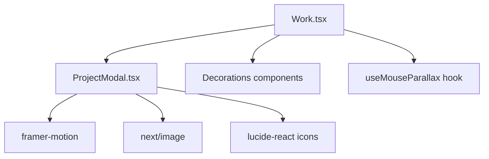
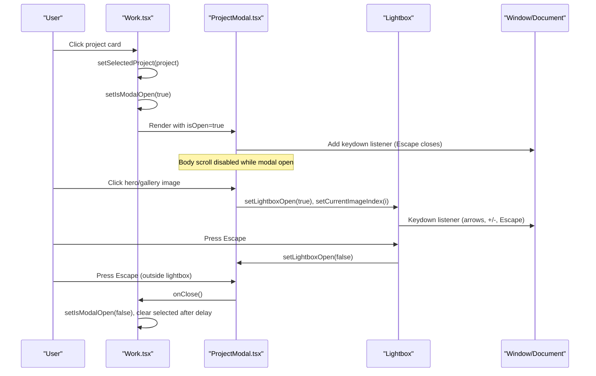
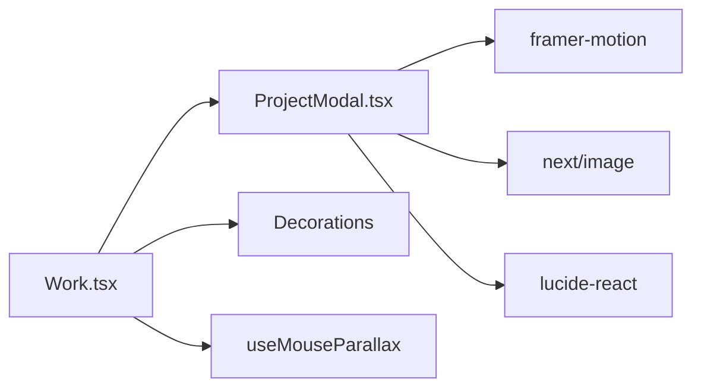

# Project Modal Component

<cite>
**Referenced Files in This Document**
- [ProjectModal.tsx](file://app/components/ProjectModal.tsx)
- [Work.tsx](file://app/components/Work.tsx)
- [LIGHTBOX_FEATURE.md](file://LIGHTBOX_FEATURE.md)
- [globals.css](file://app/globals.css)
</cite>

## Table of Contents
1. [Introduction](#introduction)
2. [Project Structure](#project-structure)
3. [Core Components](#core-components)
4. [Architecture Overview](#architecture-overview)
5. [Detailed Component Analysis](#detailed-component-analysis)
6. [Dependency Analysis](#dependency-analysis)
7. [Performance Considerations](#performance-considerations)
8. [Troubleshooting Guide](#troubleshooting-guide)
9. [Conclusion](#conclusion)
10. [Appendices](#appendices)

## Introduction
This document provides comprehensive documentation for the Project modal component that displays detailed information about individual portfolio projects. It covers the presentation layer (images, descriptions, technologies, metadata), lifecycle management (open/close, backdrop interactions), keyboard navigation (ESC to close), focus behavior, responsive design patterns, image galleries within modals, and performance considerations for large project content. It also explains how to configure project data, customize modal appearance, integrate with the Work component, and ensure accessibility compliance including screen reader support and keyboard navigation patterns.

## Project Structure
The Project modal is implemented as a client-side React component integrated into the Work section. The modal renders both a main dialog view and an optional full-screen lightbox for images. The Work component manages project state and opens/closes the modal based on user interaction.

**Diagram sources**
- [Work.tsx:1-16](file://app/components/Work.tsx#L1-L16)
- [ProjectModal.tsx:1-21](file://app/components/ProjectModal.tsx#L1-L21)

**Section sources**
- [Work.tsx:1-16](file://app/components/Work.tsx#L1-L16)
- [ProjectModal.tsx:1-21](file://app/components/ProjectModal.tsx#L1-L21)

## Core Components
- ProjectModal: Renders the modal dialog and lightbox, handles keyboard events, manages zoom and gallery state, and presents project details.
- Work: Manages project data arrays, exposes project selection state, and mounts ProjectModal with open/close handlers.

Key responsibilities:
- Presentation: Hero image, overview text, design process steps, outcomes, gallery grid, tech stack tags, role/timeline/category metadata, and external links.
- Interaction: Backdrop click to close, ESC to close, lightbox navigation via buttons and keyboard, zoom controls, thumbnail strip navigation.
- Accessibility: Dialog semantics, ARIA attributes, descriptive labels, keyboard support.

**Section sources**
- [ProjectModal.tsx:23-51](file://app/components/ProjectModal.tsx#L23-L51)
- [ProjectModal.tsx:125-163](file://app/components/ProjectModal.tsx#L125-L163)
- [ProjectModal.tsx:342-627](file://app/components/ProjectModal.tsx#L342-L627)
- [Work.tsx:352-499](file://app/components/Work.tsx#L352-L499)

## Architecture Overview
The modal uses a layered rendering approach:
- Main modal dialog at z-index 100 with a blurred backdrop.
- Lightbox overlay at z-index 110 when viewing images full-screen.
- Framer Motion animations for entrance/exit and transitions.
- Next.js Image for optimized image loading and sizing.
- Keyboard event listener attached to window when modal or lightbox is open.

**Diagram sources**
- [Work.tsx:352-365](file://app/components/Work.tsx#L352-L365)
- [ProjectModal.tsx:138-163](file://app/components/ProjectModal.tsx#L138-L163)
- [ProjectModal.tsx:190-340](file://app/components/ProjectModal.tsx#L190-L340)
- [ProjectModal.tsx:342-627](file://app/components/ProjectModal.tsx#L342-L627)

## Detailed Component Analysis

### ProjectModal: Presentation Layer
- Hero image area with gradient overlay and “View full” button to open lightbox.
- Title overlay with tag and year; accessible heading linked via aria-labelledby.
- Overview paragraph using fullDescription.
- Optional design process steps rendered as numbered cards with phase titles and descriptions.
- Key outcomes displayed in a two-column grid with accent markers.
- Gallery grid showing additional images; each opens lightbox at corresponding index.
- Sidebar metadata: Role, Timeline, Category.
- Tech Stack tags with hover states.
- External Links: conditional rendering for Figma, GitHub, Play Store, App Store, Website.

Accessibility highlights:
- Dialog container uses role="dialog", aria-modal="true", and aria-labelledby pointing to the title element.
- Close button has explicit aria-label.
- All interactive elements have descriptive labels.

**Section sources**
- [ProjectModal.tsx:342-426](file://app/components/ProjectModal.tsx#L342-L426)
- [ProjectModal.tsx:428-548](file://app/components/ProjectModal.tsx#L428-L548)
- [ProjectModal.tsx:550-623](file://app/components/ProjectModal.tsx#L550-L623)

### ProjectModal: Lifecycle Management
- Open/close controlled by isOpen prop; body scroll is disabled when modal is open and restored on close.
- AnimatePresence wraps modal and lightbox for smooth enter/exit transitions.
- Z-index layering ensures lightbox appears above modal.
- Backdrop click closes the modal; modal panel prevents event propagation to avoid accidental closing.

Keyboard navigation:
- Global keydown listener attached when modal is open:
  - ESC closes the modal.
  - In lightbox mode:
    - ArrowLeft/ArrowRight navigate images.
    - + and - cycle zoom levels.
    - ESC closes lightbox.

Focus behavior:
- No explicit focus trap implementation; focus remains where it was or moves to clicked elements.
- Ensure users can reach all interactive controls via Tab; ESC provides a reliable escape path.

Backdrop interactions:
- Backdrop click triggers onClose.
- Panel click stops propagation to prevent unintended closure.

**Section sources**
- [ProjectModal.tsx:125-163](file://app/components/ProjectModal.tsx#L125-L163)
- [ProjectModal.tsx:190-340](file://app/components/ProjectModal.tsx#L190-L340)
- [ProjectModal.tsx:342-375](file://app/components/ProjectModal.tsx#L342-L375)

### ProjectModal: Image Lightbox and Zoom
- Full-screen viewer with dark backdrop and blur.
- Toolbar shows current image counter and zoom controls (zoom out, reset percentage, zoom in).
- Navigation arrows for previous/next images.
- Thumbnail strip at bottom with active indicator; horizontal scrolling on small screens.
- Zoom levels cycle through predefined scales; clicking image toggles zoom in/out.

Responsive behavior:
- Max width constraints and aspect ratios maintain readability across devices.
- Thumbnails adapt to available width; overflow-x-auto enables horizontal scrolling.

**Section sources**
- [ProjectModal.tsx:190-340](file://app/components/ProjectModal.tsx#L190-L340)
- [LIGHTBOX_FEATURE.md:1-137](file://LIGHTBOX_FEATURE.md#L1-L137)

### Work: Integration and Data Configuration
- Maintains selectedProject and isModalOpen state.
- Opens modal with handleOpenProject and closes with handleCloseModal.
- Provides featuredProjects and additionalProjects arrays; combines into allProjects.
- ProjectCard components trigger modal open on click.
- ProjectModal mounted at the bottom of the Work section with props bound to state.

Configuring project data:
- Each project object includes id, title, category, description, fullDescription, year, color, tag, role, timeline, techStack, outcomes, designProcess (optional), links (optional), and images array.
- Images array first item serves as hero; remaining items populate gallery grid and lightbox.

Customizing appearance:
- Use project.color for accent styling throughout the modal (tags, borders, markers).
- Adjust techStack tags and link buttons via Tailwind classes already applied.

**Section sources**
- [Work.tsx:70-294](file://app/components/Work.tsx#L70-L294)
- [Work.tsx:296-365](file://app/components/Work.tsx#L296-L365)
- [Work.tsx:352-499](file://app/components/Work.tsx#L352-L499)

### Responsive Design Patterns
- Modal uses responsive padding and grid layouts: single column on small screens, multi-column on larger breakpoints.
- Hero image uses responsive sizes attribute for optimal loading.
- Gallery grid adapts from two columns to fit viewport constraints.
- Lightbox toolbar and thumbnails are touch-friendly with adequate hit areas.

**Section sources**
- [ProjectModal.tsx:342-627](file://app/components/ProjectModal.tsx#L342-L627)
- [ProjectModal.tsx:190-340](file://app/components/ProjectModal.tsx#L190-L340)

### Accessibility Compliance
- Dialog semantics: role="dialog", aria-modal="true", aria-labelledby linking to the modal title.
- Keyboard navigation: ESC to close modal/lightbox; arrow keys to navigate images; +/- to adjust zoom.
- Screen readers: Descriptive alt text for images; aria-labels for all interactive controls.
- Reduced motion: Global CSS respects prefers-reduced-motion to minimize animations.

Note: There is no explicit focus trap; consider adding one if you need to enforce focus within the modal for stricter accessibility requirements.

**Section sources**
- [ProjectModal.tsx:342-375](file://app/components/ProjectModal.tsx#L342-L375)
- [ProjectModal.tsx:138-163](file://app/components/ProjectModal.tsx#L138-L163)
- [globals.css:102-112](file://app/globals.css#L102-L112)

## Dependency Analysis
- ProjectModal depends on:
  - framer-motion for animations and presence handling.
  - next/image for optimized image rendering.
  - lucide-react for icons used in UI controls and metadata.
- Work depends on:
  - ProjectModal for modal rendering.
  - Decorations and hooks for visual effects and parallax.

**Diagram sources**
- [ProjectModal.tsx:1-21](file://app/components/ProjectModal.tsx#L1-L21)
- [Work.tsx:1-16](file://app/components/Work.tsx#L1-L16)

**Section sources**
- [ProjectModal.tsx:1-21](file://app/components/ProjectModal.tsx#L1-L21)
- [Work.tsx:1-16](file://app/components/Work.tsx#L1-L16)

## Performance Considerations
- Image optimization:
  - Uses Next.js Image with priority for hero images and lazy loading for gallery thumbnails.
  - Responsive sizes attributes reduce bandwidth on smaller screens.
- Animation efficiency:
  - Framer Motion leverages GPU-accelerated transforms for smooth transitions.
  - Staggered animations for content sections improve perceived performance.
- State management:
  - Minimal re-renders by scoping state to modal and lightbox features.
  - Zoom level resets when switching images or opening/closing lightbox to avoid unnecessary computations.
- Large content:
  - Consider virtualizing long lists if designProcess or outcomes grow significantly.
  - Defer heavy operations until modal opens to keep initial render fast.

[No sources needed since this section provides general guidance]

## Troubleshooting Guide
Common issues and resolutions:
- Modal does not close on ESC:
  - Verify keydown listener is attached when modal is open and ESC handler calls onClose.
  - Ensure no other global listeners intercept ESC before the modal’s handler.
- Lightbox navigation not working:
  - Confirm currentImageIndex updates on arrow key presses and that project.images.length > 0.
  - Check that thumbnail strip onClick sets correct index.
- Images not displaying:
  - Ensure image paths exist in public directory and match configured strings.
  - Validate sizes and aspect ratios to prevent layout shifts.
- Focus management:
  - If users report difficulty navigating with keyboard, add a focus trap to keep focus within modal/lightbox.
- Reduced motion:
  - Users with reduced motion preferences will see minimal animations due to global CSS media query.

**Section sources**
- [ProjectModal.tsx:138-163](file://app/components/ProjectModal.tsx#L138-L163)
- [ProjectModal.tsx:190-340](file://app/components/ProjectModal.tsx#L190-L340)
- [globals.css:102-112](file://app/globals.css#L102-L112)

## Conclusion
The Project modal component delivers a rich, accessible, and performant experience for showcasing portfolio projects. It integrates seamlessly with the Work component, supports robust keyboard navigation, and provides a polished image lightbox with zoom and thumbnail navigation. By configuring project data thoughtfully and leveraging responsive design patterns, developers can present large amounts of project content clearly and efficiently. For enhanced accessibility, consider implementing a focus trap to strictly contain focus within the modal and lightbox contexts.

[No sources needed since this section summarizes without analyzing specific files]

## Appendices

### Configuring Project Data
- Define project objects with required fields: id, title, category, description, fullDescription, year, color, tag, role, timeline, techStack, outcomes, images.
- Optional fields: designProcess (array of phases with descriptions), links (Figma, GitHub, Play Store, App Store, Website).
- Place images in the public directory and reference them in the images array. First image acts as hero; subsequent images populate the gallery and lightbox.

**Section sources**
- [Work.tsx:70-294](file://app/components/Work.tsx#L70-L294)
- [LIGHTBOX_FEATURE.md:41-63](file://LIGHTBOX_FEATURE.md#L41-L63)

### Customizing Modal Appearance
- Accent colors: Set project.color to influence borders, tags, and markers throughout the modal.
- Typography and spacing: Tailwind classes control font sizes, spacing, and grid layouts; adjust as needed for brand consistency.
- Link buttons: Styled with consistent hover states; extend with additional link types by following existing patterns.

**Section sources**
- [ProjectModal.tsx:405-426](file://app/components/ProjectModal.tsx#L405-L426)
- [ProjectModal.tsx:582-623](file://app/components/ProjectModal.tsx#L582-L623)

### Integrating with the Work Component
- Manage selectedProject and isModalOpen state in Work.
- Pass project, isOpen, and onClose props to ProjectModal.
- Mount ProjectModal within the Work section to ensure proper context and event handling.

**Section sources**
- [Work.tsx:352-365](file://app/components/Work.tsx#L352-L365)
- [Work.tsx:491-495](file://app/components/Work.tsx#L491-L495)