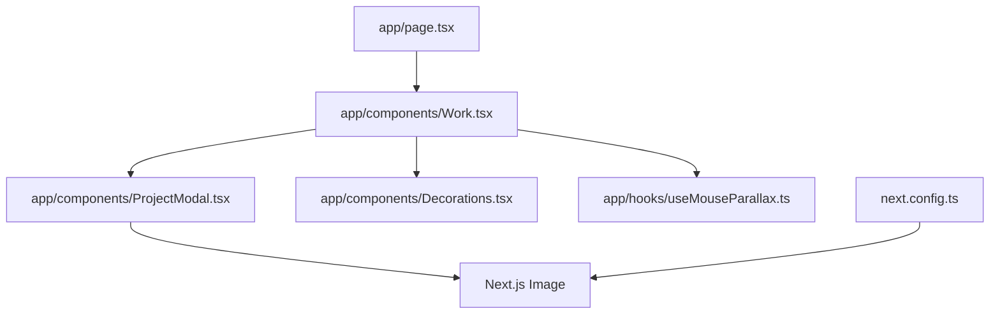
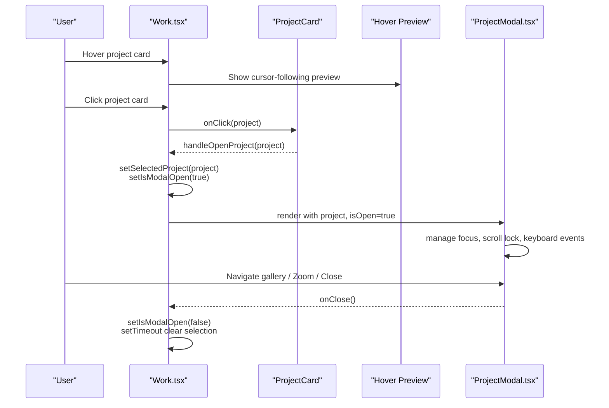
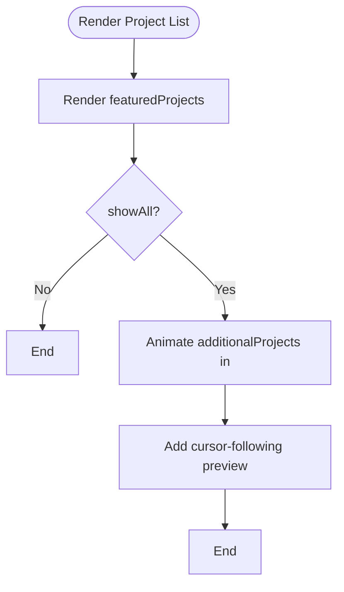
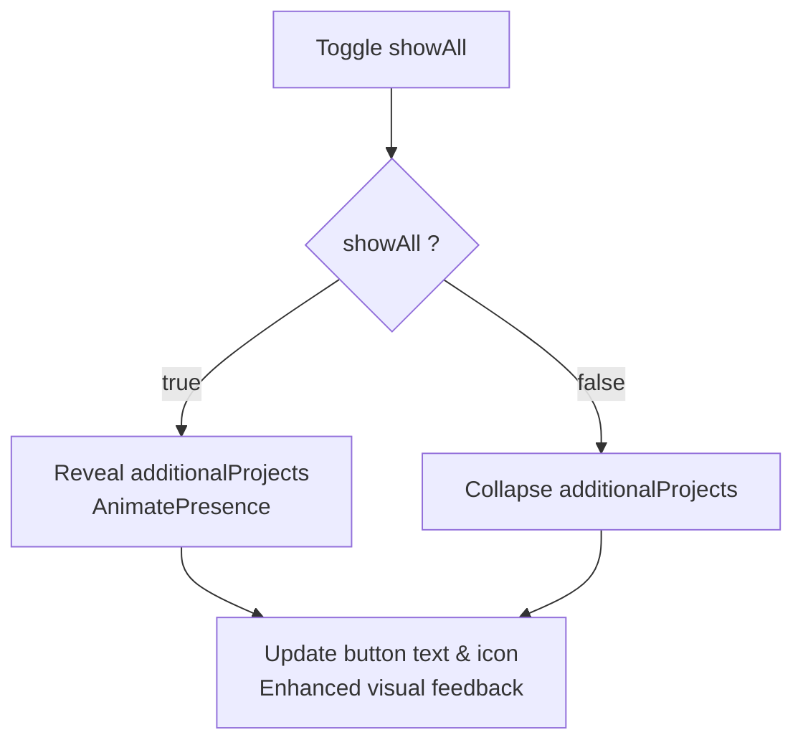
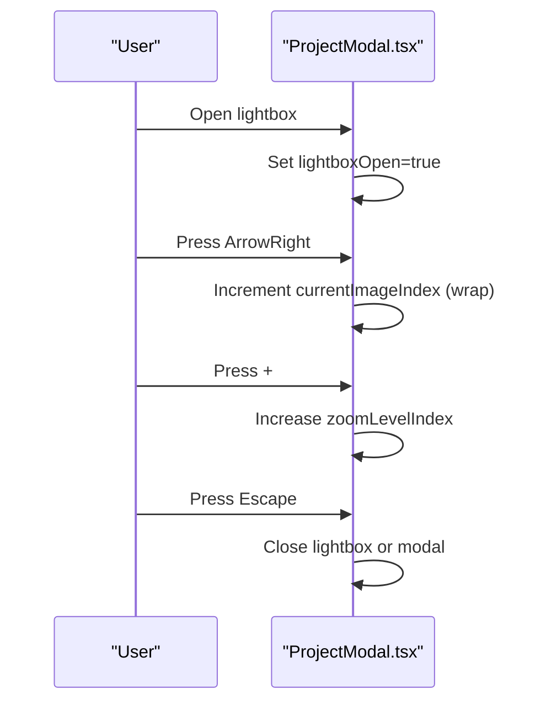
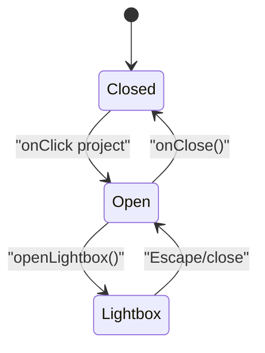
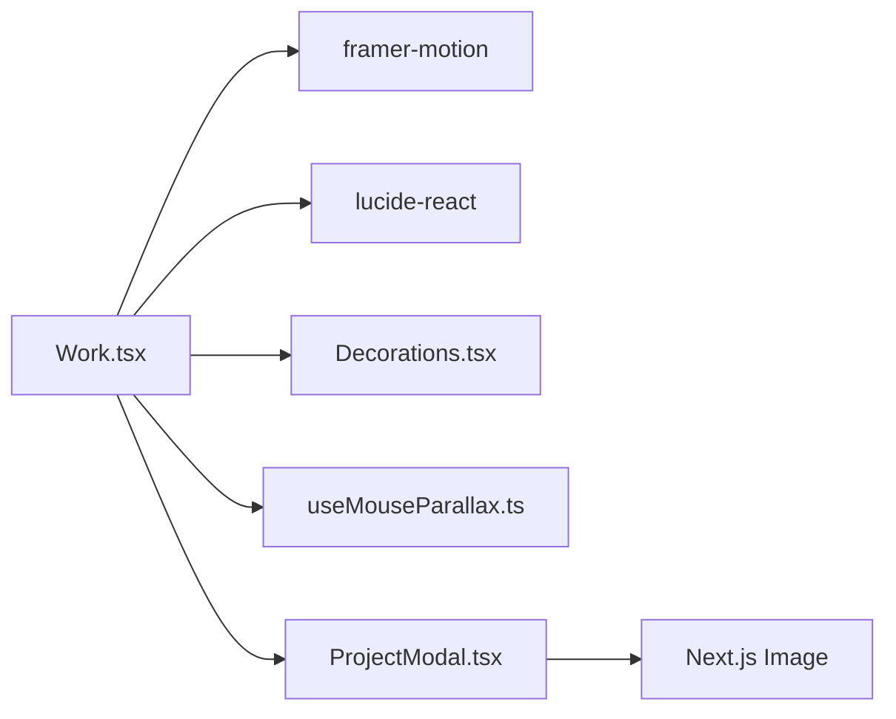

# Work Showcase Component

<cite>
**Referenced Files in This Document**
- [Work.tsx](file://app/components/Work.tsx)
- [ProjectModal.tsx](file://app/components/ProjectModal.tsx)
- [page.tsx](file://app/page.tsx)
- [Decorations.tsx](file://app/components/Decorations.tsx)
- [useMouseParallax.ts](file://app/hooks/useMouseParallax.ts)
- [next.config.ts](file://next.config.ts)
</cite>

## Update Summary
**Changes Made**
- Enhanced project data structure with comprehensive design process documentation
- Improved visual hierarchy with better categorization and project organization
- Added cursor-following image preview functionality for desktop hover interactions
- Enhanced modal functionality with advanced lightbox capabilities
- Expanded project showcase with 7 detailed projects featuring rich metadata
- Improved responsive design patterns and accessibility features
- Optimized performance with lazy loading and efficient state management

## Table of Contents
1. [Introduction](#introduction)
2. [Project Structure](#project-structure)
3. [Core Components](#core-components)
4. [Architecture Overview](#architecture-overview)
5. [Detailed Component Analysis](#detailed-component-analysis)
6. [Dependency Analysis](#dependency-analysis)
7. [Performance Considerations](#performance-considerations)
8. [Troubleshooting Guide](#troubleshooting-guide)
9. [Conclusion](#conclusion)
10. [Appendices](#appendices)

## Introduction
This document explains the enhanced Work showcase component that displays portfolio projects with sophisticated categorization, improved visual hierarchy, and interactive features including expandable project lists, cursor-following previews, and advanced modal functionality. The component manages project filtering, expansion states, and modal interactions while providing responsive design patterns, image optimization strategies, and comprehensive accessibility features. It includes examples for adding new projects, customizing project cards, and integrating with the ProjectModal component.

## Project Structure
The Work showcase is implemented as a client-side React component within a Next.js application. The main entry point renders the Work section alongside other sections. Decorative elements and mouse parallax are provided by shared components and hooks.

**Diagram sources**
- [page.tsx:13](file://app/page.tsx#L13)
- [Work.tsx:1-18](file://app/components/Work.tsx#L1-L18)
- [ProjectModal.tsx:1-21](file://app/components/ProjectModal.tsx#L1-L21)
- [Decorations.tsx:1-5](file://app/components/Decorations.tsx#L1-L5)
- [useMouseParallax.ts:1-5](file://app/hooks/useMouseParallax.ts#L1-L5)
- [next.config.ts:1-12](file://next.config.ts#L1-L12)

**Section sources**
- [page.tsx:13](file://app/page.tsx#L13)
- [Work.tsx:1-18](file://app/components/Work.tsx#L1-L18)

## Core Components
- **Work**: Renders the "Selected Work" section with enhanced project showcase, manages project lists, expand/collapse behavior, cursor-following previews, and opens the ProjectModal.
- **ProjectModal**: Displays detailed project information with comprehensive design process documentation, gallery, advanced lightbox with zoom and keyboard navigation, and external links.
- **Decorations**: Provides visual accents (grids, orbs, floating shapes) used by Work with enhanced parallax effects.
- **useMouseParallax**: Hook to compute smooth parallax offsets based on mouse position with configurable intensity and spring physics.

Key responsibilities:
- **Work**: Data composition (featured vs additional), enhanced UI rendering with cursor previews, state for modal and expansion, event handling for hover interactions.
- **ProjectModal**: Advanced modal lifecycle, comprehensive lightbox controls, keyboard shortcuts, accessible dialog, optimized image display with zoom capabilities.

**Section sources**
- [Work.tsx:363-571](file://app/components/Work.tsx#L363-L571)
- [ProjectModal.tsx:125-631](file://app/components/ProjectModal.tsx#L125-L631)
- [Decorations.tsx:1-190](file://app/components/Decorations.tsx#L1-L190)
- [useMouseParallax.ts:1-66](file://app/hooks/useMouseParallax.ts#L1-L66)

## Architecture Overview
The enhanced Work component composes two arrays of projects: featured (always visible) and additional (revealed on demand). Each project now includes comprehensive design process documentation with detailed phases. Clicking a project card opens the ProjectModal with the selected project, while hovering triggers a cursor-following image preview. The modal supports an advanced gallery and immersive lightbox with zoom and keyboard navigation.

**Diagram sources**
- [Work.tsx:380-388](file://app/components/Work.tsx#L380-L388)
- [Work.tsx:520-561](file://app/components/Work.tsx#L520-L561)
- [ProjectModal.tsx:125-163](file://app/components/ProjectModal.tsx#L125-L163)
- [ProjectModal.tsx:342-627](file://app/components/ProjectModal.tsx#L342-L627)

## Detailed Component Analysis

### Enhanced Project Data Model
The project data structure has been significantly enhanced with comprehensive design process documentation. Each project now includes identity, metadata, descriptions, role/timeline/category, tech stack, outcomes, detailed design process steps, links, and images.

**Updated** Projects now feature detailed design processes with multiple phases including Discovery, User Personas, User Flows, Design, Test & Iterate, and Launch & Measure phases.

- Fields include id, title, category, description, fullDescription, year, color, tag, role, timeline, techStack, outcomes, designProcess, links, images.
- Links support multiple destinations (Figma, GitHub, stores, website).
- Images are paths to assets served from the public directory.
- Design processes contain structured phases with detailed descriptions.

Examples of where this model is used:
- Featured projects array with 4 high-quality projects
- Additional projects array with 3 more detailed projects
- Modal rendering and gallery with comprehensive metadata

**Section sources**
- [ProjectModal.tsx:23-45](file://app/components/ProjectModal.tsx#L23-L45)
- [Work.tsx:72-294](file://app/components/Work.tsx#L72-L294)

### Enhanced Grid Layout and Project Cards
**Updated** The project list uses a responsive grid per row with enhanced visual hierarchy: a narrow column for id/year, a middle column for title/description/tag, and a right column for category and action indicator. On smaller screens, it collapses gracefully with improved spacing and typography.

Each card now features:
- Cursor-following image preview on desktop hover
- Enhanced hover states with accent line animation
- Improved color transitions and affordance indicators
- Better mobile responsiveness

**Diagram sources**
- [Work.tsx:448-481](file://app/components/Work.tsx#L448-L481)
- [Work.tsx:520-561](file://app/components/Work.tsx#L520-L561)

**Section sources**
- [Work.tsx:298-361](file://app/components/Work.tsx#L298-L361)
- [Work.tsx:448-481](file://app/components/Work.tsx#L448-L481)

### Enhanced Expandable Project List
**Updated** A "View All Projects" button toggles visibility of additional projects with animated height transitions and improved UX. The toggle shows a count of hidden items and switches to "Show Less" when expanded with enhanced visual feedback.

AnimaPresence ensures smooth enter/exit animations with staggered delays for better user experience.

**Diagram sources**
- [Work.tsx:485-517](file://app/components/Work.tsx#L485-L517)

**Section sources**
- [Work.tsx:485-517](file://app/components/Work.tsx#L485-L517)

### Advanced Modal Functionality and Lightbox
**Updated** Opening a project sets selectedProject and opens the modal; closing clears the selection after a short delay to avoid animation glitches. The modal now contains enhanced content including:

- Hero image with gradient overlay and "View full" button
- Comprehensive overview with detailed project descriptions
- Structured design process steps with numbered phases
- Key outcomes with visual indicators
- Gallery thumbnails with hover effects
- Sidebar with role, timeline, category, tech stack, and external links

Advanced lightbox mode features:
- Fullscreen viewer with prev/next navigation
- Multi-level zoom (1x → 1.5x → 2x) with cycling controls
- Keyboard shortcuts: Escape to close, arrows to navigate, +/- to zoom
- Body scroll lock while open
- Thumbnail strip for quick navigation
- Responsive image sizing and optimization

**Diagram sources**
- [ProjectModal.tsx:125-163](file://app/components/ProjectModal.tsx#L125-L163)
- [ProjectModal.tsx:165-188](file://app/components/ProjectModal.tsx#L165-L188)
- [ProjectModal.tsx:190-339](file://app/components/ProjectModal.tsx#L190-L339)
- [ProjectModal.tsx:342-627](file://app/components/ProjectModal.tsx#L342-L627)

**Section sources**
- [Work.tsx:380-388](file://app/components/Work.tsx#L380-L388)
- [ProjectModal.tsx:125-188](file://app/components/ProjectModal.tsx#L125-L188)
- [ProjectModal.tsx:190-627](file://app/components/ProjectModal.tsx#L190-L627)

### Enhanced State Management
**Updated** Selected project and modal visibility are held in Work's local state with additional state for cursor-following preview functionality. Expansion state (showAll) controls rendering of additional projects with improved animation timing.

Modal internal state includes lightboxOpen, currentImageIndex, zoomLevelIndex with enhanced reset logic. Effects manage:
- Body scroll lock/unlock when modal opens/closes
- Keyboard event listeners for lightbox and modal dismissal
- Cleanup of event listeners and timers
- Cursor position tracking for hover previews

**Diagram sources**
- [Work.tsx:364-368](file://app/components/Work.tsx#L364-L368)
- [ProjectModal.tsx:125-163](file://app/components/ProjectModal.tsx#L125-L163)
- [ProjectModal.tsx:190-339](file://app/components/ProjectModal.tsx#L190-L339)

**Section sources**
- [Work.tsx:364-368](file://app/components/Work.tsx#L364-L368)
- [ProjectModal.tsx:125-163](file://app/components/ProjectModal.tsx#L125-L163)

### Enhanced Responsive Design Patterns
**Updated** Project rows adapt from multi-column layouts on desktop to stacked layouts on mobile with improved spacing and typography. Gallery grids adjust columns based on breakpoints with better touch targets.

Decorative elements are hidden on small screens to reduce clutter while maintaining visual appeal. Modal uses responsive padding and sizing for readability across devices with enhanced mobile interactions.

**Section sources**
- [Work.tsx:325-359](file://app/components/Work.tsx#L325-L359)
- [ProjectModal.tsx:342-627](file://app/components/ProjectModal.tsx#L342-L627)
- [Decorations.tsx:45-119](file://app/components/Decorations.tsx#L45-L119)

### Enhanced Image Optimization Strategies
**Updated** Uses Next.js Image for automatic format conversion (WebP/AVIF), responsive sizes, and caching with improved configuration. Configured deviceSizes and imageSizes for efficient delivery across all screen densities.

Priority set on hero images; lazy loading used for secondary images and thumbnails with optimized loading strategies. Sizes attributes guide browser image selection for different viewports with enhanced fallback handling.

**Section sources**
- [ProjectModal.tsx:279-289](file://app/components/ProjectModal.tsx#L279-L289)
- [ProjectModal.tsx:310-336](file://app/components/ProjectModal.tsx#L310-L336)
- [ProjectModal.tsx:377-403](file://app/components/ProjectModal.tsx#L377-L403)
- [ProjectModal.tsx:504-533](file://app/components/ProjectModal.tsx#L504-L533)
- [next.config.ts:3-12](file://next.config.ts#L3-L12)

### Enhanced Accessibility Features
**Updated** Modal uses role="dialog", aria-modal, and aria-labelledby for screen readers with improved focus management. Keyboard navigation: Escape closes modal/lightbox; arrow keys navigate gallery; +/- zooms with enhanced feedback.

Buttons have descriptive aria-labels for actions like zoom in/out, previous/next image, and close with proper semantic markup. Decorative elements are marked aria-hidden to avoid noise for assistive technologies while maintaining visual richness.

**Section sources**
- [ProjectModal.tsx:356-375](file://app/components/ProjectModal.tsx#L356-L375)
- [ProjectModal.tsx:149-163](file://app/components/ProjectModal.tsx#L149-L163)
- [ProjectModal.tsx:215-249](file://app/components/ProjectModal.tsx#L215-L249)
- [Decorations.tsx:30-41](file://app/components/Decorations.tsx#L30-L41)
- [Decorations.tsx:145-155](file://app/components/Decorations.tsx#L145-L155)

## Dependency Analysis
The enhanced Work component depends on:
- Framer Motion for advanced animations and viewport triggers
- Lucide icons for enhanced UI affordances
- Shared decorations and parallax hook for sophisticated visual effects
- ProjectModal for comprehensive detail views and advanced lightbox

**Diagram sources**
- [Work.tsx:1-7](file://app/components/Work.tsx#L1-L7)
- [ProjectModal.tsx:1-21](file://app/components/ProjectModal.tsx#L1-L21)
- [Decorations.tsx:1-5](file://app/components/Decorations.tsx#L1-L5)
- [useMouseParallax.ts:1-5](file://app/hooks/useMouseParallax.ts#L1-L5)

**Section sources**
- [Work.tsx:1-18](file://app/components/Work.tsx#L1-L18)
- [ProjectModal.tsx:1-21](file://app/components/ProjectModal.tsx#L1-L21)

## Performance Considerations
**Updated** Rendering strategy:
- Featured projects always rendered; additional projects conditionally rendered to reduce initial DOM size
- AnimatePresence handles smooth transitions without unnecessary re-renders
- Cursor-following preview only renders on desktop and when hovering over projects

Image performance:
- Next.js Image optimizes formats and sizes; priority for above-the-fold hero images; lazy for others
- Configured deviceSizes/imageSizes and minimumCacheTTL for efficient caching
- Enhanced image loading with proper fallback handling

Animation performance:
- Use viewport-triggered animations to avoid off-screen work
- Keep parallax intensity reasonable to minimize layout thrashing
- Optimize cursor-following preview with motion values and springs

Large collections:
- Consider virtualization or pagination if the number of projects grows significantly beyond current counts
- Defer heavy computations until user interaction (e.g., opening modal)
- Implement lazy loading for large image galleries

Memory and cleanup:
- Ensure event listeners and timers are cleaned up in useEffect returns
- Reset zoom and modal state appropriately to prevent stale references
- Proper cleanup of cursor position tracking and hover states

## Troubleshooting Guide
Common issues and resolutions:
- Modal not closing on Escape:
  - Verify keyboard event listener is attached only when modal is open and removed on unmount
  - Check that lightbox and modal share consistent Escape handling
- Images not loading or blurry:
  - Confirm correct asset paths in public directory and proper sizes attributes
  - Ensure next.config image formats and sizes are configured
- Animations jitter or lag:
  - Reduce parallax intensity or disable on low-power devices
  - Avoid animating layout properties; prefer transforms and opacity
  - Optimize cursor-following preview performance
- Accessibility problems:
  - Ensure all interactive elements have appropriate roles and labels
  - Test with screen readers and keyboard-only navigation
  - Verify proper focus management in modal interactions

**Section sources**
- [ProjectModal.tsx:138-163](file://app/components/ProjectModal.tsx#L138-L163)
- [ProjectModal.tsx:190-339](file://app/components/ProjectModal.tsx#L190-L339)
- [next.config.ts:3-12](file://next.config.ts#L3-L12)

## Conclusion
The enhanced Work showcase component provides a polished, accessible, and performant way to present portfolio projects with sophisticated categorization and improved visual hierarchy. It balances immediate visibility of featured work with an expandable list for deeper exploration, and integrates a rich modal with comprehensive design process documentation, gallery, and advanced lightbox capabilities. With Next.js image optimization, enhanced state management, and thoughtful responsive design, it scales well for moderate collections and can be extended for larger datasets through virtualization or pagination.

## Appendices

### Adding a New Project
**Updated** Steps:
- Define a new project object following the enhanced ProjectDetail interface with comprehensive metadata
- Add it to either featuredProjects or additionalProjects depending on desired visibility
- Include at least one image path in the images array; optionally add more for gallery
- Provide detailed designProcess entries with structured phases (Discovery, Design, Test, etc.)
- Include comprehensive outcomes and key metrics
- Optionally add links (figma, github, playStore, appStore, website)

References:
- Enhanced ProjectDetail type definition
- Featured and additional project arrays with comprehensive examples

**Section sources**
- [ProjectModal.tsx:23-45](file://app/components/ProjectModal.tsx#L23-L45)
- [Work.tsx:72-294](file://app/components/Work.tsx#L72-L294)

### Customizing Project Cards
**Updated** To customize appearance:
- Adjust the grid classes for different breakpoints with enhanced spacing
- Modify hover styles (accent line, background, colors) with improved transitions
- Change typography and spacing to match brand guidelines
- Update tag styling with dynamic border and text colors
- Customize cursor-following preview behavior and appearance
- Enhance mobile responsiveness with improved touch interactions

**Section sources**
- [Work.tsx:325-359](file://app/components/Work.tsx#L325-L359)
- [Work.tsx:520-561](file://app/components/Work.tsx#L520-L561)

### Integrating with ProjectModal
**Updated** Integration points:
- Pass selectedProject and isOpen state from Work to ProjectModal
- Implement onClose handler to reset modal state and clear selection after transition
- Ensure keyboard and focus behaviors are preserved when opening/closing
- Handle enhanced modal features like lightbox and zoom controls
- Manage cursor-following preview state coordination

**Section sources**
- [Work.tsx:380-388](file://app/components/Work.tsx#L380-L388)
- [ProjectModal.tsx:125-163](file://app/components/ProjectModal.tsx#L125-L163)
- [ProjectModal.tsx:342-375](file://app/components/ProjectModal.tsx#L342-L375)