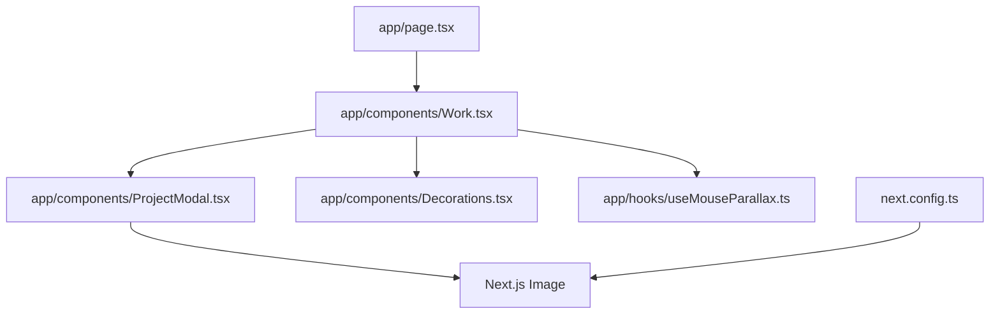
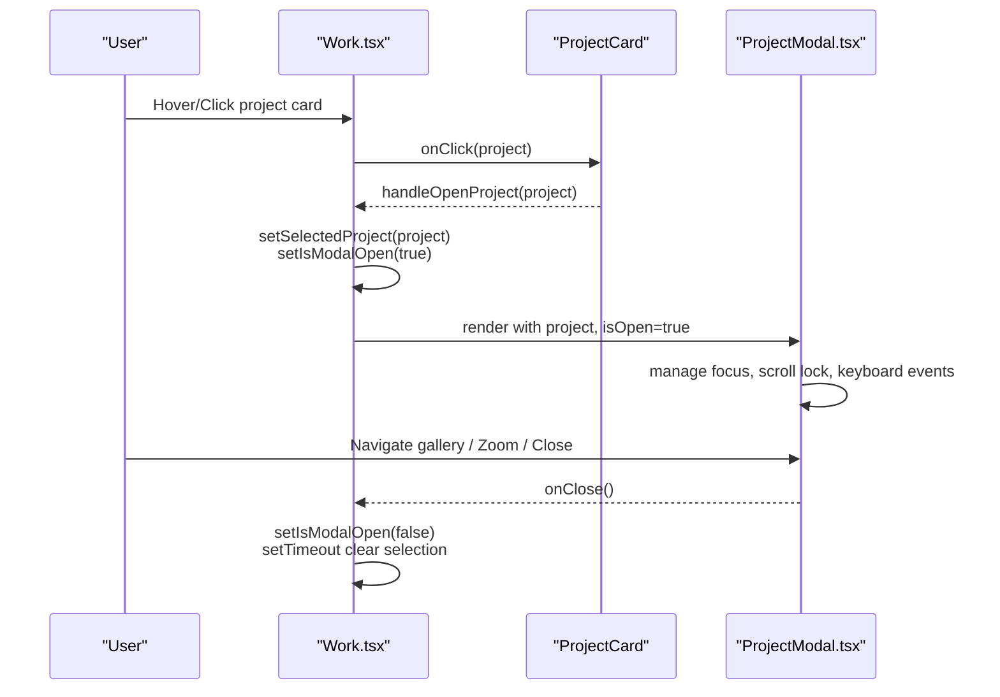
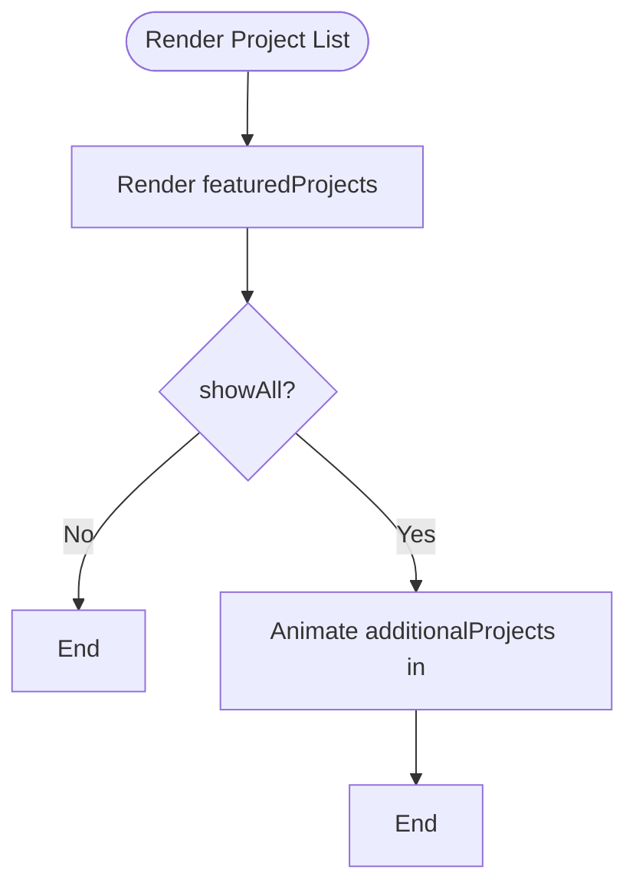
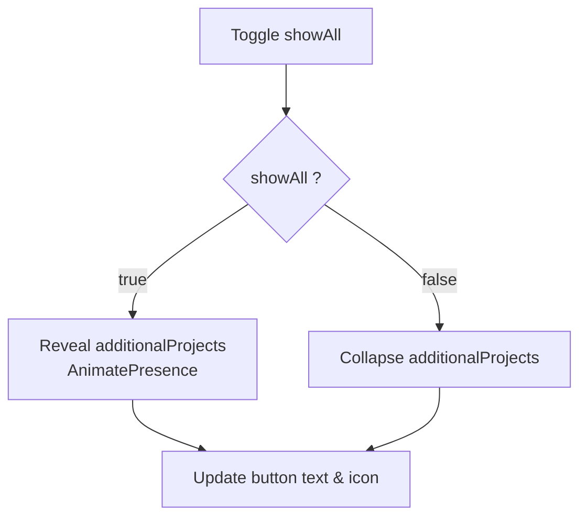
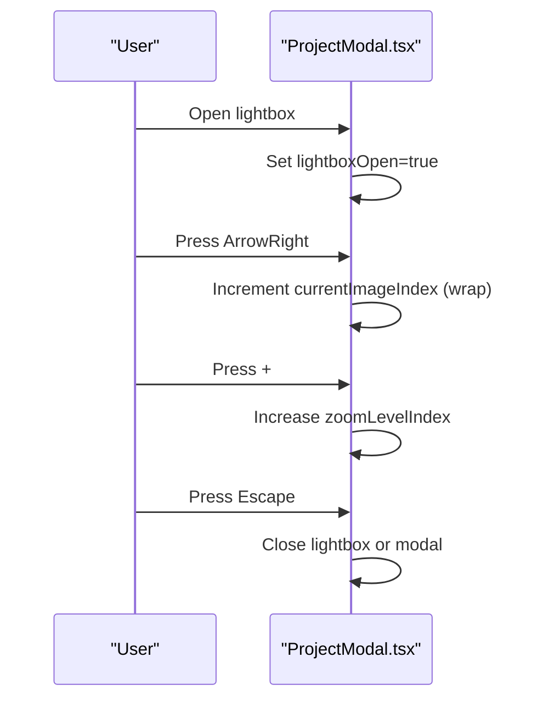
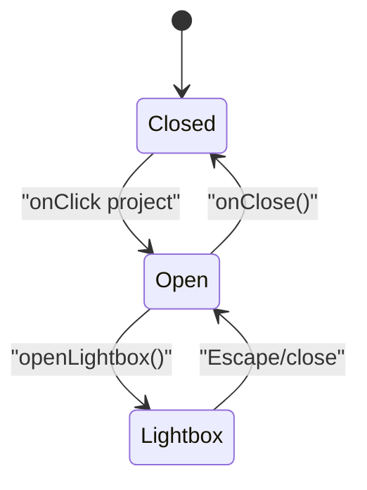
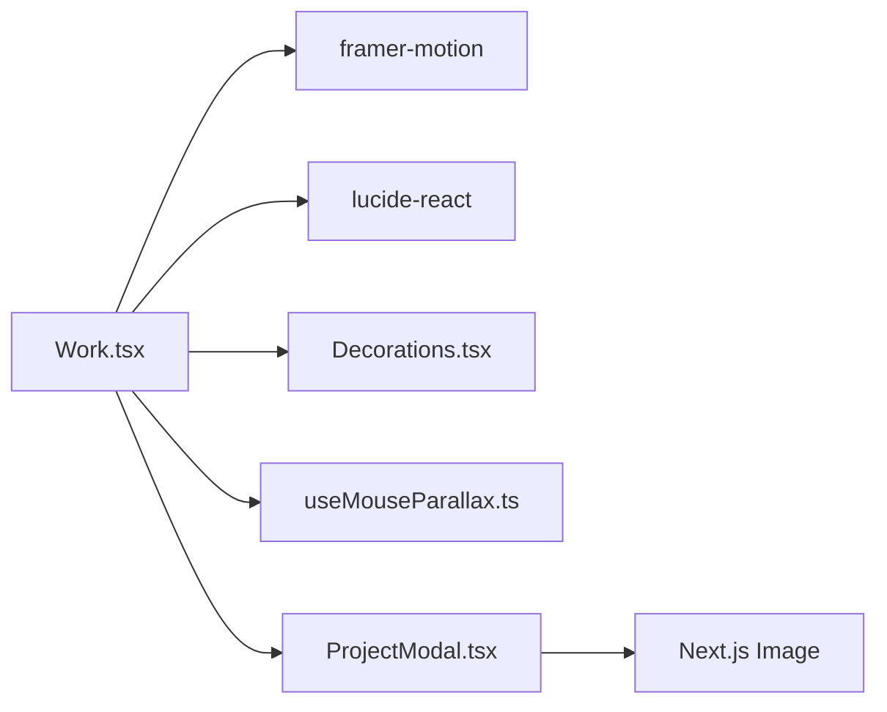

# Work Showcase Component

<cite>
**Referenced Files in This Document**
- [Work.tsx](file://app/components/Work.tsx)
- [ProjectModal.tsx](file://app/components/ProjectModal.tsx)
- [page.tsx](file://app/page.tsx)
- [Decorations.tsx](file://app/components/Decorations.tsx)
- [useMouseParallax.ts](file://app/hooks/useMouseParallax.ts)
- [next.config.ts](file://next.config.ts)
</cite>

## Table of Contents
1. [Introduction](#introduction)
2. [Project Structure](#project-structure)
3. [Core Components](#core-components)
4. [Architecture Overview](#architecture-overview)
5. [Detailed Component Analysis](#detailed-component-analysis)
6. [Dependency Analysis](#dependency-analysis)
7. [Performance Considerations](#performance-considerations)
8. [Troubleshooting Guide](#troubleshooting-guide)
9. [Conclusion](#conclusion)
10. [Appendices](#appendices)

## Introduction
This document explains the Work showcase component that displays portfolio projects, including its data model, grid layout, interactive features (expandable project list and modal), state management for filtering/expansion/modal interactions, responsive design patterns, image optimization strategies, accessibility considerations, and performance guidance for large collections and lazy loading. It also provides examples for adding new projects, customizing project cards, and integrating with the ProjectModal component.

## Project Structure
The Work showcase is implemented as a client-side React component within a Next.js application. The main entry point renders the Work section alongside other sections. Decorative elements and mouse parallax are provided by shared components and hooks.

**Diagram sources**
- [page.tsx:1-20](file://app/page.tsx#L1-L20)
- [Work.tsx:1-16](file://app/components/Work.tsx#L1-L16)
- [ProjectModal.tsx:1-25](file://app/components/ProjectModal.tsx#L1-L25)
- [Decorations.tsx:1-10](file://app/components/Decorations.tsx#L1-L10)
- [useMouseParallax.ts:1-10](file://app/hooks/useMouseParallax.ts#L1-L10)
- [next.config.ts:1-19](file://next.config.ts#L1-L19)

**Section sources**
- [page.tsx:1-20](file://app/page.tsx#L1-L20)
- [Work.tsx:1-16](file://app/components/Work.tsx#L1-L16)

## Core Components
- Work: Renders the “Selected Work” section, manages project lists, expand/collapse behavior, and opens the ProjectModal.
- ProjectModal: Displays detailed project information, gallery, lightbox with zoom and keyboard navigation, and links.
- Decorations: Provides visual accents (grids, orbs, floating shapes) used by Work.
- useMouseParallax: Hook to compute smooth parallax offsets based on mouse position.

Key responsibilities:
- Work: Data composition (featured vs additional), UI rendering, state for modal and expansion, event handling.
- ProjectModal: Modal lifecycle, lightbox controls, keyboard shortcuts, accessible dialog, image display.

**Section sources**
- [Work.tsx:296-499](file://app/components/Work.tsx#L296-L499)
- [ProjectModal.tsx:23-631](file://app/components/ProjectModal.tsx#L23-L631)
- [Decorations.tsx:1-190](file://app/components/Decorations.tsx#L1-L190)
- [useMouseParallax.ts:1-66](file://app/hooks/useMouseParallax.ts#L1-L66)

## Architecture Overview
The Work component composes two arrays of projects: featured (always visible) and additional (revealed on demand). Clicking a project card opens the ProjectModal with the selected project. The modal supports a gallery and an immersive lightbox with zoom and keyboard navigation.

**Diagram sources**
- [Work.tsx:352-365](file://app/components/Work.tsx#L352-L365)
- [Work.tsx:425-452](file://app/components/Work.tsx#L425-L452)
- [ProjectModal.tsx:125-163](file://app/components/ProjectModal.tsx#L125-L163)
- [ProjectModal.tsx:342-627](file://app/components/ProjectModal.tsx#L342-L627)

## Detailed Component Analysis

### Project Data Model
The project data structure is defined once and reused across components. Each project includes identity, metadata, descriptions, role/timeline/category, tech stack, outcomes, optional design process steps, links, and images.

- Fields include id, title, category, description, fullDescription, year, color, tag, role, timeline, techStack, outcomes, designProcess, links, images.
- Links support multiple destinations (Figma, GitHub, stores, website).
- Images are paths to assets served from the public directory.

Examples of where this model is used:
- Featured projects array
- Additional projects array
- Modal rendering and gallery

**Section sources**
- [ProjectModal.tsx:23-45](file://app/components/ProjectModal.tsx#L23-L45)
- [Work.tsx:71-195](file://app/components/Work.tsx#L71-L195)
- [Work.tsx:199-292](file://app/components/Work.tsx#L199-L292)

### Grid Layout and Project Cards
- The project list uses a responsive grid per row: a narrow column for id/year, a middle column for title/description/tag, and a right column for category and action indicator. On smaller screens, it collapses gracefully.
- Each card animates into view using viewport-based motion and staggered delays.
- Hover states reveal an accent line and change colors for affordance.

**Diagram sources**
- [Work.tsx:422-452](file://app/components/Work.tsx#L422-L452)

**Section sources**
- [Work.tsx:296-350](file://app/components/Work.tsx#L296-L350)
- [Work.tsx:422-452](file://app/components/Work.tsx#L422-L452)

### Expandable Project List
- A “View All Projects” button toggles visibility of additional projects with animated height transitions.
- The toggle shows a count of hidden items and switches to “Show Less” when expanded.
- AnimatePresence ensures smooth enter/exit animations.

**Diagram sources**
- [Work.tsx:455-488](file://app/components/Work.tsx#L455-L488)

**Section sources**
- [Work.tsx:455-488](file://app/components/Work.tsx#L455-L488)

### Modal Functionality and Lightbox
- Opening a project sets selectedProject and opens the modal; closing clears the selection after a short delay to avoid animation glitches.
- The modal contains:
  - Hero image with gradient overlay and “View full” button
  - Overview, design process steps, key outcomes, gallery thumbnails
  - Sidebar with role, timeline, category, tech stack, and links
- Lightbox mode:
  - Fullscreen viewer with prev/next navigation
  - Zoom levels cycle via buttons or keyboard (+/-)
  - Keyboard shortcuts: Escape to close, arrows to navigate, +/- to zoom
  - Body scroll lock while open

**Diagram sources**
- [ProjectModal.tsx:125-163](file://app/components/ProjectModal.tsx#L125-L163)
- [ProjectModal.tsx:165-188](file://app/components/ProjectModal.tsx#L165-L188)
- [ProjectModal.tsx:190-339](file://app/components/ProjectModal.tsx#L190-L339)
- [ProjectModal.tsx:342-627](file://app/components/ProjectModal.tsx#L342-L627)

**Section sources**
- [Work.tsx:352-365](file://app/components/Work.tsx#L352-L365)
- [ProjectModal.tsx:125-188](file://app/components/ProjectModal.tsx#L125-L188)
- [ProjectModal.tsx:190-627](file://app/components/ProjectModal.tsx#L190-L627)

### State Management
- Selected project and modal visibility are held in Work’s local state.
- Expansion state (showAll) controls rendering of additional projects.
- Modal internal state includes lightboxOpen, currentImageIndex, zoomLevelIndex.
- Effects manage:
  - Body scroll lock/unlock when modal opens/closes
  - Keyboard event listeners for lightbox and modal dismissal
  - Cleanup of event listeners and timers

**Diagram sources**
- [Work.tsx:352-365](file://app/components/Work.tsx#L352-L365)
- [ProjectModal.tsx:125-163](file://app/components/ProjectModal.tsx#L125-L163)
- [ProjectModal.tsx:190-339](file://app/components/ProjectModal.tsx#L190-L339)

**Section sources**
- [Work.tsx:352-365](file://app/components/Work.tsx#L352-L365)
- [ProjectModal.tsx:125-163](file://app/components/ProjectModal.tsx#L125-L163)

### Responsive Design Patterns
- Project rows adapt from multi-column layouts on desktop to stacked layouts on mobile.
- Gallery grids adjust columns based on breakpoints.
- Decorative elements are hidden on small screens to reduce clutter.
- Modal uses responsive padding and sizing for readability across devices.

**Section sources**
- [Work.tsx:314-349](file://app/components/Work.tsx#L314-L349)
- [ProjectModal.tsx:342-627](file://app/components/ProjectModal.tsx#L342-L627)
- [Decorations.tsx:45-119](file://app/components/Decorations.tsx#L45-L119)

### Image Optimization Strategies
- Uses Next.js Image for automatic format conversion (WebP/AVIF), responsive sizes, and caching.
- Configured deviceSizes and imageSizes for efficient delivery.
- Priority set on hero images; lazy loading used for secondary images and thumbnails.
- Sizes attributes guide browser image selection for different viewports.

**Section sources**
- [ProjectModal.tsx:279-289](file://app/components/ProjectModal.tsx#L279-L289)
- [ProjectModal.tsx:310-336](file://app/components/ProjectModal.tsx#L310-L336)
- [ProjectModal.tsx:377-403](file://app/components/ProjectModal.tsx#L377-L403)
- [ProjectModal.tsx:504-533](file://app/components/ProjectModal.tsx#L504-L533)
- [next.config.ts:3-12](file://next.config.ts#L3-L12)

### Accessibility Features
- Modal uses role="dialog", aria-modal, and aria-labelledby for screen readers.
- Keyboard navigation: Escape closes modal/lightbox; arrow keys navigate gallery; +/- zooms.
- Buttons have descriptive aria-labels for actions like zoom in/out, previous/next image, and close.
- Decorative elements are marked aria-hidden to avoid noise for assistive technologies.

**Section sources**
- [ProjectModal.tsx:356-375](file://app/components/ProjectModal.tsx#L356-L375)
- [ProjectModal.tsx:149-163](file://app/components/ProjectModal.tsx#L149-L163)
- [ProjectModal.tsx:215-249](file://app/components/ProjectModal.tsx#L215-L249)
- [Decorations.tsx:30-41](file://app/components/Decorations.tsx#L30-L41)
- [Decorations.tsx:145-155](file://app/components/Decorations.tsx#L145-L155)

## Dependency Analysis
The Work component depends on:
- Framer Motion for animations and viewport triggers
- Lucide icons for UI affordances
- Shared decorations and parallax hook for visual effects
- ProjectModal for detail views and lightbox

**Diagram sources**
- [Work.tsx:1-7](file://app/components/Work.tsx#L1-L7)
- [ProjectModal.tsx:1-21](file://app/components/ProjectModal.tsx#L1-L21)
- [Decorations.tsx:1-5](file://app/components/Decorations.tsx#L1-L5)
- [useMouseParallax.ts:1-5](file://app/hooks/useMouseParallax.ts#L1-L5)

**Section sources**
- [Work.tsx:1-16](file://app/components/Work.tsx#L1-L16)
- [ProjectModal.tsx:1-25](file://app/components/ProjectModal.tsx#L1-L25)

## Performance Considerations
- Rendering strategy:
  - Featured projects always rendered; additional projects conditionally rendered to reduce initial DOM size.
  - AnimatePresence handles smooth transitions without unnecessary re-renders.
- Image performance:
  - Next.js Image optimizes formats and sizes; priority for above-the-fold hero images; lazy for others.
  - Configured deviceSizes/imageSizes and minimumCacheTTL for efficient caching.
- Animation performance:
  - Use viewport-triggered animations to avoid off-screen work.
  - Keep parallax intensity reasonable to minimize layout thrashing.
- Large collections:
  - Consider virtualization or pagination if the number of projects grows significantly beyond current counts.
  - Defer heavy computations until user interaction (e.g., opening modal).
- Memory and cleanup:
  - Ensure event listeners and timers are cleaned up in useEffect returns.
  - Reset zoom and modal state appropriately to prevent stale references.

[No sources needed since this section provides general guidance]

## Troubleshooting Guide
Common issues and resolutions:
- Modal not closing on Escape:
  - Verify keyboard event listener is attached only when modal is open and removed on unmount.
  - Check that lightbox and modal share consistent Escape handling.
- Images not loading or blurry:
  - Confirm correct asset paths in public directory and proper sizes attributes.
  - Ensure next.config image formats and sizes are configured.
- Animations jitter or lag:
  - Reduce parallax intensity or disable on low-power devices.
  - Avoid animating layout properties; prefer transforms and opacity.
- Accessibility problems:
  - Ensure all interactive elements have appropriate roles and labels.
  - Test with screen readers and keyboard-only navigation.

**Section sources**
- [ProjectModal.tsx:138-163](file://app/components/ProjectModal.tsx#L138-L163)
- [ProjectModal.tsx:190-339](file://app/components/ProjectModal.tsx#L190-L339)
- [next.config.ts:3-12](file://next.config.ts#L3-L12)

## Conclusion
The Work showcase component provides a polished, accessible, and performant way to present portfolio projects. It balances immediate visibility of featured work with an expandable list for deeper exploration, and integrates a rich modal with gallery and lightbox capabilities. With Next.js image optimization and thoughtful state management, it scales well for moderate collections and can be extended for larger datasets through virtualization or pagination.

[No sources needed since this section summarizes without analyzing specific files]

## Appendices

### Adding a New Project
Steps:
- Define a new project object following the ProjectDetail interface.
- Add it to either featuredProjects or additionalProjects depending on desired visibility.
- Include at least one image path in the images array; optionally add more for gallery.
- Provide designProcess entries if you want to showcase your workflow.
- Optionally add links (figma, github, playStore, appStore, website).

References:
- ProjectDetail type definition
- Featured and additional project arrays

**Section sources**
- [ProjectModal.tsx:23-45](file://app/components/ProjectModal.tsx#L23-L45)
- [Work.tsx:71-195](file://app/components/Work.tsx#L71-L195)
- [Work.tsx:199-292](file://app/components/Work.tsx#L199-L292)

### Customizing Project Cards
To customize appearance:
- Adjust the grid classes for different breakpoints.
- Modify hover styles (accent line, background, colors).
- Change typography and spacing to match brand guidelines.
- Update tag styling with dynamic border and text colors.

**Section sources**
- [Work.tsx:306-349](file://app/components/Work.tsx#L306-L349)

### Integrating with ProjectModal
Integration points:
- Pass selectedProject and isOpen state from Work to ProjectModal.
- Implement onClose handler to reset modal state and clear selection after transition.
- Ensure keyboard and focus behaviors are preserved when opening/closing.

**Section sources**
- [Work.tsx:352-365](file://app/components/Work.tsx#L352-L365)
- [ProjectModal.tsx:125-163](file://app/components/ProjectModal.tsx#L125-L163)
- [ProjectModal.tsx:342-375](file://app/components/ProjectModal.tsx#L342-L375)