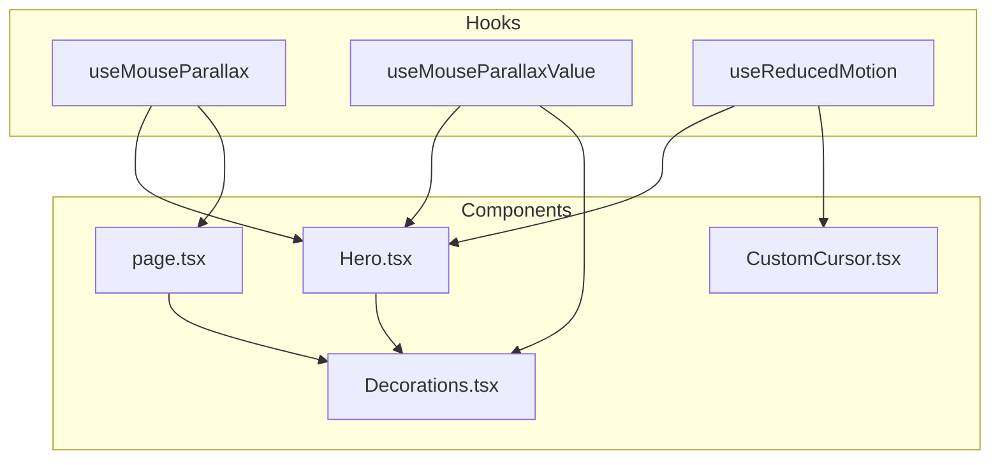
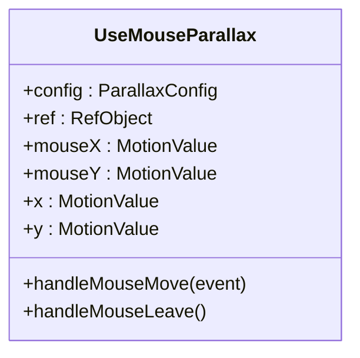
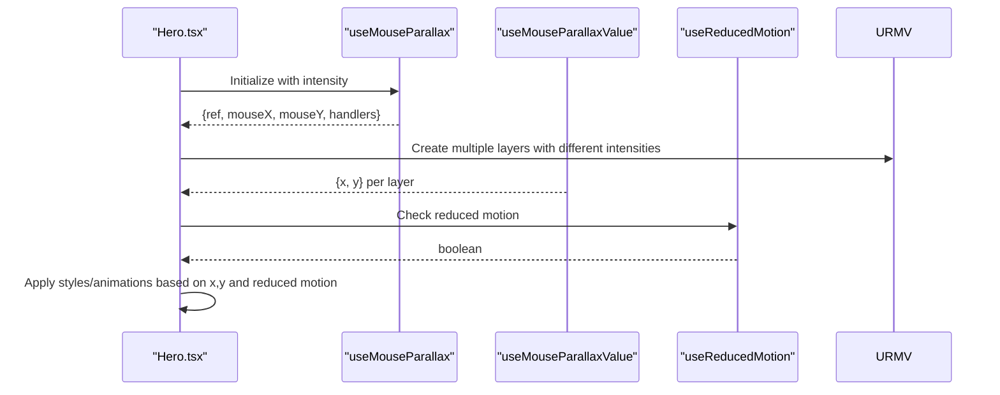
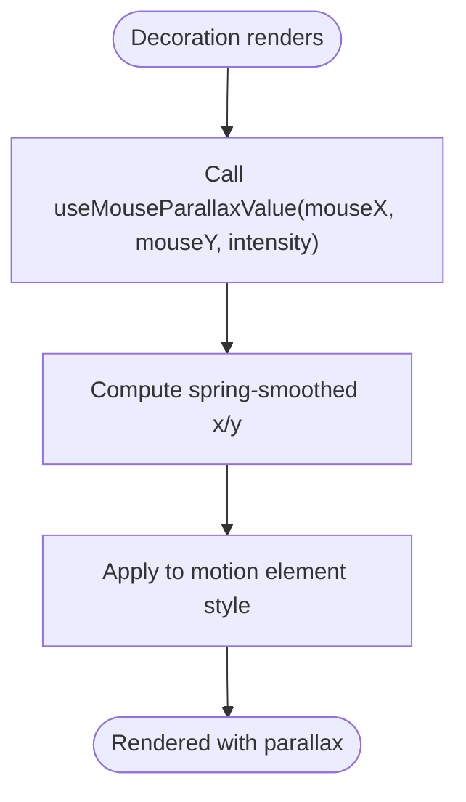
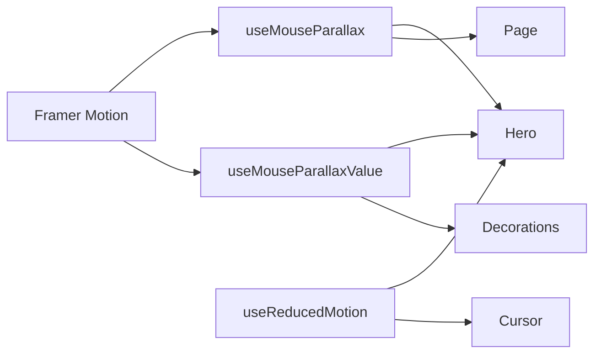

# Custom Hooks

<cite>
**Referenced Files in This Document**
- [useMouseParallax.ts](file://app/hooks/useMouseParallax.ts)
- [useReducedMotion.ts](file://app/hooks/useReducedMotion.ts)
- [Hero.tsx](file://app/components/Hero.tsx)
- [Decorations.tsx](file://app/components/Decorations.tsx)
- [CustomCursor.tsx](file://app/components/CustomCursor.tsx)
- [page.tsx](file://app/page.tsx)
</cite>

## Table of Contents
1. [Introduction](#introduction)
2. [Project Structure](#project-structure)
3. [Core Components](#core-components)
4. [Architecture Overview](#architecture-overview)
5. [Detailed Component Analysis](#detailed-component-analysis)
6. [Dependency Analysis](#dependency-analysis)
7. [Performance Considerations](#performance-considerations)
8. [Troubleshooting Guide](#troubleshooting-guide)
9. [Conclusion](#conclusion)
10. [Appendices](#appendices)

## Introduction
This document explains the custom React hooks that power reusable motion and accessibility behavior across the portfolio:
- useMouseParallax: Creates parallax effects driven by mouse movement using Framer Motion primitives. It provides normalized motion values, spring-smoothed transforms, and event handlers to attach to a container element.
- useReducedMotion: Detects user preference for reduced motion via the prefers-reduced-motion media query and updates reactively when the preference changes.

These hooks are used throughout the application to create layered parallax visuals while respecting accessibility preferences.

## Project Structure
The hooks live under app/hooks and are consumed by components in app/components and the root page. The typical flow is:
- A component calls useMouseParallax on a container to get ref, mouseX/mouseY MotionValues, and event handlers.
- Other elements within or outside that container consume those MotionValues via useMouseParallaxValue to derive smooth x/y transforms with configurable intensity.
- Accessibility-sensitive components call useReducedMotion to disable or adjust animations when users prefer reduced motion.



**Diagram sources**
- [useMouseParallax.ts:12-65](file://app/hooks/useMouseParallax.ts#L12-L65)
- [useReducedMotion.ts:5-19](file://app/hooks/useReducedMotion.ts#L5-L19)
- [Hero.tsx:5-33](file://app/components/Hero.tsx#L5-L33)
- [Decorations.tsx:3-5](file://app/components/Decorations.tsx#L3-L5)
- [CustomCursor.tsx:5-9](file://app/components/CustomCursor.tsx#L5-L9)
- [page.tsx:27-54](file://app/page.tsx#L27-L54)

**Section sources**
- [useMouseParallax.ts:12-65](file://app/hooks/useMouseParallax.ts#L12-L65)
- [useReducedMotion.ts:5-19](file://app/hooks/useReducedMotion.ts#L5-L19)
- [Hero.tsx:5-33](file://app/components/Hero.tsx#L5-L33)
- [Decorations.tsx:3-5](file://app/components/Decorations.tsx#L3-L5)
- [CustomCursor.tsx:5-9](file://app/components/CustomCursor.tsx#L5-L9)
- [page.tsx:27-54](file://app/page.tsx#L27-L54)

## Core Components
- useMouseParallax(config): Returns a DOM ref, normalized mouseX/mouseY MotionValues, smoothed x/y transforms (spring-based), and mouse move/leave handlers. Attach the ref and handlers to a container to capture mouse position relative to its center.
- useMouseParallaxValue(mouseX, mouseY, config): Consumes existing MotionValues and returns spring-smoothed x/y transforms scaled by intensity. Ideal for multiple layers moving at different speeds.
- useReducedMotion(): Returns a boolean indicating whether the user prefers reduced motion. Updates reactively when system settings change.

Key behaviors:
- Normalization: Mouse coordinates are normalized to -1..1 based on the container’s bounding rect, ensuring consistent parallax regardless of size.
- Spring smoothing: Transforms are eased with useSpring for fluid motion.
- Reset on leave: Mouse values reset to zero when the pointer leaves the container.

**Section sources**
- [useMouseParallax.ts:12-45](file://app/hooks/useMouseParallax.ts#L12-L45)
- [useMouseParallax.ts:47-65](file://app/hooks/useMouseParallax.ts#L47-L65)
- [useReducedMotion.ts:5-19](file://app/hooks/useReducedMotion.ts#L5-L19)

## Architecture Overview
The hooks form a small but powerful motion layer:
- Event-driven input: useMouseParallax captures mouse events on a container and emits normalized MotionValues.
- Composable transforms: useMouseParallaxValue composes these inputs into per-layer transforms with independent intensities.
- Accessibility gating: useReducedMotion allows components to conditionally enable/disable motion.

```mermaid
sequenceDiagram
participant C as "Component"
participant H as "useMouseParallax"
participant V as "useMouseParallaxValue"
participant M as "Framer Motion"
participant R as "useReducedMotion"
C->>H : Initialize with config
H-->>C : {ref, mouseX, mouseY, handleMouseMove, handleMouseLeave}
C->>M : Attach ref + onMouseMove/onMouseLeave
C->>V : Provide mouseX, mouseY, intensity
V-->>C : {x, y} spring-transformed values
C->>R : Check prefers-reduced-motion
R-->>C : boolean flag
Note over C,M : Elements animate with x/y; disabled if reduced motion
```

**Diagram sources**
- [useMouseParallax.ts:12-45](file://app/hooks/useMouseParallax.ts#L12-L45)
- [useMouseParallax.ts:47-65](file://app/hooks/useMouseParallax.ts#L47-L65)
- [useReducedMotion.ts:5-19](file://app/hooks/useReducedMotion.ts#L5-L19)
- [Hero.tsx:11-33](file://app/components/Hero.tsx#L11-L33)

## Detailed Component Analysis

### useMouseParallax
Purpose:
- Capture mouse position relative to a container and produce normalized MotionValues.
- Provide spring-smoothed x/y transforms for direct usage.
- Expose raw mouseX/mouseY for composition with other layers.

Parameters:
- config.intensity: Multiplier applied to normalized mouse values before smoothing. Default is tuned for subtle movement.
- config.damping, config.stiffness: Spring physics parameters controlling how quickly and smoothly transforms settle.

Return values:
- ref: DOM reference to attach to the container.
- mouseX, mouseY: Raw normalized MotionValues (-1..1).
- x, y: Smoothed transform values derived from mouseX/mouseY and intensity.
- handleMouseMove, handleMouseLeave: Event handlers to bind to the container.

Implementation highlights:
- Normalization uses the container’s bounding rect to compute offsets from center and scale by half-width/height.
- Spring smoothing ensures performant GPU-accelerated transforms.
- On mouse leave, values reset to origin to avoid lingering transforms.

Usage example pattern:
- Attach ref and event handlers to a section/container.
- Pass mouseX/mouseY to child components or useMouseParallaxValue for additional layers.

Edge cases:
- If the container ref is not yet available during an event, the handler safely exits without updating values.
- Works best with client-side rendering due to DOM access.

Accessibility considerations:
- Combine with useReducedMotion to disable or reduce motion when preferred.

**Section sources**
- [useMouseParallax.ts:12-45](file://app/hooks/useMouseParallax.ts#L12-L45)

#### Class-like view of useMouseParallax internals


**Diagram sources**
- [useMouseParallax.ts:6-45](file://app/hooks/useMouseParallax.ts#L6-L45)

### useMouseParallaxValue
Purpose:
- Convert existing mouseX/mouseY MotionValues into spring-smoothed x/y transforms with a given intensity.
- Enable multiple layers to respond to the same mouse input with different speeds/directions.

Parameters:
- mouseX, mouseY: MotionValues from useMouseParallax or any source.
- config.intensity, config.damping, config.stiffness: Same semantics as above.

Return values:
- x, y: Smoothed transform values ready to apply to motion-enabled elements.

Usage example pattern:
- In a parent component, obtain mouseX/mouseY from useMouseParallax.
- Call useMouseParallaxValue multiple times with different intensities to create depth.

**Section sources**
- [useMouseParallax.ts:47-65](file://app/hooks/useMouseParallax.ts#L47-L65)

### useReducedMotion
Purpose:
- Detect and react to the user’s reduced motion preference.
- Provide a boolean flag to gate or adjust animations.

Behavior:
- Initializes state from the current media query result.
- Subscribes to changes and updates state when the user toggles their preference.
- Safely handles server-side rendering by defaulting to false when window is unavailable.

Usage example pattern:
- Read the boolean and conditionally render or animate elements accordingly.

**Section sources**
- [useReducedMotion.ts:5-19](file://app/hooks/useReducedMotion.ts#L5-L19)

### Integration Examples in Components

#### Hero component
- Calls useMouseParallax on the hero container to capture mouse movement.
- Uses useMouseParallaxValue multiple times with varying intensities to create layered parallax for decorative elements and text.
- Reads useReducedMotion to conditionally animate an indicator arrow.



**Diagram sources**
- [Hero.tsx:11-33](file://app/components/Hero.tsx#L11-L33)
- [useMouseParallax.ts:12-45](file://app/hooks/useMouseParallax.ts#L12-L45)
- [useMouseParallax.ts:47-65](file://app/hooks/useMouseParallax.ts#L47-L65)
- [useReducedMotion.ts:5-19](file://app/hooks/useReducedMotion.ts#L5-L19)

**Section sources**
- [Hero.tsx:11-33](file://app/components/Hero.tsx#L11-L33)

#### Decorations components
- Reusable visual elements (GlowOrb, FloatingRing, FloatingDot, FloatingPlus) accept mouseX/mouseY and intensity props.
- Internally call useMouseParallaxValue to derive x/y transforms and apply them to motion-enabled nodes.



**Diagram sources**
- [Decorations.tsx:7-43](file://app/components/Decorations.tsx#L7-L43)
- [Decorations.tsx:45-67](file://app/components/Decorations.tsx#L45-L67)
- [Decorations.tsx:69-91](file://app/components/Decorations.tsx#L69-L91)
- [Decorations.tsx:93-120](file://app/components/Decorations.tsx#L93-L120)
- [useMouseParallax.ts:47-65](file://app/hooks/useMouseParallax.ts#L47-L65)

**Section sources**
- [Decorations.tsx:7-120](file://app/components/Decorations.tsx#L7-L120)

#### CustomCursor component
- Uses useReducedMotion to detect accessibility preferences.
- Disables custom cursor entirely when reduced motion is preferred or on touch devices.
- Demonstrates conditional logic around motion-heavy features.

**Section sources**
- [CustomCursor.tsx:5-9](file://app/components/CustomCursor.tsx#L5-L9)
- [CustomCursor.tsx:20-59](file://app/components/CustomCursor.tsx#L20-L59)

#### Root page sections
- Sections like About use useMouseParallax to provide mouseX/mouseY to decoration components, creating cohesive parallax across the page.

**Section sources**
- [page.tsx:27-54](file://app/page.tsx#L27-L54)

## Dependency Analysis
- useMouseParallax depends on Framer Motion primitives: useMotionValue, useTransform, useSpring.
- useMouseParallaxValue also depends on Framer Motion for transforming and springing MotionValues.
- Components consuming these hooks depend on Framer Motion’s motion components for applying transforms.
- useReducedMotion depends only on React and browser APIs (matchMedia).



**Diagram sources**
- [useMouseParallax.ts:1-5](file://app/hooks/useMouseParallax.ts#L1-L5)
- [useMouseParallax.ts:47-65](file://app/hooks/useMouseParallax.ts#L47-L65)
- [useReducedMotion.ts:1-4](file://app/hooks/useReducedMotion.ts#L1-L4)
- [Hero.tsx:1-7](file://app/components/Hero.tsx#L1-L7)
- [Decorations.tsx:1-5](file://app/components/Decorations.tsx#L1-L5)
- [CustomCursor.tsx:1-5](file://app/components/CustomCursor.tsx#L1-L5)

**Section sources**
- [useMouseParallax.ts:1-5](file://app/hooks/useMouseParallax.ts#L1-L5)
- [useReducedMotion.ts:1-4](file://app/hooks/useReducedMotion.ts#L1-L4)
- [Hero.tsx:1-7](file://app/components/Hero.tsx#L1-L7)
- [Decorations.tsx:1-5](file://app/components/Decorations.tsx#L1-L5)
- [CustomCursor.tsx:1-5](file://app/components/CustomCursor.tsx#L1-L5)

## Performance Considerations
- Prefer using MotionValues and spring transforms for GPU-accelerated animations.
- Keep intensity values modest to avoid excessive movement and layout thrashing.
- Avoid re-creating MotionValues inside render loops; the hooks encapsulate stable references.
- When many layers use the same mouseX/mouseY, reuse the values rather than duplicating listeners.
- Respect reduced motion to minimize work on devices or for users who prefer it.

[No sources needed since this section provides general guidance]

## Troubleshooting Guide
Common issues and resolutions:
- No parallax effect: Ensure the container ref is attached and event handlers are bound. Verify the container has dimensions so normalization works correctly.
- Jittery motion: Adjust damping/stiffness in config to make transitions smoother.
- Values not resetting: Confirm handleMouseLeave is attached and fires when the pointer exits the container.
- Reduced motion not respected: Ensure components read the reduced motion flag and conditionally disable animations.
- SSR mismatch: useReducedMotion guards against undefined window during SSR; ensure client-only code runs after mount.

**Section sources**
- [useMouseParallax.ts:28-42](file://app/hooks/useMouseParallax.ts#L28-L42)
- [useReducedMotion.ts:5-19](file://app/hooks/useReducedMotion.ts#L5-L19)
- [Hero.tsx:11-33](file://app/components/Hero.tsx#L11-L33)
- [CustomCursor.tsx:20-59](file://app/components/CustomCursor.tsx#L20-L59)

## Conclusion
These hooks provide a clean, composable foundation for parallax and accessibility-aware motion:
- useMouseParallax centralizes mouse tracking and exposes both raw and smoothed values.
- useMouseParallaxValue enables multi-layer parallax with simple configuration.
- useReducedMotion ensures the experience adapts to user preferences.

By following the patterns shown in Hero, Decorations, CustomCursor, and page sections, you can extend these hooks to new components while maintaining performance and accessibility.

[No sources needed since this section summarizes without analyzing specific files]

## Appendices

### API Reference Summary

- useMouseParallax(config)
  - Parameters:
    - intensity: number (default ~20)
    - damping: number (default ~25)
    - stiffness: number (default ~150)
  - Returns:
    - ref: DOM ref for container
    - mouseX, mouseY: MotionValues in range -1..1
    - x, y: Smoothed transforms
    - handleMouseMove, handleMouseLeave: Event handlers

- useMouseParallaxValue(mouseX, mouseY, config)
  - Parameters:
    - mouseX, mouseY: MotionValues
    - intensity, damping, stiffness: same as above
  - Returns:
    - x, y: Smoothed transforms

- useReducedMotion()
  - Returns: boolean reflecting prefers-reduced-motion setting

**Section sources**
- [useMouseParallax.ts:6-45](file://app/hooks/useMouseParallax.ts#L6-L45)
- [useMouseParallax.ts:47-65](file://app/hooks/useMouseParallax.ts#L47-L65)
- [useReducedMotion.ts:5-19](file://app/hooks/useReducedMotion.ts#L5-L19)