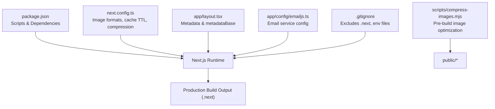
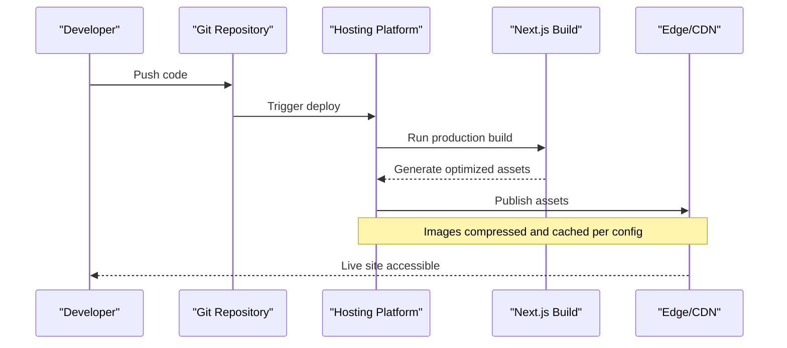
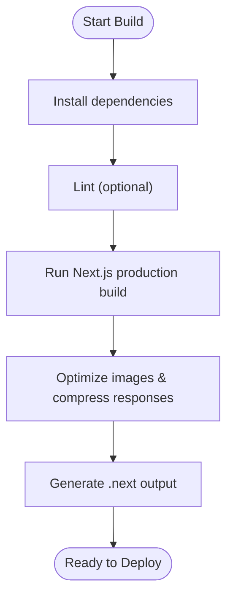
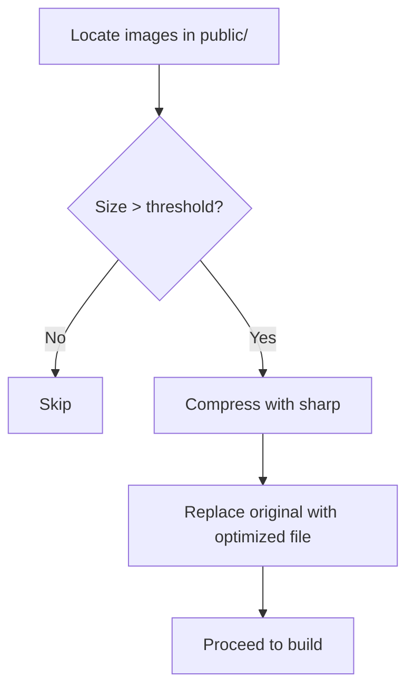
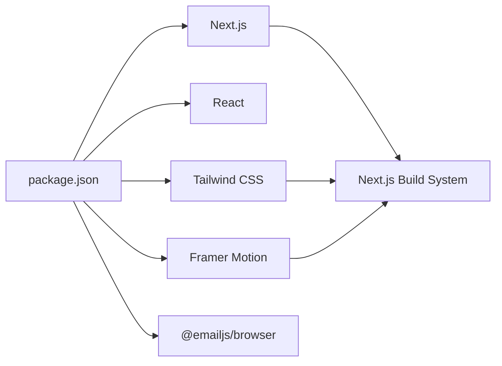

# Deployment Guide

<cite>
**Referenced Files in This Document**
- [package.json](file://package.json)
- [next.config.ts](file://next.config.ts)
- [README.md](file://README.md)
- [app/layout.tsx](file://app/layout.tsx)
- [app/config/emailjs.ts](file://app/config/emailjs.ts)
- [.gitignore](file://.gitignore)
- [scripts/compress-images.mjs](file://scripts/compress-images.mjs)
</cite>

## Table of Contents
1. [Introduction](#introduction)
2. [Project Structure](#project-structure)
3. [Core Components](#core-components)
4. [Architecture Overview](#architecture-overview)
5. [Detailed Component Analysis](#detailed-component-analysis)
6. [Dependency Analysis](#dependency-analysis)
7. [Performance Considerations](#performance-considerations)
8. [Troubleshooting Guide](#troubleshooting-guide)
9. [Conclusion](#conclusion)
10. [Appendices](#appendices)

## Introduction
This guide documents how to build and deploy the Next.js portfolio website to production, including environment configuration, domain and SSL setup, monitoring/analytics integration, troubleshooting, and CI/CD recommendations. The project uses Next.js App Router with client components and includes image optimization and compression settings configured for performance.

## Project Structure
The application is a Next.js site using the App Router. Key deployment-relevant files include:
- Build scripts and dependencies defined in package.json
- Next.js runtime and optimization settings in next.config.ts
- Root layout metadata and base URL in app/layout.tsx
- EmailJS configuration used by the contact form in app/config/emailjs.ts
- Image compression script under scripts/compress-images.mjs
- .gitignore rules that exclude build artifacts and environment files

**Diagram sources**
- [package.json:1-32](file://package.json#L1-L32)
- [next.config.ts:1-20](file://next.config.ts#L1-L20)
- [app/layout.tsx:1-107](file://app/layout.tsx#L1-L107)
- [app/config/emailjs.ts:1-15](file://app/config/emailjs.ts#L1-L15)
- [scripts/compress-images.mjs:1-43](file://scripts/compress-images.mjs#L1-L43)
- [.gitignore:1-41](file://.gitignore#L1-L41)

**Section sources**
- [package.json:1-32](file://package.json#L1-L32)
- [next.config.ts:1-20](file://next.config.ts#L1-L20)
- [app/layout.tsx:1-107](file://app/layout.tsx#L1-L107)
- [app/config/emailjs.ts:1-15](file://app/config/emailjs.ts#L1-L15)
- [scripts/compress-images.mjs:1-43](file://scripts/compress-images.mjs#L1-L43)
- [.gitignore:1-41](file://.gitignore#L1-L41)

## Core Components
- Build and start commands are provided via npm scripts for development, production build, and serving the built output.
- Next.js configuration enables modern image formats, responsive sizes, long cache TTL, response compression, and removal of server identification headers.
- Root layout defines metadata and sets a canonical metadata base URL for SEO and social sharing.
- Contact form relies on EmailJS configuration; ensure these values are managed securely in production environments.
- An optional pre-build image compression script can reduce asset sizes before deployment.

**Section sources**
- [package.json:1-32](file://package.json#L1-L32)
- [next.config.ts:1-20](file://next.config.ts#L1-L20)
- [app/layout.tsx:1-107](file://app/layout.tsx#L1-L107)
- [app/config/emailjs.ts:1-15](file://app/config/emailjs.ts#L1-L15)
- [scripts/compress-images.mjs:1-43](file://scripts/compress-images.mjs#L1-L43)

## Architecture Overview
The deployment pipeline builds static assets and optimized bundles using Next.js, then serves them through a production-capable host. The root layout’s metadata base URL anchors all absolute URLs for SEO and social cards. Image optimization is handled at build time and served via Next.js’s image pipeline.

[No sources needed since this diagram shows conceptual workflow, not actual code structure]

## Detailed Component Analysis

### Production Build Process
- Use the provided npm scripts to run the development server, create a production build, and start the production server locally.
- The build outputs a .next directory containing optimized bundles and static assets.
- Response compression is enabled, and images are served in modern formats with aggressive caching.

**Section sources**
- [package.json:1-32](file://package.json#L1-L32)
- [next.config.ts:1-20](file://next.config.ts#L1-L20)

### Environment Variables Configuration
- The repository ignores environment files from version control, so do not commit secrets.
- For EmailJS, configuration is present in a dedicated file. In production, manage sensitive keys via your hosting platform’s environment variables or secret management.
- The root layout sets a metadata base URL; ensure it matches your production domain.

Recommended steps:
- Create environment variables for any secrets (e.g., EmailJS keys) in your hosting dashboard.
- If you choose to use Next.js public environment variables, prefix them appropriately and avoid storing secrets there.
- Verify the metadata base URL aligns with your live domain.

**Section sources**
- [.gitignore:1-41](file://.gitignore#L1-L41)
- [app/config/emailjs.ts:1-15](file://app/config/emailjs.ts#L1-L15)
- [app/layout.tsx:1-107](file://app/layout.tsx#L1-L107)

### Domain Setup and SSL
- Configure your custom domain on your hosting provider and enable automatic HTTPS/SSL where supported.
- Ensure DNS records point to the platform’s endpoints.
- Validate that the metadata base URL in the root layout matches your production domain to avoid mixed-content issues.

[No sources needed since this section provides general guidance]

### Monitoring and Analytics
- Add analytics SDKs (e.g., Google Analytics, Plausible, Vercel Analytics) via your preferred method (script injection or framework integration).
- Instrument key user interactions (form submissions, navigation events) to measure engagement.
- Set up error tracking and uptime monitoring if applicable.

[No sources needed since this section provides general guidance]

### Pre-Build Image Optimization
- Use the included image compression script to optimize large images in the public directory prior to building.
- This reduces payload size and improves load performance.

**Section sources**
- [scripts/compress-images.mjs:1-43](file://scripts/compress-images.mjs#L1-L43)

## Dependency Analysis
The project depends on Next.js and React, with additional UI and animation libraries. The build process compiles TypeScript and processes CSS via PostCSS/Tailwind.

**Diagram sources**
- [package.json:1-32](file://package.json#L1-L32)

**Section sources**
- [package.json:1-32](file://package.json#L1-L32)

## Performance Considerations
- Image optimization: Modern formats (AVIF/WebP), device-specific sizes, and long cache TTL are configured to improve performance.
- Compression: All responses are compressed to reduce transfer size.
- Asset hygiene: Use the image compression script to minimize payload before deployment.
- Fonts: Prefer system fonts or next/font usage to avoid render-blocking font loads.

**Section sources**
- [next.config.ts:1-20](file://next.config.ts#L1-L20)
- [scripts/compress-images.mjs:1-43](file://scripts/compress-images.mjs#L1-L43)

## Troubleshooting Guide
Common deployment issues and resolutions:
- Build fails due to missing dependencies: Ensure dependencies are installed and Node version matches requirements.
- Environment variables not applied: Confirm secrets are set in the hosting platform’s environment settings and that variable names match expectations.
- Mixed content or incorrect base URL: Verify the metadata base URL in the root layout matches your production domain.
- Large images slowing down the site: Run the image compression script and re-deploy.
- Email form not sending: Check EmailJS credentials and template IDs in the configuration; ensure they are correctly set in production.

Rollback procedures:
- Revert to a previous Git commit and redeploy.
- On platforms with preview deployments, promote a known-good build back to production.
- Maintain tagged releases for quick rollback points.

**Section sources**
- [app/layout.tsx:1-107](file://app/layout.tsx#L1-L107)
- [app/config/emailjs.ts:1-15](file://app/config/emailjs.ts#L1-L15)
- [scripts/compress-images.mjs:1-43](file://scripts/compress-images.mjs#L1-L43)

## Conclusion
This portfolio site is optimized for production with Next.js image handling, compression, and clean metadata configuration. Follow the steps above to build, configure environment variables, deploy to your chosen platform, and monitor performance. Use the provided scripts and configurations to maintain fast load times and reliable operation.

[No sources needed since this section summarizes without analyzing specific files]

## Appendices

### Deployment to Popular Platforms

- Vercel
  - Connect your repository and deploy. Vercel auto-detects Next.js and runs the production build.
  - Set environment variables in the Vercel dashboard for secrets.
  - Configure a custom domain and enable automatic HTTPS.

- Netlify
  - Connect your repository and set build command to the production build script and publish directory to the Next.js build output.
  - Add environment variables in the Netlify dashboard.
  - Configure redirects and custom domains with automatic SSL.

- Custom Hosting (Node-based)
  - Build the project and serve the .next output using a Node server or static hosting with appropriate headers.
  - Ensure environment variables are injected at runtime.
  - Place a reverse proxy (e.g., Nginx) in front to handle SSL termination and caching.

[No sources needed since this section provides general guidance]

### CI/CD Pipeline Recommendations
- Use GitHub Actions to lint, build, and test on each push.
- Cache node_modules to speed up builds.
- Deploy to staging on feature branches and to production on main with approval gates.
- Store secrets in your CI/CD provider’s secret store.
- Automate domain and SSL verification checks post-deploy.

[No sources needed since this section provides general guidance]