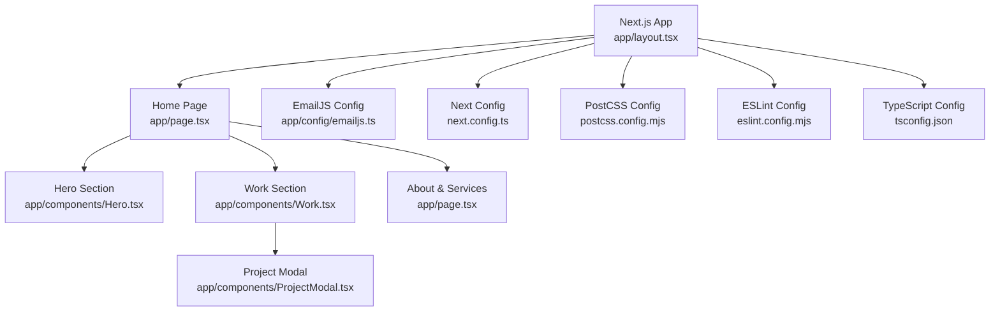
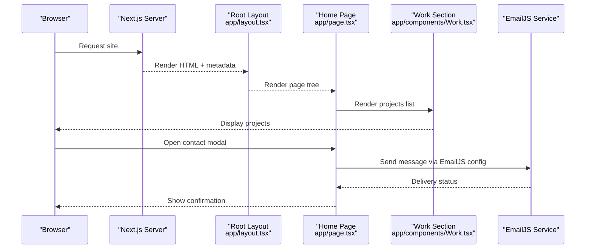
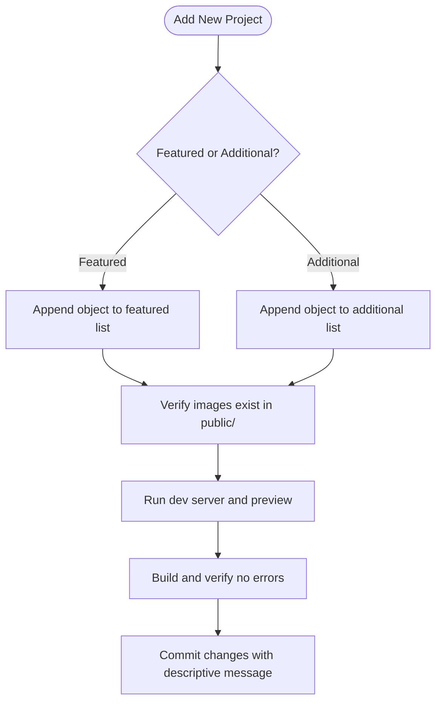
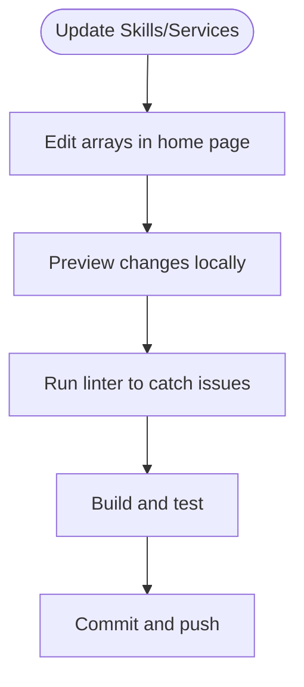
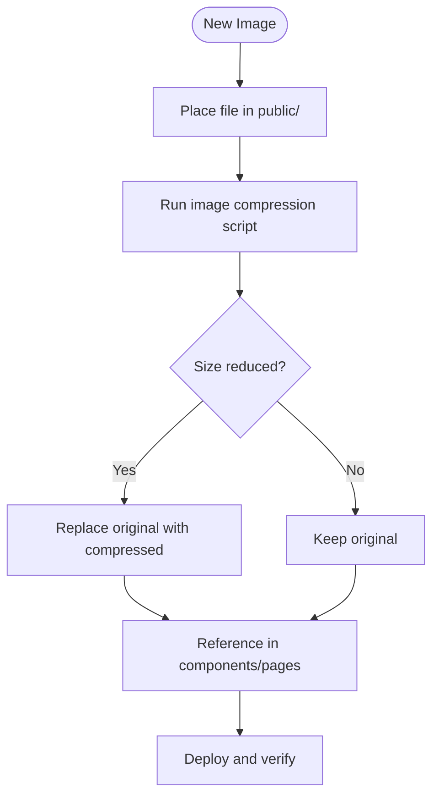
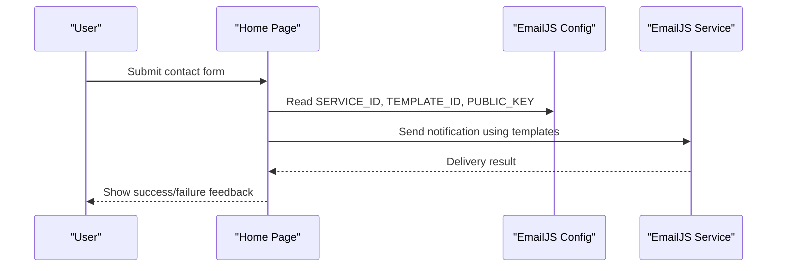
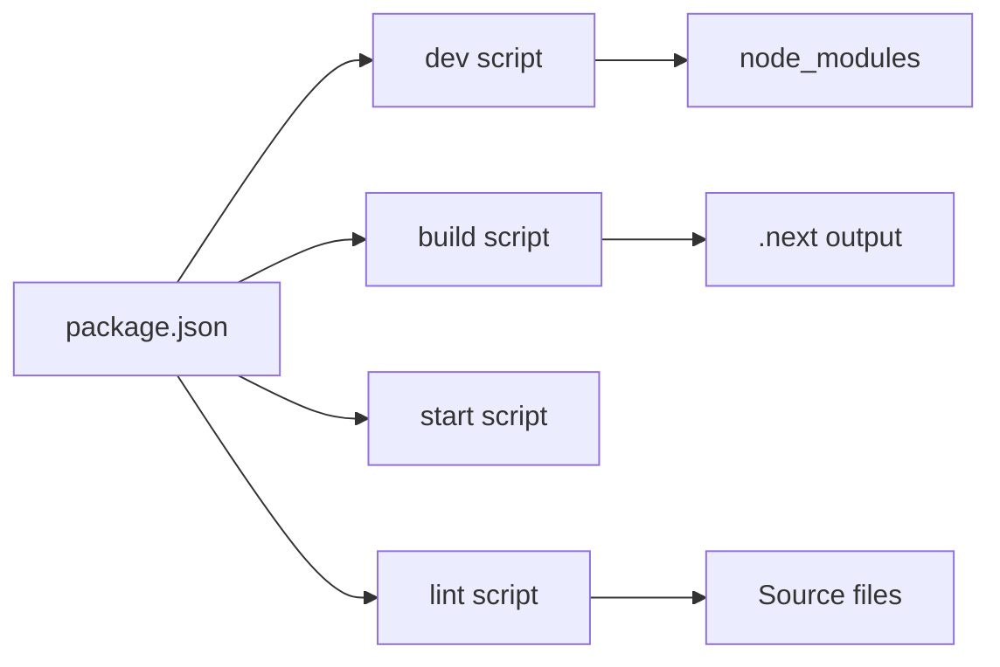

# Maintenance and Updates

<cite>
**Referenced Files in This Document**
- [package.json](file://package.json)
- [README.md](file://README.md)
- [next.config.ts](file://next.config.ts)
- [app/layout.tsx](file://app/layout.tsx)
- [app/page.tsx](file://app/page.tsx)
- [app/components/Work.tsx](file://app/components/Work.tsx)
- [app/components/Hero.tsx](file://app/components/Hero.tsx)
- [app/config/emailjs.ts](file://app/config/emailjs.ts)
- [scripts/compress-images.mjs](file://scripts/compress-images.mjs)
- [eslint.config.mjs](file://eslint.config.mjs)
- [postcss.config.mjs](file://postcss.config.mjs)
- [tsconfig.json](file://tsconfig.json)
</cite>

## Table of Contents
1. Introduction
2. Project Structure
3. Core Components
4. Architecture Overview
5. Detailed Component Analysis
6. Dependency Analysis
7. Performance Considerations
8. Troubleshooting Guide
9. Conclusion
10. Appendices

## Introduction
This document provides maintenance and update guidance for the portfolio website to keep it current, performant, and reliable. It covers:
- Updating content (projects, skills/services, contact configuration)
- Managing media assets (optimization and organization)
- Updating dependencies safely with package managers
- Testing strategies for compatibility and performance
- Content management and version control best practices
- Troubleshooting common issues and debugging techniques
- Backup and disaster recovery procedures

## Project Structure
The site is a Next.js application using React, TypeScript, Tailwind CSS, and Framer Motion. Key areas:
- app/: page components, layout, hooks, and client-side features
- public/: static assets (images referenced by pages)
- scripts/: utility scripts (e.g., image compression)
- Configuration files for Next.js, ESLint, PostCSS, and TypeScript

**Diagram sources**
- [app/layout.tsx:1-107](file://app/layout.tsx#L1-L107)
- [app/page.tsx:1-588](file://app/page.tsx#L1-L588)
- [app/components/Hero.tsx:1-187](file://app/components/Hero.tsx#L1-L187)
- [app/components/Work.tsx:1-499](file://app/components/Work.tsx#L1-L499)
- [next.config.ts:1-20](file://next.config.ts#L1-L20)
- [postcss.config.mjs:1-8](file://postcss.config.mjs#L1-L8)
- [eslint.config.mjs:1-19](file://eslint.config.mjs#L1-L19)
- [tsconfig.json:1-35](file://tsconfig.json#L1-L35)

**Section sources**
- [README.md:1-37](file://README.md#L1-L37)
- [package.json:1-32](file://package.json#L1-L32)

## Core Components
- Home page orchestrates sections: Hero, Work, About, Services, Contact modal.
- Work section manages project listings and modals; projects are defined as data arrays within the component.
- Hero section renders hero imagery and parallax effects.
- EmailJS configuration centralizes service and template IDs for contact form notifications.

Content updates typically involve editing data arrays or text in these files rather than deep code changes.

**Section sources**
- [app/page.tsx:1-588](file://app/page.tsx#L1-L588)
- [app/components/Work.tsx:1-499](file://app/components/Work.tsx#L1-L499)
- [app/components/Hero.tsx:1-187](file://app/components/Hero.tsx#L1-L187)
- [app/config/emailjs.ts:1-15](file://app/config/emailjs.ts#L1-L15)

## Architecture Overview
High-level flow from root layout to interactive sections and external integrations:

**Diagram sources**
- [app/layout.tsx:30-89](file://app/layout.tsx#L30-L89)
- [app/page.tsx:557-588](file://app/page.tsx#L557-L588)
- [app/components/Work.tsx:352-499](file://app/components/Work.tsx#L352-L499)
- [app/config/emailjs.ts:6-15](file://app/config/emailjs.ts#L6-L15)

## Detailed Component Analysis

### Projects Management (Work Section)
Projects are represented as structured data objects with fields such as id, title, category, description, fullDescription, year, color, tag, role, timeline, techStack, outcomes, links, designProcess, and images. Two lists exist: featured and additional. The UI toggles visibility of additional projects and opens a modal for details.

To add a new project:
- Add an object following the existing structure into either the featured or additional array.
- Ensure images referenced under images exist in the public directory.
- Update any related design process arrays if needed.

**Diagram sources**
- [app/components/Work.tsx:71-195](file://app/components/Work.tsx#L71-L195)
- [app/components/Work.tsx:199-294](file://app/components/Work.tsx#L199-L294)
- [app/components/Work.tsx:352-499](file://app/components/Work.tsx#L352-L499)

**Section sources**
- [app/components/Work.tsx:71-195](file://app/components/Work.tsx#L71-L195)
- [app/components/Work.tsx:199-294](file://app/components/Work.tsx#L199-L294)
- [app/components/Work.tsx:352-499](file://app/components/Work.tsx#L352-L499)

### Skills and Services Updates
Skills and services are embedded directly in the home page component. To update:
- Edit the competencies and tool categories arrays for skills.
- Edit the services array for service offerings.
- Adjust labels, descriptions, and icons as needed.

**Diagram sources**
- [app/page.tsx:47-160](file://app/page.tsx#L47-L160)
- [app/page.tsx:374-487](file://app/page.tsx#L374-L487)

**Section sources**
- [app/page.tsx:47-160](file://app/page.tsx#L47-L160)
- [app/page.tsx:374-487](file://app/page.tsx#L374-L487)

### Media Assets Management
Images are stored in the public directory and referenced by path. Use the provided script to compress large images before deployment to improve load times.

Recommended workflow:
- Place new images in public/.
- Run the compression script to optimize PNG/JPG files above a size threshold.
- Reference optimized images in components.

**Diagram sources**
- [scripts/compress-images.mjs:1-44](file://scripts/compress-images.mjs#L1-L44)

**Section sources**
- [scripts/compress-images.mjs:1-44](file://scripts/compress-images.mjs#L1-L44)

### Contact Form Integration
Contact form notifications are handled via EmailJS. Update service and template IDs in the configuration file to ensure emails route correctly.

**Diagram sources**
- [app/config/emailjs.ts:6-15](file://app/config/emailjs.ts#L6-L15)
- [app/page.tsx:557-588](file://app/page.tsx#L557-L588)

**Section sources**
- [app/config/emailjs.ts:1-15](file://app/config/emailjs.ts#L1-L15)

## Dependency Analysis
Dependencies are managed via npm/yarn/pnpm/bun through package.json. Scripts include development, build, start, and lint tasks.

Key points:
- Use the provided scripts to run dev, build, and lint.
- Update dependencies carefully and validate builds.
- Lockfiles (e.g., package-lock.json) should be committed to ensure reproducible installs.

**Diagram sources**
- [package.json:5-30](file://package.json#L5-L30)

**Section sources**
- [package.json:1-32](file://package.json#L1-L32)

## Performance Considerations
- Images: Next.js automatically serves modern formats and caches optimized images. Configure device sizes and cache TTL as needed.
- Compression: Enable response compression globally.
- Fonts: Use next/font for efficient font loading with swap strategy.
- Accessibility: Respect prefers-reduced-motion to minimize animations for users who prefer reduced motion.

Operational tips:
- Keep images optimized using the compression script.
- Monitor bundle size and avoid unnecessary dependencies.
- Use lazy loading for non-critical images where appropriate.

**Section sources**
- [next.config.ts:3-17](file://next.config.ts#L3-L17)
- [app/layout.tsx:5-22](file://app/layout.tsx#L5-L22)
- [app/hooks/useReducedMotion.ts:1-20](file://app/hooks/useReducedMotion.ts#L1-L20)
- [scripts/compress-images.mjs:1-44](file://scripts/compress-images.mjs#L1-L44)

## Troubleshooting Guide
Common issues and resolutions:
- Build fails after dependency update:
  - Reinstall dependencies and rebuild.
  - Check for peer dependency conflicts and align versions.
- Images not loading:
  - Ensure paths match actual filenames in public/.
  - Confirm file names and extensions are correct.
- Contact emails not received:
  - Verify EmailJS service and template IDs are set correctly.
  - Test sending a sample email via EmailJS dashboard.
- Linting errors:
  - Run the linter and fix reported issues before committing.
- Excessive animations on low-power devices:
  - Ensure reduced motion preferences are respected.

Debugging steps:
- Run the development server and inspect console for errors.
- Use browser developer tools to check network requests and resource loading.
- Validate environment variables and configuration values.

**Section sources**
- [app/config/emailjs.ts:6-15](file://app/config/emailjs.ts#L6-L15)
- [eslint.config.mjs:1-19](file://eslint.config.mjs#L1-L19)
- [app/hooks/useReducedMotion.ts:1-20](file://app/hooks/useReducedMotion.ts#L1-L20)

## Conclusion
Maintaining this portfolio involves straightforward content edits, careful asset optimization, and disciplined dependency management. Follow the outlined processes to update projects, skills, services, and media while ensuring performance and reliability. Use testing and linting to catch issues early, and adopt version control best practices to track changes effectively.

## Appendices

### Content Management Guidelines
- Keep project data consistent and complete: include all required fields for clarity and display.
- Organize images logically in public/ and reference them consistently.
- Update SEO metadata in the root layout when changing titles, descriptions, or social previews.

**Section sources**
- [app/components/Work.tsx:71-195](file://app/components/Work.tsx#L71-L195)
- [app/layout.tsx:30-89](file://app/layout.tsx#L30-L89)

### Version Control Best Practices
- Create feature branches for updates and open pull requests for review.
- Write clear commit messages describing what changed and why.
- Keep lockfiles committed to ensure consistent environments across machines.

[No sources needed since this section provides general guidance]

### Backup and Disaster Recovery
- Back up the repository regularly (remote Git hosting).
- Snapshot production deployments and configurations.
- Maintain a documented rollback procedure: revert to last known good commit and redeploy.

[No sources needed since this section provides general guidance]