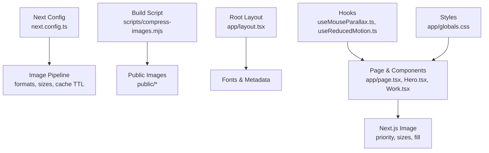
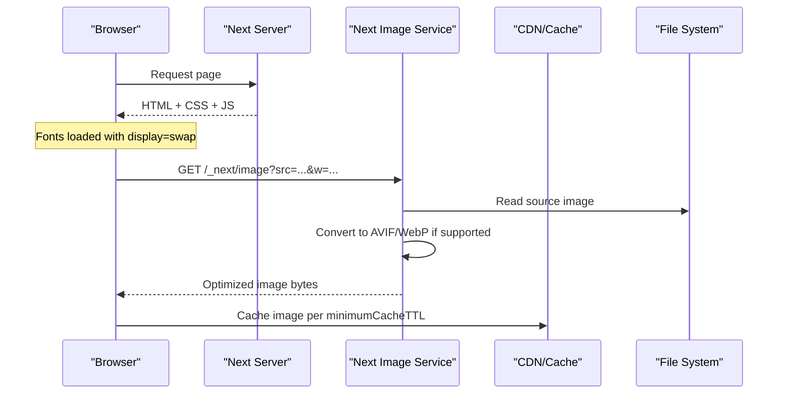
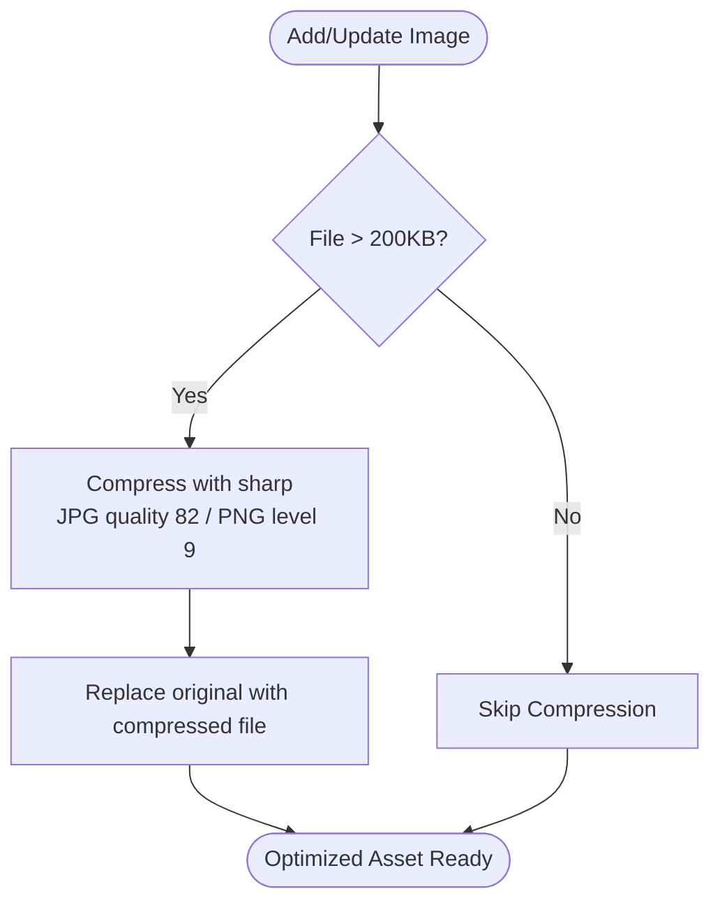
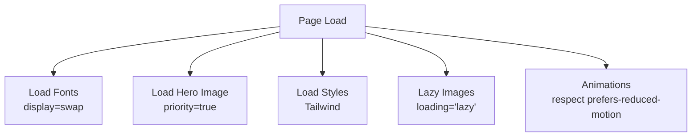
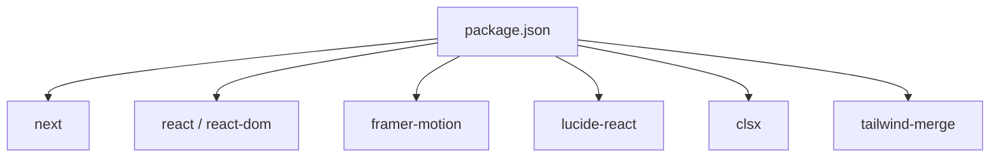

# Performance Optimization

<cite>
**Referenced Files in This Document**
- [next.config.ts](file://next.config.ts)
- [compress-images.mjs](file://scripts/compress-images.mjs)
- [package.json](file://package.json)
- [layout.tsx](file://app/layout.tsx)
- [page.tsx](file://app/page.tsx)
- [Hero.tsx](file://app/components/Hero.tsx)
- [Work.tsx](file://app/components/Work.tsx)
- [ProjectModal.tsx](file://app/components/ProjectModal.tsx)
- [useMouseParallax.ts](file://app/hooks/useMouseParallax.ts)
- [useReducedMotion.ts](file://app/hooks/useReducedMotion.ts)
- [globals.css](file://app/globals.css)
</cite>

## Table of Contents
1. Introduction
2. Project Structure
3. Core Components
4. Architecture Overview
5. Detailed Component Analysis
6. Dependency Analysis
7. Performance Considerations
8. Troubleshooting Guide
9. Conclusion
10. Appendices

## Introduction
This document explains the performance optimization strategies implemented in the portfolio website, focusing on image optimization with Next.js Image and a custom compression script, bundle optimization via code splitting and lazy loading, resource loading priorities, caching, mobile considerations, and guidance for maintaining performance as new content or features are added. It also outlines monitoring approaches and metrics to measure improvements.

## Project Structure
The project is a Next.js application with:
- A root layout that configures fonts and metadata
- Client components using Framer Motion for animations
- Optimized images via Next.js Image component
- A build-time image compression script
- Tailwind CSS for styling
- Minimal runtime dependencies

**Diagram sources**
- [next.config.ts:3-17](file://next.config.ts#L3-L17)
- [compress-images.mjs:1-44](file://scripts/compress-images.mjs#L1-L44)
- [layout.tsx:1-107](file://app/layout.tsx#L1-L107)
- [page.tsx:1-588](file://app/page.tsx#L1-L588)
- [Hero.tsx:1-187](file://app/components/Hero.tsx#L1-L187)
- [Work.tsx:1-499](file://app/components/Work.tsx#L1-L499)
- [useMouseParallax.ts:1-66](file://app/hooks/useMouseParallax.ts#L1-L66)
- [useReducedMotion.ts:1-19](file://app/hooks/useReducedMotion.ts#L1-L19)
- [globals.css:1-113](file://app/globals.css#L1-L113)

**Section sources**
- [next.config.ts:3-17](file://next.config.ts#L3-L17)
- [package.json:1-32](file://package.json#L1-L32)
- [layout.tsx:1-107](file://app/layout.tsx#L1-L107)

## Core Components
- Root layout sets up optimized Google Fonts with display swap and provides metadata (title, description, Open Graph, Twitter cards).
- Page composes sections and client-side components; uses motion-based interactions and responsive layouts.
- Hero uses Next.js Image with priority, fill, and sizes to optimize the hero image delivery.
- Work section lists projects and opens a modal; images are referenced from static assets.
- ProjectModal implements a lightbox with keyboard navigation and zoom controls.
- Hooks provide mouse parallax with spring physics and reduced-motion detection.
- Styles include smooth scrolling, theme variables, and reduced motion media query.

Key performance-relevant patterns:
- Font loading with display swap reduces FOIT and improves perceived performance.
- Next.js Image configured for modern formats and responsive sizing.
- Animations respect user preferences via reduced motion hook and CSS.
- Lightweight dependency set minimizes bundle size.

**Section sources**
- [layout.tsx:5-22](file://app/layout.tsx#L5-L22)
- [layout.tsx:30-89](file://app/layout.tsx#L30-L89)
- [Hero.tsx:148-155](file://app/components/Hero.tsx#L148-L155)
- [Work.tsx:352-499](file://app/components/Work.tsx#L352-L499)
- [ProjectModal.tsx:125-200](file://app/components/ProjectModal.tsx#L125-L200)
- [useMouseParallax.ts:12-45](file://app/hooks/useMouseParallax.ts#L12-L45)
- [useReducedMotion.ts:5-19](file://app/hooks/useReducedMotion.ts#L5-L19)
- [globals.css:19-29](file://app/globals.css#L19-L29)
- [globals.css:102-112](file://app/globals.css#L102-L112)

## Architecture Overview
The performance architecture combines server-side configuration, build-time asset processing, and client-side optimizations:

**Diagram sources**
- [next.config.ts:3-17](file://next.config.ts#L3-L17)
- [Hero.tsx:148-155](file://app/components/Hero.tsx#L148-L155)

## Detailed Component Analysis

### Image Optimization Strategy
- Next.js Image usage:
  - Hero image uses fill and sizes attributes to deliver responsive images tailored to viewport widths.
  - Priority flag ensures critical above-the-fold image loads early.
- Next.js Image service configuration:
  - Modern formats enabled (AVIF, WebP) for smaller payloads where supported.
  - Device and image size steps define breakpoints for responsive delivery.
  - Long cache TTL for optimized images reduces repeat requests.
- Build-time compression:
  - Custom script compresses PNG/JPG files over a threshold using sharp, replacing originals with optimized versions.
  - Quality and compression settings balance visual fidelity and file size.

**Diagram sources**
- [compress-images.mjs:6-41](file://scripts/compress-images.mjs#L6-L41)

**Section sources**
- [Hero.tsx:148-155](file://app/components/Hero.tsx#L148-L155)
- [next.config.ts:3-17](file://next.config.ts#L3-L17)
- [compress-images.mjs:1-44](file://scripts/compress-images.mjs#L1-L44)

### Bundle Optimization and Code Splitting
- Framework-level code splitting:
  - Next.js automatically splits routes and components into separate bundles.
  - Client components are isolated from server-rendered pages when needed.
- Lazy loading patterns:
  - Modal and lightbox are conditionally rendered only when opened, avoiding upfront cost.
  - AnimatePresence gates heavy UI until interaction occurs.
- Minimal dependencies:
  - The dependency list is intentionally small, reducing bundle size and parse time.

**Diagram sources**
- [page.tsx:557-588](file://app/page.tsx#L557-L588)
- [Work.tsx:352-499](file://app/components/Work.tsx#L352-L499)
- [ProjectModal.tsx:125-200](file://app/components/ProjectModal.tsx#L125-L200)
- [package.json:11-20](file://package.json#L11-L20)

**Section sources**
- [package.json:11-20](file://package.json#L11-L20)
- [Work.tsx:435-452](file://app/components/Work.tsx#L435-L452)
- [ProjectModal.tsx:125-200](file://app/components/ProjectModal.tsx#L125-L200)

### Resource Loading Priorities
- Critical resources:
  - Fonts are preloaded via next/font with display swap to avoid layout shifts and improve first paint.
  - Hero image marked priority to ensure fast initial render.
- Non-critical resources:
  - Tool icons use lazy loading attribute to defer offscreen images.
  - Animations are gated by reduced motion preference to avoid unnecessary work on constrained devices.

**Diagram sources**
- [layout.tsx:5-22](file://app/layout.tsx#L5-L22)
- [Hero.tsx:148-155](file://app/components/Hero.tsx#L148-L155)
- [page.tsx:347-356](file://app/page.tsx#L347-L356)
- [useReducedMotion.ts:5-19](file://app/hooks/useReducedMotion.ts#L5-L19)
- [globals.css:102-112](file://app/globals.css#L102-L112)

**Section sources**
- [layout.tsx:5-22](file://app/layout.tsx#L5-L22)
- [Hero.tsx:148-155](file://app/components/Hero.tsx#L148-L155)
- [page.tsx:347-356](file://app/page.tsx#L347-L356)
- [useReducedMotion.ts:5-19](file://app/hooks/useReducedMotion.ts#L5-L19)
- [globals.css:102-112](file://app/globals.css#L102-L112)

### Caching Strategies
- Image caching:
  - Next.js Image service caches optimized images with a long TTL to reduce bandwidth and latency on repeat visits.
- Response compression:
  - Global response compression reduces payload sizes for all served responses.
- Header hygiene:
  - Removing X-Powered-By avoids leaking server details and slightly reduces header overhead.

**Section sources**
- [next.config.ts:3-17](file://next.config.ts#L3-L17)

### Mobile Performance Considerations
- Responsive images:
  - Sizes attribute guides the browser to request appropriately sized images for different viewports.
- Reduced motion:
  - Animations adapt to user preferences, improving performance and accessibility on low-power devices.
- Smooth scroll behavior:
  - CSS defines smooth scrolling but can be overridden by reduced motion preferences.

**Section sources**
- [Hero.tsx:148-155](file://app/components/Hero.tsx#L148-L155)
- [useReducedMotion.ts:5-19](file://app/hooks/useReducedMotion.ts#L5-L19)
- [globals.css:19-29](file://app/globals.css#L19-L29)
- [globals.css:102-112](file://app/globals.css#L102-L112)

## Dependency Analysis
The project maintains a lean dependency surface to minimize bundle size and startup cost. Key runtime dependencies include React, Next.js, Framer Motion, and utility libraries. Dev dependencies focus on tooling and linting.

**Diagram sources**
- [package.json:11-20](file://package.json#L11-L20)

**Section sources**
- [package.json:11-20](file://package.json#L11-L20)

## Performance Considerations
- Image pipeline:
  - Ensure all public images are run through the compression script before deployment to maximize savings.
  - Prefer vector icons (SVG) or inline SVGs where possible to avoid extra network requests.
- Bundle size:
  - Keep client components focused; move heavy logic into reusable hooks or utilities.
  - Avoid adding large third-party libraries without justification.
- Rendering:
  - Use server components where possible to reduce client JavaScript.
  - Defer non-critical interactions behind user actions (e.g., modals).
- Accessibility and performance:
  - Respect reduced motion preferences to avoid unnecessary animation costs.
  - Provide meaningful alt text and semantic structure for better SEO and accessibility.

[No sources needed since this section provides general guidance]

## Troubleshooting Guide
- Images not optimizing:
  - Verify Next.js Image configuration includes modern formats and appropriate sizes.
  - Confirm source images exist under public and are referenced correctly.
- Excessive animations:
  - Check reduced motion hook usage and CSS media queries to disable heavy effects on constrained devices.
- Large bundles:
  - Audit dependencies and remove unused packages.
  - Leverage Next.js automatic code splitting and avoid bundling heavy libraries into shared chunks unnecessarily.

**Section sources**
- [next.config.ts:3-17](file://next.config.ts#L3-L17)
- [useReducedMotion.ts:5-19](file://app/hooks/useReducedMotion.ts#L5-L19)
- [globals.css:102-112](file://app/globals.css#L102-L112)

## Conclusion
The portfolio leverages Next.js Image optimization, a build-time compression script, careful resource prioritization, and minimal dependencies to deliver fast, efficient experiences across devices. Animations are adaptive to user preferences, and modals are lazily rendered to keep the initial bundle small. These practices form a solid foundation for maintaining performance as new content and features are added.

[No sources needed since this section summarizes without analyzing specific files]

## Appendices

### Guidelines for Adding New Content or Features
- Images:
  - Run new images through the compression script before committing.
  - Use Next.js Image with appropriate sizes and priority only for critical visuals.
- Code:
  - Prefer server components for static content; reserve client components for interactivity.
  - Keep client-side state minimal; extract complex logic into hooks or utilities.
- Assets:
  - Use SVGs for icons and simple graphics; inline when small to reduce requests.
  - Avoid embedding large base64 assets unless necessary.
- Performance checks:
  - Measure impact using Lighthouse and Web Vitals after changes.
  - Monitor bundle size growth and regressions in CI.

[No sources needed since this section provides general guidance]

### Monitoring Approaches and Tools
- Recommended tools:
  - Lighthouse for auditing performance, accessibility, and best practices.
  - Web Vitals (INP, LCP, CLS, FID/FCP) to track core web metrics.
  - Chrome DevTools Performance panel to identify bottlenecks in rendering and JavaScript execution.
  - Network tab to analyze resource loading, caching headers, and transfer sizes.
- Integration ideas:
  - Add lightweight analytics to capture real-user metrics (e.g., Web Vitals) and send anonymized data to your analytics platform.
  - Set up alerts for regressions in key metrics during deployments.

[No sources needed since this section provides general guidance]

### Metrics and Benchmarks
- Baseline measurements:
  - Capture LCP, INP, CLS, and total bundle size before changes.
- Targets:
  - Aim for LCP under 2.5 seconds, INP under 200 ms, CLS under 0.1.
  - Keep JavaScript bundle size minimal; target incremental additions under 10 KB gzipped per feature.
- Validation:
  - Re-run audits after each change and compare against baselines.
  - Track trends over time to detect gradual regressions.

[No sources needed since this section provides general guidance]