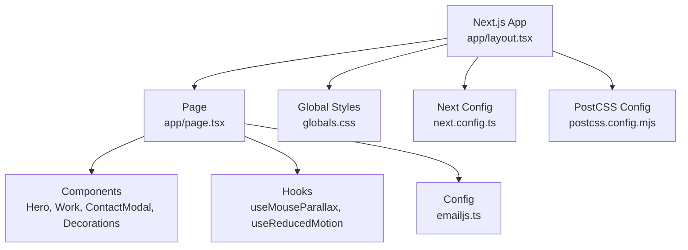
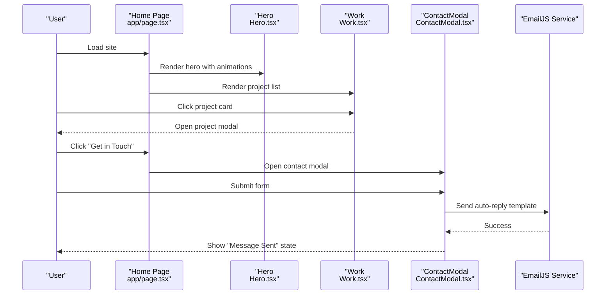
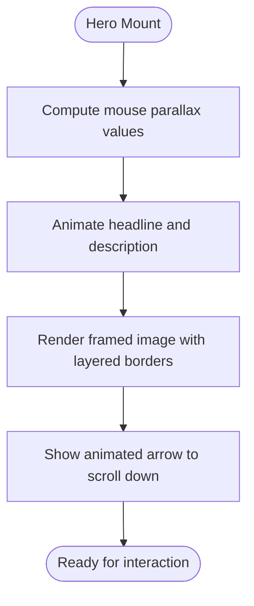
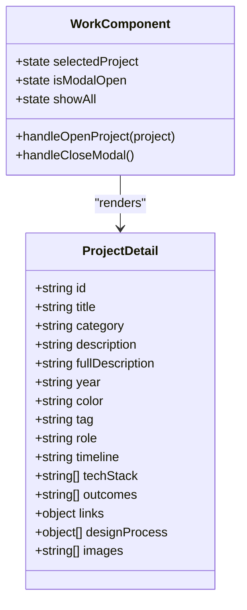
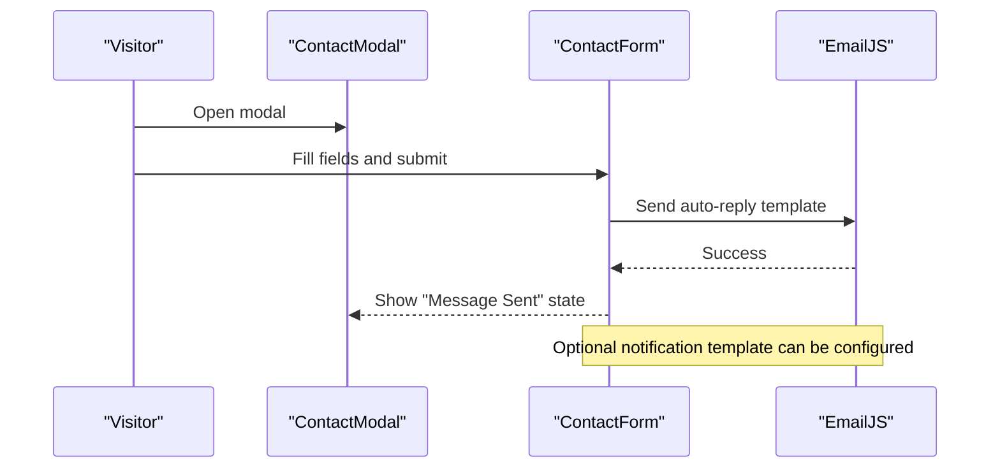
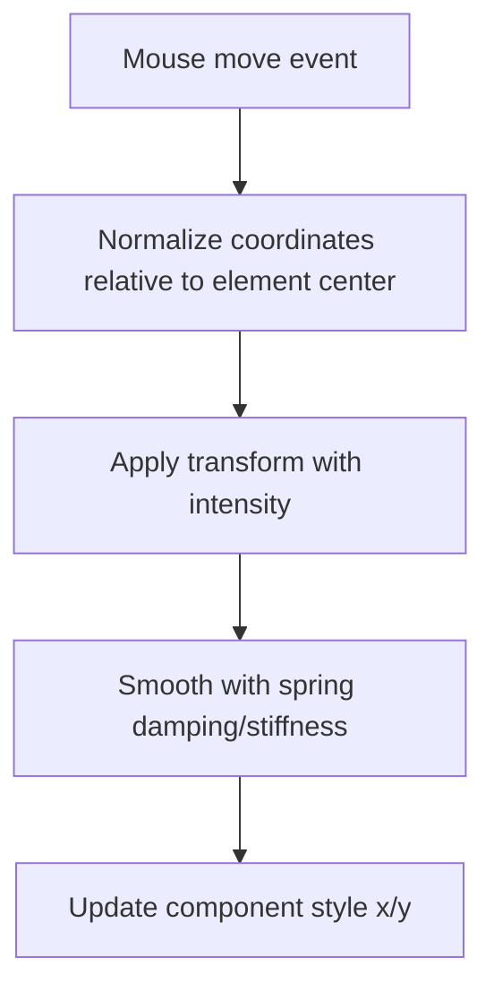
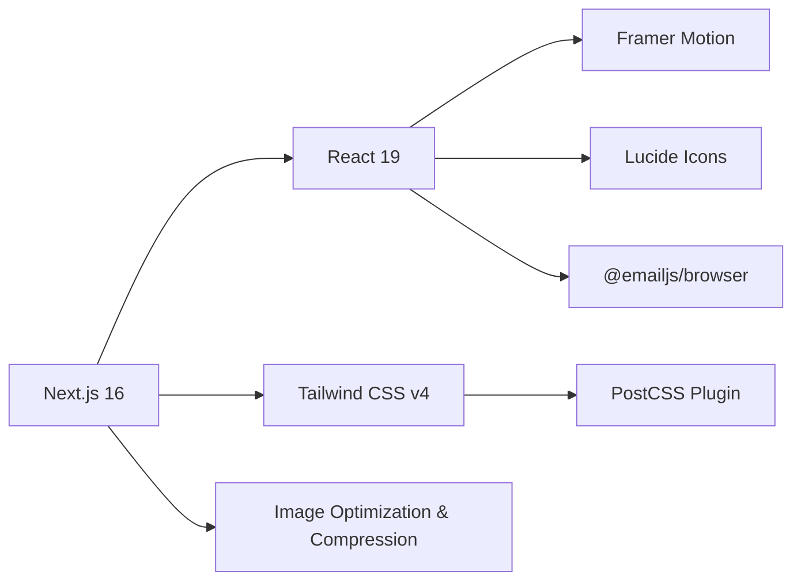

# Project Overview

<cite>
**Referenced Files in This Document**
- [README.md](file://README.md)
- [package.json](file://package.json)
- [next.config.ts](file://next.config.ts)
- [postcss.config.mjs](file://postcss.config.mjs)
- [app/layout.tsx](file://app/layout.tsx)
- [app/page.tsx](file://app/page.tsx)
- [app/components/Hero.tsx](file://app/components/Hero.tsx)
- [app/components/Work.tsx](file://app/components/Work.tsx)
- [app/components/ContactModal.tsx](file://app/components/ContactModal.tsx)
- [app/config/emailjs.ts](file://app/config/emailjs.ts)
- [app/hooks/useMouseParallax.ts](file://app/hooks/useMouseParallax.ts)
- [app/hooks/useReducedMotion.ts](file://app/hooks/useReducedMotion.ts)
- [app/components/Decorations.tsx](file://app/components/Decorations.tsx)
- [app/globals.css](file://app/globals.css)
</cite>

## Table of Contents
1. [Introduction](#introduction)
2. [Project Structure](#project-structure)
3. [Core Components](#core-components)
4. [Architecture Overview](#architecture-overview)
5. [Detailed Component Analysis](#detailed-component-analysis)
6. [Dependency Analysis](#dependency-analysis)
7. [Performance Considerations](#performance-considerations)
8. [Troubleshooting Guide](#troubleshooting-guide)
9. [Conclusion](#conclusion)

## Introduction
This portfolio website is a modern, interactive showcase for Temitope Williams, highlighting professional work and services through a polished web application. It emphasizes clarity, performance, and accessibility while presenting a compelling narrative about product design, project management, and delivery across FinTech, SaaS, enterprise, and EdTech domains. The site uses Next.js App Router with React client components to deliver smooth animations, responsive layouts, and an integrated contact system powered by EmailJS.

Key highlights:
- Modern stack: Next.js 16, React 19, Framer Motion animations, Tailwind CSS styling, EmailJS integration
- Interactive experiences: parallax effects, scroll-triggered animations, custom cursor, and subtle motion enhancements
- Content sections: Hero, About, Services, Work showcase, Contact modal
- Performance and SEO: optimized images, compression, metadata, robots configuration

[No sources needed since this section provides general guidance]

## Project Structure
The project follows the Next.js App Router structure with a clear separation between pages, shared components, hooks, and configuration:
- app/: Application entry points, layout, page content, and global styles
- app/components/: Reusable UI components (Hero, Work, ContactModal, Decorations, etc.)
- app/hooks/: Custom hooks for parallax and reduced motion preferences
- app/config/: External service configuration (EmailJS)
- public/: Static assets
- Configuration files at root: next.config.ts, postcss.config.mjs, package.json

**Diagram sources**
- [app/layout.tsx:1-107](file://app/layout.tsx#L1-L107)
- [app/page.tsx:1-588](file://app/page.tsx#L1-L588)
- [app/components/Hero.tsx:1-187](file://app/components/Hero.tsx#L1-L187)
- [app/components/Work.tsx:1-499](file://app/components/Work.tsx#L1-L499)
- [app/components/ContactModal.tsx:1-392](file://app/components/ContactModal.tsx#L1-L392)
- [app/config/emailjs.ts:1-15](file://app/config/emailjs.ts#L1-L15)
- [app/hooks/useMouseParallax.ts:1-66](file://app/hooks/useMouseParallax.ts#L1-L66)
- [app/hooks/useReducedMotion.ts:1-20](file://app/hooks/useReducedMotion.ts#L1-L20)
- [app/components/Decorations.tsx:1-190](file://app/components/Decorations.tsx#L1-L190)
- [app/globals.css:1-113](file://app/globals.css#L1-L113)
- [next.config.ts:1-20](file://next.config.ts#L1-L20)
- [postcss.config.mjs:1-8](file://postcss.config.mjs#L1-L8)

**Section sources**
- [app/layout.tsx:1-107](file://app/layout.tsx#L1-L107)
- [app/page.tsx:1-588](file://app/page.tsx#L1-L588)
- [next.config.ts:1-20](file://next.config.ts#L1-L20)
- [postcss.config.mjs:1-8](file://postcss.config.mjs#L1-L8)

## Core Components
- Hero: Introduces Temitope’s role and value proposition with animated text, image framing, and parallax decorations. Provides navigation anchors to Work and Contact sections.
- Work: Showcases selected projects with expandable lists, detailed modals, and per-project design process narratives. Includes tags, roles, timelines, tech stacks, outcomes, and links.
- ContactModal: Integrated form that sends messages via EmailJS, includes success states, error handling, and accessibility features. Displays contact details and social links.
- Decorations: Reusable visual elements (glow orbs, floating rings/dots/pluses, dotted grids, corner brackets, diagonal lines) that enhance depth and interactivity.
- Hooks:
  - useMouseParallax: Computes mouse-driven transforms with spring physics for smooth parallax effects.
  - useReducedMotion: Respects user preferences to reduce motion when requested.

Practical examples:
- Parallax effect on hero background elements and decorative shapes using normalized mouse coordinates and spring transitions.
- Scroll-triggered fade-in animations for sections and cards using viewport-based triggers.
- Modal interactions with keyboard support (Escape to close), focus management, and accessible attributes.

**Section sources**
- [app/components/Hero.tsx:1-187](file://app/components/Hero.tsx#L1-L187)
- [app/components/Work.tsx:1-499](file://app/components/Work.tsx#L1-L499)
- [app/components/ContactModal.tsx:1-392](file://app/components/ContactModal.tsx#L1-L392)
- [app/components/Decorations.tsx:1-190](file://app/components/Decorations.tsx#L1-L190)
- [app/hooks/useMouseParallax.ts:1-66](file://app/hooks/useMouseParallax.ts#L1-L66)
- [app/hooks/useReducedMotion.ts:1-20](file://app/hooks/useReducedMotion.ts#L1-L20)

## Architecture Overview
The application is structured around the Next.js App Router with client-side interactivity:
- Root layout sets up fonts, metadata, viewport, and global theme variables.
- Page composes top-level sections and global effects (cursor, noise overlay).
- Components are modular and reusable; hooks encapsulate animation logic.
- EmailJS configuration centralizes service IDs and keys for messaging.

**Diagram sources**
- [app/page.tsx:1-588](file://app/page.tsx#L1-L588)
- [app/components/Hero.tsx:1-187](file://app/components/Hero.tsx#L1-L187)
- [app/components/Work.tsx:1-499](file://app/components/Work.tsx#L1-L499)
- [app/components/ContactModal.tsx:1-392](file://app/components/ContactModal.tsx#L1-L392)
- [app/config/emailjs.ts:1-15](file://app/config/emailjs.ts#L1-L15)

**Section sources**
- [app/layout.tsx:1-107](file://app/layout.tsx#L1-L107)
- [app/page.tsx:1-588](file://app/page.tsx#L1-L588)

## Detailed Component Analysis

### Hero Section
- Purpose: Introduce Temitope’s expertise and guide users to explore work or contact.
- Interactions: Animated entrance, parallax decorations, scroll indicator, responsive image framing.
- Accessibility: Respects reduced motion preferences; semantic headings and links.

**Diagram sources**
- [app/components/Hero.tsx:1-187](file://app/components/Hero.tsx#L1-L187)
- [app/hooks/useMouseParallax.ts:1-66](file://app/hooks/useMouseParallax.ts#L1-L66)
- [app/hooks/useReducedMotion.ts:1-20](file://app/hooks/useReducedMotion.ts#L1-L20)

**Section sources**
- [app/components/Hero.tsx:1-187](file://app/components/Hero.tsx#L1-L187)

### Work Showcase
- Purpose: Present selected projects with rich context (roles, timelines, tech stacks, outcomes).
- Interactions: Expandable additional projects, detail modals, hover states, and animated reveals.
- Data model: Each project includes id, title, category, description, fullDescription, year, color, tag, role, timeline, techStack, outcomes, links, designProcess, images.

**Diagram sources**
- [app/components/Work.tsx:1-499](file://app/components/Work.tsx#L1-L499)

**Section sources**
- [app/components/Work.tsx:1-499](file://app/components/Work.tsx#L1-L499)

### Contact System
- Purpose: Enable visitors to reach out directly with a streamlined form and confirmation flow.
- Integration: Uses EmailJS to send auto-reply templates and optional notifications; handles errors gracefully.
- UX: Accessible modal, keyboard support, loading states, success feedback, and contact details display.

**Diagram sources**
- [app/components/ContactModal.tsx:1-392](file://app/components/ContactModal.tsx#L1-L392)
- [app/config/emailjs.ts:1-15](file://app/config/emailjs.ts#L1-L15)

**Section sources**
- [app/components/ContactModal.tsx:1-392](file://app/components/ContactModal.tsx#L1-L392)
- [app/config/emailjs.ts:1-15](file://app/config/emailjs.ts#L1-L15)

### Parallax and Decorations
- Purpose: Add depth and interactivity through mouse-driven transformations and subtle visual accents.
- Implementation: Centralized hook computes normalized mouse position and applies spring-physics-based transforms; decoration components compose these effects consistently.

**Diagram sources**
- [app/hooks/useMouseParallax.ts:1-66](file://app/hooks/useMouseParallax.ts#L1-L66)
- [app/components/Decorations.tsx:1-190](file://app/components/Decorations.tsx#L1-L190)

**Section sources**
- [app/hooks/useMouseParallax.ts:1-66](file://app/hooks/useMouseParallax.ts#L1-L66)
- [app/components/Decorations.tsx:1-190](file://app/components/Decorations.tsx#L1-L190)

## Dependency Analysis
- Framework and runtime: Next.js 16 with React 19 client components enable server/client separation and modern APIs.
- Styling: Tailwind CSS v4 with PostCSS plugin; custom theme variables define colors and fonts.
- Animation: Framer Motion provides declarative animations, spring physics, and viewport triggers.
- Icons: Lucide React icons used throughout UI for consistent iconography.
- Messaging: EmailJS browser SDK integrates client-side email sending without backend code.
- Configuration: next.config.ts optimizes images, enables compression, and removes server headers; postcss config wires Tailwind processing.

**Diagram sources**
- [package.json:1-32](file://package.json#L1-L32)
- [postcss.config.mjs:1-8](file://postcss.config.mjs#L1-L8)
- [next.config.ts:1-20](file://next.config.ts#L1-L20)

**Section sources**
- [package.json:1-32](file://package.json#L1-L32)
- [postcss.config.mjs:1-8](file://postcss.config.mjs#L1-L8)
- [next.config.ts:1-20](file://next.config.ts#L1-L20)

## Performance Considerations
- Image optimization: Next.js automatically serves WebP/AVIF formats with device-specific sizes and long cache TTLs.
- Compression: Responses are compressed to reduce payload size.
- Animations: Use spring physics and viewport-based triggers to avoid unnecessary reflows; respect reduced motion preferences.
- Fonts: Google fonts loaded with display swap to prevent FOIT/FOUT.
- Global effects: Noise overlay and cursor spotlight are lightweight and non-blocking.

[No sources needed since this section provides general guidance]

## Troubleshooting Guide
- EmailJS not sending:
  - Verify SERVICE_ID, TEMPLATE_ID, NOTIFY_TEMPLATE_ID, and PUBLIC_KEY in configuration.
  - Ensure templates exist in EmailJS dashboard and match field names used in the form submission.
  - Check browser console for network errors and CORS issues.
- Reduced motion not respected:
  - Confirm media query usage and hook implementation to toggle animations based on user preference.
- Parallax jitter:
  - Adjust intensity, damping, and stiffness parameters in the parallax hook for smoother movement.
- Layout shifts:
  - Ensure images have explicit dimensions or use Next.js Image with proper sizing attributes.
  - Avoid animating layout-affecting properties; prefer transform-based animations.

**Section sources**
- [app/config/emailjs.ts:1-15](file://app/config/emailjs.ts#L1-L15)
- [app/components/ContactModal.tsx:1-392](file://app/components/ContactModal.tsx#L1-L392)
- [app/hooks/useMouseParallax.ts:1-66](file://app/hooks/useMouseParallax.ts#L1-L66)
- [app/hooks/useReducedMotion.ts:1-20](file://app/hooks/useReducedMotion.ts#L1-L20)

## Conclusion
This portfolio website delivers a refined, interactive experience that effectively showcases Temitope Williams’ professional work and services. By leveraging Next.js, React, Framer Motion, Tailwind CSS, and EmailJS, it balances aesthetic appeal with performance and accessibility. The modular architecture and thoughtful animations create a cohesive narrative that guides visitors from introduction to engagement, making it a strong foundation for personal branding and client acquisition.

[No sources needed since this section summarizes without analyzing specific files]