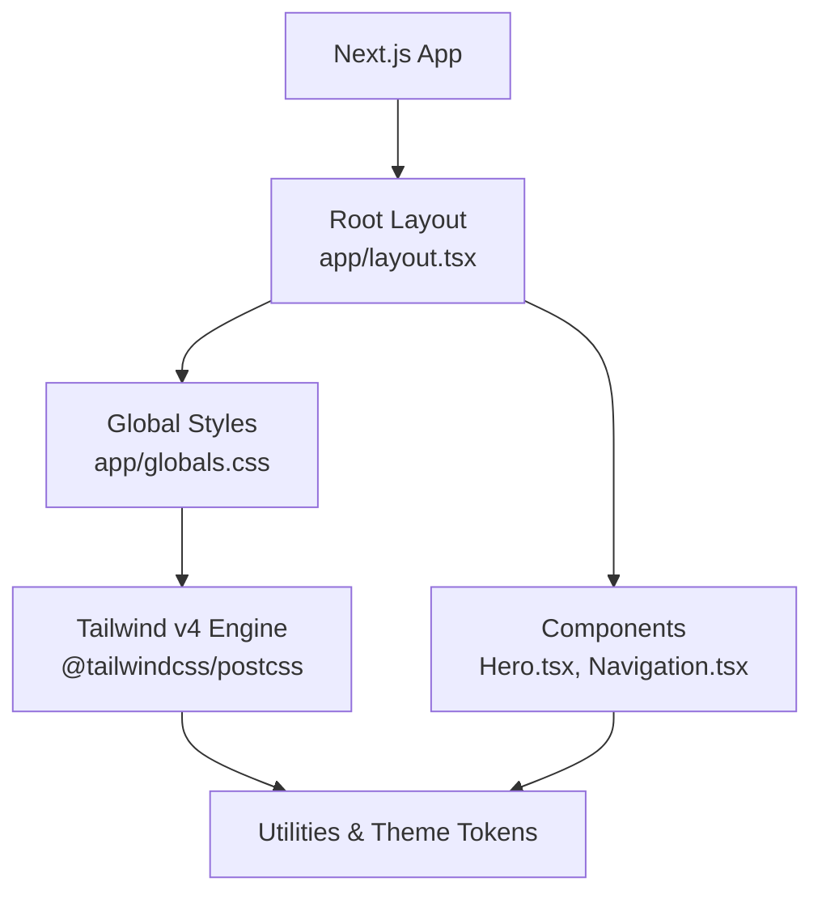
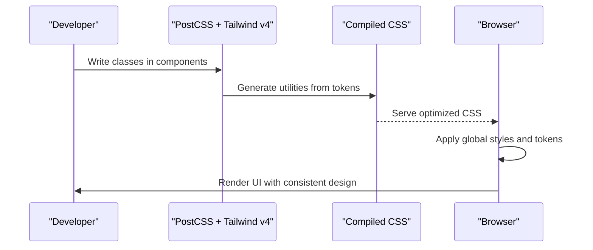
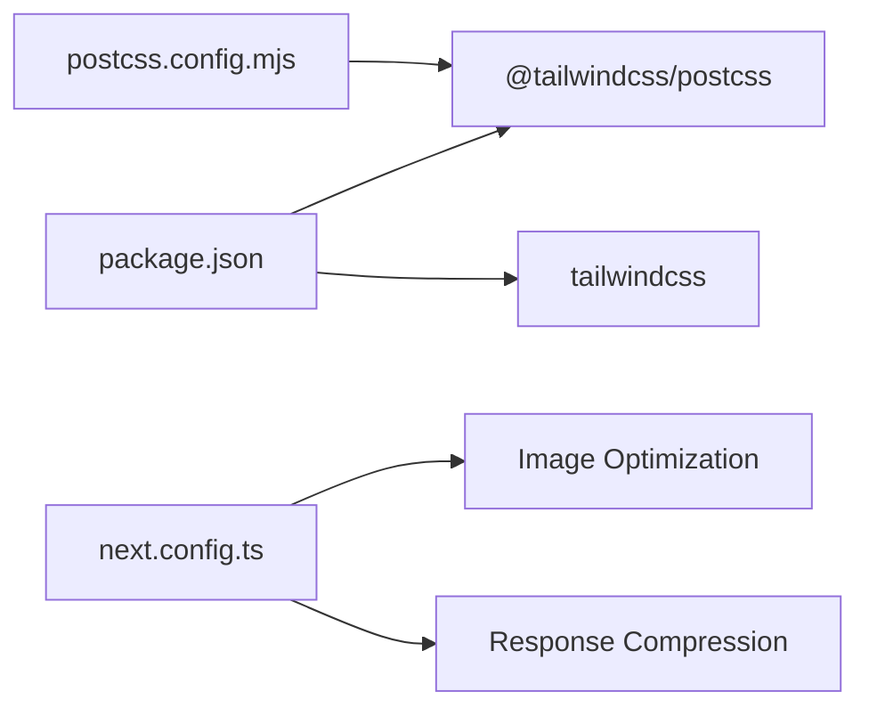

# Styling System

<cite>
**Referenced Files in This Document**
- [globals.css](file://app/globals.css)
- [postcss.config.mjs](file://postcss.config.mjs)
- [package.json](file://package.json)
- [next.config.ts](file://next.config.ts)
- [layout.tsx](file://app/layout.tsx)
- [Hero.tsx](file://app/components/Hero.tsx)
- [Navigation.tsx](file://app/components/Navigation.tsx)
- [useReducedMotion.ts](file://app/hooks/useReducedMotion.ts)
</cite>

## Table of Contents
1. [Introduction](#introduction)
2. [Project Structure](#project-structure)
3. [Core Components](#core-components)
4. [Architecture Overview](#architecture-overview)
5. [Detailed Component Analysis](#detailed-component-analysis)
6. [Dependency Analysis](#dependency-analysis)
7. [Performance Considerations](#performance-considerations)
8. [Troubleshooting Guide](#troubleshooting-guide)
9. [Conclusion](#conclusion)
10. [Appendices](#appendices)

## Introduction
This document explains the styling system built with Tailwind CSS v4 and custom CSS for a Next.js portfolio site. It covers design tokens (colors, typography), global styles, PostCSS configuration, responsive patterns, accessibility considerations, and performance best practices for CSS loading and rendering.

## Project Structure
The styling system is centered around:
- A single global stylesheet that imports Tailwind and defines theme tokens and global rules
- A minimal PostCSS configuration using the Tailwind v4 PostCSS plugin
- A root layout that injects Google Fonts via CSS variables and applies base classes
- Components that compose utility-first classes to build responsive layouts and interactions

**Diagram sources**
- [layout.tsx:1-107](file://app/layout.tsx#L1-L107)
- [globals.css:1-113](file://app/globals.css#L1-L113)
- [postcss.config.mjs:1-8](file://postcss.config.mjs#L1-L8)

**Section sources**
- [layout.tsx:1-107](file://app/layout.tsx#L1-L107)
- [globals.css:1-113](file://app/globals.css#L1-L113)
- [postcss.config.mjs:1-8](file://postcss.config.mjs#L1-L8)

## Core Components
- Design tokens are defined inline as CSS custom properties within the Tailwind theme block. These include colors for background, foreground, surfaces, accents, muted text, borders, and font families.
- Global styles set smooth scrolling, base body appearance, selection color, scrollbar styling, and reusable visual utilities like gradient text, noise overlay, cursor spotlight, glow orbs, and reduced motion handling.
- The root layout applies the fonts via CSS variables and sets the base background and text color using the design tokens.

Key responsibilities:
- globals.css: centralizes tokens and global UI polish; integrates with Tailwind via @import and @theme
- layout.tsx: loads Google Fonts, exposes them as CSS variables, and applies base classes
- postcss.config.mjs: wires Tailwind v4 into the build pipeline

**Section sources**
- [globals.css:1-113](file://app/globals.css#L1-L113)
- [layout.tsx:1-107](file://app/layout.tsx#L1-L107)
- [postcss.config.mjs:1-8](file://postcss.config.mjs#L1-L8)

## Architecture Overview
The styling architecture follows a layered approach:
- Build-time: Tailwind v4 processes CSS, generating only used utilities based on class usage across components
- Runtime: CSS variables provide consistent tokens; global styles apply baseline behavior and effects
- Components: Compose utility classes for layout, spacing, typography, and color; leverage responsive prefixes and modifiers

[No sources needed since this diagram shows conceptual workflow, not actual code structure]

## Detailed Component Analysis

### Design Tokens
- Colors:
  - Background, foreground, surface variants, accent palette (primary, hover, secondary, tertiary), muted, border
- Typography:
  - Sans-serif mapped to Outfit
  - Monospace mapped to Geist Mono
  - Cursive mapped to Dancing Script
- Integration:
  - Tokens are exposed as CSS variables inside the Tailwind theme block, enabling direct use in utilities (e.g., bg-accent, text-muted, border-border)

Usage examples in components:
- Hero uses tokens for backgrounds, text, and gradients
- Navigation uses tokens for borders, text, and hover states

**Section sources**
- [globals.css:3-17](file://app/globals.css#L3-L17)
- [Hero.tsx:35-187](file://app/components/Hero.tsx#L35-L187)
- [Navigation.tsx:29-133](file://app/components/Navigation.tsx#L29-L133)

### Global Styles and Utilities
- Base settings:
  - Smooth scrolling on html
  - Body background and text color using tokens
  - Selection color using accent
  - Custom scrollbar styling
- Visual utilities:
  - Gradient text effect
  - Noise overlay for texture
  - Cursor spotlight with radial gradient
  - Glow orb helper for blurred decorative elements
- Accessibility:
  - Reduced motion media query disables animations/transitions when user prefers reduced motion
  - Custom cursor hiding on fine pointer devices

These utilities are applied directly in components or via class names where appropriate.

**Section sources**
- [globals.css:19-113](file://app/globals.css#L19-L113)
- [useReducedMotion.ts:1-19](file://app/hooks/useReducedMotion.ts#L1-L19)

### Typography Scale and Font Loading
- Fonts are loaded via next/font/google and injected as CSS variables:
  - --font-outfit
  - --font-geist-mono
  - --font-cursive
- The root html element applies these variables and antialiased rendering
- The body sets default font family and ensures readability

Typography usage in components:
- Hero scales headings responsively and uses token-based text colors
- Navigation adjusts logo size across breakpoints and uses token-based colors

**Section sources**
- [layout.tsx:5-22](file://app/layout.tsx#L5-L22)
- [layout.tsx:91-107](file://app/layout.tsx#L91-L107)
- [Hero.tsx:89-100](file://app/components/Hero.tsx#L89-L100)
- [Navigation.tsx:43-48](file://app/components/Navigation.tsx#L43-L48)

### Spacing System
- Spacing is primarily handled by Tailwind’s spacing utilities (margins, paddings, gaps).
- Components demonstrate responsive spacing adjustments:
  - Hero uses different padding at small vs large screens
  - Grid gaps adjust between mobile and desktop
  - Navigation uses consistent vertical spacing and gap values

Guidelines:
- Prefer Tailwind spacing utilities for consistency
- Use responsive prefixes to adapt spacing per breakpoint
- Avoid arbitrary spacing unless necessary; prefer tokens and scale

**Section sources**
- [Hero.tsx:35-75](file://app/components/Hero.tsx#L35-L75)
- [Navigation.tsx:41-85](file://app/components/Navigation.tsx#L41-L85)

### Responsive Design Patterns and Mobile-First Approach
- Mobile-first:
  - Default classes target small screens; larger screens use lg: and xl: prefixes
  - Example: hero section padding increases on large screens
  - Navigation hides links on small screens and reveals a full-screen menu via state
- Breakpoints:
  - sm:, md:, lg:, xl: prefixes are used to adapt layout and typography
- Techniques:
  - Conditional visibility with hidden lg:block
  - Flexible grid with lg:grid-cols-2
  - Responsive image sizing with sizes attribute

Examples:
- Hero: responsive heading sizes, grid reflow, image sizing
- Navigation: responsive logo size, desktop nav vs mobile drawer

**Section sources**
- [Hero.tsx:35-187](file://app/components/Hero.tsx#L35-L187)
- [Navigation.tsx:29-133](file://app/components/Navigation.tsx#L29-L133)

### Accessibility and Motion Preferences
- Reduced motion:
  - CSS media query disables animations and transitions globally when preferred
  - Hook detects user preference and can conditionally animate in components
- Focus and semantics:
  - Navigation includes aria attributes for menu toggle and dialog role
- Custom cursor:
  - Hides native cursor on fine pointer devices when custom cursor is active

**Section sources**
- [globals.css:95-112](file://app/globals.css#L95-L112)
- [useReducedMotion.ts:1-19](file://app/hooks/useReducedMotion.ts#L1-L19)
- [Navigation.tsx:71-83](file://app/components/Navigation.tsx#L71-L83)
- [Navigation.tsx:88-129](file://app/components/Navigation.tsx#L88-L129)

## Dependency Analysis
- Tailwind v4 integration:
  - PostCSS plugin configured to process CSS with Tailwind
  - Dependencies declared in package.json ensure correct versions
- Next.js configuration:
  - Image optimization settings support responsive images and caching
  - Compression enabled for responses

**Diagram sources**
- [package.json:11-29](file://package.json#L11-L29)
- [postcss.config.mjs:1-8](file://postcss.config.mjs#L1-L8)
- [next.config.ts:3-17](file://next.config.ts#L3-L17)

**Section sources**
- [package.json:11-29](file://package.json#L11-L29)
- [postcss.config.mjs:1-8](file://postcss.config.mjs#L1-L8)
- [next.config.ts:3-17](file://next.config.ts#L3-L17)

## Performance Considerations
- CSS generation:
  - Tailwind v4 generates only used utilities, minimizing CSS size
  - Keep classes semantic and avoid unnecessary overrides to reduce output
- Fonts:
  - Using next/font with display swap improves perceived performance
  - Limit subsets to latin to reduce payload
- Images:
  - Next.js image formats (AVIF/WebP) and device sizes optimize delivery
  - Proper sizes attributes help the browser choose optimal image resolution
- Animations:
  - Respect reduced motion preferences to avoid unnecessary work
  - Use transform and opacity for performant animations
- Caching:
  - Long cache TTL for images reduces repeat load times
  - Response compression reduces transfer size

[No sources needed since this section provides general guidance]

## Troubleshooting Guide
- Tokens not applying:
  - Ensure tokens are defined in the Tailwind theme block and referenced correctly in components
  - Verify the root layout applies font variables and base classes
- Unexpected styles:
  - Check for conflicting global styles (e.g., body background) overriding component styles
  - Confirm responsive prefixes are used appropriately
- Accessibility issues:
  - Validate reduced motion behavior across browsers
  - Ensure interactive elements have proper aria attributes and roles
- Scrollbar and selection styles:
  - Note that some browsers may not fully support custom scrollbars; test across platforms

**Section sources**
- [globals.css:19-113](file://app/globals.css#L19-L113)
- [layout.tsx:91-107](file://app/layout.tsx#L91-L107)
- [useReducedMotion.ts:1-19](file://app/hooks/useReducedMotion.ts#L1-L19)

## Conclusion
The styling system leverages Tailwind CSS v4’s utility-first approach combined with a focused set of design tokens and global styles. It emphasizes consistency, responsiveness, and accessibility while maintaining performance through efficient CSS generation and optimized assets. By following the guidelines here, you can extend the design system safely and keep the codebase maintainable.

## Appendices

### Adding New Styles
- Define new tokens in the Tailwind theme block if they will be reused widely
- Create utility classes sparingly; prefer composing existing utilities
- Keep global styles minimal and scoped to app-wide concerns
- Follow naming conventions and organize related styles together

### Maintaining Consistency
- Use tokens for colors, fonts, and spacing
- Adopt responsive prefixes consistently
- Reuse component-level patterns rather than duplicating styles

### Optimizing CSS Output
- Remove unused classes during development to keep builds fast
- Monitor bundle size and audit generated CSS periodically
- Leverage Tailwind’s purge behavior by writing clean, purposeful classes

### Examples of Responsive Patterns
- Hero:
  - Responsive typography scaling
  - Grid reflow from single column to two columns on large screens
  - Image sizing with adaptive breakpoints
- Navigation:
  - Desktop navigation links visible on medium+ screens
  - Mobile drawer with animated entrance and exit
  - Logo size adapts across breakpoints

**Section sources**
- [Hero.tsx:35-187](file://app/components/Hero.tsx#L35-L187)
- [Navigation.tsx:29-133](file://app/components/Navigation.tsx#L29-L133)